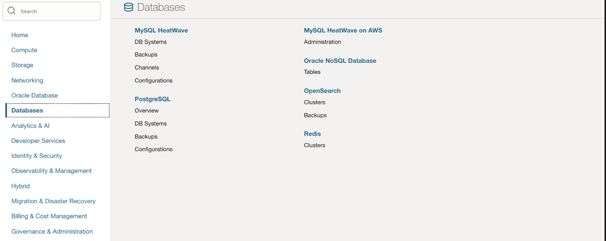
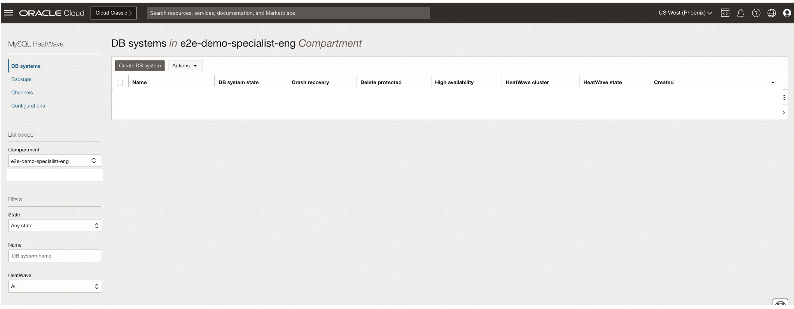
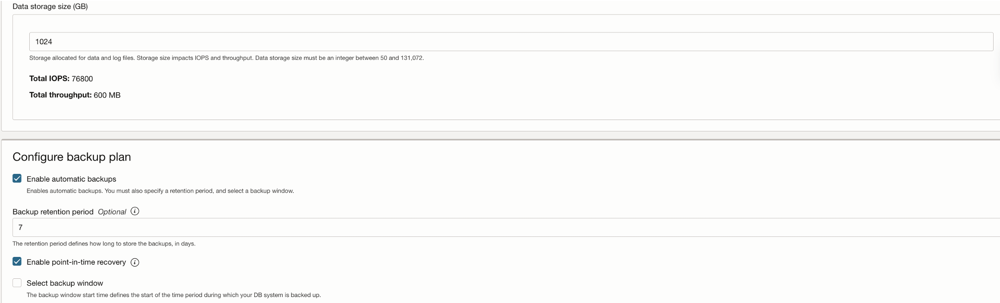

# Create MySQL Database HeatWave

## Introduction

This lab walks you through the steps to create **MySQL Database System** in Oracle Cloud Infrastructure.

_Estimated Lab Time_: 40 minutes

### Objectives

In this lab, you will:
- Be able to launch MySQL Heatwave Database System in Oracle Cloud.

### Prerequisites

This lab assumes you have:
- An Oracle account
- Privileges to use Oracle Cloud resources
- Compartment and VCN has been created. 

Note - This lab "**2c -Create MySQL Database HeatWave**" is independent of the previous lab **2b**.Once the above Prerequisites are met the below steps can be executed.

## Task 1: Create MySQL Database System in Oracle Cloud

1. Login into OCI console, Navigate to **Databases** menu and click on DB Systems under **MySQL HeatWave**.

	

2. Click on "**Create DB System**"

  

3. Select **Production** , **Compartment** , **DB System Name** and provide **username**/**password**, confirm password

	

4. Select **Standalone** then select VCN/Subnet in the corresponding compartment:  

   

5. (a) **Enable MySQL Heatwave** and Click on Change Shape as in following screen shot 

	

	(b) Select OCPU , Choose the Shape (16 OCPU/512 GB Memory) then click on "Select a shape" button

	

	(c) Following options you can keep as default, storage and backup:

	

	(d) Then Click on “advanced options” –> Connections -> give hostname “eemysql” and click on “**Create**” to initiate creation process.

	**Note : The host name must be unique within the subnet. If it is not unique, the DB system will fail to provision. It will be used later in the live lab.

	

6. Once Instance is launched, it will be Active in few minutes:

	 

7. Check the MySQL Endpoint(Hostname/Address), which we will use later to connect:

	 

You may now proceed to the next lab.

## Acknowledgements
* **Author** - Bhushan Arora, Principal Cloud Architect, North America Cloud Infrastructure - Engineering
* **Contributors** - Bhushan Arora ,Principal Cloud Architect,Biswanath Nanda, Master Principal Cloud Architect,North America Cloud Infrastructure - Engineering
* **Last Updated By/Date** - Bhushan Arora, November 2024
