# Create a Business Glossary and Custom Property

## Introduction

In many organizations, communication issues and misunderstandings arise due to lack of common vocabulary of business concepts and associated data. A simple concept like “Customer” could mean five different things to 5 different departments. Some customers maintain these concepts in excel sheets or word documents, which is obviously not a scalable model. Business Glossaries define the vocabulary of terms used in an organization. Having agreed upon definitions help establish a common understanding and promote collaboration. In addition, linking technical metadata with glossary terms helps data consumers with additional business context.

Additionally, data consumers can’t easily find data and don’t know the associated business meaning due to missing or incomplete information and tribal knowledge. So, Data providers need to constantly answer questions about data by consumers. To help with this, a data provider like a subject matter expert can provide business context for each object in the catalog using custom properties. Data consumers can use this information, in a self-service manner, to determine if the data object is fit for use.

In this task you will be a data steward who defines glossary categories and terms. You will also create a custom property called Data owner to capture owners of the data objects.

Estimated Time: 45 minutes

### Objectives

In this lab, you will:
* Create a Business Glossary
* Import a Glossary
* Create a Category
* Create a Term
* Export a Glossary
* Create a custom property

### Prerequisites

Complete Lab0 : Task 1-3 and Lab1

## Task 1: Create a Business Glossary

In this task you will create a Glossary.

1. On the Home tab, click **Glossaries**.

    

2. Click **Create Glossary**.

    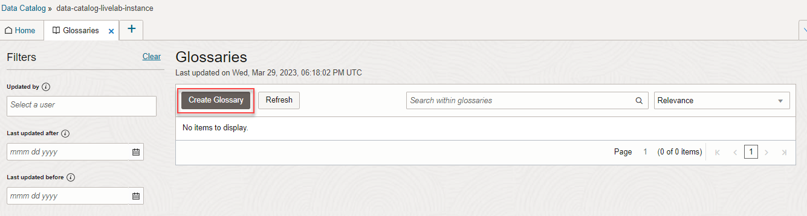

3. In the **Create Glossary** panel that appears, in the Name field, enter a unique **Name**.

4. Optionally, in the **Description** field, specify the purpose of creating this glossary.

5. Click **Create**.

    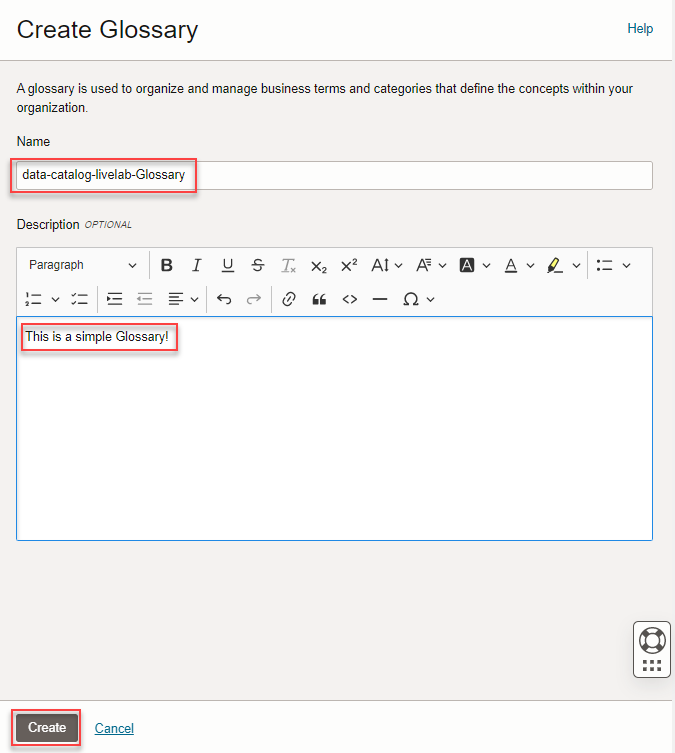

	You can now see the glossary created and its details

    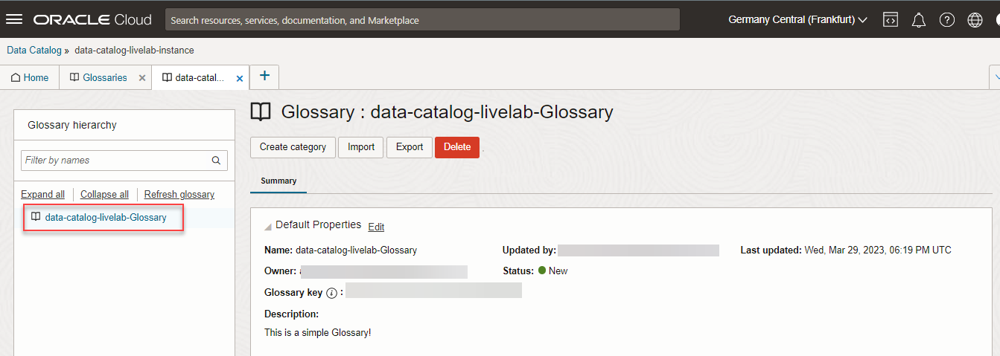

## Task 2: Import a Glossary

You can either create the categories and terms one by one or choose to import them from an Excel file. You can define the categories and terms in an Excel file using the template provided [here] (https://docs.oracle.com/en-us/iaas/data-catalog/using/files/BG_Import_Template.xlsx).

In this task you will import the sample glossary provided in the workshop files.

1. Click **Import** on the Glossary Details tab.

    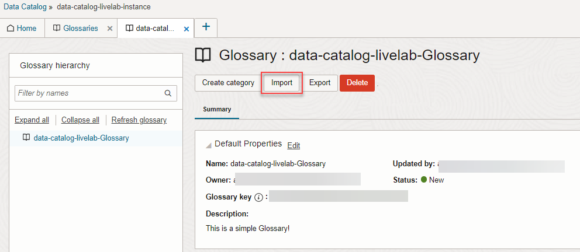

2. A Note dialog opens indicating that some rich text formatting might be lost on import. Review the note and click **Proceed**.

    

3. Using the file browser, locate the Excel file you want to import from the unzipped folder and click **Open**.

    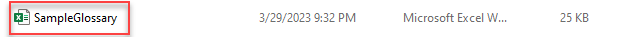

	An import glossary job is triggered. If the import file is small, the job finishes instantly and the imported glossary is displayed. If the import   file is large, you can monitor the status of the job from the Jobs tab. When the job is completed successfully, the contents of the Excel file are   imported into your glossary and are visible on the left panel.

    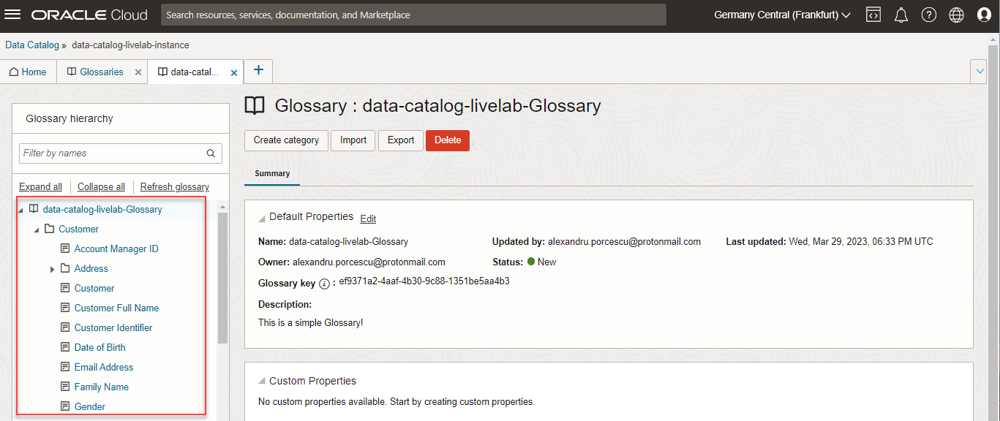

## Task 3: Create a Category

In a glossary, each term must be created within a category.

Here is how you create a category:

1. On the glossary details tab of the glossary where you want to create a category, click **Create Category**.

    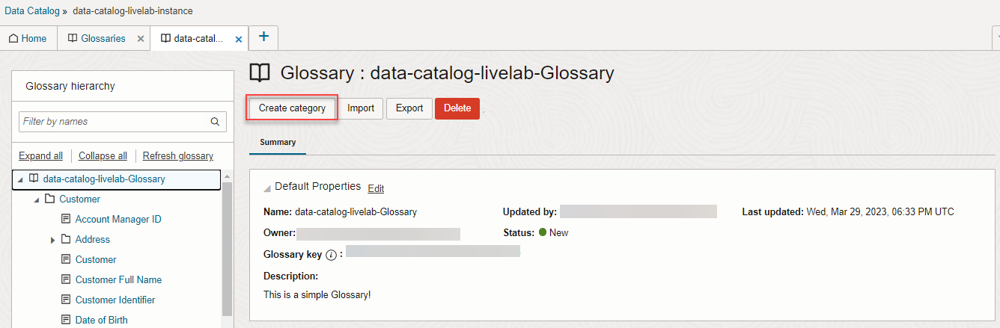

2. In the Create Category panel, enter a **Name** and **Definition** for the category.

3. Click **Save**.

    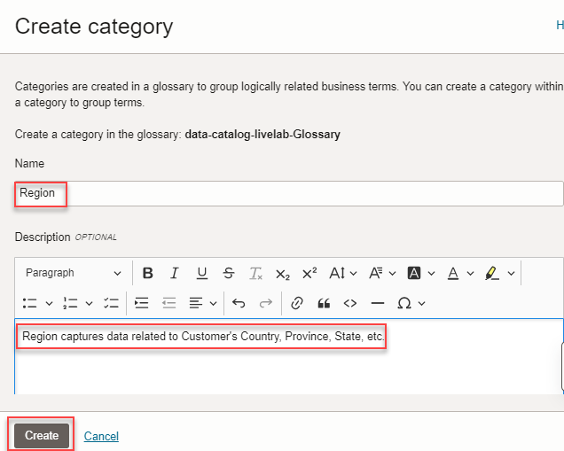

	The category is created and the category is seen in the glossary details tab.

    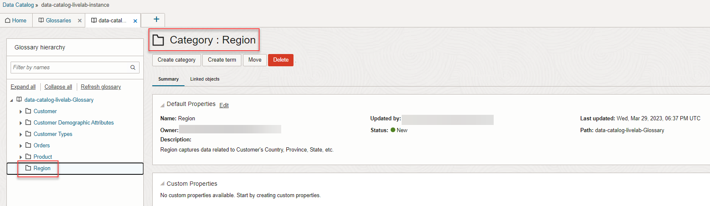

After the category is created, it is listed in the Hierarchy pane of the glossary details tab and you can create terms within this category. You can also create a category within another category creating nested categories.

## Task 4: Create a Term

You use terms to classify the harvested data entities and attributes. Each term must be created within a category.

Here is how you create a term:

1. Access the glossary details tab of the glossary where you want to create a term.

2. In the Hierarchy pane of the glossary details tab, click the category where you want to create a term. Click **Create Term**.

    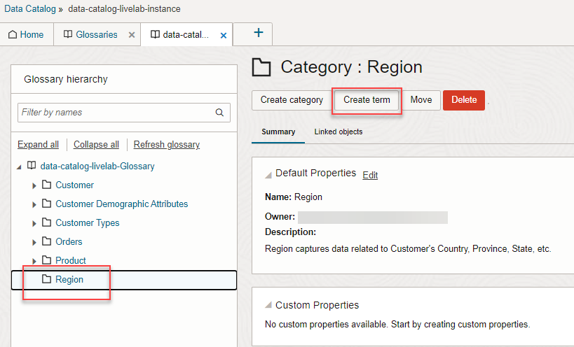

3. In the Create Term panel, enter a **Name** and **Definition** for the term. A term name must be unique within its category.

4. Click **Save**.

    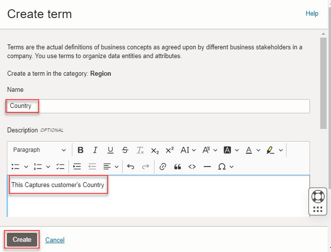

	The term is created and the term displays in the glossary details tab and it is listed in the Hierarchy pane.

    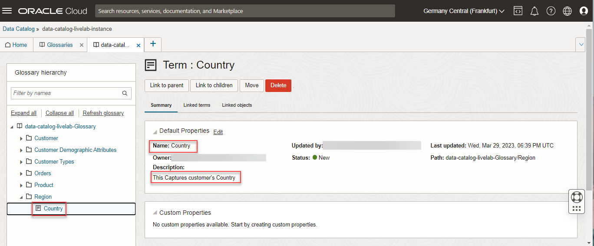

## Task 5: Export a Glossary

You can export the glossary in your catalog either to be imported in another catalog or if you want to review and modify it before importing it back into the catalog.

Here is how you export a glossary.

1. In the glossary details tab, Click **Export**.

    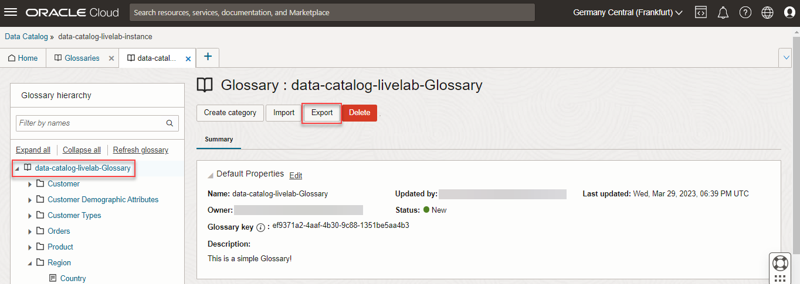

2. A Note dialog opens indicating that some rich text formatting might be lost on export. Review the note and click **Proceed**.

    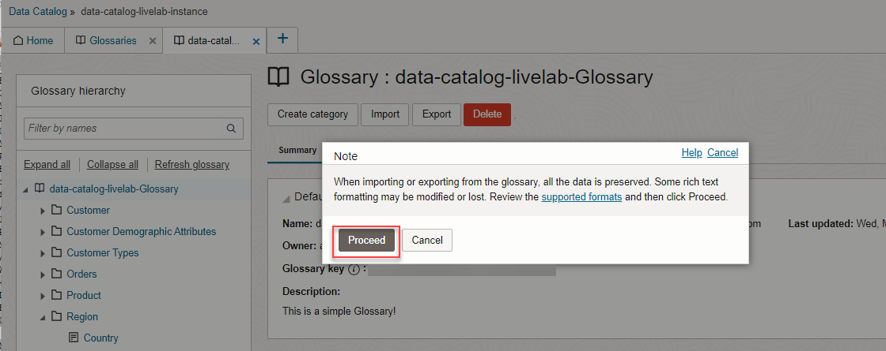

3. The glossary exports as an Excel file. Save the file to your local system.

4. Open the file to see the details.

    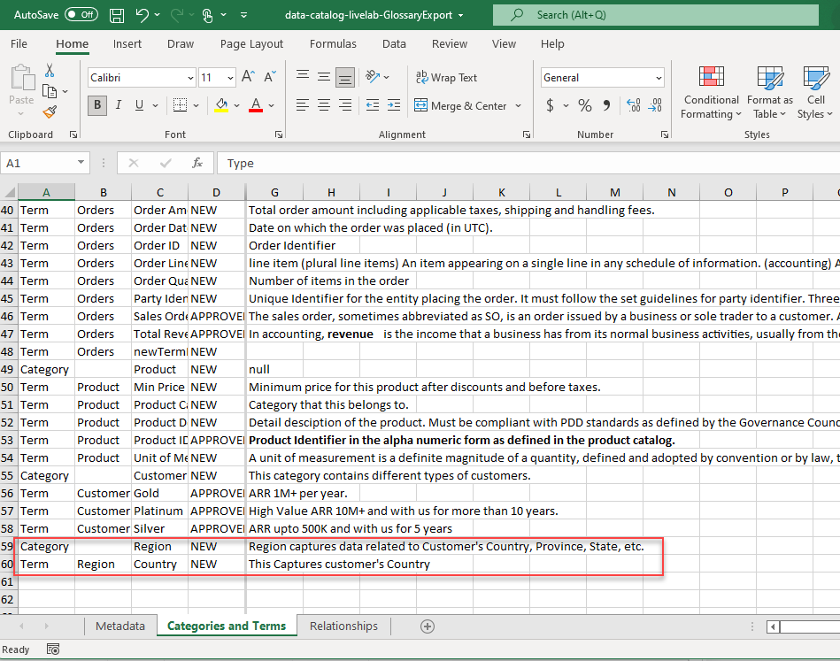

## Task 6: Create a Custom Property

Custom properties are used to define metadata to capture business context for data catalog object.

When you harvest a data source using Data Catalog, some default properties are created in your data catalog for data entities and attributes. For example, description, data entity type, updated by, and last updated. Similar default properties are also available for data catalog objects like glossaries, categories, and terms.

The default properties may not be sufficient to capture all the context for a data catalog object. More details such as business description, update frequency, certification status, or data owners, can provide more business context to the technical metadata. Business metadata help data consumers in understanding, discovery, classification, and collaboration.

1.	On your data catalog instance Home tab, click **Custom Properties** to access the Custom Properties tab.

    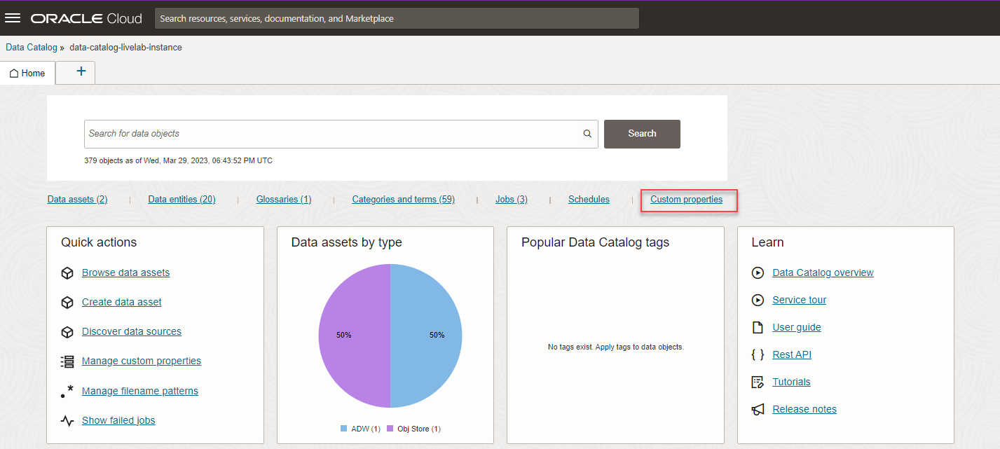

2.	Click **Create Custom Property**.

    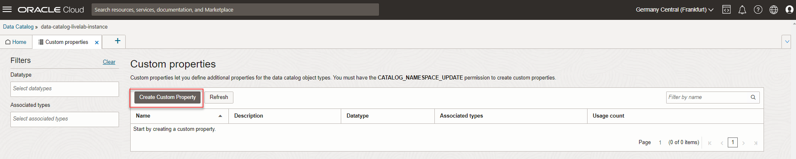

3.	In the Create Custom Property panel, enter the **Name** for your custom property.

4.	(Optional) Enter the **Description** for the custom property. This description shows up as the tooltip for the custom property in the associated object details tabs.

5.	Select a **Datatype** for the custom property.

	You can choose from the following options:

	•	**String (Plain Text)**: The value for the custom property is only a simple string text.

	•	**String (Rich Text)**: The value for the custom property can be a rich string text or simple string text.

	•	**Number**: The value for the custom property is only a number.

	•	**Boolean**: The value for the custom property is only True or False, or Yes or No.

	•	**Date**: The value for the custom property is only a date.

6.	In **Value options**, configure how the values must be entered for the custom property. Value options are available only for the String (Plain 	  Text) and Number datatypes.

	You can specify the following two options:

	•	**Use list of values**: Select this option if you want to predefine only specific values to be available to users for populating the custom property values.

	•	**Allow multiple values**: Select this option if you want to permit multiple values for the custom property.

7.	Select one or more **Data catalog object types** that you want to associate with the custom property.

8.  Leave the optional **Enable events** field blank.

9.	In **Search result options**, configure how you want the custom property to behave in search results.

	You can select the following options:

	•	**Show in search results**: Select this option if you want the custom property to be displayed in the search results list. You can select this option 	 for up to four custom properties. Only one of these four custom properties can be of the String (Rich Text) datatype.

	•	**Allow filtering**: Select this option if you want the custom property to be displayed in the search results as Custom Filters. Typically, this option is selected for custom properties with the List of values option selected as well.

	•	**Allow sorting**: Select this option if you want the search results to be sortable using the custom property.

10.	In **View and Edit options**, select the Quick edit check box, if you want to configure the custom property to appear in the Attributes table of 	a data entity. For more information, see Editing Attribute Name and Custom Properties.

11.	Click **Create**.

    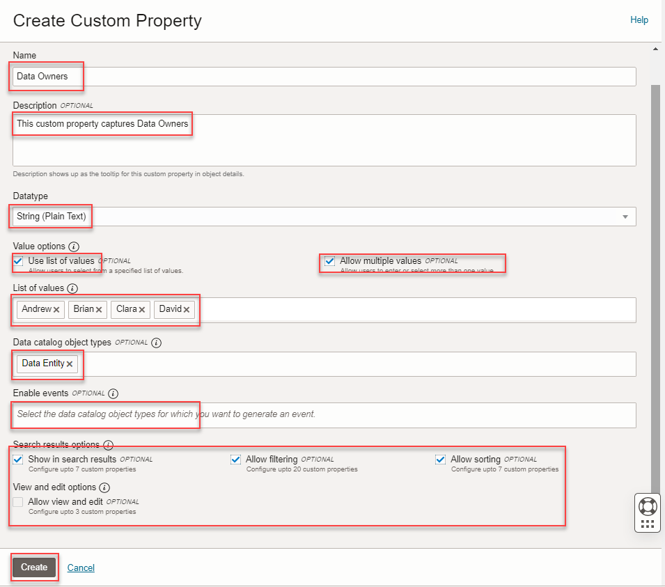

	The **Custom Property** is created.

    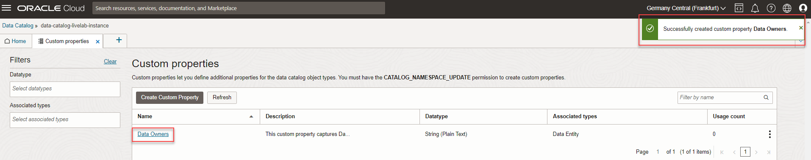

 
 
You may now **proceed to the next lab**

## Learn More

* [Get Started with Data Catalog](https://docs.oracle.com/en-us/iaas/data-catalog/using/index.htm)
* [Data Catalog Overview](https://docs.oracle.com/en-us/iaas/data-catalog/using/overview.htm)
* [Autonomous Data Warehouse](https://docs.oracle.com/en/cloud/paas/autonomous-data-warehouse-cloud/index.html)
* [Object Storage](https://docs.oracle.com/en-us/iaas/Content/Object/Concepts/objectstorageoverview.htm)
* [Oracle Cloud Infrastructure Identity and Access Management](https://docs.oracle.com/en-us/iaas/Content/Identity/Concepts/overview.htm)
* [Managing Groups in Oracle Cloud Infrastructure](https://docs.oracle.com/en-us/iaas/Content/Identity/Tasks/managinggroups.htm)
* [Overview of VCNs and Subnets](https://docs.oracle.com/en-us/iaas/Content/Network/Tasks/managingVCNs_topic-Overview_of_VCNs_and_Subnets.htm#Overview)
* [Managing Compartments in Oracle Cloud Infrastructure](https://docs.oracle.com/en-us/iaas/Content/Identity/Tasks/managingcompartments.htm)

## Acknowledgements

* **Author** - Shreedhar Talikoti, Ramkumar Dhanasekaran
* **Contributors** -  Rashmi Badan, Sreekala Vyasan
* **Last Updated By/Date** - Alexandru Porcescu, March 2023
