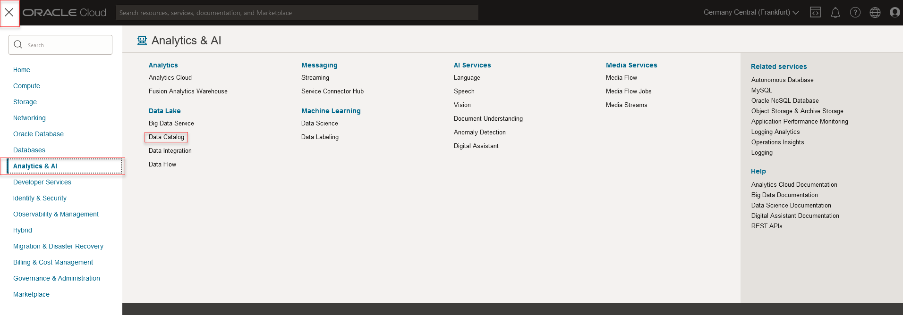
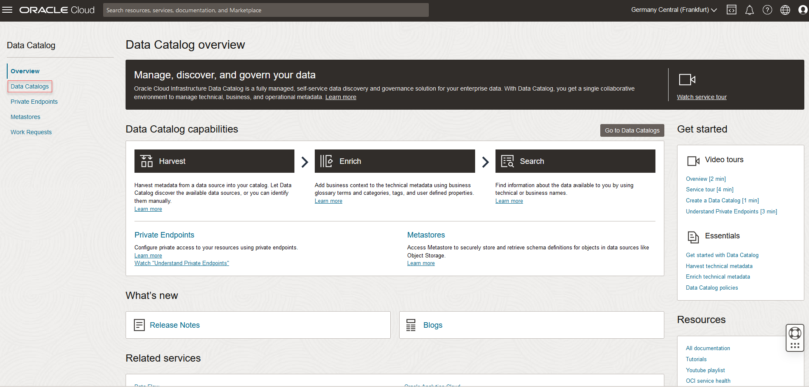
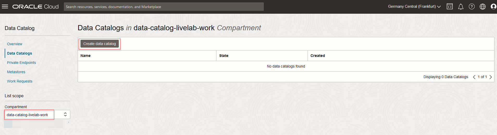
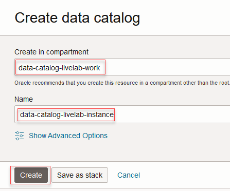
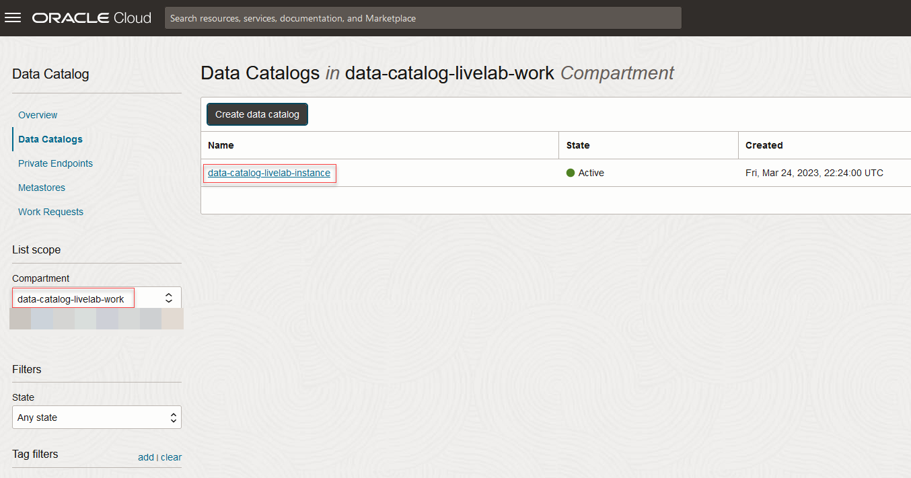
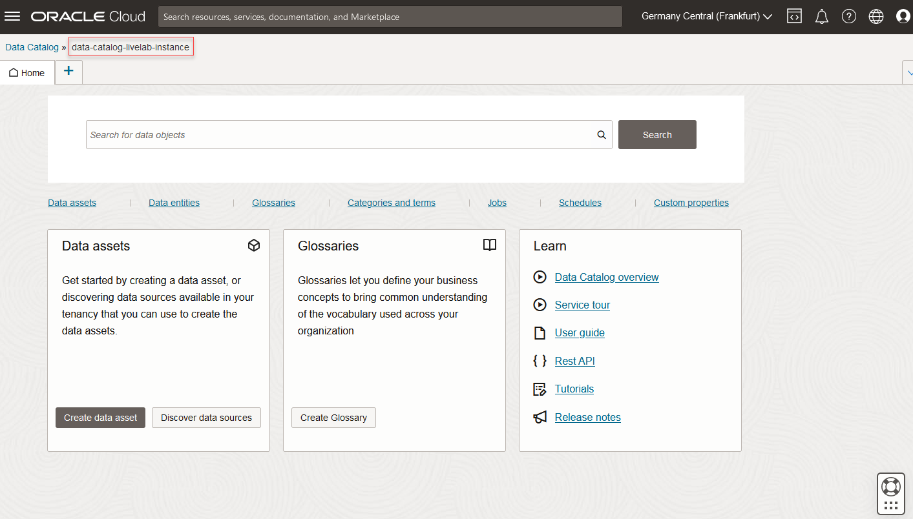

# Create a Data Catalog

## Introduction

This lab will guide you to create a new catalog instance and view the list of available catalogs. You can have a maximum of 2 catalogs per region in the tenancy.

Estimated Time: 15 minutes

### Objectives

In this lab, you will:
* Create a Data Catalog Instance
* View Created Data Catalog Instance

###Prerequisites

Complete Lab0 : Steps 1-3

## Task 1: Create a Data Catalog                                 

You complete a single form to create a Data Catalog instance. Oracle takes care of service management, patching, backup and restore, and other service lifecycle tasks.

1. In the Console, open the navigation menu and click **Analytics & AI**. Under **Data Lake**, click **Data Catalog**.

    

2. The Data Catalog Overview page opens. From the left navigation, click **Data Catalogs**.

    

3. On the Data Catalog page that appears, from the left panel, select the **Compartment** .

4. Click **Create Data Catalog**. The Create Data Catalog dialog opens.

    

5. Select the compartment again where you want to create the data catalog instance.
6. Enter a name for the data catalog instance. Avoid entering confidential information.
7. (Optional) Enter one or more tags for your data catalog resource. Tags help organize and track all the resources within your tenancy.
8. Click **Create Data Catalog**. The data catalog is created within seconds and is listed in the Data Catalogs page.

    

## Task 2: View Created Instances

1. The Data Catalogs page displays all the data catalog instances created in your the selected compartment.

    

2. Click an instance name to open and use the data catalog.

    

You may now **proceed to the next lab**

## Learn More

* [Get Started with Data Catalog](https://docs.oracle.com/en-us/iaas/data-catalog/using/index.htm)
* [Data Catalog Overview](https://docs.oracle.com/en-us/iaas/data-catalog/using/overview.htm)
* [Autonomous Data Warehouse](https://docs.oracle.com/en/cloud/paas/autonomous-data-warehouse-cloud/index.html)
* [Object Storage](https://docs.oracle.com/en-us/iaas/Content/Object/Concepts/objectstorageoverview.htm)
* [Oracle Cloud Infrastructure Identity and Access Management](https://docs.oracle.com/en-us/iaas/Content/Identity/Concepts/overview.htm)
* [Managing Groups in Oracle Cloud Infrastructure](https://docs.oracle.com/en-us/iaas/Content/Identity/Tasks/managinggroups.htm)
* [Overview of VCNs and Subnets](https://docs.oracle.com/en-us/iaas/Content/Network/Tasks/managingVCNs_topic-Overview_of_VCNs_and_Subnets.htm#Overview)
* [Managing Compartments in Oracle Cloud Infrastructure](https://docs.oracle.com/en-us/iaas/Content/Identity/Tasks/managingcompartments.htm)

## Acknowledgements

* **Author** - Shreedhar Talikoti, Ramkumar Dhanasekaran
* **Contributors** -  Rashmi Badan, Sreekala Vyasan
* **Last Updated By/Date** - Alexandru Porcescu, March 2023
