# Harvest Metadata from Oracle Object Storage

## Introduction

Data lakes contain large volumes of semi-structured and unstructured files. Understanding the content of the data lake is a huge challenge due to variety and volume of data. The files may be either independent files of varying format or similar files that represent a single data set, such as a partitioned file resulting from a Spark job. Data Catalog helps you easily find these files and meaningfully interpret them. In Data Catalog, Logical entities are a way of grouping files based on file name patterns.

In this lab, you will learn more about creating and using filename patterns and generating logical entities.

Estimated Time: 30 minutes

### Objectives

In this lab, you will:
* Create an Oracle Object Storage data asset.
* Add one default connection for the newly created data asset.
* Create a Filename Pattern and assign it to the Oracle Object Storage data asset.
* Harvest the data asset.
* View the harvested data entities.

### Prerequisites

Complete Lab0 : Step 1-3 and Lab1. Before you create an object storage data asset, you must create a dynamic group and an object storage resource access policy.

## Task 1: Create Dynamic Groups and Policies

Dynamic groups allow you to group Oracle Cloud Infrastructure compute instances as "principal" actors (similar to user groups). You can then create policies to permit instances to make API calls against Oracle Cloud Infrastructure services. When you create a dynamic group, rather than adding members explicitly to the group, you instead define a set of matching rules to define the group members. For example, a rule could specify that all instances in a particular compartment are members of the dynamic group. The members can change dynamically as instances are launched and terminated in that compartment.

In this task, you copy the OCID of the Data Catalog instance and use it as a resource to create a dynamic group.

1. Open the **Navigation** menu and click **Analytics & AI**. Under **Data Lake**, select **Data Catalog**.

2. On the **Data Catalogs** page, in the row for your **data-catalog-livelab-instance**, click the **Action** button to display the context menu. Select **Copy OCID** from the context menu to copy the OCID for the **training-dcat-instance** Data Catalog instance. Next, paste that OCID to an editor or a file, so that you can retrieve it later in this lab.

    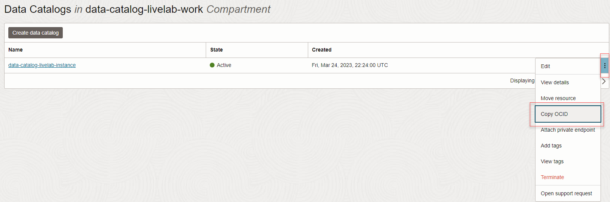

3. Open the **Navigation** menu and click **Identity & Security**. Click **Domain**. Select Your **Domain** (Default) and click **Dynamic Groups**.

4. On the **Dynamic Groups** page, click **Create Dynamic Group**.

    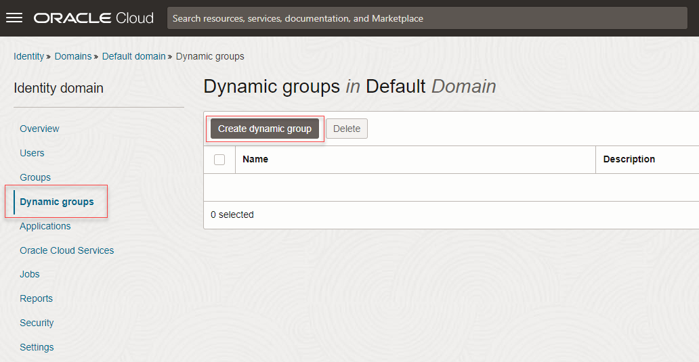

5. In the **Create Dynamic Group** dialog box, specify the following:

    + Enter **`moviestream-dynamic-group`** in the **Name** field.
    + Enter **`Training Compartment Dynamic Group`** in the **Description** field.
    + In the **Matching Group** section, accept the default **Match any rules defined below** option.
    + Click the **Copy** button in the following code box to copy the dynamic rule, and then paste it in the **Rule 1** text box. This dynamic group will be used in a policy that allows the **`datacatalog`** Data Catalog to access the Object Storage buckets. Substitute the _your-data-catalog-instance-ocid_ with your **training-dcat-instance** Data Catalog instance OCID that you copied earlier.

        ```
        <copy>Any {resource.id = 'ocid1.user.oc1..<unique_ID>'}</copy>
        ```

        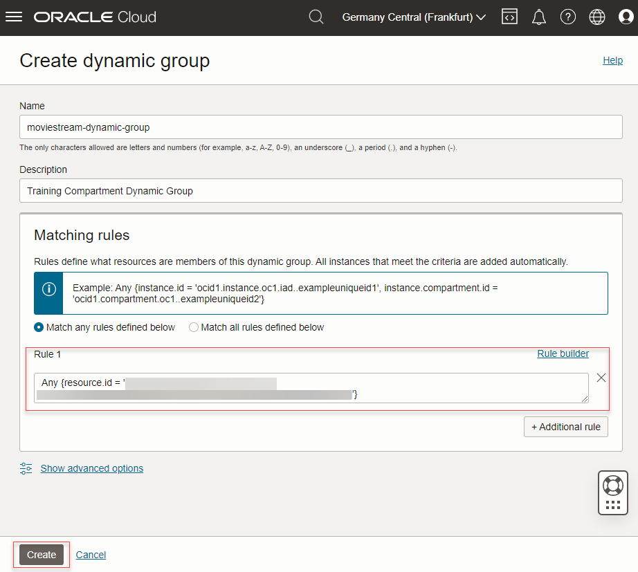

    + Click **Create**. The **Dynamic Group Details** page is displayed. Click **Dynamic Groups** in the breadcrumbs to re-display the **Dynamic Groups** page.

         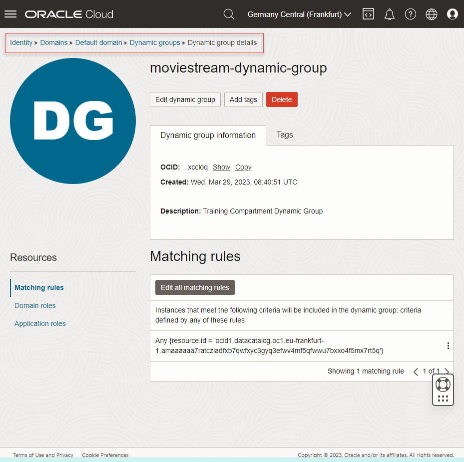

         The newly created dynamic group is displayed.

         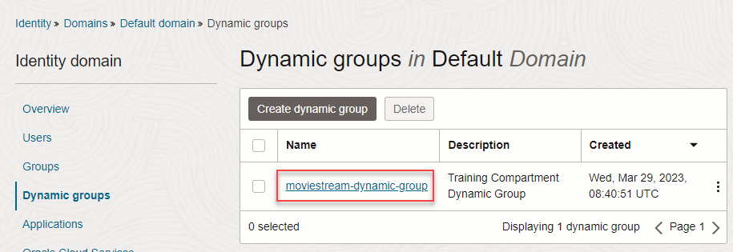

#### Create an Object Storage Resources Access Policy    

After you create a dynamic group, you create policies to permit the dynamic group to access Oracle Cloud Infrastructure services. In this task, you create a policy to allow Data Catalog in your `data-catalog-livelab-work` compartment to access any object in your **Oracle Object Storage**, in any bucket. At a minimum, you must have `READ` permissions to all the individual resource types such as `objectstorage-namespaces`, `buckets`, and `objects`, or to the Object Storage aggregate resource type `object-family`.

Create an access policy to grant ``READ`` permission to the **Object Storage** aggregate resource type ``object-family`` as follows:

1. Open the **Navigation** menu and click **Identity & Security**. Under **Identity**, select **Policies**.

    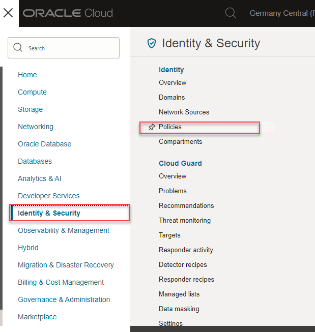

2. On the **Policies** page, make sure that your **`data-catalog-livelab-work`** compartment is selected, and then click **Create Policy**.  

    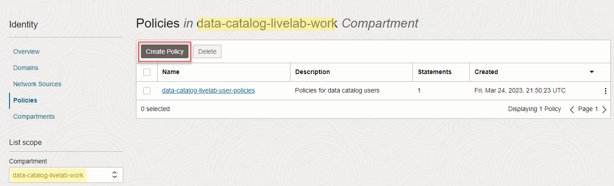

    The **Create Policy** dialog box is displayed.

3. In the **Create Policy** dialog box, provide the following information:
    + Enter **`moviestream-object-storage-policy`** in the **Name** field.
    + Enter **`Grant Dynamic Group instances access to the Oracle Object Storage resources in your compartment`** in the **Description** field.
    + Select **`data-catalog-livelab-work`** from the **Compartment** drop-down list, if it's not already selected.
    + In the **Policy Builder** section, click and slide the **Show manual editor** slider to enable it. An empty text box is displayed in this section.
    + Allow Data Catalog to access any object in your Oracle Object Storage, in any bucket, in the `training-dcat-compartment` compartment. Click the **Copy** button in the following code box, and then paste it in the **Policy Builder** text box.  

        ```
        <copy>allow dynamic-group moviestream-dynamic-group to read object-family in compartment data-catalog-livelab-work</copy>
        ```
     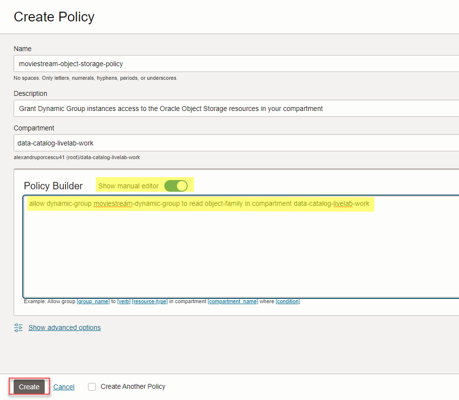

     This policy allows access to any object, in any bucket, within the `data-catalog-livelab-work` compartment where the policy is created.

    + Click **Create**. The **Policy Detail** page is displayed. Click **Policies** in the breadcrumbs to return to the **Dynamic Groups** page.

         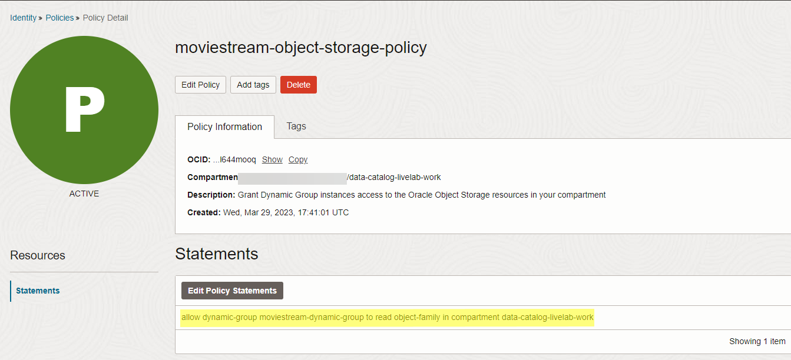

          The newly created policy is displayed in the **Policies** page.

        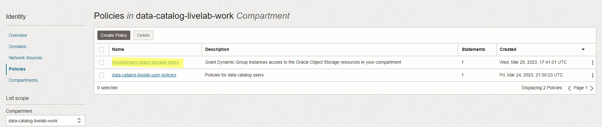
        > **NOTE:**   You must have a **Free Tier/ Paid Oracle Cloud Account** and **Oracle Cloud Infrastructure user** that is assigned to an **Oracle Cloud Infrastructure group**.

## Task 2: Create an Object Storage Data Asset

1. Open the **Navigation** menu and click **Analytics & AI**. Under **Data Lake**, click **Data Catalog**.

2. On the **Data Catalogs** page, click the **`data-catalog-livelab-instance`** Data Catalog instance where you want to create your data asset.

    

3. On the **`data-catalog-livelab-instance`** **Home** page, click **Create Data Asset** in the **Quick Actions** tile.

     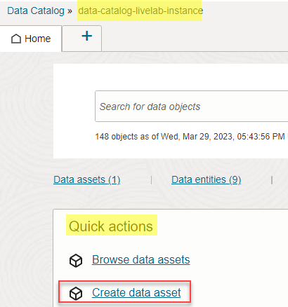

4. In the **Create Data Asset** panel, specify the data asset details as follows. You can use the values, which you have obtained from Task1 for filling the details, but for this lab, we will use an existing Object Storage buckets:    
       * **Name:** **`Oracle Object Storage Data Asset`**.
       * **Description:** **`Data Asset to access Oracle Object Storage buckets in a different tenancy than yours using public PARs`**.
       * **Type:** Select **Oracle Object Storage** from the drop-down list.
       * **URL:** Enter the swift URL for your Oracle Cloud Infrastructure Object Storage resource. The URL format for an Oracle Cloud Infrastructure Object Storage resource is as follows which includes your own _region-identifier_:

        ```
        <copy>https://swiftobjectstorage.&ltregion-identifier&gt.oraclecloud.com</copy>
        ```
        > **NOTE:** In this lab, you will be accessing an existing Oracle Object Storage bucket that contains the data. The bucket located in the **c4u04** tenancy in the **us-ashburn-1** region. In the next step, you will add a connection to this data asset using pre-authenticated requests (PAR). For information on PAR, see [Using Pre-Authenticated Requests](https://docs.oracle.com/en-us/iaas/Content/Object/Tasks/usingpreauthenticatedrequests.htm) in the *Oracle Cloud Infrastructure* documentation.

        Click **Copy** to copy the following URL, and then paste it in the **URL** field:
        ```
        <copy>https://swiftobjectstorage.us-ashburn-1.oraclecloud.com</copy>
        ```

      * **Namespace:** Enter **c4u04**.  

5. Click **Create** in the **Create Data Asset** panel.  

    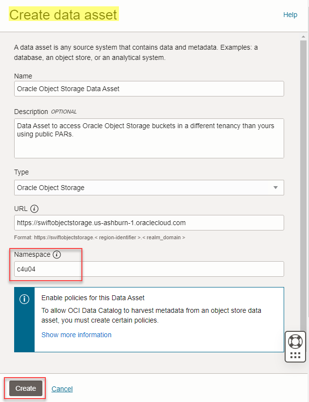

  A  `Data Asset created successfully` message box is displayed. The **Data Lake** tab is displayed. The details for the new Data Asset are displayed in the **Summary tab**.

    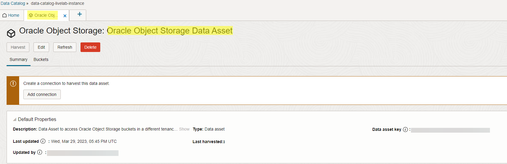

## Task 3: Add Data Asset Connections to the Oracle Object Storage Buckets

After you register a data source as a data asset in your data catalog, you create a connection to your data asset to be able to harvest it. You can create multiple connections to your data source. At least one connection is needed to be able to harvest a data asset. In this lab, you will create a data connection to access the **moviestream\_landing** Oracle Object Storage buckets that contain the data. The buckets are located in different tenancy than yours, named **c4u04** in the **us-ashburn-1** region; therefore, you will use pre-authenticated requests (PAR). For information on PAR, see [Using Pre-Authenticated Requests](https://docs.oracle.com/en-us/iaas/Content/Object/Tasks/usingpreauthenticatedrequests.htm) in the *Oracle Cloud Infrastructure* documentation.

Add a connection to the **moviestream\_landing** bucket to your new **Oracle Object Storage Data Asset** as follows:

1. On the **Oracle Object Storage Data Asset** tab, in the **Summary** tab, click **Add Connection**.

   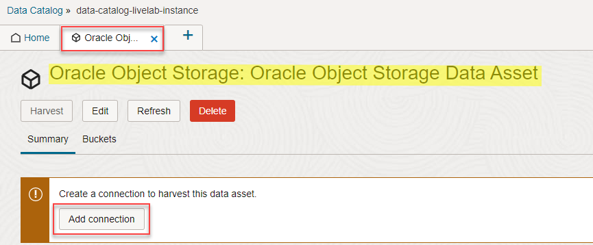

2. In the **Add Connection** panel, specify the connection details as follows:

       * **Name:** **`moviestream-landing-bucket-connection`**.
       * **Description:** Enter an optional description.
       * **Type:** Select **Pre-Authenticated Request** from drop-down list.
       * **Pre-Authenticated Request URL:** Click **Copy** to copy the following URL, and then paste it in this field.
         ```
         <copy>https://objectstorage.us-ashburn-1.oraclecloud.com/p/YtpqXpUpPx1pPXFQa4Githwxx4bxp12q2yZJsCyzN0Y9-kpYr5nAOvLvwZfLHxXF/n/c4u04/b/moviestream_landing/o/</copy>

         ```   
       * **Make this the default connection for the data asset:** Leave this checkbox unchecked.

    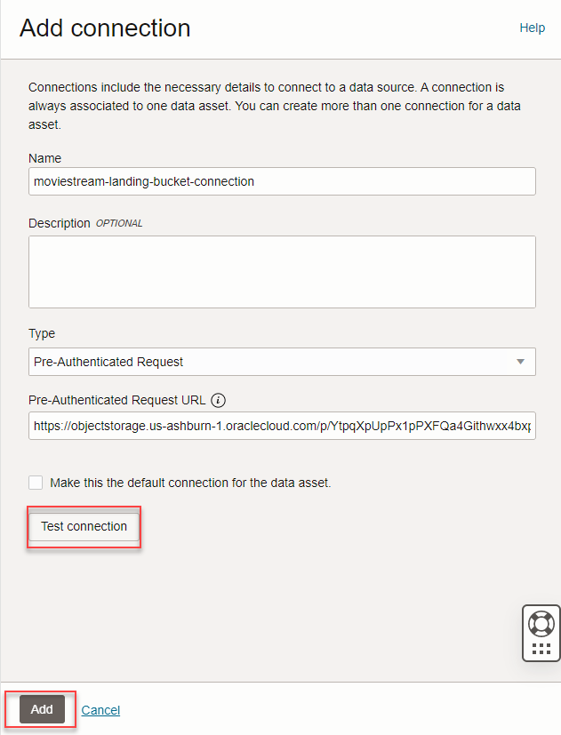

3. Click **Test Connection**. A message box is displayed indicating whether the test was successful.

   

4. If the test is successful, click **Add**. A message box is displayed indicating whether the connection was added successfully. The **moviestream-landing-bucket-connection** data source connection is added to the data asset and is displayed in the **Connections** section.

   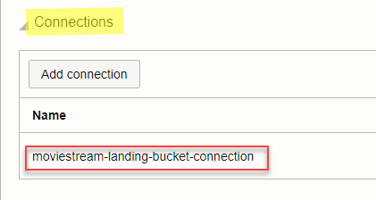

## Task 4: Create a Filename Pattern and Assign it to your Oracle Object Storage Data Asset

Your data lake typically has a large number of files that represent a single data set. You can group multiple Object Storage files into logical data entities in Data Catalog using filename patterns. A filename pattern is a regular expression that is created to group multiple Object Storage files into a logical data entity that can be used for search and discovery. Using logical data entities, you can organize your data lake content meaningfully and prevent the explosion of your entities and attributes in your Data Catalog. If an Object Storage file is matched with multiple filename patterns, it can be part of multiple logical data entities.

  > **Note** : If you harvest your Object Storage data source files without creating filename patterns, Data Catalog creates an individual logical entity for each file under each root bucket. Imagine this situation with hundreds of files in your data source resulting in hundreds of data entities in your Data Catalog.

Create a filename pattern as follows:

1. Open the **Navigation** menu and click **Analytics & AI**. Under **Data Lake**, click **Data Catalog**.

2. On the **Data Catalogs** page, click the **`data-catalog-livelab-instance`** Data Catalog instance that contains the Data Asset for which you are adding a Filename Pattern.

3. On the Data Catalog instance **Home** page, click the **+** tab and select **File Patterns** from the **Context** menu.

    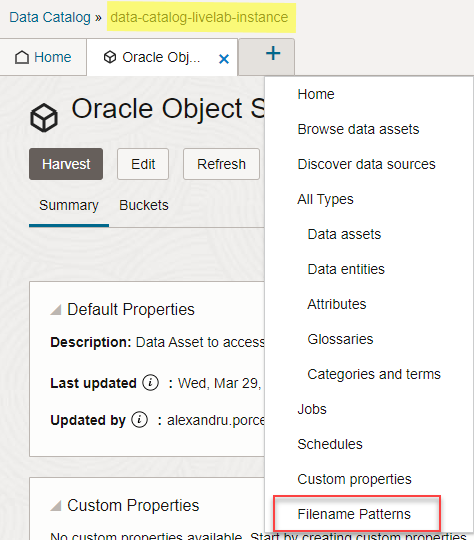

    The **Filename Patterns** tab is displayed.

    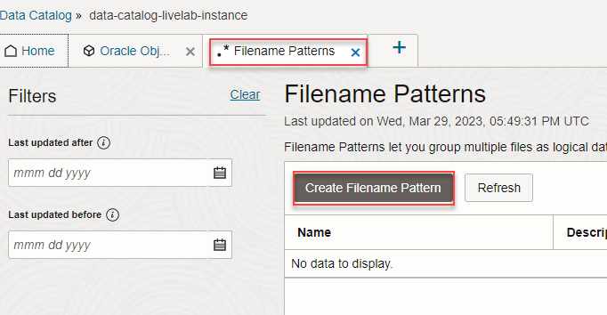

    > **Note**: Alternatively, you can also access the **Filenames Pattern** tab from the Data Catalog instance **Home** page. Next, click **Manage Filename Patterns** from the **Quick Actions** tile.

    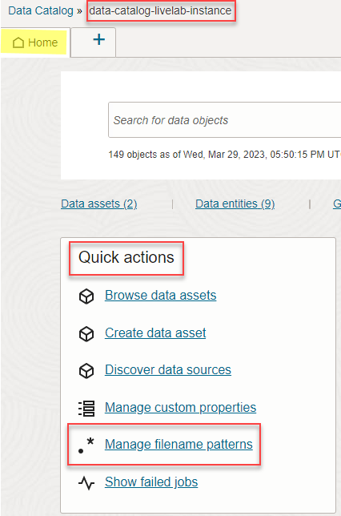

4. Click **Create Filename Pattern**. In the **Create Filename Pattern** panel, specify the following information:

     * **Name:** `Map Object Storage Folders to DCAT Logical Entities`.
     * **Description:** `Map each Object Storage folder off the moviestream_landing and moviestream_gold root buckets to DCAT Logical Entities using the regular expression`.
     * Select **Regular Expression**
     * **Expression:** Enter the following regular expression:

        ```
        <copy>{bucketName:[A-Za-z0-9\.\-_]+}/{logicalEntity:[^/]+}/\S+$</copy>
        ```
        > **Note**: You can click **View Pattern Examples** for examples on filenames, pattern expressions, and the logical data entity names that are derived based on the pattern expression. The examples show both

     Here is the explanation of the regular expressions:      

     * **``{bucketName:[A-Za-z0-9\.\-_]+}``**:      
     This section, between the opening and closing **{ }**, represents the derived bucket name. You can use the **`bucketName`** qualifier to specify that the bucket name should be derived from the path that matches the expression that follows. In this example, the bucket name is comprised of the characters leading up to first **`/`** character (which is outside the name section). The valid characters are **`A-Z`**, **`a-z`**, **`0-9`**, **`.`** (period), **-** (hyphen), and **_** (underscore). The **`+`** (plus) indicates any number of occurrences of the preceding expression inside the **[ ]**.
     Certain characters such as **`.`**, and **`-`** must be escaped by adding a **`\`** (backslash) escape character such as **`\.`** and **`\-`**.

     * **``{logicalEntity:[^/]+}``**:      
     This section, between the second set of opening and closing **{ }**, represents the derived logical entity name. You can use the **`logicalEntity`** qualifier to specify that the logical entity name should be derived from the path that matches the expression that follows. In this example, the logical entity name is comprised of the characters leading up to the second **`/`** character (which is outside the name section). The logical entity name starts after the "/" and ends with the “/” following the closing "}". It can contain any character that is not a forward slash, `/` as represented by the not **`^`** (caret) symbol.  

     * **`/\S+$`**:       
     Finally, the logical data entities names will be any non-whitespace characters (represented by `\S+`). **`$`** signifies the end of the line.

     * **Test Expression:** Enter the following filenames in the **Test filenames** text box:

        ```
        <copy>moviestream_landing/customer/customer.csv
        moviestream_gold/sales/time=jan/file1.parquet
        moviestream_gold/sales/time=feb/file1.parquet</copy>
        ```

        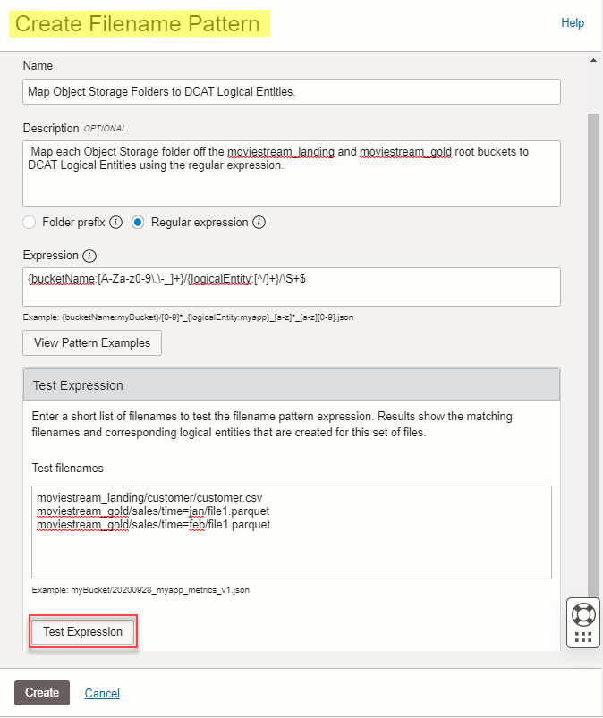

5. Click the **Test Expression** link. The **Resulting Logical Entities** based on the regular expression that you specified are displayed.

    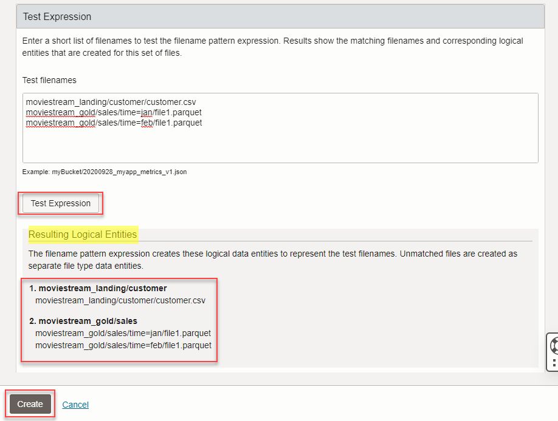

6. Click **Create**. A message box is displayed indicating whether the test was successful.

    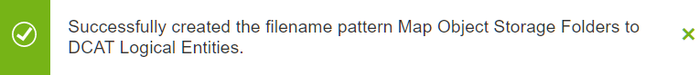

  The **File Patterns** tab is re-displayed. The newly created file pattern is displayed in the **Filename Patterns** list.
  
    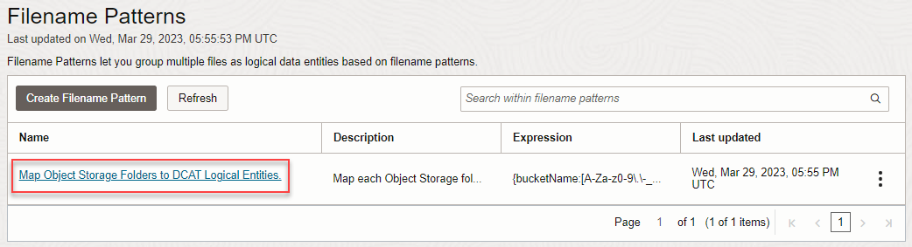

7. Assign the filename pattern that you just created to your **Oracle Object Storage Data Asset**. On the **Home** tab, click the **Data Assets** link to access the **Data Assets** tab.

    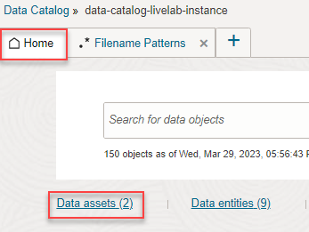

8. In the **Data Assets** list, click the **Oracle Object Storage Data Asset** data asset for which you want to assign filename pattern.
    

9. In the **Summary** tab on the **Oracle Object Storage Data Asset** details tab, scroll-down the page to the **Filename Patterns** section, and then click **Assign Filename Patterns**.

    

10. From the **Assign Filename Patterns** panel, select the filename patterns that you want to assign to this data asset. You can use the **Filter** box to filter the filename patterns by name. You can also de-select already assigned filename patterns to un-assign them from this data asset.

    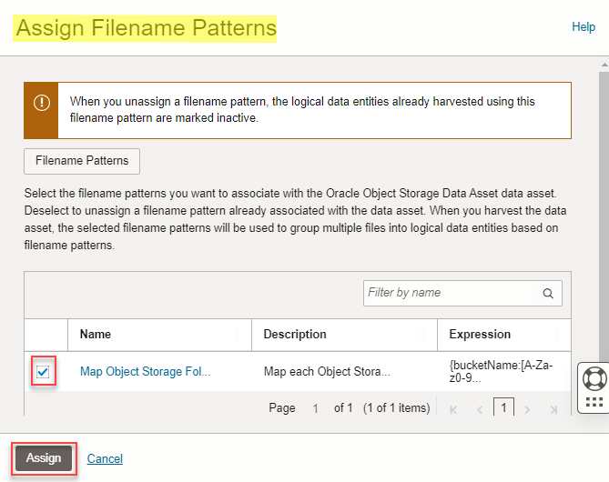

11. Click **Assign**. The selected filename patterns is assigned to the data asset. When you harvest the data asset, the filename pattern is used to derive logical data entities. The names of the files in the Object Storage bucket are matched to the pattern expression and the logical data entities are formed.

    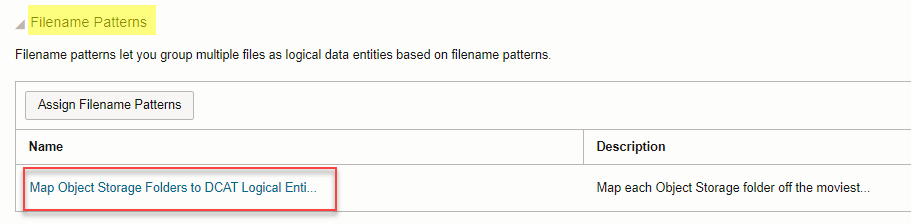

    > **Note:**    
    When you assign a new filename pattern to a data asset, the status of any harvested logical data entities is set to **Inactive**. You need to harvest the data asset again to derive the valid logical data entities again.

## Task 5: Harvest the Data Asset

After you create a data asset in the Data Catalog repository, you harvest the data asset to extract the data structure information into the Data Catalog and view its data entities and attributes.

Harvest the data entities from a data asset as follows:

1. Open the **Navigation** menu and click **Analytics & AI**. Under **Data Lake**, click **Data Catalog**.

2. On the **Data Catalogs** page, click the **`data-catalog-livelab-instance`** Data Catalog instance that contains the data asset that you want to harvest.

3. On the Data Catalog instance **Home** tab, click **Data Assets**. The **Data Assets** tab is displayed.       

      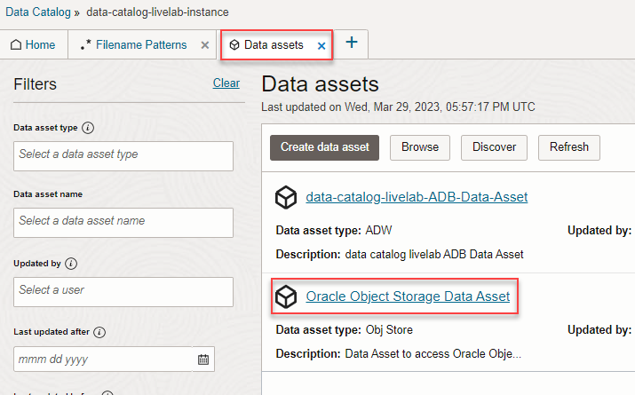

4. In the **Data Assets** list, click the **Oracle Object Storage Data Asset** data asset. The **Oracle Object Storage: Oracle Object Storage Data Asset** page is displayed.

      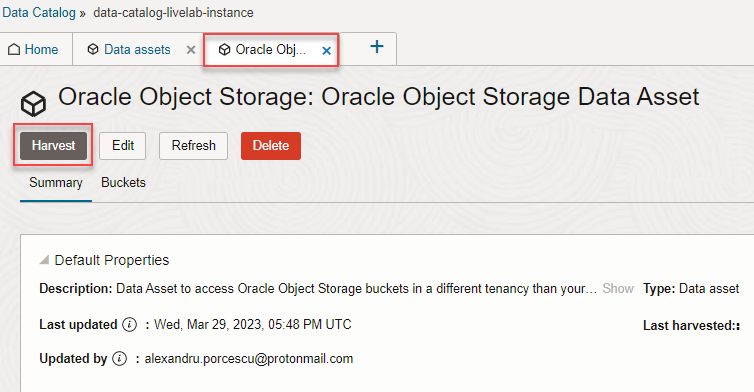

5. Click **Harvest**. The **Select a Connection** page of the **Harvest** wizard (Step 1 of 3) is displayed in the **Harvest Data Entities** tab. Select the **moviestream-landing-bucket-connection** from the **Select a connection for the data asset you want to harvest** drop-down list. Click **Next**.

      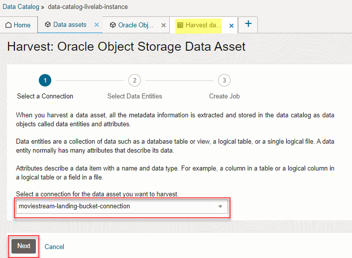

6. The **Select Data Entities** page of the **Harvest** wizard (Step 2 of 3) is displayed.

      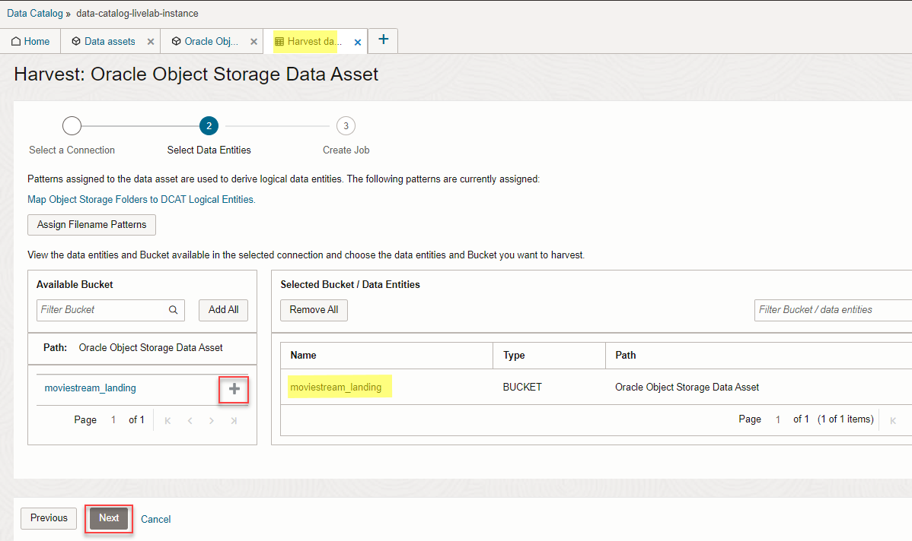

      > **Note:** You can use this page to view and add the bucket(s) and/or data entities you want to harvest from the **Available Buckets** section. Click the **bucket link** to display its nested data entities. Click the  icon next to each data entity that you want to include in the harvest job. You can search for a bucket or entity using the **Filter Bucket** and **Filter Bucket / data entities** search boxes.

      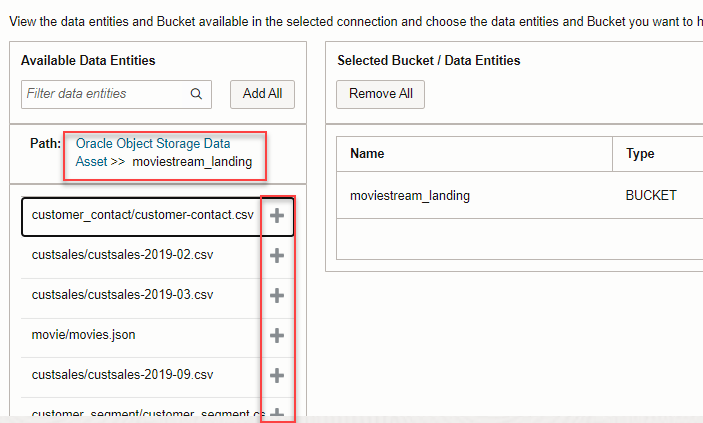

7. Click **Next**. The **Create Job** page of the **Harvest** wizard (Step 3 of 3) is displayed. Specify the following for the job details:

      * **Job Name:** Accept the default name.
      * **Job Description:** Enter an optional description.
      * **Incremental Harvest:** Deselect this checkbox. Selecting this check box causes subsequent runs of this harvesting job to only harvest data entities that have changed since the first run of the harvesting job.
      * **Include Unrecognized Files:** Leave this check box unchecked. Select this check box if you want Data Catalog to also harvest file formats that are not currently supported such as `.log`, `.txt`, `.sh`, `.jar`, and `.pdf`.
      * **Include matched files only:** Select this check box. If you are harvesting an Oracle Object Storage data asset, select this check box if you want Data Catalog to harvest only the files that match the assigned filename patterns that you specified. When you select this check box, the files that do not match the assigned filename patterns are ignored during the harvest and are added to the skipped count.
      * **Time of Execution:** Select one of the three options to specify the time of execution for the harvest job:
         * **Run job now**: Select this option (default). This creates a harvest job and runs it immediately.    
         * **Schedule job run**: Displays more fields to schedule the harvest job. Enter a name and an optional description for the schedule. Specify how frequently you want the job to run from the **Frequency** drop-down list. Your choices are **Hourly**, **Daily**, **Weekly**, and **Monthly**. Finally, select the start and end time for the job.    

         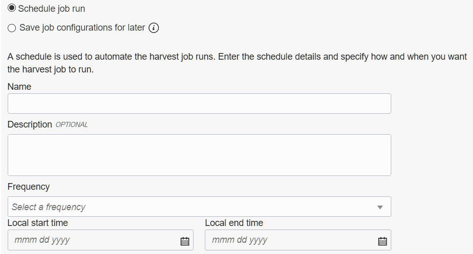

         * **Save job configurations for later**: Creates a job to harvest the data asset, but the job is not run.

          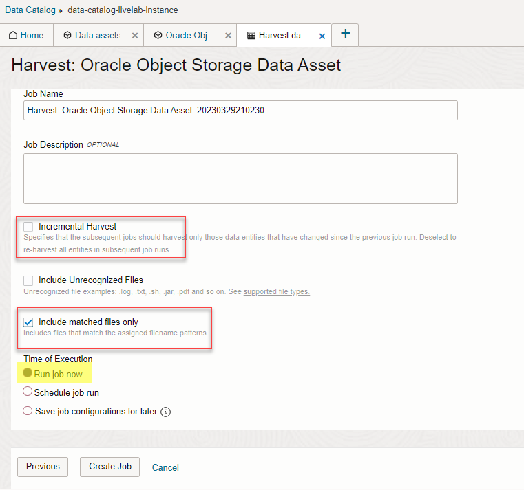

8. Click **Create Job**.      

    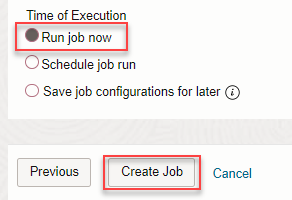

    The harvest job is created successfully and the **Jobs** tab is displayed. Click the job name link in the **Name** column.

    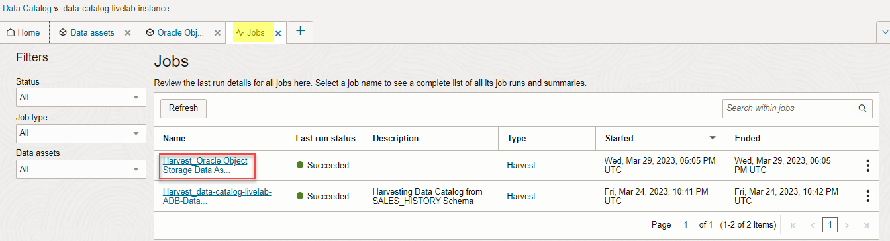

9. The harvest job name tab is displayed. On the **Jobs** tab, you can track the status of your job and view the job details.  The **Logical data entities harvested** field shows **9** as the number of logical entities that were harvested using the filename pattern that you assigned to this Object Storage asset. This number represents the number of sub-folders under the **`moviestream_landing`** root buckets. There are **57** corresponding files under the sub-folders under the root buckets.

    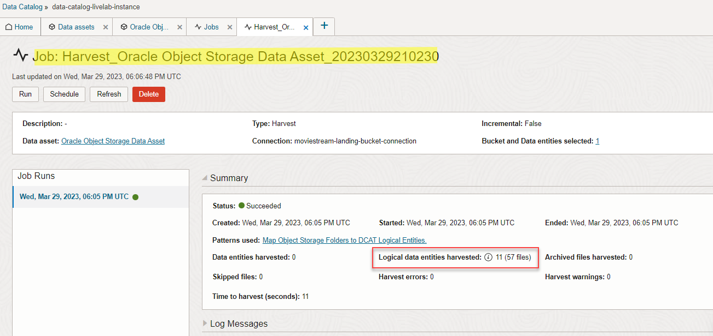

10. Drill-down on the **Log Messages** icon to display the job log.

    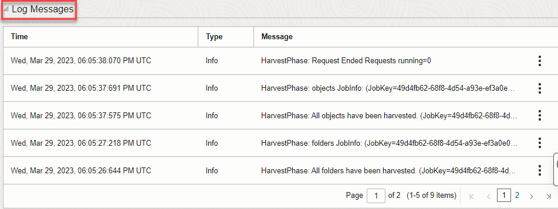

11. After you harvest your data asset, you can browse or explore your data asset to view the data entities and attributes. Click on the **Data Asset** link.

    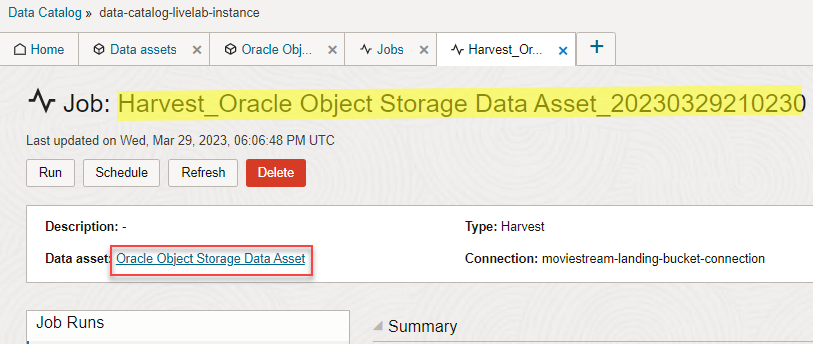

12. The **Oracle Object Storage Data Asset** tab is displayed. Click on **Refresh** button; always do this before exploring the buckets and its entities.

    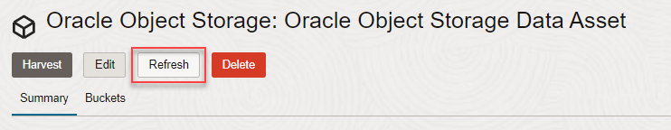

13. Click on **Buckets** tab, and then click on the **moviestream_landing** bucket link.

    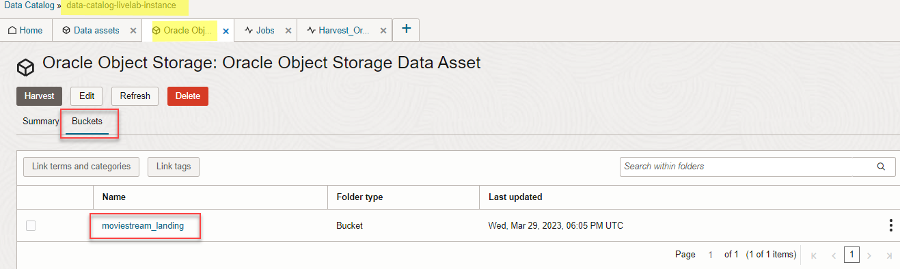

14. A new tab **moviestream_landing** is opened with the default **Summary** tab.

    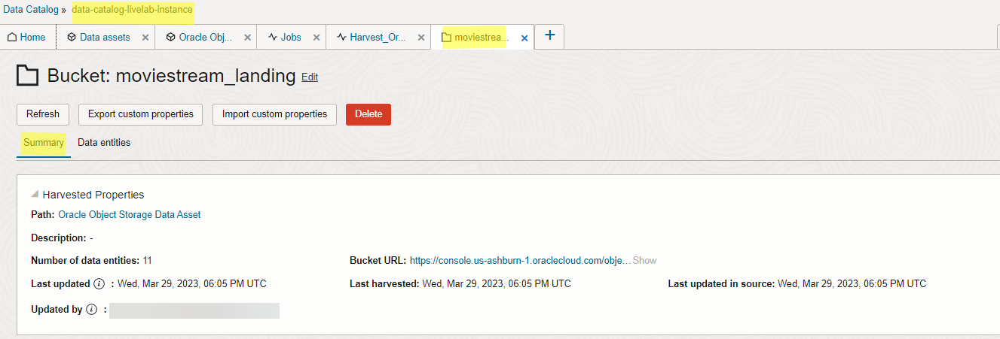

15. Click on **Data Entities** tab to explore further, for example click on **custsales** data entity.

    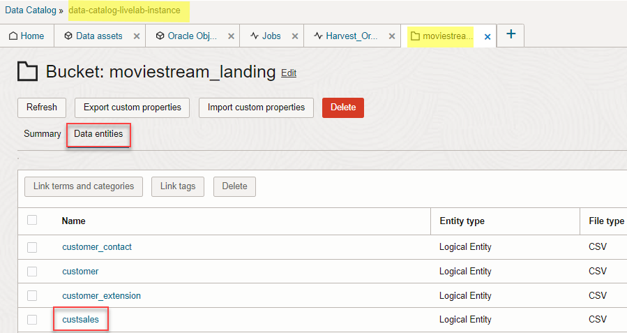

16. A **Summary** tab is displayed.View the default properties, custom properties, tags, business glossary terms and categories, and recommendations, if any, for the data entity from the **Summary** tab.

    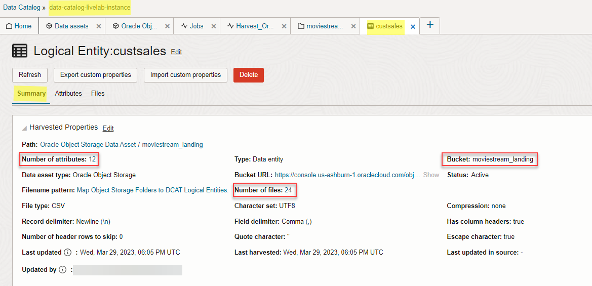

17. From the **Attributes** tab, view the data entity attribute details.

    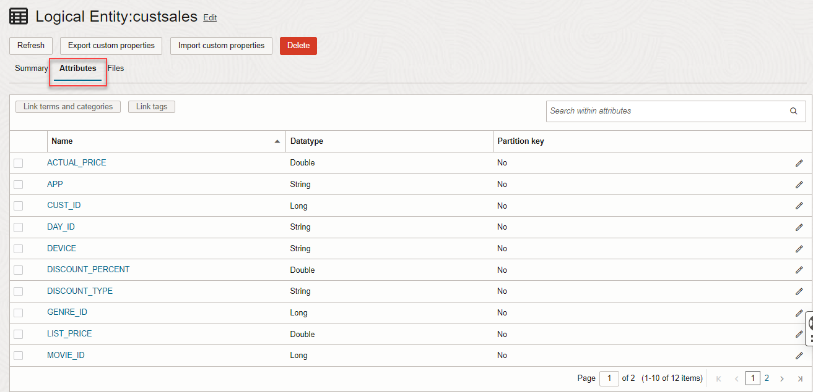

18. From the **Files** tab, view the data entity attribute details.


    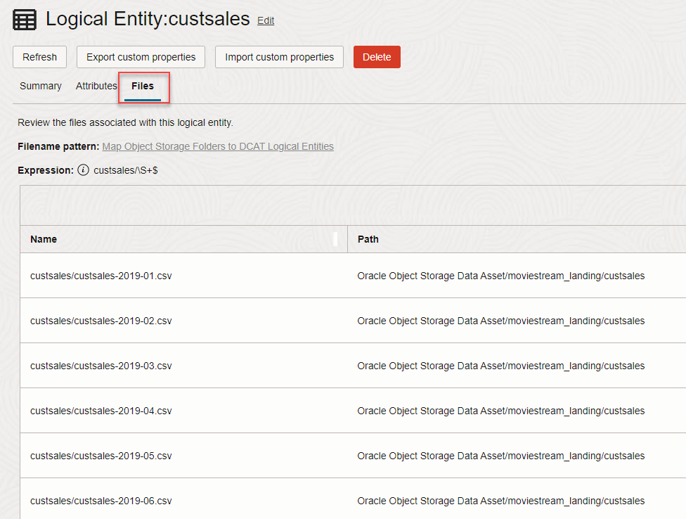


You may now **proceed to the next lab**


## Learn More

* [Get Started with Data Catalog](https://docs.oracle.com/en-us/iaas/data-catalog/using/index.htm)
* [Data Catalog Overview](https://docs.oracle.com/en-us/iaas/data-catalog/using/overview.htm)
* [Autonomous Data Warehouse](https://docs.oracle.com/en/cloud/paas/autonomous-data-warehouse-cloud/index.html)
* [Object Storage](https://docs.oracle.com/en-us/iaas/Content/Object/Concepts/objectstorageoverview.htm)
* [Oracle Cloud Infrastructure Identity and Access Management](https://docs.oracle.com/en-us/iaas/Content/Identity/Concepts/overview.htm)
* [Managing Groups in Oracle Cloud Infrastructure](https://docs.oracle.com/en-us/iaas/Content/Identity/Tasks/managinggroups.htm)
* [Overview of VCNs and Subnets](https://docs.oracle.com/en-us/iaas/Content/Network/Tasks/managingVCNs_topic-Overview_of_VCNs_and_Subnets.htm#Overview)
* [Managing Compartments in Oracle Cloud Infrastructure](https://docs.oracle.com/en-us/iaas/Content/Identity/Tasks/managingcompartments.htm)

## Acknowledgements

* **Author** - Lauran Serhal, Shreedhar Talikoti, Ramkumar Dhanasekaran
* **Contributors** - Rashmi Badan, Sreekala Vyasan
* **Last Updated By/Date** - Alexandru Porcescu, March 2023
