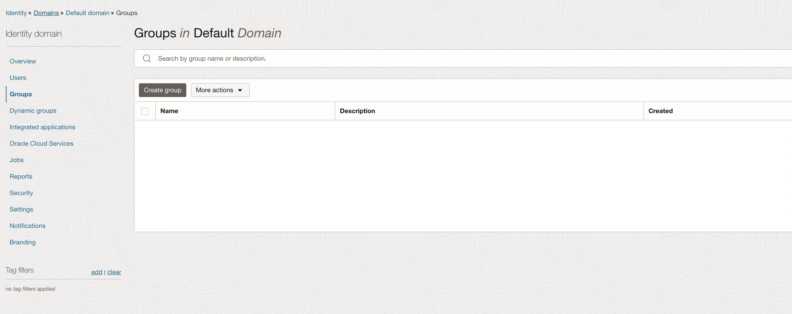
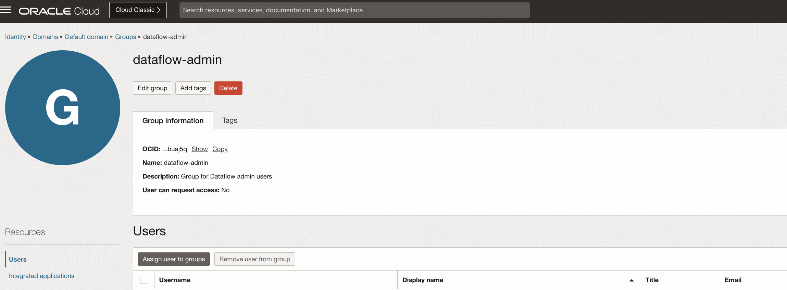
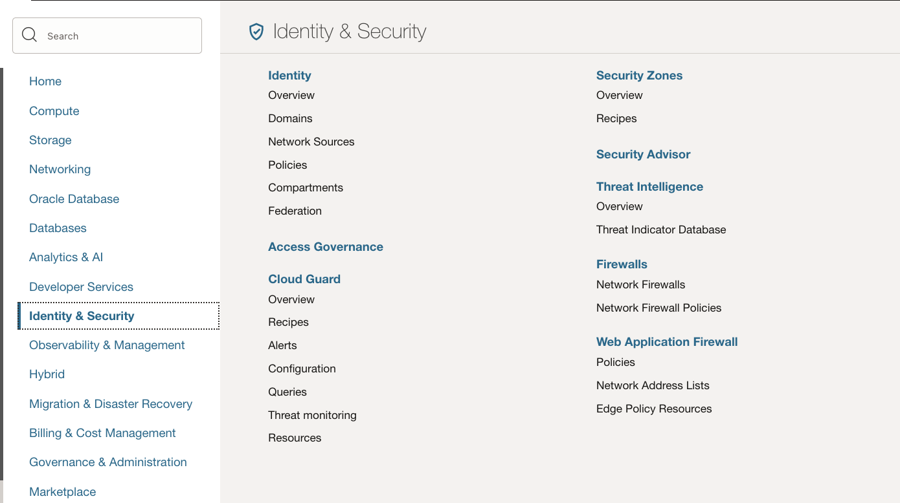
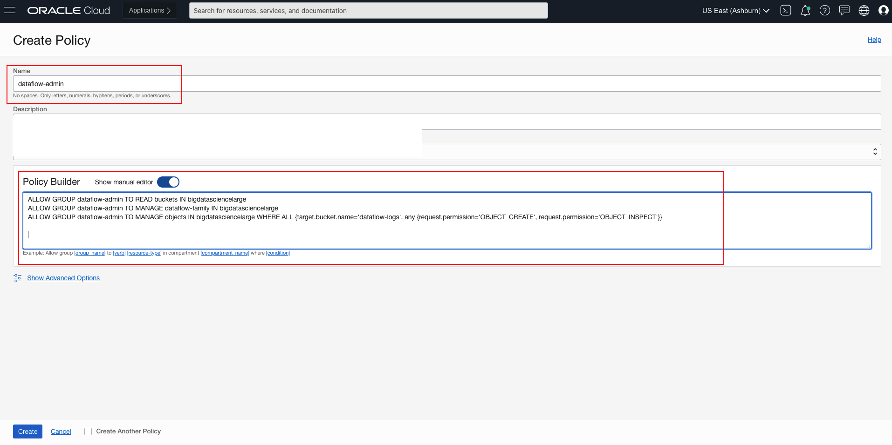
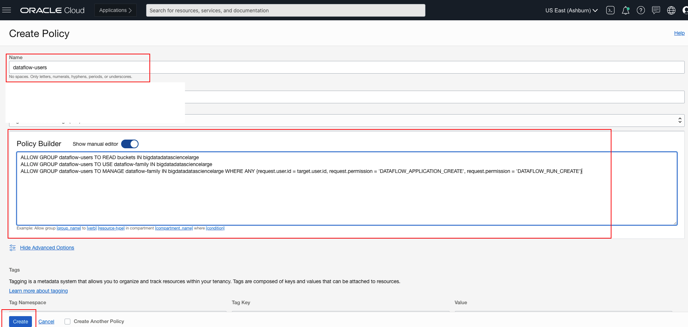
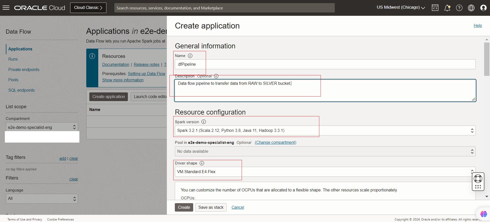

## Setting up Oracle Cloud Infrastructure Data Flow 

### Introduction
The labs shows how we can set up the OCI Data Flow PySpark application and extract data from ***demo-events-raw-mysqlhw*** bucket ,consolidate the datasets and load the data to ***demo-events-silver-mysqlhw*** bucket .

Setting up OCI Data Flow
- Provision the OCI Data flow in the tenancy 
- Deploy the PySpark application to run using Data flow.
- Create PAR Link for the bucket

*Estimated Lab Time*: 30 mins

### Objectives

In this lab you will learn about Oracle Data Flow , how to set the service ,dependent policies and run PySpark application.

Before you can create, manage and execute applications in Data Flow, the tenant administrator (or any user with elevated privileges to create buckets and modify IAM) must create specific storage buckets and associated policies in IAM. These set up steps are required in Object Store and IAM for Data Flow functioning .

This lab will set the foundation for future labs to follow.

- Provision the OCI Data flow in the tenancy 
- Deploy the PySpark application to run using Data flow.
- Create PAR Link for the bucket.

### Prerequisites

Before you Begin with Data Flow lab, you must have:

* An Oracle Cloud Infrastructure account. Trial accounts can be used to demo Data Flow.
* A Service Administrator role for your Oracle Cloud services. When the service is activated, Oracle sends the credentials and URL to the designated Account Administrator. The Account Administrator creates an account for each user who needs access to the service.
* A supported browser, such as:
    * Microsoft Internet Explorer 11.x+
    * Mozilla Firefox ESR 38+
    * Google Chrome 42+
* Familiarity with Object Storage Service.

## Task 1: Object Storage Bucket : Validation Check

Before running the application in the Data Flow service.

Please ensure you have already created the bucket called **dataflow-logs** and **Dataflowbucket** in the Object Store service as previously mentioned in **Lab 1 -> Task2**


## Task 2(a): Identity: Policy Set Up

A user's permissions to access services comes from the _groups_ to which they belong. The permissions for a group are defined by policies. Policies define what actions members of a group can perform, and in which compartments. Users can access services and perform operations based on the policies set for the groups of which they are members.

We'll create a user, a group, and policies to understand the concept.


1. **User Policies** : Data Flow requires policies to be set in IAM to access resources in order to manage and run applications. We categorize the Data Flow users into two groups for clear separation of authority administrator and users:

    * From the OCI Services menu, click `Identity and Security` -> `Domains` -> `Default domain` and  `Groups`

        

    * Create a group in your identity service called `dataflow-admin`

        

    * Click on your new group to display it. Your new group is displayed. Assign user to the groups

        

        

    * From the OCI Services menu, click `Identity and Security` and in identity click `Policies`

        

    * Create a policy called `dataflow-admin` in your `compartment` and add the following statements:

       

      ```
      <copy>
      ALLOW GROUP dataflow-admin TO READ buckets IN TENANCY
      </copy>
      ```

      ```
      <copy>
      ALLOW GROUP dataflow-admin TO MANAGE dataflow-family IN TENANCY
      </copy>
      ```
      ```
      <copy>
      ALLOW GROUP dataflow-admin TO MANAGE objects IN TENANCY WHERE ALL
          {target.bucket.name='dataflow-logs', any {request.permission='OBJECT_CREATE',
          request.permission='OBJECT_INSPECT'}}
      </copy>
      ```
    * Create a group in your identity service called dataflow-users and add users to this group.

      

    * Create a policy called dataflow-users and add the following statements:

      

      ```
      <copy>
      ALLOW GROUP dataflow-users TO READ buckets IN TENANCY
      </copy>
      ```
      ```
      <copy>
      ALLOW GROUP dataflow-users TO USE dataflow-family IN TENANCY
      </copy>
      ```
      ```
      <copy>
      ALLOW GROUP dataflow-users TO MANAGE dataflow-family IN TENANCY WHERE ANY {request.user.id = target.user.id, request.permission = 'DATAFLOW_APPLICATION_CREATE', request.permission = 'DATAFLOW_RUN_CREATE'}
      </copy>
      ```
      *Note: Replace <tenancy> with the name of your tenancy*

2. **Service Policies** : The Data Flow service needs permission to perform actions on behalf of the user or group on objects within the tenancy.To set it up, create a policy called `dataflow-service` and add the following statement:

      ```
      <copy>
      ALLOW SERVICE dataflow TO READ objects IN tenancy WHERE target.bucket.name='dataflow-logs'
      </copy>
 
     ```
## Task 2(b): Deploy the PySpark Application to the data flow
In this task we will be deploying the PySpark Application to OCI Objectstore and will be creating a Data flow application.
1. Modify the PySpark script - Open the script locall
- Download the Labfiles and navigate to the below folder location to collect the codepump.zip file.

   Download file [`MYSQLLakehouse_labfiles.zip`](https://objectstorage.us-ashburn-1.oraclecloud.com/p/RPka_orWclfWJmKN3gTHfEiv-uPckBJTZ3FV0sESZ3mm3PDCQcVDCT-uM2dsJNGf/n/orasenatdctocloudcorp01/b/MYSQLLakehouse_labfiles/o/MYSQLLakehouse_labfiles.zip)

  *** Python Framework Location in the Zip file - MYSQLLakehouse_labfiles\_Lab6a

  

      ```
      <copy>
      line 26: change the namespace of the bucket path
      line36: change the namespace of the bucket path
      </copy>
 
     ```
     

2. Upload the main.py script to Objectstore bucket ***Dataflowbucket***

    

3. Create a PySpark application on Data Flow.
  Navigate to DataFlow

  

  Create the Data Flow Application

  DataFlow Application Name - 
      ```
      <copy>
      dfPipeline
      </copy>
 
     ```
  *** Note - Select the parameters based on the below snapshot provided.
  

  

  

  

  

4. Run the PySpark App
   

## Task 3: Create the PAR Link for the "e2e-demo-events-silver-mysqlhw" bucket 

1. Create a PAR URL for all of the **e2e-demo-events-silver-mysqlhw** objects with a prefix

    - a. From your OCI console, navigate to your e2e-demo-events-silver-mysqlhw bucket in OCI.

        
    - b. Click the three vertical dots of "e2e-demo-events-silver-mysqlhw" bucket 

        

    - c. Click on ‘Create Pre-Authenticated Request’
    - d. Click to select the ‘Objects with prefix’ option under ‘Pre-Authenticated Request Target’.
    - e. Leave the ‘Access Type’ option as-is: ‘Permit object reads on those with the specified prefix’.
    - f. Click to select the ‘Enable Object Listing’ checkbox.
    - g. Click the ‘Create Pre-Authenticated Request’ button.

       

    - h. Click the ‘Copy’ icon to copy the PAR URL, it will not be shown again.
    - i. Save the generated PAR URL; you will need it later.
    - j. You can test the URL out by pasting it in your browser. It should return output like this:

        

2. Save the generated PAR URL; you will need it in the next task


You may now **proceed to the next lab**
## Acknowledgements
* **Author** - Biswanath Nanda, Principal Cloud Architect, North America Cloud Infrastructure - Engineering
* **Contributors** -  Biswanath Nanda, Principal Cloud Architect,Bhushan Arora ,Principal Cloud Architect,Sharmistha das ,Master Principal Cloud Architect,North America Cloud Infrastructure - Engineering
* **Last Updated By/Date** - Biswanath Nanda, November 2024

