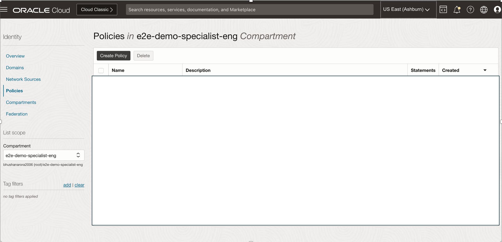

# Creating dynamic group to access streams/objects

### Introduction

In this lab we will create the dynamic group

_Estimated Lab Time_: 5 minutes

### Objectives
In this lab, you will:
- Create Dynamic Group
- Create Policies

##  
## Task 1 Create Dynamic Group

1. Open the navigation menu and click ***Domains***

    

2. Click on ***Default***(Current Domain)
    
    

3. Click on ***Dynamic Group*** -> ***Create dynamic group***:
    
    


4. Give Details as in following screen shot:


    

      ```
      <copy>
      ALL {resource.type = 'fnfunc', resource.compartment.id = 'ocid1.compartment.oc1……xyz’}
      </copy>

      ```

5. Open the navigation Menu -> Go to Identity -> Policies ->  Create Policy
    
    

6. Click on Create Policy and give it name **function-dynamic-group**

    In following copy & Replace the OCID of compartment **e2e-demo-specialist-eng** 

    ```
    <copy>
    allow dynamic-group function-dynamic-group to manage stream-family in compartment id resource.compartment.id = ‘ocid1.compartment.oc1……xyz’
    allow dynamic-group function-dynamic-group to manage stream-pull in compartment id resource.compartment.id = ‘ocid1.compartment.oc1……xyz’
    allow dynamic-group function-dynamic-group to manage streams in compartment id resource.compartment.id = ‘ocid1.compartment.oc1……xyz’
    allow dynamic-group function-dynamic-group to manage stream-pools in compartment id resource.compartment.id = ‘ocid1.compartment.oc1……xyz’
    allow dynamic-group function-dynamic-group to manage objects in compartment id resource.compartment.id = ‘ocid1.compartment.oc1……xyz’
    </copy>
    ```

    Above Create Policy should like as in following screen shots:

    

7. Now you should see **function-dynamic-group** has been created

    

You may now **proceed to the next lab**

## Acknowledgements
* **Author** - Bhushan Arora, Principal Cloud Architect, North America Cloud Infrastructure - Engineering
* **Contributors** -  Biswanath Nanda, Master Principal Cloud Architect,Bhushan Arora ,Principal Cloud Architect, Lovelesh Saxena, Principal Cloud Architect
* **Last Updated By/Date** - Bhushan Arora, November 2024