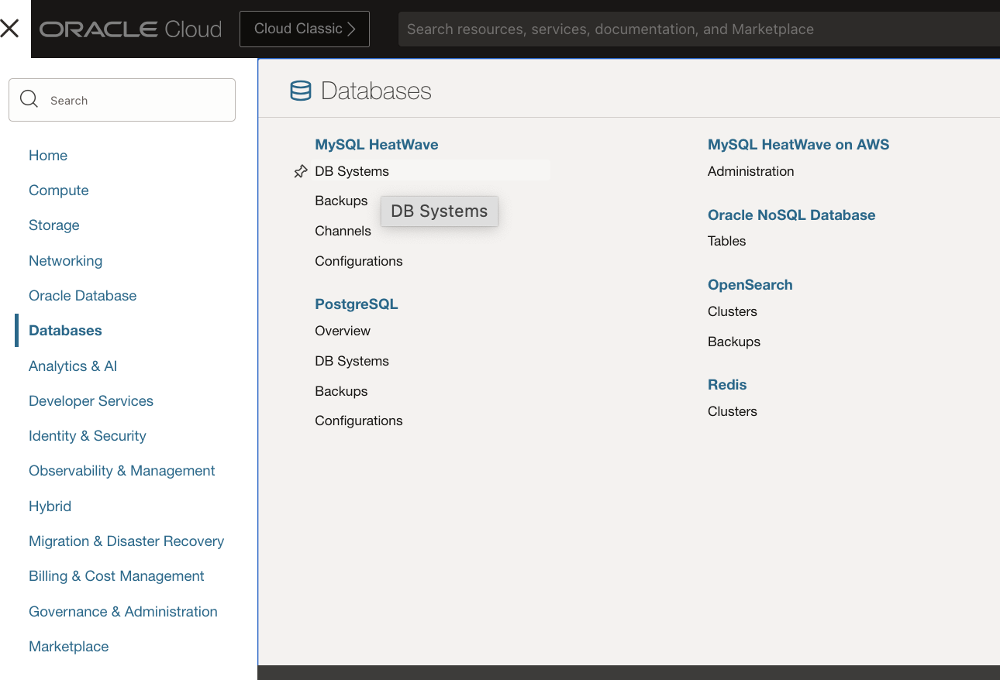
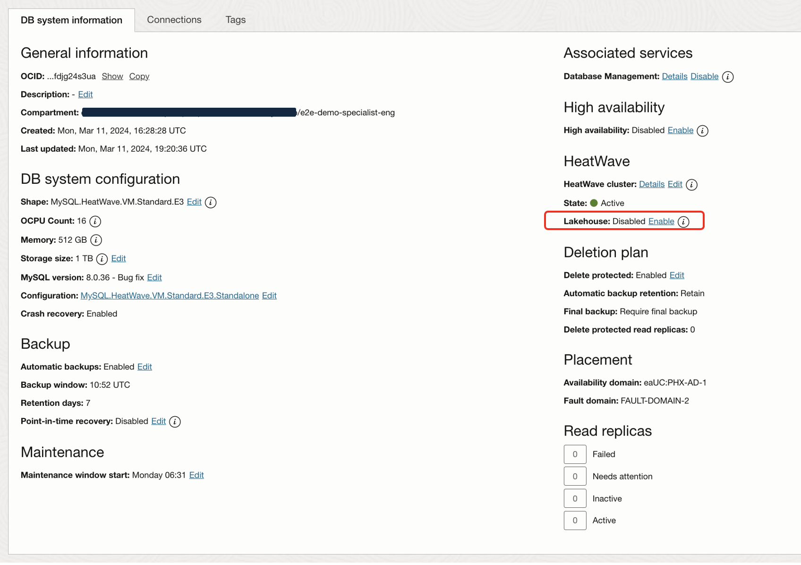

# Enable MySQL HeatWave Lakehouse in MySQL Database System

### Introduction

This lab walks you through the steps to enable **MySQL HeatWave Lakehouse** Cluster in MySQL Database System that we have created in earlier lab

_Estimated Lab Time_: 20 minutes

### Objectives

In this lab, you will:
* Be able to enable **MySQL HeatWave Lakehouse** in Oracle Cloud.

### Prerequisites

This lab assumes you have:
- An Oracle account
- You have enough privileges to use Oracle Cloud resources
- Previous lab has been successfully completed

## 
## Task 1: Enable MySQL HeatWave Lakehouse in MySQL Database System

1. Go to Navigation Menu Databases MySQL
    

2. Click the heatwave-db Database System link
    

3. All DB Systems are created with point-in-time-recovery enabled by default. 

    ***Note***: Prior to MySQL 8.3.0-u2 to enable Lakehouse,you must disable point-in-time-recovery. As here we are using the prior version; so we will disable the point-in-time-recovery.


    As of now, you will see Point-in-time recovery is enabled and proceed to next steps:

    


4. Now Click on **Edit** button above to disable "Point-in-time recovery". In Following, uncheck **Point-in-time recovery** and click on **Save Changes**

    

5. Click on **Lakehouse: Enable Button** under HeatWave

    

6. There will be a popup, now click on enable button:

    

7. It will take around 2 minutes then lakehouse status will be enabled as following:


	


## Task 2: Connect to your MySQL HeatWave system using Cloud Shell

1. If not already connected with SSH, connect to the Compute instance using OCI Cloud Shell... be sure replace the  "private key file"  and the "new compute instance ip"

     ```bash
    <copy>ssh -i private_key_file opc@new_compute_instance_ip</copy>
     ```

2. Connect to MySQL Database using the MySQL Shell client tool with the following command:

    ```bash
    <copy>mysqlsh -uadmin -p -h 10.x.x.x --sql </copy>
    ```

    

3. List schemas in your heatwave instance

    ```bash
        <copy>show databases;</copy>
    ```
    
    ```bash
        <copy>create database MFG_SENSOR;</copy>
    ```

    Now you should see a new database:

    ```bash
        <copy>show databases;</copy>
    ```

    

4. Change to the MFG\_SENSOR database

    Enter the following command at the prompt

    ```bash
    <copy>USE MFG_SENSOR;</copy>
    ```
    

5. Create Table "T\_LIVE\_EVENT\_FEED\_DATA" for Real Time data:

    ```bash
    <copy>CREATE TABLE MFG_SENSOR.T_LIVE_EVENT_FEED_DATA (
     TIMESTAMP VARCHAR(26) ,
     DEVICE_ID VARCHAR(26),
     PROD_TYPE VARCHAR(26) ,
     DEVICE_TEMP DECIMAL(38,1),
     ROTN_SPEED DECIMAL(38,1),
     TORQUE DECIMAL(38,1),
     TOOL_WEAR DECIMAL(38,1),
     PROBABILITY_SCORE DECIMAL(20,7)
    );</copy>
    ```

    ```bash
    <copy>ALTER TABLE MFG_SENSOR.T_LIVE_EVENT_FEED_DATA add (event_id INT AUTO_INCREMENT PRIMARY KEY);</copy>
    ```

    ```bash
    <copy>ALTER TABLE MFG_SENSOR.T_LIVE_EVENT_FEED_DATA SECONDARY_ENGINE=RAPID;</copy>
    ```

    Result of above commands:

    

6. Now load the data into heatwave:

    ```bash
    <copy>ALTER TABLE MFG_SENSOR.T_LIVE_EVENT_FEED_DATA SECONDARY_LOAD;</copy>
    ```

    Result of above command:

    


7. To see a list of the tables available in the MFG\_SENSOR schema

    Enter the following command at the prompt

    ```bash
    <copy>show tables;</copy>
    ```
    


You may now proceed to the next lab.

## Acknowledgements
* **Author** - Bhushan Arora, Principal Cloud Architect,North America Cloud Infrastructure - Engineering
* **Contributors** - Bhushan Arora ,Principal Cloud Architect,Biswanath Nanda, Master Principal Cloud Architect,North America Cloud Infrastructure - Engineering
* **Last Updated By/Date** - Bhushan Arora, November 2024
