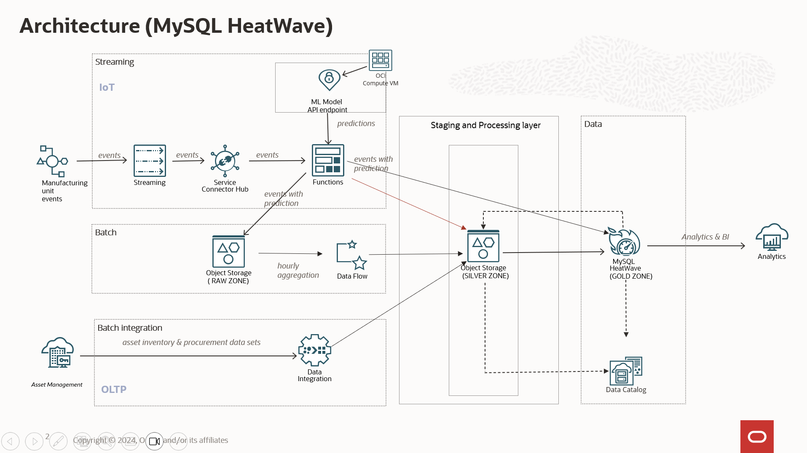
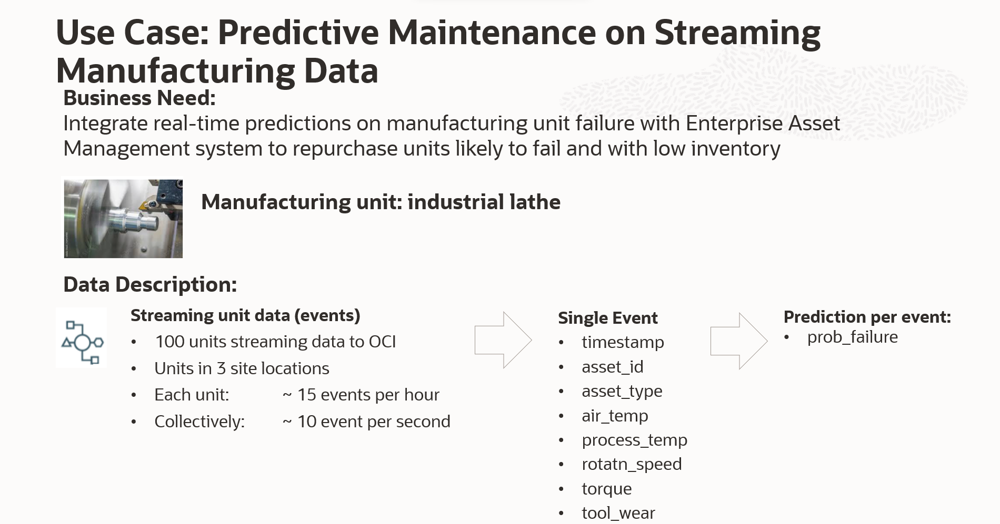

# Introduction

### MySQL HeatWave - Cloud Data Platform Architecture

  

### About this Workshop

The workshop focuses on demonstrating how Oracle Manufacturing Lakehouse helps the business in monitoring the Operational matrices and optimizing the supply chain using Oracle Cloud Data Platform. The Workshop has been designed to get a hands-on experience in Manufacturing Lakehouse and learn to leverage the next-age Data Platform services for customer demonstrations, designing POC and as an implementation accelerator for MySQL Heatwave Lakehouse.

A data Lakehouse is a modern, open architecture that enables you to store, understand, and analyze all your data. It combines the power and richness of data warehouses with the breadth and flexibility of the most popular open-source data technologies you use today.

### Dataset Brief

 The below figure shows the feature vectors of manufacturing sensor data streams .The events are being generated by the producer code hosted in a compute VM. A single event contains features such as timestamp ,asset\_id,asset\_type ,process\_temp,rotation speed ,torque and tool\_wear . Based on the historical data sets and occurrence of failures, we have built a training data set which is used as a source for the ML model built on OCI.

  

_Estimated Workshop Time_: 6 Hours

### Objectives

In this workshop, you will learn how to:

* Develop end to end OCI Cloud Data Platform using MySQL HW
* Provision OCI Streaming Service and OCI Connector Hub - for ingesting streaming work loads
* Develop Custom Machine Learning Model to predict device failures
* Provision OCI Functions
* Provision HeatWave cluster on OCI
* Provision OCI Data FLow for bulk data inserts
* Load Sample data into HeatWave Cluster
* Provision Oracle Analytics Cloud and build Dashboards
* Provision OCI Data Catalog

### About MySQL Heatwave

HeatWave is a massively parallel, high performance, in-memory query accelerator that accelerates MySQL performance by orders of magnitude for analytics workloads, mixed workloads, and machine learning.

HeatWave consists of a MySQL DB System and HeatWave nodes. Analytics queries that meet certain prerequisites are automatically offloaded from the MySQL DB System to the HeatWave Cluster for accelerated processing. With a HeatWave Cluster, you can run online transaction processing (OLTP), online analytical processing (OLAP), and mixed workloads from the same MySQL database without requiring extract, transfer, and load (ETL), and without modifying your applications.

MySQL HeatWave Lakehouse processes data in a variety of file formats, such as CSV, Parquet, Avro, and exports from other databases. You can query data in object storage and, optionally, combine it with transactional data in MySQL databases. Applications can use large language models to interact with HeatWave Lakehouse in natural language. Data loaded into the HeatWave cluster for processing is automatically transformed into the HeatWave in-memory format, and object storage data is not copied to the MySQL database.

### Prerequisites

This lab assumes you have:

* You have an Oracle account.

## Livelab Files location

 Download [`MYSQLLakehouse_labfiles.zip`](https://objectstorage.us-ashburn-1.oraclecloud.com/p/RPka_orWclfWJmKN3gTHfEiv-uPckBJTZ3FV0sESZ3mm3PDCQcVDCT-uM2dsJNGf/n/orasenatdctocloudcorp01/b/MYSQLLakehouse_labfiles/o/MYSQLLakehouse_labfiles.zip) and save to a folder on your laptop or workstation.

## Acknowledgements

* **Author** -  Bhushan Arora - Principal Cloud Architect, Biswanath Nanda - Master Principal Cloud Architect (North America Cloud Infrastructure - Engineering Team)
* **Lead By** - Bhushan Arora - Principal Cloud Architect
* **Contributors** -  Biswanath Nanda - Master Principal Cloud Architect, Bhushan Arora - Principal Cloud Architect , Sharmistha das - Master Principal Cloud Architect, Lovelesh Saxena - Principal Cloud Architect
* **Supported By** - Bhaskar Sudarshan - Director, Balasubramanian Ramamoorthy - Director, Anviksha Shukla - Manager
* **Last Updated By/Date** - Bhushan Arora, November 2024
