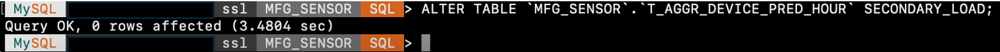

## Load datasets from demo-events-silver-mysqlhw to MySQL HW

### Introduction

The labs shows how to load the datasets from demo-events-silver-mysqlhw to MYSQL HW
- Run Autoload to infer the schema and estimate capacity
- Load complete T\_AGGR\_DEVICE\_PRED\_HOUR table from Object Store into MySQL HeatWave


_Estimated Lab Time_: 30 mins

### Objectives

In this lab you will learn about how to run Autoload to infer the data


- Run Autoload to infer the schema 
- Load the T\_AGGR\_DEVICE\_PRED\_HOUR table from Object Store into MySQL HeatWave.


### Prerequisites

Before you Begin with Data Flow lab, you must have:

- Previous Labs have been completed
- We will use the PAR URL Created in previous lab for the bucket e2e-demo-events-silver-mysqlhw

## Task 1: Run Autoload to infer the schema and estimate capacity required to upload the aggregate device data 

1. Aggregated data information is in the csv files in the object store for which we have created a PAR URL in the earlier task. Now run the following commands:

2. This sets the schema, in which we will load table data into.  

    ```bash
    <copy>SET @db_list = '["MFG_SENSOR"]';</copy>
    ```
    


3. This sets the parameters for the table name we want to load data into and other information about the source file in the object store. Substitute the **PAR URL** below with the one you generated in the previous **Lab 6(a) Task 3**:
    ```bash
    <copy>SET @dl_tables = '[{
    "db_name": "MFG_SENSOR",
    "tables": [{
    "table_name": "T_AGGR_DEVICE_PRED_HOUR",
    "dialect": 
       {
       "format": "csv",
       "field_delimiter": ",",
       "record_delimiter": "\\n"
       },
    "file": [{"par": "PAR URL"}]
    }] }]';</copy>
    ```
    Be sure to include the PAR URL inside the quotes " " and above should look like as in following:

    

4. This command populates all the options needed by Autoload:

    ```bash
    <copy>SET @options = JSON_OBJECT('mode', 'dryrun',  'policy', 'disable_unsupported_columns',  'external_tables', CAST(@dl_tables AS JSON));</copy>
    ```
    

5. Run this Autoload command:

    ```bash
    <copy>CALL sys.heatwave_load(@db_list, @options);</copy>
    ```


6. Once Autoload completes running, its output has several pieces of information:
    - a. Whether the table exists in the schema you have identified.
    - b. Auto schema inference determines the number of columns in the table.
    - c. Auto schema sampling samples a small number of rows from the table and determines the number of rows in the table and the size of the table.
    - d. Auto provisioning determines how much memory would be needed to load this table into HeatWave and how much time loading this data take.

    

    

7. Autoload also generated a statement like the one below. Execute this statement now.

    ```bash
    <copy>SELECT log->>"$.sql" AS "Load Script" FROM sys.heatwave_autopilot_report WHERE type = "sql" ORDER BY id;</copy>
    ```

    Output of above command:

    


8. The execution result contains the SQL statements needed to create the table. As there was no header in the csv file generated, now execute the following **CREATE TABLE** command by replacing your **PAR Value**. In following create table we have mentioned the required column name for this lab.
 
 **NOTE: Ensure to Replace you PAR VALUE after copying the following command**


    ```bash
    <copy>CREATE TABLE `MFG_SENSOR`.`T_AGGR_DEVICE_PRED_HOUR`( `year` year NOT NULL, `month` tinyint unsigned NOT NULL, `Day` tinyint unsigned NOT NULL, `Hour` tinyint unsigned NOT NULL, `device_id` varchar(6) NOT NULL COMMENT 'RAPID_COLUMN=ENCODING=VARLEN', `prod_type` varchar(1) NOT NULL COMMENT 'RAPID_COLUMN=ENCODING=VARLEN', `air_temp_mean` decimal(17,14) NOT NULL, `air_temp_max` decimal(4,1) NOT NULL, `air_temp_min` decimal(4,1) NOT NULL, `device_temp_mean` decimal(17,14) NOT NULL, `device_temp_max` decimal(4,1) NOT NULL, `device_temp_min` decimal(4,1) NOT NULL, `rotn_speed_mean` decimal(17,13) NOT NULL, `rotn_speed_max` decimal(5,1) NOT NULL, `rotn_speed_min` decimal(5,1) NOT NULL, `torque_mean` decimal(17,15) NOT NULL, `torque_max` decimal(3,1) NOT NULL, `torque_min` decimal(3,1) NOT NULL, `tool_wear_mean` decimal(17,14) NOT NULL, `tool_wear_max` decimal(4,1) NOT NULL, `tool_wear_min` decimal(4,1) NOT NULL, `prob_mean` decimal(20,19) NOT NULL, `prob_max` decimal(4,3) NOT NULL, `prob_min` decimal(4,3) NOT NULL, `prob_freq_over60` tinyint unsigned NOT NULL, `prob_freq_over90` tinyint unsigned NOT NULL) ENGINE=lakehouse SECONDARY_ENGINE=RAPID ENGINE_ATTRIBUTE='{"file": [{"par": "PAR_URL"}], "dialect": {"format": "csv", "field_delimiter": ",", "record_delimiter": "\\n"}}';</copy>
    ```


9. The above create command and result should look like this

      

## Task 2: Load the data from Object Store into MySQL HeatWave Table


1. Now load the data from the Object Store into the table

    ```bash
    <copy> ALTER TABLE /*+ AUTOPILOT_DISABLE_CHECK */ `MFG_SENSOR`.`T_AGGR_DEVICE_PRED_HOUR` SECONDARY_LOAD; </copy>
    ```
    


2. View a sample of the data in the table.

    ```bash
    <copy>select * from T_AGGR_DEVICE_PRED_HOUR limit 5;</copy>
    ```
    


You may now **proceed to the next lab**
## Acknowledgements
* **Author** -  Bhushan Arora, Principal Cloud Architect, North America Cloud Infrastructure - Engineering
* **Contributors** -  Biswanath Nanda, Principal Cloud Architect,Bhushan Arora ,Principal Cloud Architect
* **Last Updated By/Date** - Bhushan Arora, November 2024

