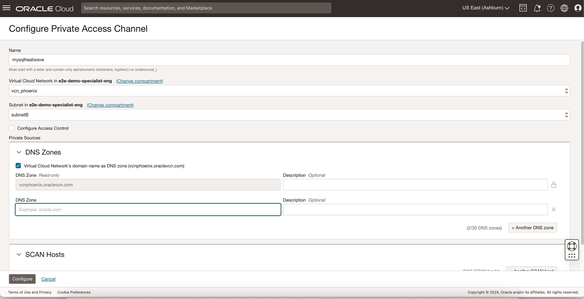
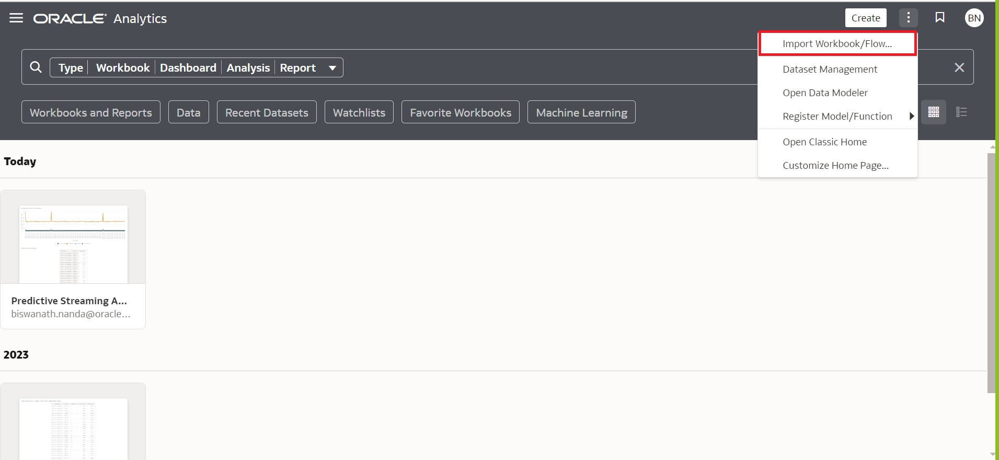
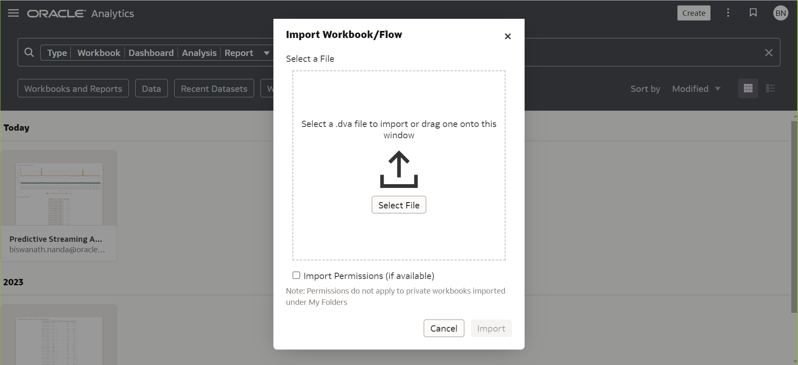
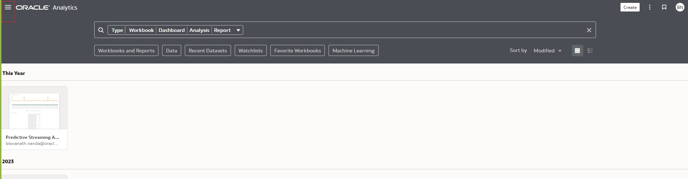
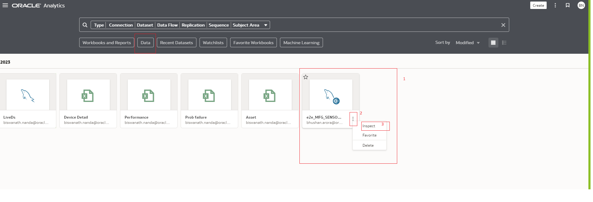

# Provision Analytics Cloud

<!---->

### Introduction

During this lab you will deploy an Oracle Analytics Cloud instance on Oracle Cloud Infrastructure.

_Estimated Lab Time_: 15 minutes (OAC provisioning time may vary)

### Objectives

In this lab, you will:

- Login as a federated user.
- Create an Oracle Analytics Cloud Instance.

### Prerequisites

- Oracle Free Trial Account.

##  
## Task 1: Create an Oracle Analytics Cloud (OAC) Instance

1. Return to the Home Page and go to the **Menu** > **Analytics & AI** > **Analytics Cloud**.

      

2. Create the OAC instance in the Demo compartment and click **Create Instance**.

      

3. (a) Fill the web form with the following information and click **Create**:

      - **Compartment**: `e2e-demo-specialist-eng` compartment, unless you have permissions and experience selecting a different one.
      - **Name**: `WorkshopAnalytics`
      - **Description**: `Analytics Instance for Data Science workshop`
      - **Capacity**: `OCPU` and `1 - Non Production`
      - **License Type**: `License Included` and `Enterprise Analytics`

      

      Your Analytics Instance will start provisioning.

      

      (b) Now Configure Private Access Channel of OAC.
      Go to the private Access Channel under Resources and Configure Private Access Channel:

      

      (c) Fill the details and click on configure button:

      

4. Deploy the DVX file to OAC project

      - Collect the OAC dashboard extract file (.DVA) file from this location.[MYSQLLakehouse_labfiles\Lab5\OAC]
      - Upload these files to OAC console and Visualize Dashboards .
      - Predictive Streaming Analytics.dva
      - **DVA password - Admin123

      
      

5. Changing the connection for MYSQL Heatwave for Live Dashboard

      - Navigate to `OAC Home page` and click on Navigate `option` -> `Data` as shown below.

      

      - Click on `Data`

      

      - In the below window click on `Data` then on the existing LiveDs, click on vertical dots and then click on Inspect option to re-point the existing MYSQLHW connection to the MYSQL HW instance in your Demo environment.

      

      - Click on `Inspect` and edit the MYSQL connections and click on Save.

      

6. Navigate to the `Workbooks and Reports` and double click on the `Predictive Streaming Analytics` icon and reload all the demo Dashboard.

      - Live Dashboard - Contains the live data being sourced from the SQL table to OAC.

      

      - There are a couple more static dashboards for your reference which shows visualization on different sensor KPI and fabricated Operational datasets.These dashboards are designed for your reference only.

      
      

- NOTE: Provisioning an Oracle Analytics Cloud instance can take from 10 (most likely) to 40 minutes.

   We will get back to your Oracle Analytics Cloud instance later in the workshop.

You may now **proceed to the next lab**

## Acknowledgements

* **Author** - Biswanath Nanda, Principal Cloud Architect, North America Cloud Infrastructure - Engineering
* **Contributors** -  Biswanath Nanda, Principal Cloud Architect,Bhushan Arora ,Principal Cloud Architect,Sharmistha das ,Master Principal Cloud Architect,North America Cloud Infrastructure - Engineering
* **Last Updated By/Date** - Biswanath Nanda, November 2024