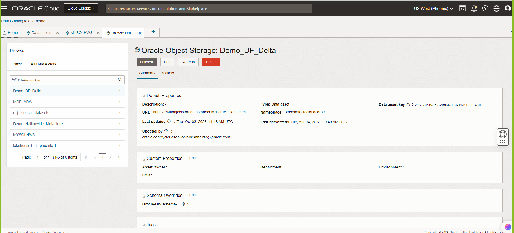

# Provision the OCI Data Catalog and connect to MYSQL HW cluster and Objectstorage

### Introduction

In this lab you will be creating a Data catalog instance and connecting it to MYSQL HW cluster and Objectstore. In this workshop data catalog is used to browse metadata across the Lakehouse.

Oracle Cloud Infrastructure (OCI) Data Catalog is a metadata management service that helps data professionals discover data and support data governance. Designed specifically to work well with the Oracle ecosystem, it provides an inventory of assets, a business glossary, and a common metastore for data lakes.

_Estimated Lab Time_: 15 minutes

### Objectives
- Create the Data Catalog
- Create assets and Harvest metadata
- Browse for metadata

### Prerequisites
* An Oracle Cloud Account.

##  
## Task 1: Create a data catalog

1. Sign in to the Oracle Cloud Infrastructure Console.

2. Open the **Navigation** menu and click **Analytics & AI**. Under **Data Lake**, click **Data Catalog**.

3. On the **Data Catalog Overview** page, click **Go to Data Catalogs**.
   

4. Click on **Create Data Catalog** as shown in the below snapshot

   Name of Catalog - LakehouseCatalog
   

## Task 2: Create assets and Harvest metadata

1. Harvest metadata from Oracle Object Storage.
   Navigate to Create new Data Asset and select on ObjectStorage . Connect to the  demo-events-raw-mysqlhw and demo-events-silver-mysqlhw
   

## Task 3: Search Metadata

1. Search and discover your data
   The metadata across different storage location and types can be searched from the OCI Data Catalog.
   

## Learn More

* [Signing In to the Console](https://docs.cloud.oracle.com/en-us/iaas/Content/GSG/Tasks/signingin.htm).
* [Get Started with Data Catalog](https://docs.oracle.com/en-us/iaas/data-catalog/using/index.htm)
* [Data Catalog Overview](https://docs.oracle.com/en-us/iaas/data-catalog/using/overview.htm)
* [Oracle Cloud Infrastructure Documentation](https://docs.oracle.com/en-us/iaas/Content/GSG/Concepts/baremetalintro.htm)

You may now **proceed to the next lab**

## Acknowledgements
* **Author** - Biswanath Nanda, Principal Cloud Architect, North America Cloud Infrastructure - Engineering
* **Contributors** -  Biswanath Nanda, Principal Cloud Architect,Bhushan Arora ,Principal Cloud Architect,Sharmistha das ,Master Principal Cloud Architect,North America Cloud Infrastructure - Engineering
* **Last Updated By/Date** - Biswanath Nanda, November 2024