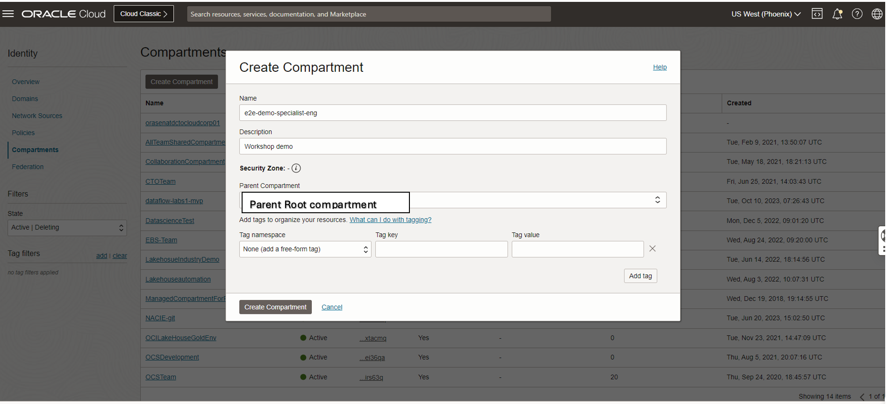
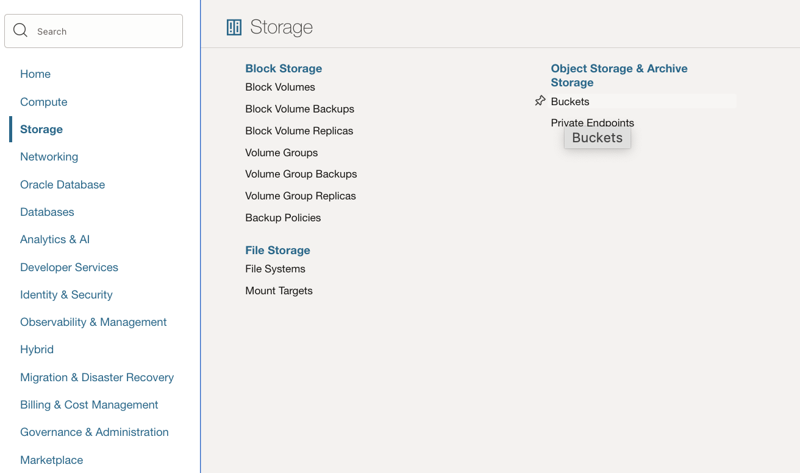

# Create Compartment and Required Buckets for the Workshop

### Introduction

In this lab we be creating the Demo compartment and OCI Object-storage buckets used for the workshop

_Estimated Lab Time_: 10 minutes

### Objectives

In this lab, you will be guided through the following tasks:

- Create Compartment
- Create Required Buckets
- Setting Up Object Stroage

### Prerequisites

- An Oracle Trial or Paid Cloud Account

<!-- This is a extra hashes(##) for Task1 extendable issue-->
##  
## Task 1: Create Demo Compartment

1. Click the **Navigation Menu** in the upper left, navigate to **Identity & Security** and select **Compartments**.

2. On the Compartments page, click **Create Compartment**.

3. In the Create Compartment dialog box, complete the following fields:

    Name:

    ```bash
    <copy>e2e-demo-specialist-eng</copy>
    ```

    Description:

    ```bash
    <copy>Compartment for end to end workshop </copy>
    ```
   *** You can use any other compartment name based up on your needs .Please ensure to create all the OCI services under the same compartment and region which you created in the step No 3.
4. The **Parent Compartment** should be **root** and click **Create Compartment**
    

## Task 2: Create the following buckets in object storage before proceeding.
1. RAW Bucket :
   Bucket Name - **demo-events-raw-mysqlhw**

   Bucket Purpose - The the streaming payloads will be continously written to this bucket .
2. Silver Bucket - **demo-events-silver-mysqlhw**

   Bucket Purpose - This bucket is used by the Data flow to write the aggregated data from RAW bucket .

3. OCI Data flow buckets - **Dataflowbucket** and **dataflow-logs**

   Bucket Purpose - These buckets will be containing the PySpark script and data flow application logs respectively.


## Task 3: Object Store: Setting Up Storage
The below steps shows ,how to create the ObjectStorage buckets. In this task we will be creating the below ObjectStores .

1. Before running any applications the below storage buckets needs to be created in the demo compartment.

    * From the OCI Services menu, click **Storage** and then click **Buckets** under Object Storage

       

    * Click **Create Bucket**
       

      **NOTE:** Ensure the correct Compartment is selected under COMPARTMENT list
      **NOTE** Ensure for the workshop make the below buckets ***PUBLIC*** .For customized set up the buckets can be marked private .
2. Bucket Details:

    * **Buckets for OCI Streaming Sink**
         * **e2e-demo-events-raw-mysqlhw** - Store raw data set.

    * **Buckets for OCI Dataflow set up**
         * **Dataflowbucket** - host the main.py file ( Spark Application file)
         * **dataflow-logs** - Store the dataflow Application log
    * **Bucket for storing Historical Data**
         * **demo-events-silver-mysqlhw** -Store the Aggregated streaming data sets

You may now **proceed to the next lab**

## Acknowledgements
* **Author** - Biswanath Nanda, Master Principal Cloud Architect, North America Cloud Infrastructure - Engineering
* **Contributors** -  Biswanath Nanda, Principal Cloud Architect,Bhushan Arora ,Principal Cloud Architect,Sharmistha das ,Master Principal Cloud Architect,North America Cloud Infrastructure - Engineering
* **Last Updated By/Date** - Biswanath Nanda, November 2024