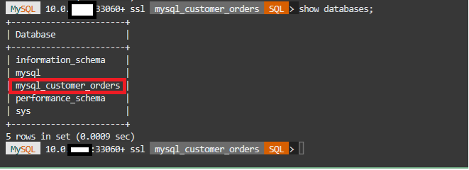
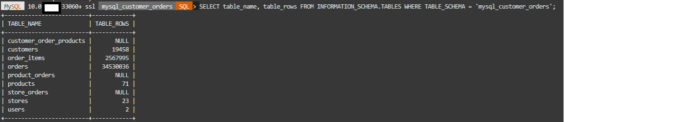

# Create Mysql HeatWave Cluster and test MySQl Shell

## Introduction

A HeatWave cluster comprise of a MySQL DB System and one or more HeatWave nodes. The MySQL DB System includes a plugin that is responsible for cluster management, loading data into the HeatWave cluster, query scheduling, and returning query result.


_Estimated Time:_ 15 minutes

### Objectives

In this lab, you will be guided through the following task:

- Add a HeatWave Cluster to heatwave-db MySQL Database System
- Connect to database using MySQL Shell

### Prerequisites

- An Oracle Trial or Paid Cloud Account
- Some Experience with MySQL Shell
- Completed Lab 2

## Task 1: Connect to database using MySQL Shell

1. If not already connected with SSH, on Command Line, connect to the Compute instance using SSH ... be sure replace the  "private key file"  and the "new compute instance ip"

     ```bash
    <copy>ssh -i private_key_file opc@new_compute_instance_ip</copy>
     ```

2. Use the following command to connect to MySQL using the MySQL Shell client tool. Be sure to add the **heatwave-db** private IP address at the end of the command. Also enter the admin user and the db password created on Lab 1

    (Example  **mysqlsh -uadmin -p -h10.0.1..   --sql**)

    **[opc@...]$**

    ```bash
    <copy>mysqlsh -uadmin -p -h 10.0.1.... --sql</copy>
    ```

    

3. List schemas in your heatwave instance

    ```bash
    <copy>show databases;</copy>
    ```

    

4. if you do not see the **mysql\_customer\_orders** schema on the list, then load it using the following commands:
    - a. change to JS

        ```bash
        <copy>\js</copy>
        ```

    - b. Run load caommand

        ```bash
        <copy>util.loadDump("https://objectstorage.us-ashburn-1.oraclecloud.com/p/0pZRzTl1hFLchwAcornQVePE7eXxp1u6rjVVF3i7a5qN7HASVk4CtTQ9BK9y4xIG/n/mysqlpm/b/plf_mysql_customer_orders/o/mco_nocoupon_dump_05242023/", {progressFile: "progress.json", loadIndexes:false})</copy>
        ```

        **Note**: If you get errors like the one below, the **mysql\_customer\_orders** schema already exists. You used the correct PAR Link to load the data during the creation process in Lab1. Don't worry; everything is okay.

         *ERROR: Schema `mysql_customer_orders` already contains a table named customers*

    - c. Make sure the **mysql\_customer\_orders** schema was loaded

        ```bash
        <copy>show databases;</copy>
        ```

        

    - d. Change to SQL mode

        ```bash
        <copy>\sql</copy>
        ```

5. View  the mysql\_customer\_orders total records per table in

    ```bash
    <copy>SELECT table_name, table_rows FROM INFORMATION_SCHEMA.TABLES WHERE TABLE_SCHEMA = 'mysql_customer_orders';</copy>
    ```

    

## Task 2: Add a HeatWave Cluster to heatwave-db MySQL Database System

1. Go to Navigation Menu
    Databases
        MySQL

2. Click the `heatwave-db` Database System link

    

3. In the list of DB Systems, click the **heatwave-db** system. click **More Action ->  Add HeatWave Cluster**.
    

4. Enable the **MySQL HeatWave LakeHouse** checkbox

5. Set **Node Count to 2** for this Lab Click **Add HeatWave Cluster** to create the HeatWave cluster

    

6. HeatWave creation will take about 10 minutes. From the DB display page scroll down to the Resources section.

7. Click the **HeatWave** link. Your completed HeatWave Cluster Information section will look like this:
    

You may now **proceed to the next lab**

## Acknowledgements

- **Author** - Perside Foster, MySQL Solution Engineering

- **Contributors** - Abhinav Agarwal, Senior Principal Product Manager, Nick Mader, MySQL Global Channel Enablement & Strategy Manager
- **Last Updated By/Date** - Perside Foster, MySQL Solution Engineering, May 2023
