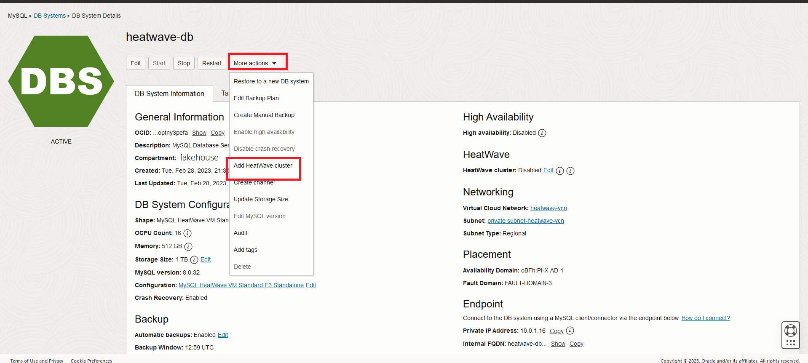
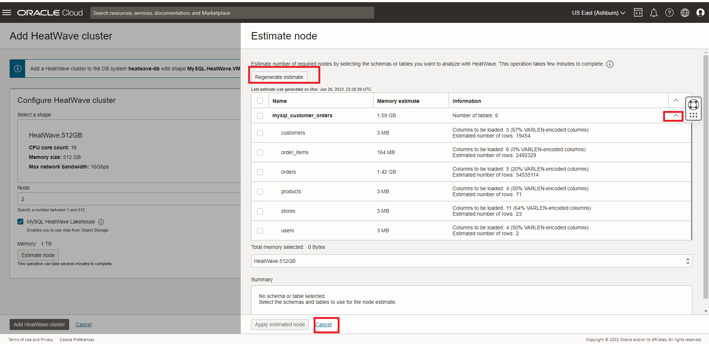
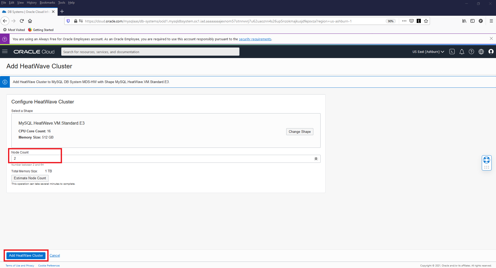
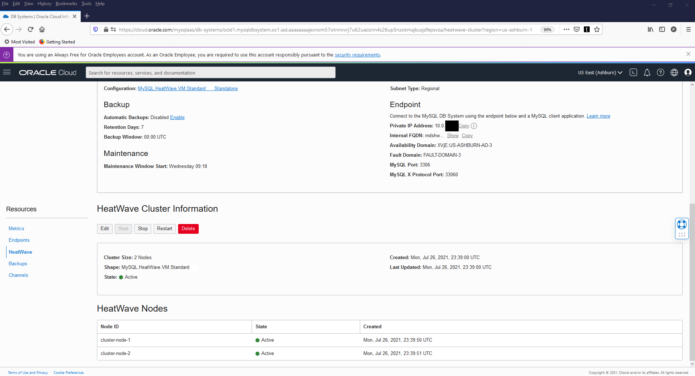

# Create Mysql HeatWave Cluster and test MySQl Shell

## Introduction

A HeatWave cluster comprise of a MySQL DB System node and two or more HeatWave nodes. The MySQL DB System node includes a plugin that is responsible for cluster management, loading data into the HeatWave cluster, query scheduling, and returning query result.

In this lab, you will load data and run queries in the HeatWave Cluster. You will see the query performance improvements on HeatWave compare to MySQL.


_Estimated Time:_ 15 minutes

### Objectives

In this lab, you will be guided through the following task:

- Add a HeatWave Cluster to heatwave-db MySQL Database System
- Connect to database using MySQL Shell

### Prerequisites

- An Oracle Trial or Paid Cloud Account
- Some Experience with MySQL Shell
- Completed Lab 2

## Task 1: Add a HeatWave Cluster to heatwave-db MySQL Database System

1. Go to Navigation Menu
    Databa2ses
        MySQL

    

2. Click the `heatwave-db` Database System link

    

3. In the list of DB Systems, click the **heatwave-db** system. click **More Action ->  Add HeatWave Cluster**.
    

4. Estiamte cluster nodes
    

5. Generate Estimate and review loaded data then  hit cancel

    

6. **Set Node Count to 2 for this Lab Click** “Add HeatWave Cluster” to create the HeatWave cluster

    

7. HeatWave creation will take about 10 minutes. From the DB display page scroll down to the Resources section.

8. Click the **HeatWave** link. Your completed HeatWave Cluster Information section will look like this:
    

## Task 2: Connect to database using MySQL Shell

1. Use the following command to connect to MySQL using the MySQL Shell client tool. Be sure to add the MDS-HW private IP address at the end of the command. Also enter the admin user and the db password created on Lab 1

    (Example  **mysqlsh -uadmin -p -h10.0.1..   --sql**)

    **[opc@...]$**

    ```bash
    <copy>mysqlsh -uadmin -p -h 10.0.1.... --sql</copy>
    ```

    

2. List schemas in your heatwave instance

    ```bash
        <copy>show databses;</copy>
    ```

    


3. View  the mysql\_customer\_orders total records per table in

    ```bash
    <copy>SELECT table_name, table_rows FROM INFORMATION_SCHEMA.TABLES WHERE TABLE_SCHEMA = 'mysql customer orders';</copy>
    ```

    
 
You may now **proceed to the next lab**

## Acknowledgements

- **Author** - Perside Foster, MySQL Solution Engineering

- **Contributors** - Abhinav Agarwal, Senior Principal Product Manager, Nick Mader, MySQL Global Channel Enablement & Strategy Manager
- **Last Updated By/Date** - Perside Foster, MySQL Solution Engineering, May 2023
