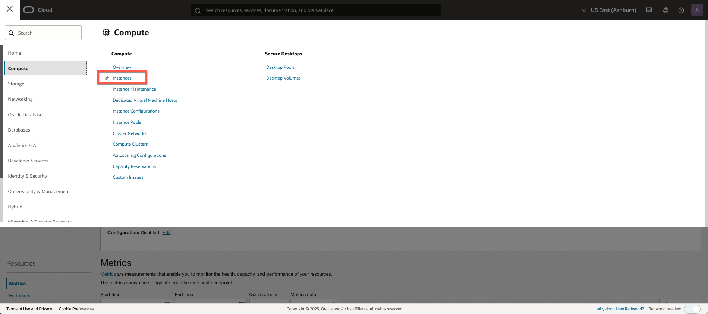
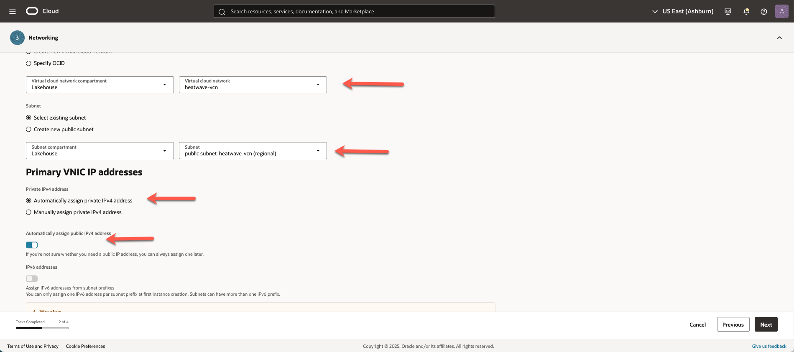

# Connect to MySQL HeatWave With Compute and Create and Load DBShema and  data

## Introduction

When working in the cloud, there are often times when your servers and services are not exposed to the public internet. MySQL HeatWave on OCI is an example of a service that is only accessible through private networks. Since the service is fully managed, we keep it siloed away from the internet to help protect your data from potential attacks and vulnerabilities. It’s a good practice to limit resource exposure as much as possible, but at some point, you’ll likely want to connect to those resources. That’s where Compute Instance, also known as a Bastion host, enters the picture. This Compute Instance Bastion Host is a resource that sits between the private resource and the endpoint which requires access to the private network and can act as a “jump box” to allow you to log in to the private resource through protocols like SSH.  This bastion host requires a Virtual Cloud Network and Compute Instance to connect with the MySQL DB Systems.

Today, you will use the Compute Instance to connect from the browser to a HeatWave DB System

_Estimated Lab Time:_ 20 minutes

### Objectives

In this lab, you will be guided through the following tasks:

- Create Compute Instance
- Setup Compute Instance with MySQL Shell
- Connect to MySQL Heatwave System
- Create and Load mysql\_customer\_orders Schema

### Prerequisites

- An Oracle Trial or Paid Cloud Account
- Some Experience with MySQL Shell
- Must Complete Lab 2

## Task 1: Create Compute instance

1. To launch a Linux Compute instance, go to 
    Navigation Menu
    Compute
    Instances
    

2. On Instances in **lakehouse** Compartment, click  **Create Instance**
    

3. On Create Compute Instance

    Enter Name

    ```bash
    <copy>heatwave-client</copy>
    ```

4. Make sure **lakehouse** compartment is selected

5. On Placement, keep the selected Availability Domain

    

6. Keep the defaults for Image and Shape

    

    Click **Next**.

7. Keep Security features disabled. Click **Next**.

8. On Networking, make sure '**heatwave-vcn**' is selected

    'Assign a public IP address' should be set to Yes

    

9. On Add SSH keys, 
    a. Click **Download private key**

    B. Click **Download public key**

    

    Click **Next**.

10. On Boot volume, leave everything in default and click **Next**.

    Click '**Create**' to finish creating your Compute Instance.

11. The New Virtual Machine will be ready to use after a few minutes. The state will be shown as 'Provisioning' during the creation
    

12. The state 'Running' indicates that the Virtual Machine is ready to use.

    

## Task 2: Connect to Compute and Install MySQl Shell

1. Copy the public IP address of the active Compute Instance to your notepad

    - Go to Navigation Menu
            Compute
            Instances
        

    - Click the `heatwave-cient` Instance link

        

    - Copy the compute name `heatwave-cient`  and  the `Public IP Address` to the notepad

2. Copy the private IP address of the active MySQl Database heatwave-client Service Instance to your notepad

    - Go to Navigation Menu
            Databases
            MySQL

        

    - Click the `heatwave-db` Database System link

        

    - Select the **Connections** tab, copy the database nane `heatwave-db`  and the `Private IP Address` to the notepad
        

3. Open Cloud Shell

    The Cloud Shell machine is a small virtual machine running a Bash shell which you access through the Oracle Cloud Console (Homepage). You will start the Cloud Shell and generate a SSH Key to use  for the Bastion  session.

    a. To start the Oracle Cloud shell, go to your Cloud console and click the cloud shell icon at the top right of the page. This will open the Cloud Shell in the browser, the first time it takes some time to generate it.

    

    

    

    _Note: You can use the icons in the upper right corner of the Cloud Shell window to minimize, maximize, restart, and close your Cloud Shell session._

4. Create a file with the private SSH Key file.

    a. Paste the RSA SSH Key from **Task 1.9**

    ```bash
    <copy>nano ~/.ssh/id_rsa</copy>
    ```
    

    b. Save the file with **CTRL + o**, Hit **Enter**, Then close nano with **CTRL + x**

    

    c. Modify the id_rsa file permissions.

    ```bash
    <copy>chmod 600 ~/.ssh/id_rsa</copy>
    ```
5. Indicate the location of the private key you created earlier.

    Enter the username **opc** and the Public **IP Address**.

     (Example: **ssh -i ~/.ssh/id_rsa opc@132.145.170...**)

    ```bash
    <copy>ssh -i ~/.ssh/id_rsa opc@<your_compute_instance_ip></copy>
    ```

    


6. **Install MySQL Shell on the Compute Instance**

    You will need a MySQL client tool to connect to your new MySQL HeatWave System from the Bastion. **You might want to have MySQL Shell in the same version as your DB System**

    You can download the specific desired version and architecture at [MySQL Community Dowloads](https://dev.mysql.com/downloads/shell/)

    To Install the current latest MySQL Shell version (9.4) for x86 architecture, you can follow the instructions:

    a. Install MySQL Shell with the following command (enter y for each question)

    ```bash
    <copy>wget https://dev.mysql.com/get/Downloads/MySQL-Shell/mysql-shell-9.4.0-1.el9.x86_64.rpm</copy>
    ```

    ```bash
    <copy>sudo yum install mysql-shell-9* -y</copy>
    ```

    

You may now **proceed to the next lab**

## Acknowledgements

- **Author** - Perside Foster, MySQL Solution Engineering

- **Contributors** - Abhinav Agarwal, Senior Principal Product Manager, Nick Mader, MySQL Global Channel Enablement & Strategy Manager
- **Last Updated By/Date** - Cristian Aguilar, MySQL Solution Engineering, August 2025
