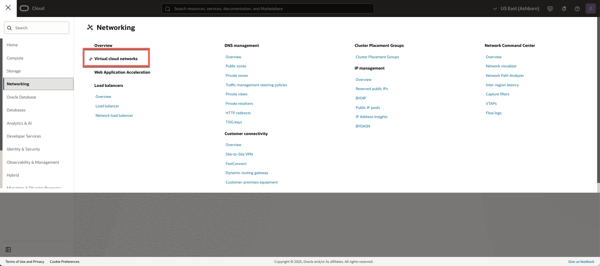
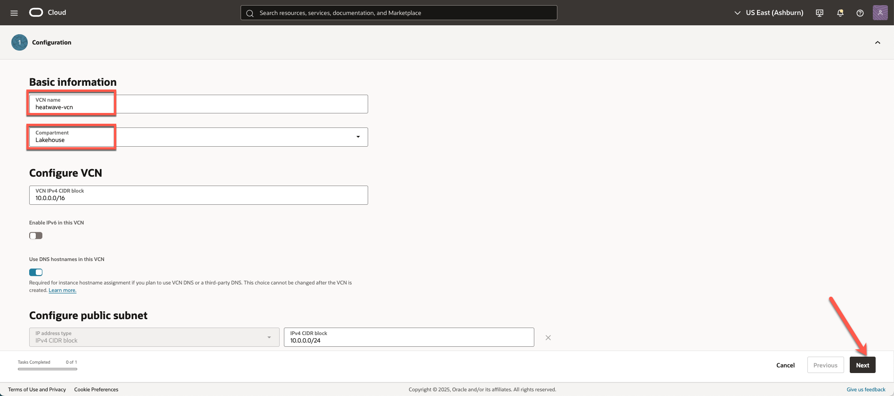
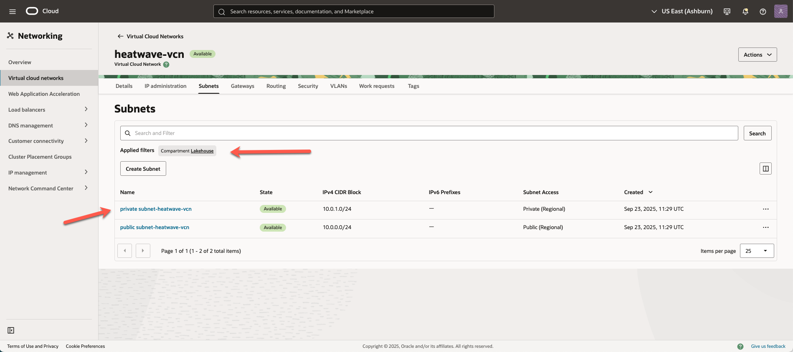
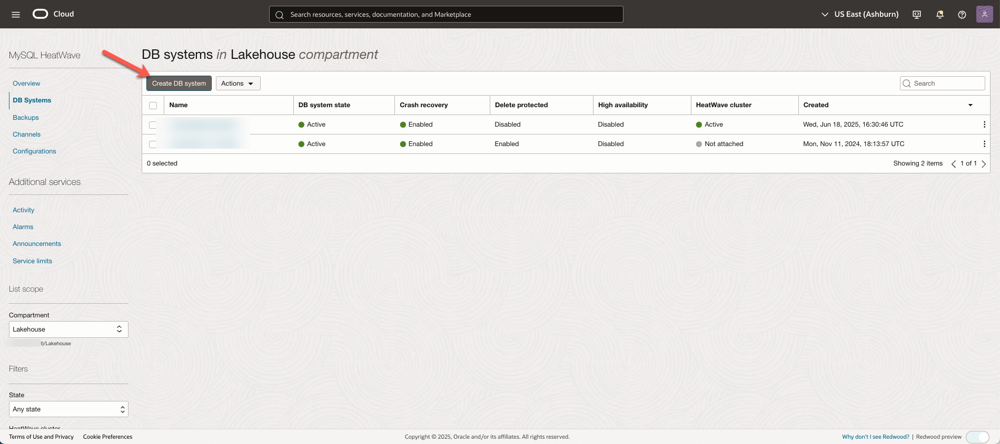
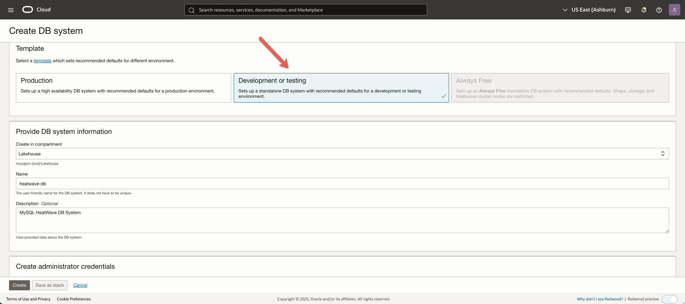
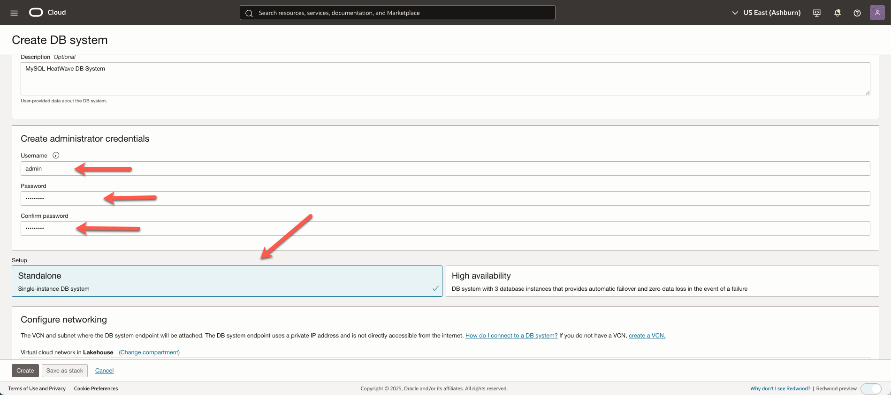
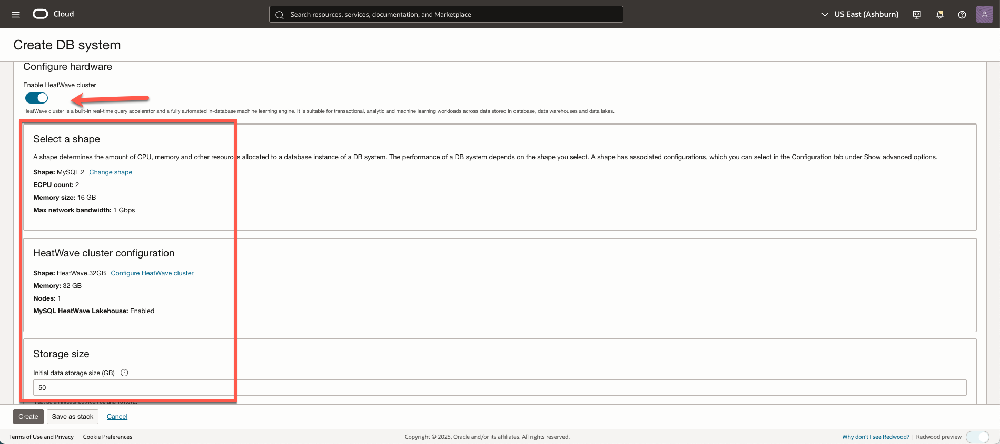
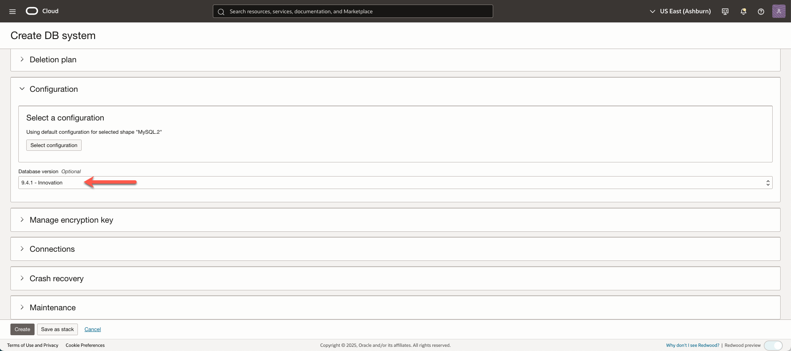

# Create Compartment, VCN, and MySQL HeatWave Database

## Introduction

In this lab, you will create a Compartment and  Virtual Cloud Network (VCN) to connect your OCI resources. You will also create a MySQL HeatWave DB System while loading the DB Data.

_Estimated Time:_ 20 minutes

### Objectives

In this lab, you will be guided through the following tasks:

- Create a Compartment
- Create a Virtual Cloud Network
- Configure a security list to allow MySQL incoming connections
- Create a MySQL Database for HeatWave DB System while loading the DB Data


### Prerequisites

- An Oracle Trial or Paid Cloud Account
- Some Experience with MySQL Shell
- Login to OCI to land on OCI Dashboard

## Task 1: Create Compartment

1. Click the **Navigation Menu** in the upper left, navigate to **Identity & Security** and select **Compartments**.

2. On the Compartments page, click **Create Compartment**.

3. In the **Create Compartment** dialog box, complete the following fields:

    Name:

    ```bash
    <copy>Lakehouse</copy>
    ```

    Description:

    ```bash
    <copy>Compartment for Lakehouse with MySQL Database workshop </copy>
    ```

4. The **Parent Compartment** should be **lakehouse** and click **Create compartment**
    

## Task 2: Create Virtual Cloud Network

1. Click **Navigation Menu**, select **Networking**, select **Virtual cloud networks**.
    

2. Click **Start VCN Wizard**.
    

3. Select **Create VCN with Internet Connectivity**, and click **Start VCN Wizard**.
    

4. On **Basic Information**, complete the following fields:

    **VCN Name**:

    ```bash
    <copy>heatwave-vcn</copy>
    ```

    **Compartment**: Select  **Lakehouse**

    Your screen should look similar to the following:
        

5. Click **Next** at the bottom of the screen.

6. Review Oracle Virtual Cloud Network (VCN), Subnets, and Gateways, and click **Create** to create the VCN.
    

8. Click **View VCN** to display the created VCN.
    

## Task 3: Configure security list to allow MySQL incoming connections

1. On **heatwave-vcn** page, under **Subnets**, in the **Lakehouse** compartment, click  **private subnet-heatwave-vcn**.
     

2. On **private subnet-heatwave-vcn** page, under **Security**,  click  **security List for private subnet-heatwave-vcn**.
    

3. On **security List for Private Subnet-heatwave-vcn** page, under **Security Rules**, click **Add Ingress Rules**.
   

4. On **Add Ingress Rules** page, under **Ingress Rule 1**, add the following:

    Source CIDR:

    ```bash
    <copy>0.0.0.0/0</copy>
    ```

    Destination Port Range:

    ```bash
    <copy>3306,33060</copy>
    ```

    Description:

    ```bash
       <copy>MySQL Port Access</copy>
    ```
    

5. Click **Add Ingress Rules**.

6. On **security list for private subnet-heatwave-vcn** page, the new ingress rules are shown.
    

## Task 4: Configure security list to allow HTTP incoming connections

1. Click the **Navigation Menu** in the upper left, navigate to **Networking** and select **Virtual Cloud Networks**.

2. Click **heatwave-vcn**.

3. Under **Subnets**, click  **public subnet-heatwave-vcn**.

4. Under **Security**, click **Default Security List for heatwave-vcn**.

5. Under **Security rules**, click **Add Ingress Rules**, and add the following:

    Add an Ingress Rule with Source CIDR

    ```bash
    <copy>0.0.0.0/0</copy>
    ```

    Destination Port Range

    ```bash
    <copy>80,443</copy>
    ```

    Description

    ```bash
    <copy>Allow HTTP connections</copy>
    ```

6. Click **Add Ingress Rules**.

    

7. On **Default Security List for heatwave-vcn** page, under **Security Rules**, the new Ingress Rules are shown.

    

## Task 5: Create MySQL Database for HeatWave (DB System)

1. Click the **Navigation Menu** in the upper left, navigate to **Databases** and under **MySQL HeatWace**, select **DB Systems**. 
    

2. Click **Create DB system**.
    

3. Select the **Development or Testing** option.
    

4. Under **Provide DB system information**, enter the following:

    Select Compartment **Lakehouse**.

    **Name**:

    ```bash
    <copy>heatwave-db</copy>
    ```

    **Description**:

    ```bash
    <copy>MySQL HeatWave DB System</copy>
   ```

    

5. Under **Create administrator credentials**, enter the **Username**, **Password**, and **Confirm Password**.

6. Select **“Standalone”** 
    

7. Under **Configure networking**, select the following:

    Virtual Cloud Network: **heatwave-vcn**

    Subnet: **private subnet-heatwave-vcn (Regional)**

    

8. Under **Configure placement**, let the default Availability domain remain selected. 

9. On Configure hardware, let the default settings remain selected. 

    

10. Click **Show advanced options**.

11. Go to **Configuration**, click **Select a MySQL version**: Select the latest Innovation MySQL version of the DB system.

    

12. Go to **Connections**, in **Hostname** enter the same name as the DB System Name:

    ```bash
    <copy>heatwave-db</copy> 
    ```
    

13. Go to **Data import**, and paste the following PAR URL:

    ```
    <copy>
   https://objectstorage.us-ashburn-1.oraclecloud.com/p/e9-qd9eqC2gatEl4qqsRD4L_mqn433tr00ALKmYzh8AuTQ-drS1thJvgLoz64-vF/n/mysqlpm/b/mysql_customer_orders/o/mco_nocoupon_11272024/
    </copy>
    ```
14. Click **Create**.

15. The New MySQL DB System will be ready to use after a few minutes. The state will be shown as **Creating** during the creation process.
    

16. The state **Active** indicates that the DB System is ready for use.
    

17. On **heatwave-db** Page,select the **Connections** tab, check and save the **Private IP address**. You will need this later to connect to the MySQL Heatwave DB System using the MySQL Shell client tool.
    

You may now **proceed to the next lab**.

## Acknowledgements

- **Author** - Perside Foster, MySQL Solution Engineering

- **Contributors** - Abhinav Agarwal, Senior Principal Product Manager, Nick Mader, MySQL Global Channel Enablement & Strategy Manager
- **Last Updated By/Date** - Aijaz Fatima, Product Manager, September 2025
