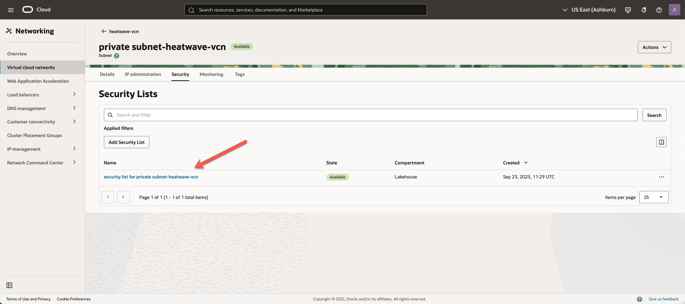
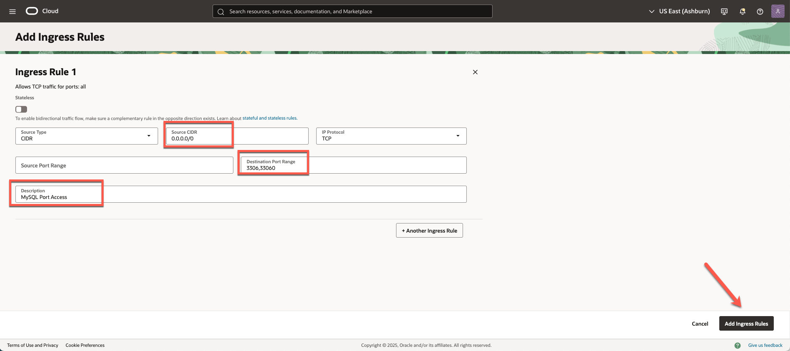
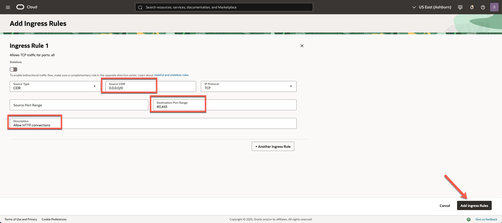
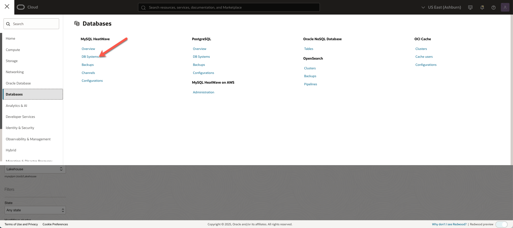
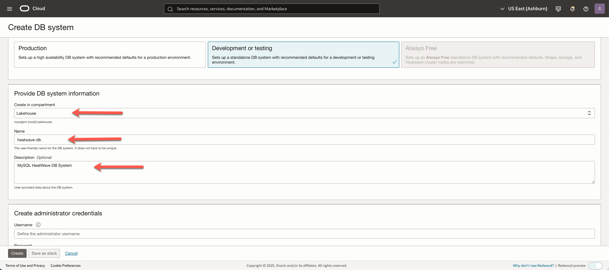
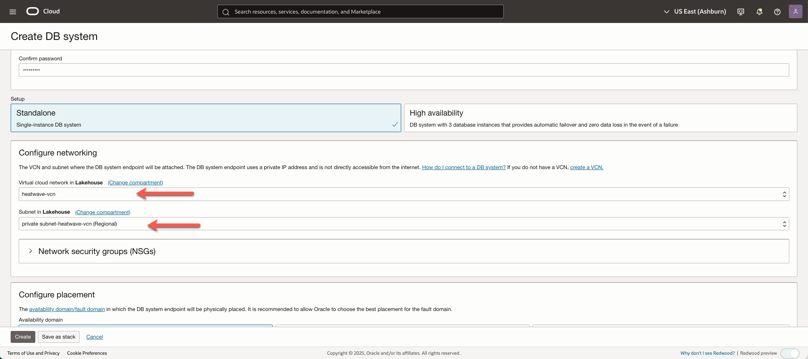
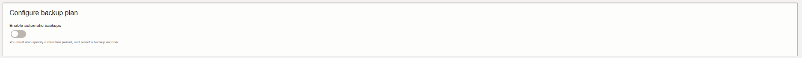

# Create VCN and MySQL Database HeatWave

## Introduction

In this lab, you will create a Virtual Cloud Network (VCN) to connect your OCI resources. You will create a MySQL HeatWave DB System and configure the HeatWave Cluster.

_Estimated Time:_ 20 minutes

### Objectives

In this lab, you will be guided through the following tasks:

- Create a Virtual Cloud Network
- Configure a security list to allow MySQL incoming connections
- Create a MySQL Database for HeatWave DB System
- Add a HeatWave Cluster to the MySQL DB System

### Prerequisites

- An Oracle Trial or Paid Cloud Account
- Some Experience with MySQL Shell
- Login to OCI to land on OCI Dashboard


## Task 1: Create Virtual Cloud Network

1. Click Navigation Menu
    Select Networking
    Select Virtual Cloud Networks
    

2. Click **Start VCN Wizard**
    

3. Select 'Create VCN with Internet Connectivity'

    Click 'Start VCN Wizard'
    

4. Create a VCN with Internet Connectivity

    On Basic Information, complete the following fields:

    VCN Name:

    ```bash
    <copy>heatwave-vcn</copy>
    ```

    Compartment: Select  **root**

    Your screen should look similar to the following
        

5. Click 'Next' at the bottom of the screen

6. Review Oracle Virtual Cloud Network (VCN), Subnets, and Gateways

    Click 'Create' to create the VCN

7. The Virtual Cloud Network creation is completing
    

8. Click 'View VCN' to display the created VCN
    

## Task 2: Configure security list to allow MySQL incoming connections

1. On heatwave-vcn page under 'Subnets in (root) Compartment', click  '**private subnet-heatwave-vcn**'
     

2. On Private Subnet-heatwave-vcn page under 'Security Lists',  click  '**Security List for private subnet-heatwave-vcn**'
    

3. On Security List for Private Subnet-heatwave-vcn page under 'Ingress Rules', click '**Add Ingress Rules**'
    

4. On Add Ingress Rules page under Ingress Rule

    Add an Ingress Rule with Source CIDR

    ```bash
    <copy>0.0.0.0/0</copy>
    ```

    Destination Port Range

    ```bash
    <copy>3306,33060</copy>
    ```

    Description

    ```bash
       <copy>MySQL Port Access</copy>
    ```

5. Click 'Add Ingress Rule'
    

6. On Security List for Private Subnet-heatwave-vcn page, the new Ingress Rules will be shown under the Ingress Rules List
    

## Task 3: Configure security list to allow HTTP incoming connections

1. Navigation Menu > Networking > Virtual Cloud Networks

2. Open heatwave-vcn

3. Click  public subnet-heatwave-vcn

4. Click Default Security List for heatwave-vcn

5. Click Add Ingress Rules page under Ingress Rule

    Add an Ingress Rule with Source CIDR

    ```bash
    <copy>0.0.0.0/0</copy>
    ```

    Destination Port Range

    ```bash
    <copy>80,443</copy>
    ```

    Description

    ```bash
    <copy>Allow HTTP connections</copy>
    ```

6. Click 'Add Ingress Rule'

    

7. On Security List for Default Security List for mds_vcn page, the new Ingress Rules will be shown under the Ingress Rules List

    

## Task 4: Create MySQL Database for HeatWave (DB System)

1. Go to Navigation Menu
         Databases
         MySQL
         DB Systems
    

2. Click 'Create MySQL DB System'
    

3. Select the Development or Testing Option
    

4. Create MySQL DB System dialog complete the fields in each section

    - Provide basic information for the DB System
    - Setup your required DB System
    - Create Administrator credentials
    - Configure Networking
    - Configure placement
    - Configure hardware
    - Exclude Backups
    - Advanced Options - NetWorking
    - Advanced Options - Data Import

5. Provide basic information for the DB System:

    Select Compartment **root**

    Enter Name

    ```bash
    <copy>heatwave-db</copy>
    ```

    Enter Description

    ```bash
    <copy>MySQL Database Service HeatWave Instance</copy>
   ```

    

6. Select **HeatWave** to specify a HeatWave DB System
    

7. Create Administrator Credentials

    **Enter Username** (write username to notepad for later use)

    **Enter Password** (write password to notepad for later use)

    **Confirm Password** (value should match password for later use)

    

8. On Configure networking, keep the default values

    Virtual Cloud Network: **heatwave-vcn**

    Subnet: **Private Subnet-heatwave-vcn (Regional)**

    

9. On Configure placement under 'Availability Domain'

    Select AD-1

    Do not check 'Choose an Availability Domain' for this DB System.

    

10. On Configure hardware, keep default shape as **MySQL.HeatWave.VM.Standard.E3**

    Data Storage Size (GB) Set value to:  **1024**

    ```bash
    <copy>1024</copy>
    ```

    

11. On Configure Backups, disable 'Enable Automatic Backup'

    

12. Click on Show Advanced Options

13. Go to the Networking tab, in the Hostname field enter  (same as DB System Name):

    ```bash
        <copy>heatwave-db</copy> 
    ```

    

14. Select the Data Import tab.

15. Use the Image below to identify your OCI Region.

    

16. Click on your localized geographic area

    ## North America (NA)

    **Tenancy Regions** Please select the same region that you are creating MDS in  

    <details>
    <summary>US East (Ashburn) Region - Copy and paste to PAR Source URL</summary>
    <br>
    ```
    <copy>
    https://objectstorage.us-ashburn-1.oraclecloud.com/p/0pZRzTl1hFLchwAcornQVePE7eXxp1u6rjVVF3i7a5qN7HASVk4CtTQ9BK9y4xIG/n/mysqlpm/b/plf_mysql_customer_orders/o/mco_nocoupon_dump_05242023/
    </copy>
    ```
    </details>

    <details>
    <summary>US West (Phoenix) Region - Copy and paste to PAR Source URL</summary>
    <br>
    ```
    <copy>TBD</copy>
    ```
    </details>

    <details>
    <summary>US West (San Jose) Region - Copy and paste to PAR Source URL</summary>
    <br>
    ```
    <copy>TBD</copy>
    ```
    </details>
    ## Latin America (LAD)
    **Tenancy Regions** Please select the same region that you are creating MDS in
    <details>
    <summary>Brazil East (Sao Paulo) Region - Copy and paste to PAR Source URL</summary>
    <br>
    ```
    <copy>
    <copy>TBD</copy>
    </copy>
    ```
    </details>

    <details>
    <summary>Chile (Santiago) Region - Copy and paste to PAR Source URL</summary>
    <br>
    ```
    <copy>
    <copy>TBD</copy>
    </copy>
    ```
    </details>

    <details>
    <summary>Brazil Southeast (Vinhedo) Region - Copy and paste to PAR Source URL</summary>
    <br>
    ```
    <copy>
    <copy>TBD</copy>
    </copy>
    ```
    </details>

17. The Data Import Link entry should look like this:

    

18. Review **Create MySQL DB System**  Screen

    

    Click the '**Create**' button

19. The New MySQL DB System will be ready to use after a few minutes

    The state will be shown as 'Creating' during the creation
    

20. The state 'Active' indicates that the DB System is ready for use

    On HeatWave-HW Page, check the MySQL Endpoint (Private IP Address)

    

You may now **proceed to the next lab**

## Acknowledgements

- **Author** - Perside Foster, MySQL Solution Engineering

- **Contributors** - Abhinav Agarwal, Senior Principal Product Manager, Nick Mader, MySQL Global Channel Enablement & Strategy Manager
- **Last Updated By/Date** - Perside Foster, MySQL Solution Engineering, May 2023
