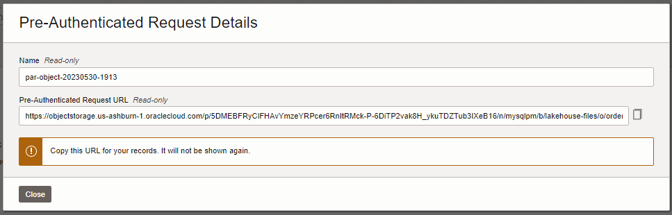
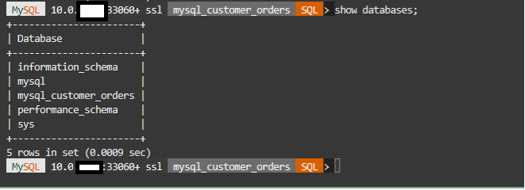
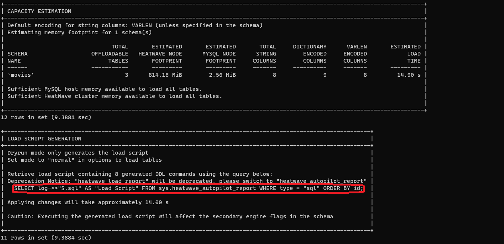
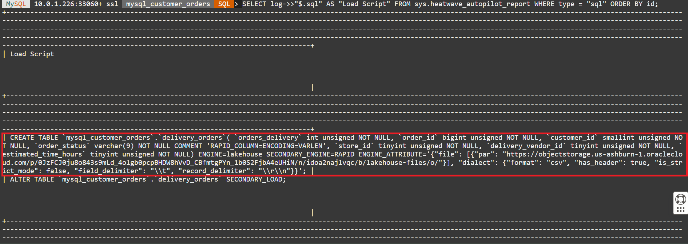
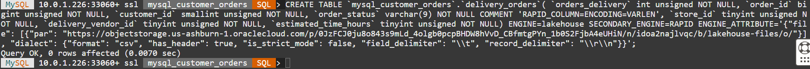
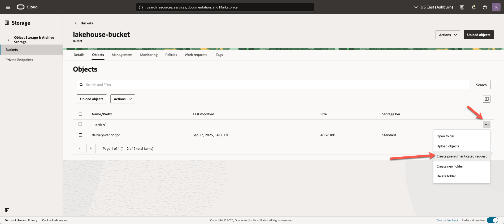
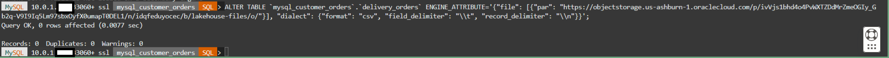

# Load CSV data from OCI Object Store

## Introduction

To load data from Object Storage to HeatWave, you need to specify the location of the file or folder objects in your Object Storage.

1. Use [Resource Principal](https://docs.oracle.com/en-us/iaas/autonomous-database-serverless/doc/resource-principal-enable.html) - It is recommended that you use Resource Principal-based approach for access to data in Object Storage for more sensitive data as this approach is more secure.

2. Use [Pre-Authenticated Request URLs (PARs)](https://docs.oracle.com/en-us/iaas/Content/Object/Tasks/usingpreauthenticatedrequests.htm) - If you choose to use PARs, we recommend that you use read-only PARs with Lakehouse and specify short expiration dates for your PARs. The expiration dates should align with your loading schedule. 

Since we are using a sample data set, we will make use of PAR in this LiveLab. We already have several tables available in HeatWave that have been loaded from MySQL.

We will now load the DELIVERY_ORDERS table from the Object Store. This is a large table with 30 million rows and contains information about the delivery vendor for orders.

### Objectives

- Create PAR Link for the  "delivery_order" files
- Run Autoload to infer the schema and estimate capacity
- Load complete DELIVERY table from Object Store into MySQL HeatWave

### Prerequisites

- An Oracle Trial or Paid Cloud Account
- Some Experience with MySQL Shell
- Completed Lab 5

## Task 1: Create the PAR Link for the "delivery_order" files

1. To create a PAR URL
    - Go to menu **Storage —> Buckets**
     

    - Select **lakehouse-files —> order**  folder.
2. Select the first file —> **delivery-orders-1.csv** and click the three vertical dots.
3. Click on **Create Pre-Authenticated Request**

    

4. The **Object** option will be pre-selected.
5. Keep **Permit object reads** selected
6. Kep the other options for **Access Type** unchanged.
7. Click the **Create Pre-Authenticated Request** button.

    

8. Click the **Copy** icon to copy the PAR URL.
    

9. Save the generated PAR URL; you will need it in the next task

## Task 2: Connect to your MySQL HeatWave system using Cloud Shell

1. If not already connected with SSH, on Command Line, connect to the Compute instance using SSH ... be sure replace the  "private key file"  and the "new compute instance ip"

     ```bash
    <copy>ssh -i private_key_file opc@new_compute_instance_ip</copy>
     ```

2. If not already connected to MySQL then connect to MySQL using the MySQL Shell client tool with the following command:

    ```bash
    <copy>mysqlsh -uadmin -p -h 10.0.1... --sql </copy>
    ```

    

3. List schemas in your heatwave instance

    ```bash
        <copy>show databases;</copy>
    ```

    

4. Change to the mysql\_customer\_orders database

    Enter the following command at the prompt

    ```bash
    <copy>USE mysql_customer_orders;</copy>
    ```

5. To see a list of the tables available in the mysql\_customer\_orders schema

    Enter the following command at the prompt

    ```bash
    <copy>show tables;</copy>
    ```

    You are now ready to use Autoload to load a table from the object store into MySQL HeatWave

## Task 3: Run Autoload to infer the schema and estimate capacity required for the DELIVERY table in the Object Store

1. Part of the DELIVERY information for orders is contained in the delivery-orders-1.csv file in object store for which we have created a PAR URL in the earlier task. In a later task, we will load the other files for the DELIVER_ORDERS table into MySQL HeatWave. Enter the following commands one by one and hit Enter.

2. This sets the schema we will load table data into. Don’t worry if this schema has not been created. Autopilot will generate the commands for you to create this schema if it doesn’t exist.

    ```bash
    <copy>SET @db_list = '["mysql_customer_orders"]';</copy>
    ```

3. This sets the parameters for the table name we want to load data into and other information about the source file in the object store. Substitute the **(PAR URL)** below with the one you generated in the previous task:

    ```bash
    <copy>SET @dl_tables = '[{
    "db_name": "mysql_customer_orders",
    "tables": [{
        "table_name": "delivery_orders",
        "dialect": 
           {
           "format": "csv",
           "field_delimiter": "\\t",
           "record_delimiter": "\\n"
           },
        "file": [{"par": "(PAR URL)"}]
    }] }]';</copy>
    ```

    - It should look like the following example (Be sure to include the PAR Link inside at of quotes("")):

    

4. This command populates all the options needed by Autoload:

    ```bash
    <copy>SET @options = JSON_OBJECT('mode', 'dryrun',  'policy', 'disable_unsupported_columns',  'external_tables', CAST(@dl_tables AS JSON));</copy>
    ```

5. Run this Autoload command:

    ```bash
    <copy>CALL sys.heatwave_load(@db_list, @options);</copy>
    ```

6. Once Autoload completes running, its output has several pieces of information:
    - a. Whether the table exists in the schema you have identified.
    - b. Auto schema inference determines the number of columns in the table.
    - c. Auto schema sampling samples a small number of rows from the table and determines the number of rows in the table and the size of the table.
    - d. Auto provisioning determines how much memory would be needed to load this table into HeatWave and how much time loading this data take.

7. Autoload also generated a statement lke the one below. Execute this statement now.

    ```bash
    <copy>SELECT log->>"$.sql" AS "Load Script" FROM sys.heatwave_autopilot_report WHERE type = "sql" ORDER BY id;</copy>
    ```

    

8. The execution result conatins the SQL statements needed to create the table and then load this table data from the Object Store into HeatWave.

    

9. Copy the **CREATE TABLE** command from the results. It should look like the following example

    

10. Modify the **CREATE TABLE** command to replace the generic column names, such as **col\_1**, with descriptive column names. Use the following values:

    - `col_1 : orders_delivery`
    - `col_2 : order_id`
    - `col_3 : customer_id`
    - `col_4 : order_status`
    - `col_5 : store_id`
    - `col_6 : delivery_vendor_id`
    - `col_7 : estimated_time_hours`

11. Your modified **CREATE TABLE** command  should look like the following example:

    

12. Execute the modified **CREATE TABLE** command to create the delivery_orders table.

13. The create command and result should look lie this

    

## Task 4: Load complete DELIVERY table from Object Store into MySQL HeatWave

1. Run this command to see the table structure created.

    ```bash
    <copy>desc delivery_orders;</copy>
    ```

    

2. Now load the data from the Object Store into the ORDERS table.

    ```bash
    <copy> ALTER TABLE `mysql_customer_orders`.`delivery_orders` SECONDARY_LOAD; </copy>
    ```

3. Once Autoload completes,point to the schema

    ```bash
    <copy>use mysql_customer_orders</copy>
    ```

4. Check the number of rows loaded into the table.

    ```bash
    <copy>select count(*) from delivery_orders;</copy>
    ```

5. View a sample of the data in the table.

    ```bash
    <copy>select * from delivery_orders limit 5;</copy>
    ```

    a. Join the delivery_orders table with other table in the schema

    ```bash
    <copy> select o.* ,d.*  from  orders o
    join delivery_orders d on o.order_id = d.order_id
    where o.order_id = 93751524; </copy>
    ```

6. Your output for steps 2 thru 5 should look like this:

    

7. Your DELIVERY table is now ready to be used in queries with other tables. In the next lab, we will see how to load additional data for the DELIVERY table from the Object Store using different options.

## Task 5:  Load all data for DELIVERY table from Object Store

The DELIVERY table contains data loaded from one file so far. If new data arrives as more files, we can load those files too. The first option is by specifying a list of the files in the table definition. The second option is by specifying a prefix and have all files with that prefix be source files for the DELIVERY table. The third option is by specifying the entire folder in the Object Store to be the source file for the DELIVERY table.

We will use the second option which Loads the data by specifying a PAR URL for all objects with a prefix.

1. First unload the DELIVERY table from HeatWave:

    ```bash
    <copy>ALTER TABLE delivery_orders SECONDARY_UNLOAD;</copy>
    ```

2. Create a PAR URL for all objects with a prefix

    - a. From your OCI console, navigate to your lakehouse-files bucket in OCI.
    - b. Select the folder —> order and click the three vertical dots.

        

    - c. Click on ‘Create Pre-Authenticated Request’
    - d. Click to select the ‘Objects with prefix’ option under ‘PreAuthentcated Request Target’.
    - e. Leave the ‘Access Type’ option as-is: ‘Permit object reads on those with the specified prefix’.
    - g. Click to select the ‘Enable Object Listing’ checkbox.
    - h. Click the ‘Create Pre-Authenticated Request’ button.

       

    - i. Click the ‘Copy’ icon to copy the PAR URL.
    - j. Save the generated PAR URL; you will need it later.
    - k. You can test the URL out by pasting it in your browser. It should return output like this:

        

3. Since we have already created the table, we will not run Autopilot again. Instead we will simply go ahead and change the table definition to point it to this new PAR URL as the table source.

4. Copy this command and replace the **(PAR URL)** with the one you saved earlier. It will be the source for the DELIVERY table:

    ```bash
    <copy>ALTER TABLE `mysql_customer_orders`.`delivery_orders` ENGINE_ATTRIBUTE='{"file": [{"par": "(PAR URL)"}], "dialect": {"format": "csv", "field_delimiter": "\\t", "record_delimiter": "\\n"}}'; </copy>
    ```

5. Your command  should look like the following example. Now Execute your modified command

    
    **Output**

    

6. Load data into the DELIVERY table:

    ```bash
    <copy>alter table delivery_orders secondary_load;</copy>
    ```

7. View the number of rows in the DELIVERY table:

    ```bash
    <copy>select count(*) from delivery_orders;</copy>
    ```

    The DELIVERY table now has 34 million rows.
8. Output of steps 6 and 7


You may now **proceed to the next lab**

## Acknowledgements

- **Author** - Perside Foster, MySQL Solution Engineering

- **Contributors** - Abhinav Agarwal, Senior Principal Product Manager, Nick Mader, MySQL Global Channel Enablement & Strategy Manager
- **Last Updated By/Date** - Perside Foster, MySQL Solution Engineering, May 2023
