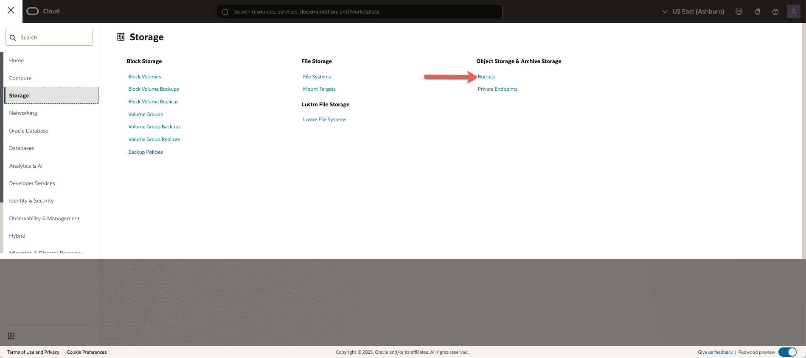
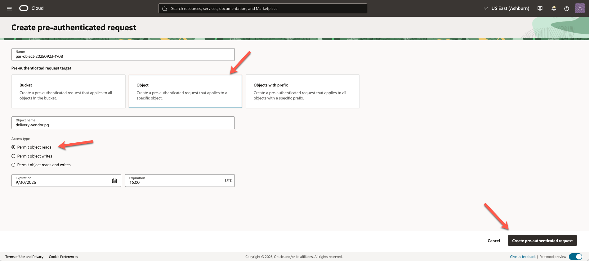
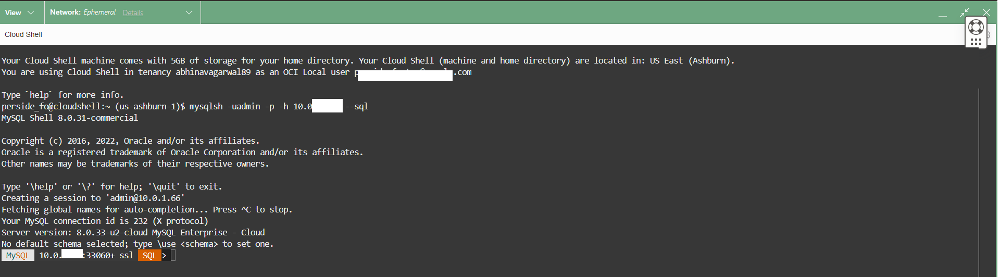
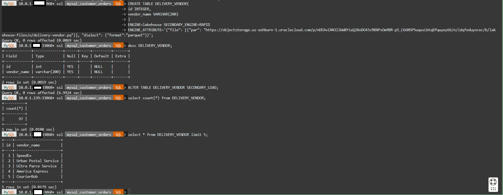

# Load Parquet data from OCI Object Store

## Introduction

In this final task of loading data we will load data into a table DELIVERY_VENDOR from the Object Store. This time, the data in the object store is in the parquet format.

**Note:** Apache Parquet is an open source, column-oriented data file format designed for efficient data storage and retrieval. It provides efficient data compression and encoding schemes with enhanced performance to handle complex data in bulk. Parquet is available in multiple languages including Java, C++, Python, etc….


### Objectives

- Create PAR URL for Parquet file
- Create and load DELIVERY_VENDOR table

### Prerequisites

- An Oracle Trial or Paid Cloud Account
- Some Experience with MySQL Shell
- Completed Lab 6

## Task 1: Create the PAR Link for the "delivery_vendor" files

1. As in the earlier tasks, we will first create a PAR URL to the file we want to load. Here, the entire data is in a single table

2. To create a PAR URL go to menu **Storage —> Buckets**
    

3. Select **lakehouse-files** bucket.
4. Select the file —> **delivery-vendor.pq** and click the three vertical dots.
5. Click on **Create Pre-Authenticated Request**

    

6. The **Object** option will be pre-selected.
7. Keep **Permit object reads** selected
8. Kep the other options for **Access Type** unchanged.
9. Click the **Create Pre-Authenticated Request** button.

    

10. Click the **Copy** icon to Copy vendor PAR URL.

    

11. Save the generated PAR URL; you will need it in the next task

## Task 2: Load Parquet format data directly from Object Store

1. If not already connected with SSH, on Command Line, connect to the Compute instance using SSH ... be sure replace the  "private key file"  and the "new compute instance ip"

     ```bash
    <copy>ssh -i private_key_file opc@new_compute_instance_ip</copy>
     ```

2. If not already connected then connect to MySQL using the MySQL Shell client tool with the following command:

    ```bash
    <copy>mysqlsh -uadmin -p -h 10.0.1... --sql </copy>
    ```

    

3. Select the mysql\_customer\_orders database for use

    Enter the following command at the prompt

    ```bash
    <copy>USE mysql_customer_orders;</copy>
    ```

4. Create the DELIVERY\_VENDOR table by copying the following command and replace the **(PAR URL)** with the one you saved earlier. It will be the source for the DELIVERY_VENDOR table:

    ```bash
    <copy>CREATE TABLE DELIVERY_VENDOR(
    id INTEGER,
    vendor_name VARCHAR(200)
    ) 
    ENGINE=lakehouse SECONDARY_ENGINE=RAPID 
    ENGINE_ATTRIBUTE='{"file": [{"par": "(PAR URL)"}], "dialect": {"format":"parquet"}}';</copy>
    ```

5. Your command  should look like the following example. Now Execute your modified command.

    *CREATE TABLE DELIVERY_VENDOR(
    id INTEGER,
    vendor_name VARCHAR(200)
    ) 
    ENGINE=lakehouse SECONDARY_ENGINE=RAPID 
    ENGINE_ATTRIBUTE='{"file": [{"par": "https://objectstorage.us-ashburn-1.oraclecloud.com/p/FEE4UaxvnmCHkVCbDFcqe38AJIjaxJAiJSheDBt4LgB-ZvZFrfxCeWhHgB1O3eqE/n/mysqlpm/b/lakehouse-livelabs/o/delivery-vendor.pq"}], "dialect": {"format":"parquet"}}';*


6. Run this command to see the table structure created.

    ```bash
    <copy>desc DELIVERY_VENDOR;</copy>
    ```

7. Now load the data from the Object Store into the ORDERS table.

    ```bash
    <copy>ALTER TABLE DELIVERY_VENDOR SECONDARY_LOAD;</copy>
    ```

8. Once Autoload completes, check the number of rows loaded into the table.

    ```bash
    <copy>select count(*) from DELIVERY_VENDOR;</copy>
    ```

9. View a sample of the data in the table.

    ```bash
    <copy>select * from DELIVERY_VENDOR limit 5;</copy>
    ```

10. Output of steps 5 thru 9
    

You may now **proceed to the next lab**

## Acknowledgements

- **Author** - Perside Foster, MySQL Solution Engineering

- **Contributors** - Abhinav Agarwal, Senior Principal Product Manager, Nick Mader, MySQL Global Channel Enablement & Strategy Manager
- **Last Updated By/Date** - Perside Foster, MySQL Solution Engineering, May 2023