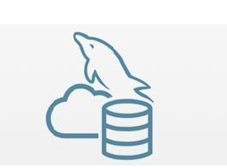
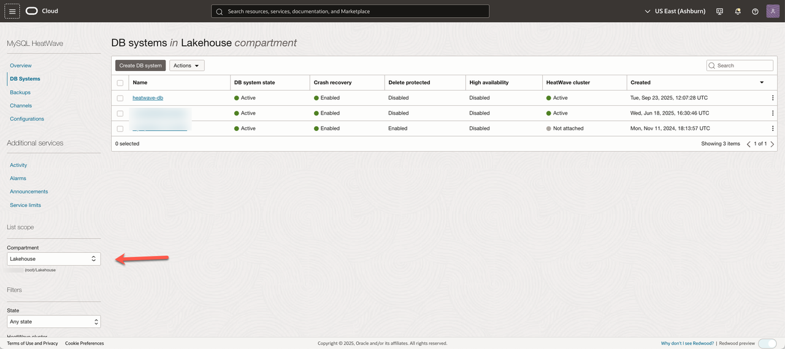
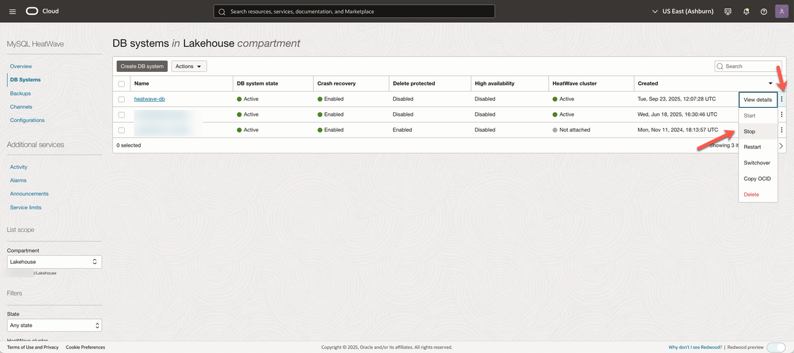
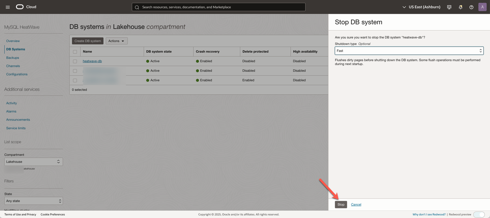
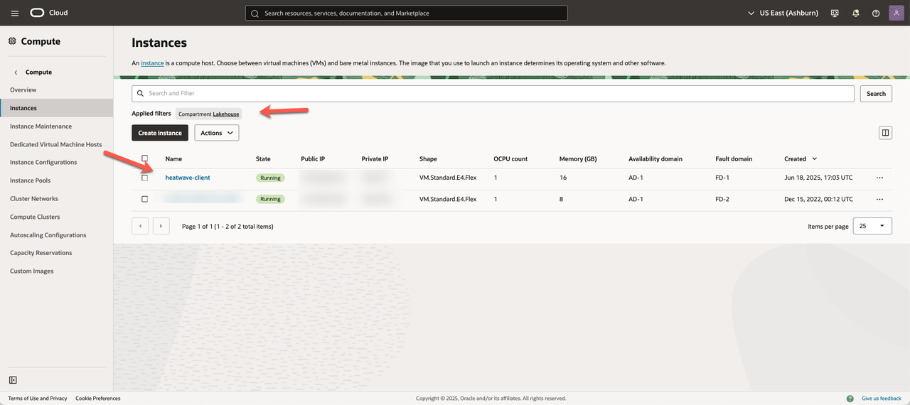
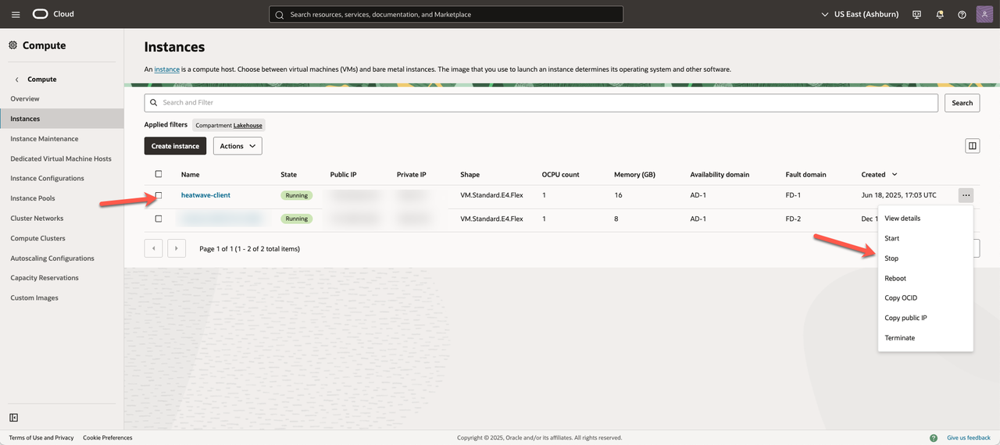
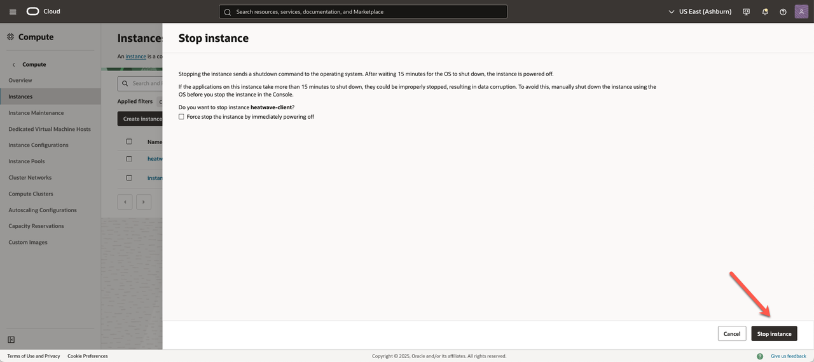

# Stop OCI Services

## Introduction

In this lab you will use the Console to Stop all of the Services you created in this Workshop.

_Estimated Time:_ 5 minutes

### Objectives

In this lab, you will be guided through the following task:

- Stop MySQL HeatWave Database Instance
- Stop Compute Instance

### Prerequisites

- An Oracle Trial or Paid Cloud Account
- Some Experience with MySQL Shell
- Completed Lab1 and Lab2

## Task 1: Stop heatwave-db Database Instance

1. Open the **Navigation menu**, click **Databases**,  and under **MySQL HeatWave**, click **DB Systems**.

2. Choose the **Lakehouse** Compartment. A list of DB systems is displayed.
    

3. Click **Actions** menu, and then click **Stop**.
    

4. In the displayed **Stop DB system** dialog box, click the  **Stop** button.
    

## Task 2: Stop heatwave-client Compute Instance

1. Open the **Navigation menu**, click **Compute**,  and under **Compute**, click **Instances**.

2. Choose the **Lakehouse** Compartment. A list of Compute intances is displayed. 
    

3. Click **Actions** menu, and then click **Stop**.
    

4. In the displayed **Stop instance** dialog box, click the  **Stop instance** button.
    

**Congratulations!  You have successfully finished the Workshop.**

## Learn More

- [Oracle Cloud Infrastructure MySQL Database Service Documentation](https://docs.cloud.oracle.com/en-us/iaas/MySQL-database)
- [MySQL Database Documentation](https://www.MySQL.com)

## Acknowledgements

- **Author** - Perside Foster, MySQL Principal Solution Engineering
- **Contributors** - Mandy Pang, MySQL Principal Product Manager,  Nick Mader, MySQL Global Channel Enablement & Strategy Manager
- **Last Updated By/Date** - Aijaz Fatima, Product Manager, September 2025