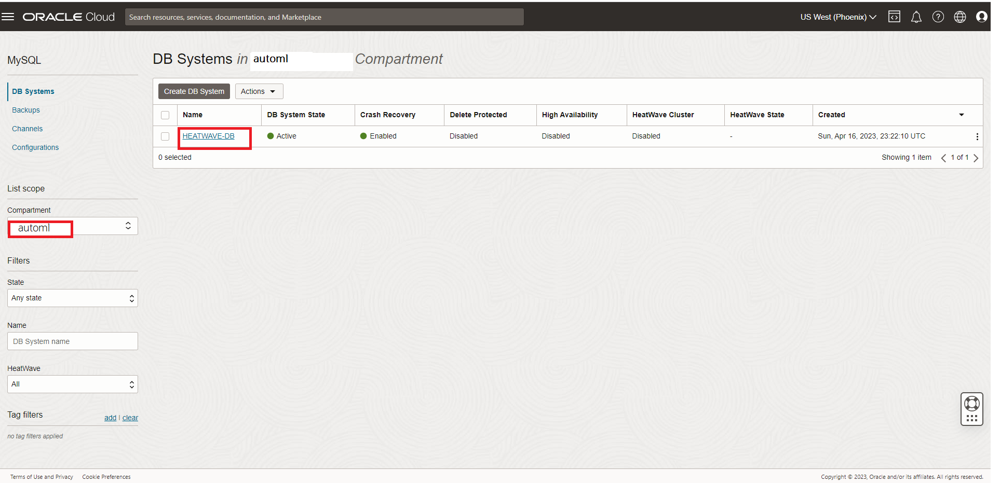
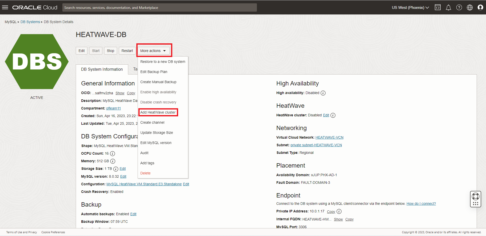
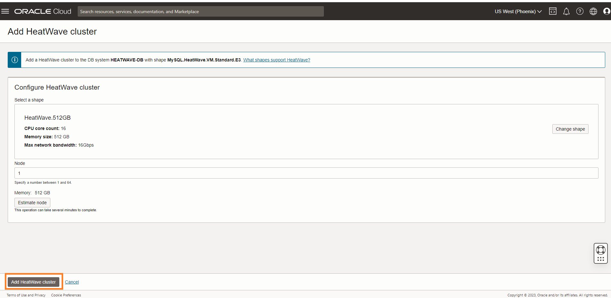

# Load HeatWave cluster in MySQL Database System

## Introduction

A HeatWave cluster comprise of a MySQL DB System and one or more HeatWave nodes. The MySQL DB System includes a plugin that is responsible for cluster management, loading data into the HeatWave cluster, query scheduling, and returning query result.

_Estimated Time:_ 10 minutes

### Objectives

In this lab, you will be guided through the following task:

- Add a HeatWave Cluster to MySQL Database System

### Prerequisites

- An Oracle Trial or Paid Cloud Account
- Some Experience with MySQL Shell
- Completed Lab 1

## Task 1: Add a HeatWave Cluster to the HEATWAVE-DB MySQL Database System

1. Open the navigation menu  
    - Databases
    - MySQL
    - DB Systems
2. Choose the root Compartment. A list of DB Systems is displayed.
    

3. In the list of DB Systems, click the **HEATWAVE-DB** system. click **More Action ->  Add HeatWave Cluster**.
    

4. Click “Add HeatWave Cluster” to create the HeatWave cluster
    

5. HeatWave creation will take about 10 minutes. From the DB display page scroll down to the Resources section. Click the **HeatWave** link. Your completed HeatWave Cluster Information section will look like this:
    

You may now **proceed to the next lab**

## Learn More

- [Oracle Cloud Infrastructure MySQL Database Service Documentation ](https://docs.cloud.oracle.com/en-us/iaas/MySQL-database)
- [MySQL Database Documentation](https://www.MySQL.com)

## Acknowledgements

- **Author** - Perside Foster, MySQL Solution Engineering
- **Contributors** - Mandy Pang, MySQL Principal Product Manager,  Priscila Galvao, MySQL Solution Engineering, Nick Mader, MySQL Global Channel Enablement & Strategy Manager
- **Last Updated By/Date** - Perside Foster, MySQL Solution Engineering, July 2023
