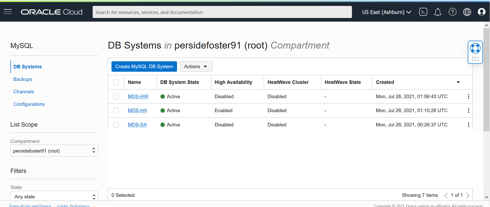
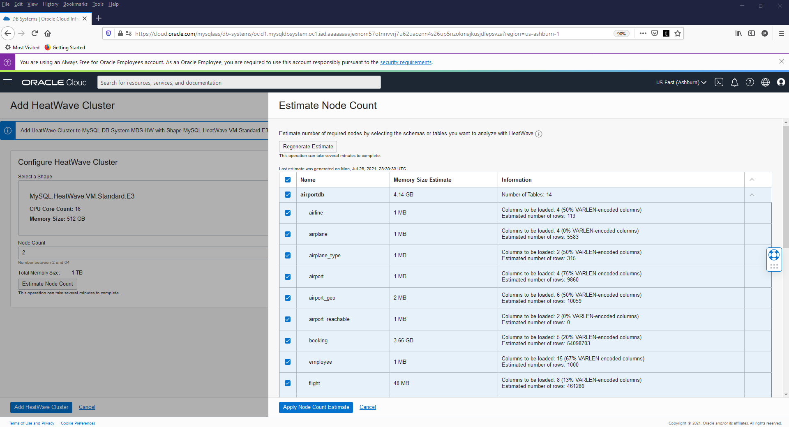

# Create MySQL Database HeatWave  and Cluster

## Introduction

In this lab, you will create and configure a Virtual Cloud Network and a MySQL HeatWave Database System. Once the HeatWave Database is fully created,  you will add a HeatWave Cluster comprise of two or more HeatWave nodes to the system.

_Estimated Time:_ 20 minutes

### Objectives

In this lab, you will be guided through the following tasks:

- Create a Virtual Cloud Network
- Create MySQL HeatWave Database
- Add a HeatWave Cluster to MySQL Database System

### Prerequisites

- An Oracle Trial or Paid Cloud Account
- Some Experience with MySQL Shell

## Task 1: Create a Virtual Cloud Network

1. Click **Navigation Menu**, **Networking**, then **Virtual Cloud Networks**
    
2. Click **Start VCN Wizard**
    

3. Select 'Create VCN with Internet Connectivity'

    Click 'Start VCN Wizard'
    

4. Create a VCN with Internet Connectivity

    On Basic Information, complete the following fields:

    VCN Name:

    ```
    <copy>MDS-VCN</copy>
    ```

    Compartment: Select  **(root)**

    Your screen should look similar to the following

    

5. Click 'Next' at the bottom of the screen

6. Review Oracle Virtual Cloud Network (VCN), Subnets, and Gateways

    Click 'Create' to create the VCN
    

7. The Virtual Cloud Network creation is completing
    

8. Click 'View Virtual Cloud Network' to display the created VCN
    

9. On MDS-VCN page under 'Subnets in (root) Compartment', click  '**Private Subnet-MDS-VCN**'
     

10. On Private Subnet-MDS-VCN page under 'Security Lists',  click  '**Security List for Private Subnet-MDS-VCN**'
    

11. On Security List for Private Subnet-MDS-VCN page under 'Ingress Rules', click '**Add Ingress Rules**'
    

12. On Add Ingress Rules page under Ingress Rule 1

    Add an Ingress Rule with Source CIDR

        ```
        <copy>0.0.0.0/0</copy>
        ```
    Destination Port Range

        ```
        <copy>3306,33060</copy>
        ```
    Description

        ```
        <copy>MySQL Port Access</copy>
        ```
    Click 'Add Ingress Rule'
        

13. On Security List for Private Subnet-MDS-VCN page, the new Ingress Rules will be shown under the Ingress Rules List
    

## Task 2: Create a MySQL Database for HeatWave (DB System) instance with sample data (airportdb)

1. Go to Navigation Menu
         Databases
         MySQL
         DB Systems
    

2. Click 'Create MySQL DB System'

    

3. Create MySQL DB System dialog and complete the fields in each section

    - Provide basic information for the DB System
    - Setup your required DB System
    - Create Administrator credentials
    - Configure Networking
    - Configure placement
    - Configure hardware
    - Exclude Backups
    - Advanced Options - Data Import

4. Provide basic information for the DB System:

    Select Compartment **(root)**

    Enter Name

        ```
        <copy>MDS-HW</copy>
        ```
    Enter Description

        ```
        <copy>MySQL Database Service HeatWave instance</copy>
        ```

    Select **HeatWave** to specify a HeatWave DB System

    

5. Create Administrator Credentials

    **Enter Username** (write username to notepad for later use)

    **Enter Password** (write the password to notepad for later use)

    **Confirm Password** (value should match the password for later use)

    

6. On Configure networking, keep the default values

    Virtual Cloud Network: **MDS-VCN**

    Subnet: **Private Subnet-MDS-VCN (Regional)**

    

7. On Configure placement under 'Availability Domain'

    Select AD-3

    Do not check 'Choose a Fault Domain' for this DB System.

    

8. On Configure hardware, keep default shape as **MySQL.HeatWave.VM.Standard.E3**

    Data Storage Size (GB) Set value to:  **1024**

        ```
        <copy>1024</copy>
        ```

    

9. On Configure Backups, disable 'Enable Automatic Backup'

    

10. Go to the Networking tab, in the Hostname field enter (same as DB System Name):

        ```
        <copy>MDS-HW</copy>
        ```

11. Review **Create MySQL DB System**  Screen

    

    Click the '**Create**' button

12. The New MySQL DB System will be ready to use after a few minutes

    The state will be shown as 'Creating' during the creation

    

13. The state 'Active' indicates that the DB System is ready for use

    On MDS-HW Page, check the MySQL Endpoint (Private IP Address)

    

## Task 3: Add a HeatWave Cluster to MDS-HW MySQL Database System

1. Open the navigation menu
    Databases
    MySQL
    DB Systems

2. Choose the root Compartment. A list of DB Systems is displayed.

    

3. In the list of DB Systems, click the **MDS-HW** system.
click **More Action ->  Add HeatWave Cluster**.

    

4. On the “Add HeatWave Cluster” dialog, select “MySQL.HeatWave.VM.Standard.E3” shape

5. Click the  “Estimate Node Count” button

    

6. On the “Estimate Node Count” page, click “Generate Estimate”.
This will trigger the auto-provisioning advisor to sample the data that is stored in InnoDB and based on the machine learning algorithm, it will predict the number of nodes needed.

    

7. Once the estimations are calculated, it shows a list of database schemas in the MySQL node. If you expand the schema and select different tables, you will see the estimated memory required in the Summary box, There is a Load Command (heatwave_load) generated in the text box window, which will change based on the selection of databases/tables

8. Select the airportdb schema and click “Apply Node Count Estimate” to apply the node count

    

9. Click “Add HeatWave Cluster” to create the HeatWave cluster

    

10. HeatWave creation will take about 10 minutes. From the DB display page scroll down to the Resources section. Click the **HeatWave** link. Your completed HeatWave Cluster Information section will look like this:

    

## Acknowledgements

- **Author** - Perside Foster, MySQL Solution Engineering
- **Contributors** - Mandy Pang, MySQL Principal Product Manager,  Priscila Galvao, MySQL Solution Engineering, Nick Mader, MySQL Global Channel Enablement & Strategy Manager, Frédéric Descamps, MySQL Community Manager
- **Last Updated By/Date** - Perside Foster, MySQL Solution Engineering, July 2022
