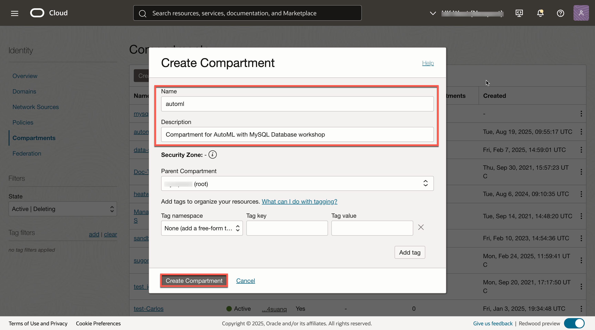
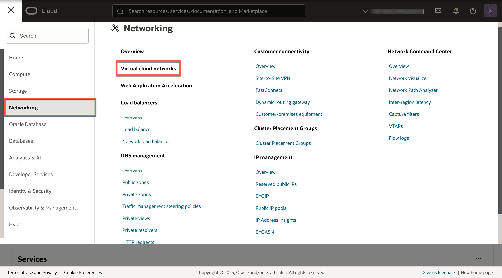
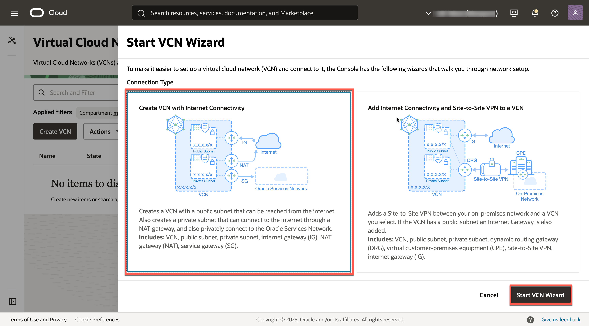
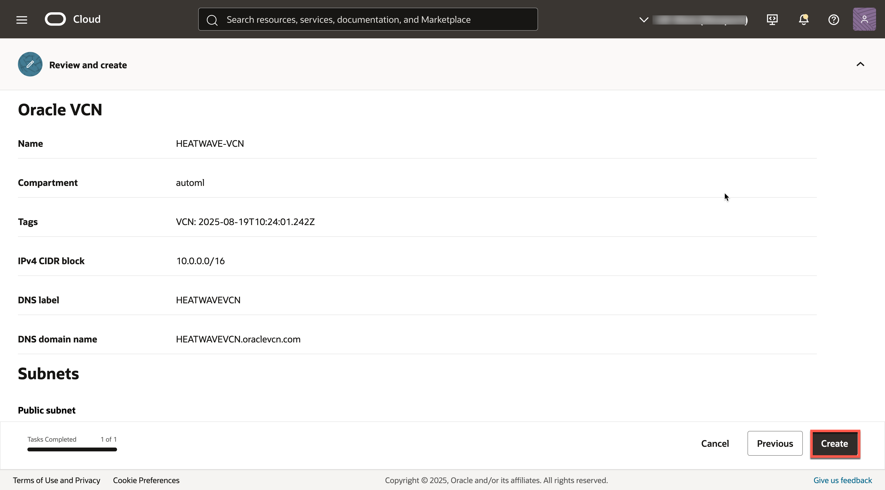
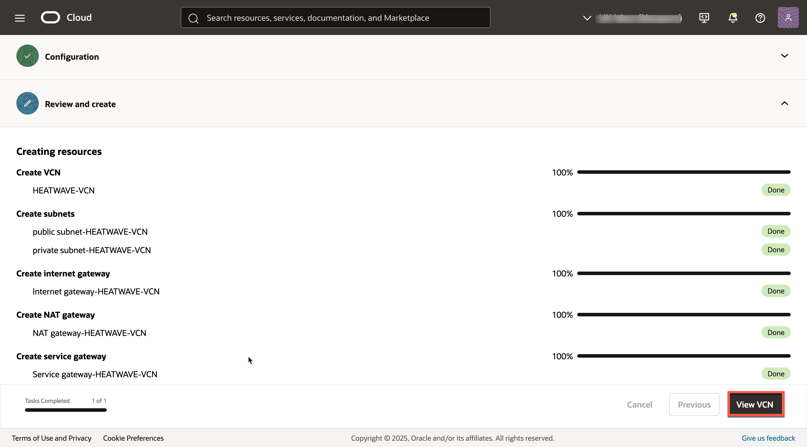
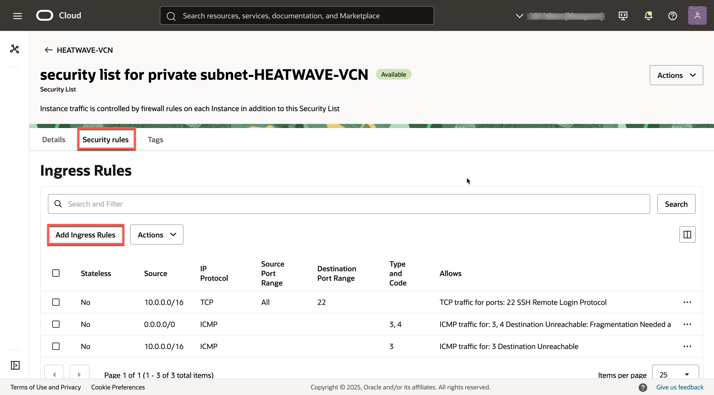
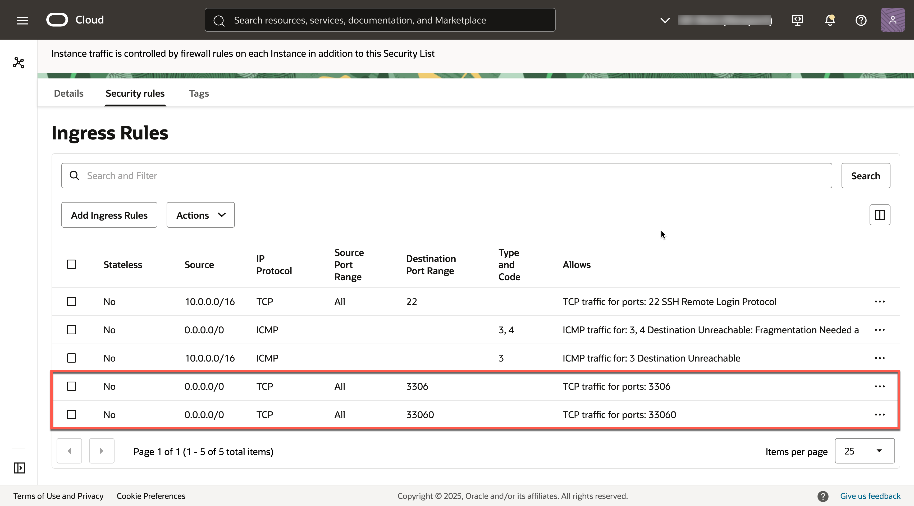
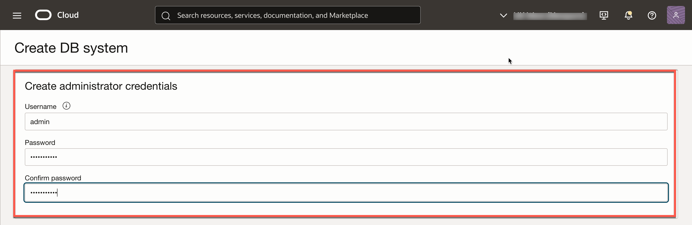
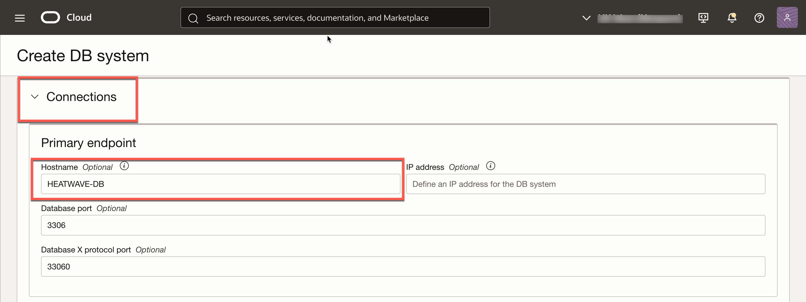

# Create MySQL HeatWave Database System


## Introduction

In this lab, you will create acreate a Compartment, a Virtual Cloud Network,  and create the MySQL HeatWave DB System.  

_Estimated Time:_ 20 minutes

### Objectives

In this lab, you will be guided through the following tasks:

- Create Compartment
- Create Virtual Cloud Network
- Create MySQL HeatWave (DB System) Instance

### Prerequisites

- An Oracle Trial or Paid Cloud Account
- Some Experience with MySQL Shell

## Task 1: Create Compartment

1. Click the **Navigation Menu** in the upper left, navigate to **Identity & Security** and select **Compartments**.

2. On the Compartments page, click **Create Compartment**.

3. In the Create Compartment dialog box, complete the following fields:

    Name:

    ```bash
    <copy>automl</copy>
    ```

    Description:

    ```bash
    <copy>Compartment for AutoML with MySQL Database workshop </copy>
    ```

4. The **Parent Compartment** should be **automl** and click **Create Compartment**
    

## Task 1: Create Virtual Cloud Network

1. You should be signed in to Oracle Cloud!

    Click **Navigation Menu**,

    

2. Click  **Networking**, then **Virtual Cloud Networks**  
    

3. Click **Start VCN Wizard**
    

4. Select 'Create VCN with Internet Connectivity'

    Click 'Start VCN Wizard'
    

5. Create a VCN with Internet Connectivity

    On Basic Information, complete the following fields:

    VCN Name:

    ```bash
    <copy>HEATWAVE-VCN</copy>
    ```

    Compartment: Select  **automl**

    Your screen should look similar to the following
    

6. Click 'Next' at the bottom of the screen

7. Review Oracle Virtual Cloud Network (VCN), Subnets, and Gateways

    Click 'Create' to create the VCN
    

8. When the Virtual Cloud Network creation completes, click 'View Virtual Cloud Network' to display the created VCN
    

## Task 2: Configure security list to allow MySQL incoming connections

1. On HEATWAVE-VCN page under 'Subnets in (root) Compartment', click  '**private subnet-heatwave-vcn**'
     

2. On Private Subnet-HEATWAVE-VCN page under 'Security Lists',  click  '**Security List for private subnet-heatwave-vcn**'
    

3. On Security List for Private Subnet-HEATWAVE-VCN page under 'Ingress Rules', click '**Add Ingress Rules**'
    

4. On Add Ingress Rules page under Ingress Rule

    Add an Ingress Rule with Source CIDR

    ```bash
    <copy>0.0.0.0/0</copy>
    ```

    Destination Port Range

    ```bash
    <copy>3306,33060</copy>
    ```

    Description

    ```bash
       <copy>MySQL Port Access</copy>
    ```

5. Click 'Add Ingress Rule'
    

6. On Security List for Private Subnet-HEATWAVE-VCN page, the new Ingress Rules will be shown under the Ingress Rules List
    

## Task 3: Configure security list to allow HTTP incoming connections

1. Navigation Menu > Networking > Virtual Cloud Networks

2. Open HeatWave-VCN

3. Click  public subnet-HeatWave-VCN

4. Click Default Security List for HeatWave-VCN

5. Click Add Ingress Rules page under Ingress Rule

    Add an Ingress Rule with Source CIDR

    ```bash
    <copy>0.0.0.0/0</copy>
    ```

    Destination Port Range

    ```bash
    <copy>80,443</copy>
    ```

    Description

    ```bash
    <copy>Allow HTTP connections</copy>
    ```

6. Click 'Add Ingress Rule'

    

7. On Security List for Default Security List for mds_vcn page, the new Ingress Rules will be shown under the Ingress Rules List

    

## Task 4: Create MySQL Database for HeatWave (DB System) instance

1. Click on Navigation Menu
         Databases
         MySQL
    

2. Click 'Create DB System'
    

3. Create MySQL DB System dialog by completing the fields in each section

    - Provide DB System information
    - Setup the DB system
    - Create Administrator credentials
    - Configure Networking
    - Configure placement
    - Configure hardware
    - Exclude Backups
    - Set up Advanced Options

4. For DB System Option Select **Development or Testing**

    

5. Provide basic information for the DB System:

    a. Select Compartment **automl**

    b. Enter Name

    ```bash
    <copy>HEATWAVE-DB</copy>
    ```

    c. Enter Description

    ```bash
    <copy>MySQL HeatWave Database Instance</copy>
    ```

    d. Create Administrator Credentials

    **Enter Username** (write username to notepad for later use)

    **Enter Password** (write password to notepad for later use)

    **Confirm Password** (value should match password for later use)

    

6. Select **“Standalone”** and enable **“Configure MySQL HeatWave”**
    
7. On Configure networking, keep the default values

    a. Virtual Cloud Network: **HEATWAVE-VCN**

    b. Subnet: **Private Subnet-HEATWAVE-VCN (Regional)**

    c. On Configure placement under 'Availability Domain'

    Select AD-1  ...  Do not check 'Choose a Fault Domain' for this DB System.

    

8. On Configure hardware, keep default shape as **MySQL.HeatWave.VM.Standard**

    Data Storage Size (GB) Set value to:  **1024**

    ```bash
    <copy>1024</copy>
    ```

    

9. On Configure Backups, disable 'Enable Automatic Backup'

    

10. Click on Show Advanced Options

11. Go to the Networking tab, in the Hostname field enter (same as DB System Name):

    ```bash
        <copy>HEATWAVE-DB</copy> 
    ```  

    

12. Review **Create MySQL DB System**  Screen

    
  

    Click the '**Create**' button

13. The New MySQL DB System will be ready to use after a few minutes

    The state will be shown as 'Creating' during the creation
    

14. The state 'Active' indicates that the DB System is ready for use

    On HEATWAVE-DB Page, check the MySQL Endpoint (Private IP Address)

    

You may now **proceed to the next lab**.

## Acknowledgements

- **Author** - Perside Foster, MySQL Solution Engineering

- **Contributors** - Mandy Pang, MySQL Principal Product Manager,  Priscila Galvao, MySQL Solution Engineering, Nick Mader, MySQL Global Channel Enablement & Strategy Manager, Frédéric Descamps, MySQL Community Manager

- **Last Updated By/Date** - Perside Foster, MySQL Solution Engineering, July 2023
