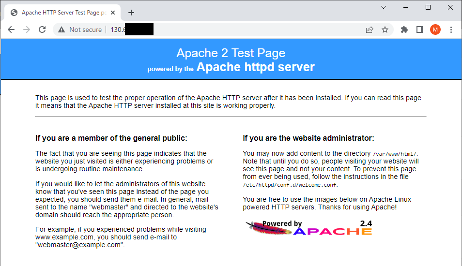
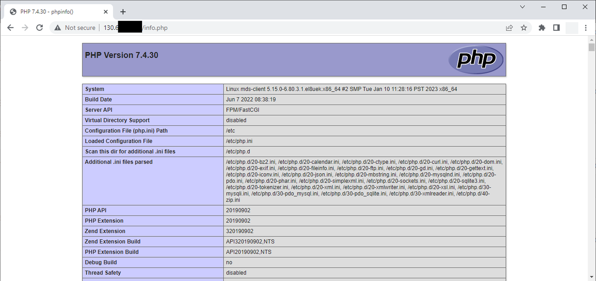
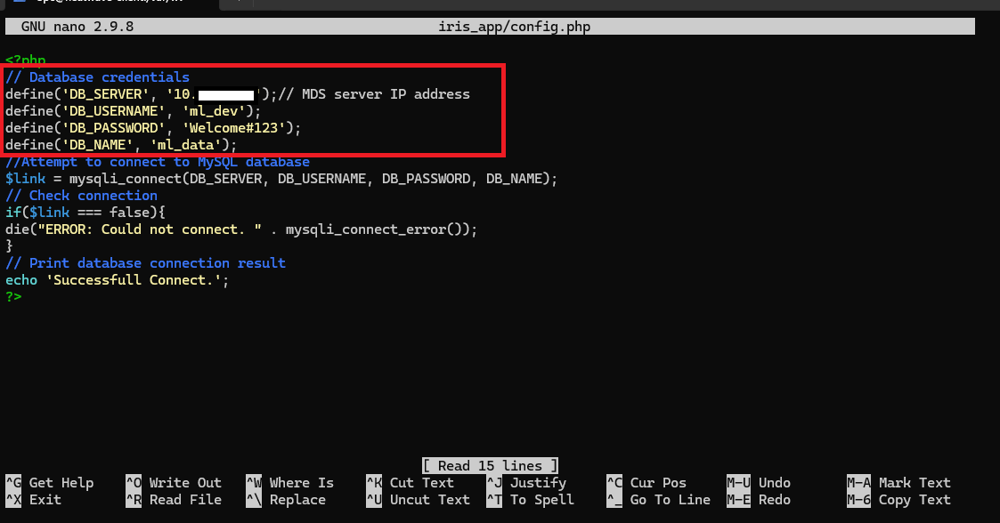
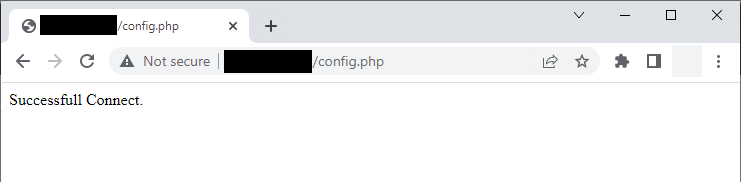
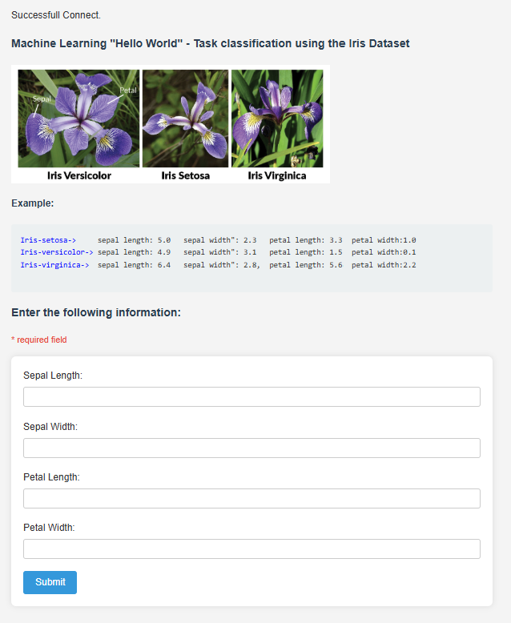

# Build HeatWave AutoML Web App  with PHP


## Introduction

MySQL HeatWave Machine Learning can easily be used for development tasks with existing Oracle services. New applications can also be created with the LAMP or other software stacks.
We use here a sample PHP application.

_Estimated Time:_ 20 minutes

### Objectives

In this lab, you will be guided through the following tasks:

- Install Apache and PHP and create PHP / MYSQL Connect AutoML access Application

### Prerequisites

- An Oracle Trial or Paid Cloud Account
- Some Experience with Linux text editors
- Some Experience with PHP
- Completed Lab 5


## Task 1: Install Web Server (APACHE)

1. If not already connected with SSH, on Command Line, connect to the Compute instance using SSH ... be sure to replace the  "private key file"  and the "new compute instance IP".

    ```bash
        <copy>ssh -i private_key_file opc@new_compute_instance_ip</copy>
    ```

2. Install app server

    a. Install Apache

    ```bash
    <copy>sudo yum install httpd -y </copy>
    ```

    b. Enable Apache

    ```bash
    <copy>sudo systemctl enable httpd</copy>
    ```

    c. Start Apache

    ```bash
    <copy>sudo systemctl restart httpd</copy>
    ```

    d. Setup firewall

    ```bash
    <copy>sudo firewall-cmd --permanent --add-port=80/tcp</copy>
    ```

    e. Reload firewall

    ```bash
    <copy>sudo firewall-cmd --reload</copy>
    ```

3. From a browser test apache from your local machine using the Public IP Address of your Compute Instance

    **Example: http://129.213....**

    

## Task 2: Install PHP

1. Install PHP:

    a. Install php:7.4

    ```bash
    <copy> sudo dnf module install php:7.4 -y</copy>
    ```

    b. Install associated PHP libraries

    ```bash
    <copy>sudo yum install php-cli php-mysqlnd php-zip php-gd php-mbstring php-xml php-json -y</copy>
    ```

    c. View PHP / MySQL libraries

    ```bash
    <copy>php -m |grep mysql</copy>
    ```

    d. View PHP version

    ```bash
    <copy>php -v</copy>
    ```

    e. Restart Apache

    ```bash
    <copy>sudo systemctl restart httpd</copy>
    ```

2. Create test PHP file (info.php)

    ```bash
    <copy>sudo nano /var/www/html/info.php</copy>
    ```

3. Add the following code to the editor and save the file (ctr + o) (ctrl + x)

    ```bash
        <copy><?php
        phpinfo();
        ?></copy>
    ```

4. From your local machine, browse the page info.php and verify that you can read the PHP settings

    **Example: http://129.213.167.../info.php**

    

## Task 3: Create HeatWave AutoML Web App

1. Security update"   set SELinux to allow Apache to connect to MySQL

    ```bash
    <copy> sudo setsebool -P httpd_can_network_connect 1 </copy>
    ```

2. Download and extract the iris application zip file

    ```bash
    <copy>cd /var/www/html</copy>
    ```

    ```bash
    <copy> sudo wget https://objectstorage.us-ashburn-1.oraclecloud.com/p/9WLLKC8BD0tfBdIJ98_x7dXLN9Kvow9ZPtBD35KVwzdqoIQshX1WBBMBB7AqIGMT/n/mysqlpm/b/mysql_iris_ml_app/o/iris_app.zip </copy>
    ```

    ```bash
    <copy>sudo unzip iris_app.zip</copy>
    ```

   **Note** This application uses the "ml_dev" database username that you should have used to create  the Machine Learning Model.

3. Configure the application to connect to MySQL HeatWave.
   Replace the database IP in config.php file with your heatwave database IP and save the file.

    ```bash
    <copy>sudo nano iris_app/config.php</copy>
    ```

    

4. From your local machine, browse the page config.php and check the successful connection message. If you receive an error, please fix it before continue

    **Test Config.php on Web Sever http://150.230....iris_app/config.php**

    

5. If the connection test is successful, run the application as follows:

    **http://computeIP/iris_app/index.php**

    

6. Insert test values in the text boxes (you can use the examples in the page) and press '**Submit**' button. Page down to see the prediction, explanation, and score:

     

## Acknowledgements

- **Author** - Perside Foster, MySQL Solution Engineering, Harsh Nayak, MySQL Solution Engineering

- **Contributors** - Mandy Pang, MySQL Principal Product Manager,  Priscila Galvao, MySQL Solution Engineering, Nick Mader, MySQL Global Channel Enablement & Strategy Manager, Marco Carlessi, MySQL Solution Engineering
- **Last Updated By/Date** - Perside Foster, MySQL Solution Engineering,January 2025