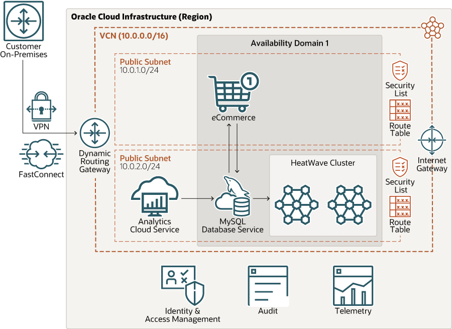
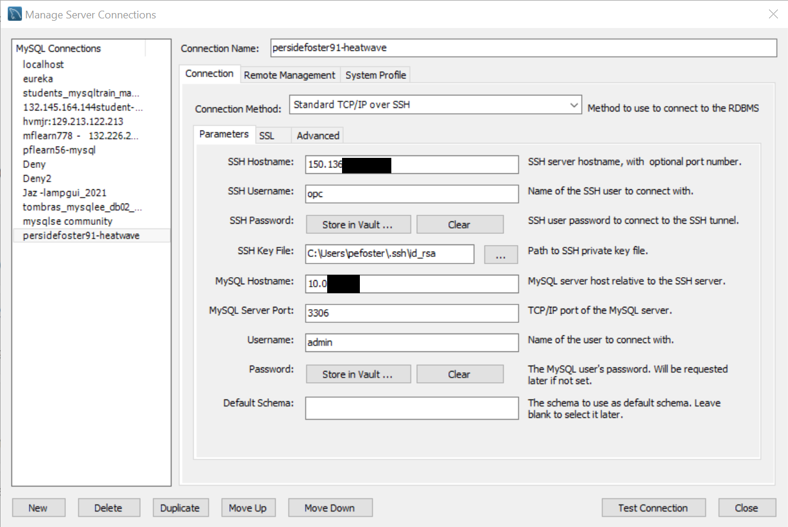
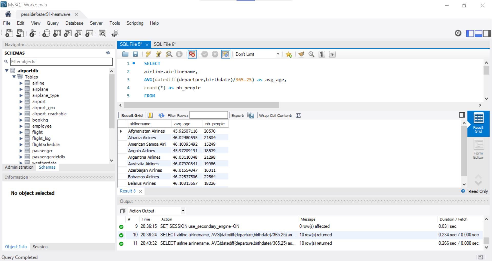
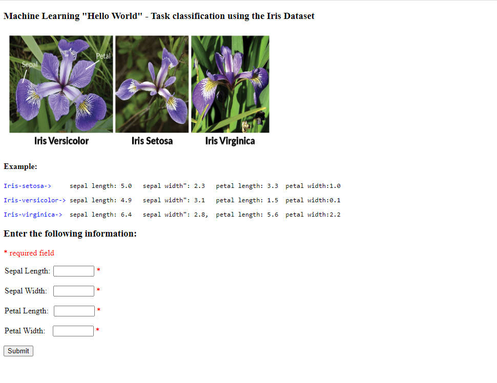

# Build HeatWave ML Web App  

## Introduction

MySQL HeatWave Machine Learning can easily be used for development tasks with existing Oracle services. New applications can also be created with the LAMP or other software stacks.



_Estimated Lab Time:_ 40 minutes

### Objectives

In this lab, you will be guided through the following tasks:

- Install Apache and PHP and create PHP / MYSQL Connect ML access Application

### Prerequisites

- An Oracle Trial or Paid Cloud Account
- Some Experience with PHP
- Completed Lab 3

## **TASK 1:**  Connect to HeatWave using Workbench

Estimated Time: 5 minutes

1. At this point, you can also use MySQL Workbench from your local machine to connect to the MySQL endpoint using your new Compute instance as a jump box.

2. In your pre-installed MySQL Workbench, configure a connection using the method "Standard TCP/IP over SSH" and use the credentials of the Compute instance for SSH.

    **MySQL Workbench Configuration for MDS HeatWAve**
    

    **MySQL Workbench Use  for MDS HeatWAve**
    

## **TASK 2:** Set UP Lamp Server

Estimated Time: 10 minutes

- **Subtask 1 – Install App Server (APACHE)**

1. If not already connected with SSH, on Command Line, connect to the Compute instance using SSH ... be sure replace the  "private key file"  and the "new compute instance ip".

    ````bash
        <copy>ssh -i private_key_file opc@new_compute_instance_ip</copy>
    ````

2. Install app server

    a. Install Apache

    ````bash
    <copy>sudo yum install httpd -y </copy>
    ````

    b. Enable Apache

    ````bash
    <copy>sudo systemctl enable httpd</copy>
    ````

    c. Start Apache

    ````bash
    <copy>sudo systemctl restart httpd</copy>
    ````

    d. Setup firewall

    ````bash
    <copy>sudo firewall-cmd --permanent --add-port=80/tcp</copy>
    ````

    e. Reload firewall

    ````bash
    <copy>sudo firewall-cmd --reload</copy>
    ````

3. From a browser test apache from your loacal machine using the Public IP Address of your Compute Instance

- **Example: http://129.213....**

- **Subtask 2 – Install PHP**   

1. Install php:

    a. Install php:7.4

    ````bash
    <copy> sudo dnf module install php:7.4 -y</copy>
    ````

    b. Install associated php libraries

    ````bash
    <copy>sudo yum install php-cli php-mysqlnd php-zip php-gd php-mbstring php-xml php-json -y</copy>
    ````

    c. View  php / mysql libraries

    ````bash
    <copy>php -m |grep mysql</copy>
    ````

    d. View php version

    ````bash
    <copy>php -v</copy>
    ````

    e. Restart Apache

    ````bash
    <copy>sudo systemctl restart httpd</copy>
    ````

2. Create test php file (info.php)

    ````bash
    <copy>sudo nano /var/www/html/info.php</copy> 
    ````

3. Add the following code to the editor and save the file (ctr + o) (ctl + x)

    ````bash
    <copy><?php
phpinfo();
?></copy>
    ````
4. From your local machine, browse the page info.php

- **Example: http://129.213.167.../info.php**

## **TASK 3:** Build HeatWave ML Web App

- **Subtask 3 – Create MDS / PHP connect app**

1. Security update"   set SELinux to allow Apache to connect to MySQL

    ````bash
    <copy> sudo setsebool -P httpd_can_network_connect 1 </copy>
    ````

2. Create config.php

    ````bash
    <copy>cd /var/www/html</copy>
    ````

    ````bash
    <copy>sudo nano config.php</copy>
    ````

3. Add the following code to the editor and save the file (ctr + o) (ctl + x)

    ````bash
    <copy><?php
// Database credentials
define('DB_SERVER', '10.0.1...');// MDS server IP address
define('DB_USERNAME', 'admin');
define('DB_PASSWORD', 'Welcome#12345');
define('DB_NAME', 'airportdb');
//Attempt to connect to MySQL database
$link = mysqli_connect(DB_SERVER, DB_USERNAME, DB_PASSWORD, DB_NAME);
// Check connection
if($link === false){
    die("ERROR: Could not connect. " . mysqli_connect_error());
}
// Print host information
echo 'Successfull Connect.';
echo 'Host info: ' . mysqli_get_host_info($link);
?>
</copy>
    ````

4. From your local machine, browse the page info.php

    **Test Config.php on Web sever http://150.230..../config.php**

5. Create dbtest.php

    ````bash
    <copy>cd /var/www/html</copy>
    ````

    ````bash
    <copy>sudo nano dbtest.php</copy>
    ````

6. Add the following code to the editor and save the file (ctr + o) (ctl + x)

    ````bash
    <copy><?php
require_once "config.php";
$query = "select firstname, lastname, count(booking.passenger_id) as count_bookings from passenger, booking
where booking.passenger_id = passenger.passenger_id
and passenger.lastname = 'Aldrin' or (passenger.firstname = 'Neil' and passenger.lastname = 'Armstrong')
and booking.price > 400.00 group by firstname, lastname;";
if ($stmt = $link->prepare($query)) {
   $stmt->execute();
   $stmt->bind_result($firstname,$lastname,$count_bookings);
   echo "<table>";
        echo "<tr>";
        echo "<th>Firstname</th>";
        echo "<th>Lastname</th>";
        echo "<th>Count</th>";
    echo "</tr>";

    while ($stmt->fetch()) {
        echo "<tr>";
           echo "<td>" . $firstname ."</td>";
           echo "<td>" . $lastname . "</td>";
           echo "<td>" . $count_bookings . "</td>";
        echo "</tr>";
     }

    $stmt->close();
}
?>

</copy>
    ````

7.	From your local  machine connect to dbhwtest.php

    Example: http://129.213.167..../dbtest.php

## **TASK 4:** Create IHeatWAve ML Web App

1. Go to the development folder

    ````bash
    <copy>cd /var/www/html</copy>
    ````

2. Download the iris application zip file

    ````bash
    <copy>wget iriz.zip</copy>
    ````

    ````bash
    <copy>unzip iriz.zip</copy>
    ````

    ````bash
    <copy>cd /var/www/html/iris</copy>
    ````

    replace the database ip in config.php file with your heatwave data base IP and save the file .

    run the application as follows:

    computeIP//iris/iris_web.php

    

## Acknowledgements

- **Author** - Perside Foster, MySQL Solution Engineering, Harsh Nayak , MySQL Solution Engineering

- **Contributors** - Mandy Pang, MySQL Principal Product Manager,  Priscila Galvao, MySQL Solution Engineering, Nick Mader, MySQL Global Channel Enablement & Strategy Manager
- **Last Updated By/Date** - Perside Foster, MySQL Solution Engineering, May 2022