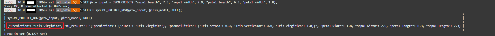
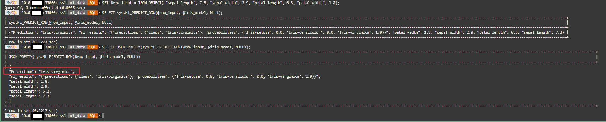
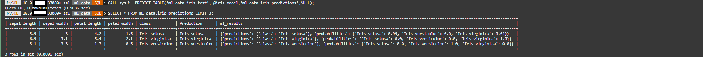
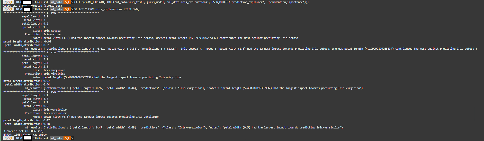

# Build HeatWave AutoML with SQL


## Introduction

To load the Iris data components, perform the following steps to create and load the required schema and tables. The requirements for Python 3 are already loaded in the compute instance and you have already installed MySQL Shell in the previous Lab.

After this step the data is stored in the MySQL HeatWave database in the following schema and tables:

**ml_data schema:** The schema containing training and test dataset tables.

**iris_train table:** The training dataset (labeled). Includes feature columns (sepal length, sepal width, petal length, petal width) and a populated class target column with ground truth values.

**iris_test table:** The test dataset (unlabeled). Includes feature columns (sepal length, sepal width, petal length, petal width) but no target column.

**iris_validate table:** The validation dataset (labeled). Includes feature columns (sepal length, sepal width, petal length, petal width) and a populated class target column with ground truth values.

_Estimated Time:_ 10 minutes

### Objectives

In this lab, you will be guided through the following task:

- Load Iris Data into HeatWave

### Prerequisites

- An Oracle Trial or Paid Cloud Account
- Some Experience with MySQL Shell
- Completed Lab 2

## Task 1: Prepare HeatWave AutoML environment

1. If not already connected with SSH, connect to Compute instance using Cloud Shell

    (Example: **ssh -i id_rsa opc@132.145.17....**)

2. On the command line, connect to MySQL using the MySQL Shell client tool with the following command:

    ```bash
    <copy>mysqlsh -uadmin -p -h 10.... -P3306 --sql </copy>
    ```

    

3. In this lab we use the administrative account previously created, but if you want to use a dedicated MySQL user, please remember to grant the following privileges to use HeatWave AutoML

    a. SELECT and ALTER privileges on the schema that contains the machine learning datasets

    ```bash
    <copy>GRANT SELECT, ALTER ON schema_name.* TO 'user_name'@'%';</copy>
    ```

    b. SELECT and EXECUTE on the MySQL sys schema where HeatWave AutoML routines reside; for example:

    ```bash
    <copy>GRANT SELECT, EXECUTE ON sys.* TO 'user_name'@'%';</copy>
    ```

## Task 2: load training and test data

1. To Create the Machine Learning schema and tables on the MySQL HeatWave DB System perform download the sample database with this command:

    a. Click on this link to **Download file [iris-ml-data.txt](files/iris-ml-data.txt)**  to your local machine
    b. Open iris-ml-data.txt from your local machine with notepad

    

    c. Copy all of the content of the iris-ml-data.txt file from your local machine
        - Paste the content next to the MySQL Shell command and hit enter at the very end (please don't forget to confirm last statement).

    

2. View the content of  your machine Learning schema (ml_data)

    a. Connected to the new database ml_data 

    ```bash
    <copy>use ml_data; </copy>
    ```

    b. Show the created tables

    ```bash
    <copy>show tables; </copy>
    ```

    

## Task 3: Train the machine learning model

1. Train the model using ML_TRAIN. Since this is a classification dataset, the classification task is specified to create a classification model:

    ```bash
    <copy>CALL sys.ML_TRAIN('ml_data.iris_train', 'class',JSON_OBJECT('task', 'classification'), @iris_model);</copy>
    ```

2. When the training operation finishes, the model handle is assigned to the @iris_model session variable, and the model is stored in your model catalog. You can view the entry in your model catalog using the following query:

    ```bash
    <copy>SELECT model_id, model_handle, train_table_name FROM ML_SCHEMA_admin.MODEL_CATALOG;</copy>
    ```

3. Load the model into HeatWave AutoML using ML\_MODEL\_LOAD routine:

    ```bash
    <copy>CALL sys.ML_MODEL_LOAD(@iris_model, NULL);</copy>
    ```

    A model must be loaded before you can use it. The model remains loaded until you unload it or the HeatWave Cluster is restarted.

    **Note**  Your output should look like this:
    

## Task 4: Predict and Explain for Single Row

1. Make a prediction for a single row of data using the ML\_PREDICT\_ROW routine.
   In this example, data is assigned to a @row\_input session variable, and the variable is called by the routine. The model handle is called using the @iris\_model session variable:

    ```bash
    <copy>SET @row_input = JSON_OBJECT( "sepal length", 7.3, "sepal width", 2.9, "petal length", 6.3, "petal width", 1.8); </copy>
    ```

    ```bash
    <copy>SELECT sys.ML_PREDICT_ROW(@row_input, @iris_model, NULL);</copy>
    ```

    Based on the feature inputs that were provided, the model predicts that the Iris plant is of the **class Iris-virginica**. The feature values used to make the prediction are also shown.

    **Note**  Your output should look like this:
    

2. To have a more human readable output, you can use the built-in function JSON\_PRETTY. Repeat row prediction with a better formatting output:

    ```bash
    <copy>SELECT JSON_PRETTY(sys.ML_PREDICT_ROW(@row_input, @iris_model, NULL));</copy>
    ```

    **Note**  Your output should look like this:
    

3. Generate an explanation for the same row of data using the ML\_EXPLAIN\_ROW routine to understand how the prediction was made:

    ```bash
    <copy>SELECT JSON_PRETTY(sys.ML_EXPLAIN_ROW(@row_input, @iris_model, JSON_OBJECT('prediction_explainer', 'permutation_importance')));;</copy>
    ```

    The attribution values show which features contributed most to the prediction, with petal length and pedal width being the most important features. The other features have a 0 value indicating that they did not contribute to the prediction.

    **Note**  Your output should look like this:
    


## Task 5: Make predictions and run explanations for a table of data  using a trained model

1. Make predictions for a table of data using the ML\_PREDICT\_TABLE routine. The routine takes data from the iris\_test table as input and writes the predictions to an iris_predictions output table.

    ```bash
    <copy>CALL sys.ML_PREDICT_TABLE('ml_data.iris_test', @iris_model,'ml_data.iris_predictions',NULL);</copy>
    ```

2. Query the table ML\_PREDICT\_TABLE to view the results  

    ```bash
    <copy>SELECT * FROM ml_data.iris_predictions LIMIT 3;</copy>
    ```

    The table shows the predictions and the feature column values used to make each prediction.

     **Note**  Your output should look like this:
    


3. Generate explanations for the same table of data using the ML\_EXPLAIN\_TABLE routine.

    ```bash
    <copy>CALL sys.ML_EXPLAIN_TABLE('ml_data.iris_test', @iris_model, 'ml_data.iris_explanations', JSON_OBJECT('prediction_explainer', 'permutation_importance'));</copy>
    ```

4. Query the table ML\_EXPLAIN\_TABLE  to view the results

    ```bash
    <copy> SELECT * FROM iris_explanations LIMIT 3\G;</copy>
    ```

     **Note**  Your output should look like this:
    

## Task 6: Score your machine learning model to assess its reliability and unload the model

1. Score the model using ML\_SCORE to assess the model's reliability. This example uses the balanced_accuracy metric, which is one of the many scoring metrics supported by HeatWave AutoML.

    ```bash
    <copy>CALL sys.ML_SCORE('ml_data.iris_validate', 'class', @iris_model, 'balanced_accuracy', @score,null);</copy>
    ```

2. To retrieve the computed score, query the @score session variable

    ```bash
    <copy>SELECT @score;</copy>
    ```

    **Note**  Your output should look like this:
    

3. Unload the model using ML\_MODEL\_UNLOAD:

    ```bash
    <copy>CALL sys.ML_MODEL_UNLOAD(@iris_model);</copy>
    ```

    **Note** To avoid consuming too much space, it is good practice to unload a model when you are finished using it.

## Learn More

* [Oracle Cloud Infrastructure MySQL Database Service Documentation](https://docs.cloud.oracle.com/en-us/iaas/MySQL-database)
* [MySQL Database Documentation](https://www.MySQL.com)

## Acknowledgements

- **Author** - Perside Foster, MySQL Solution Engineering

- **Contributors** - Salil Pradhan, Principal Product Manager,
Nick Mader, MySQL Global Channel Enablement & Strategy Manager
Marco Carlessi, MySQL Solution Engineering
- **Last Updated By/Date** - Perside Foster, MySQL Solution Engineering, Jul 2023
