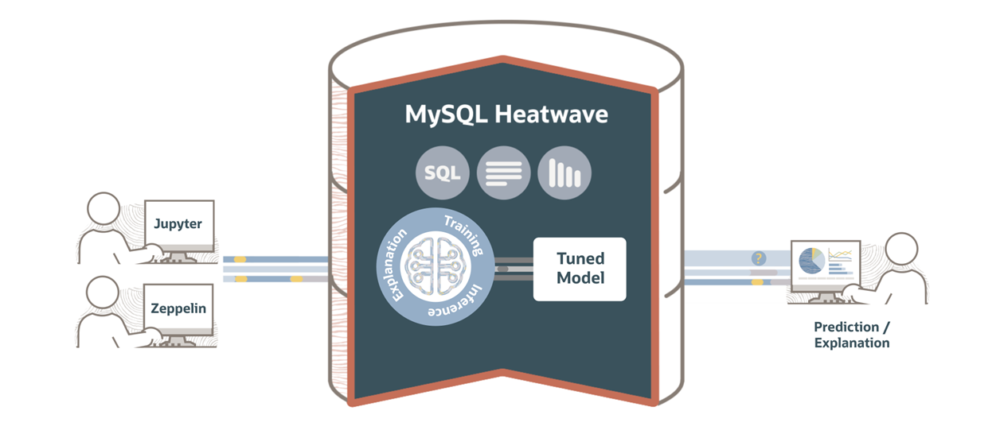

# Introduction

This workshop is based on [MySQL HeatWave User Guide: Iris Data Set Machine Learning Quickstart](https://dev.mysql.com/doc/heatwave/en/hwml-iris-example.html)

HeatWave is a massively parallel, high-performance, in-memory query accelerator that accelerates MySQL performance by orders of magnitude for analytics workloads, mixed workloads, and machine learning. A HeatWave Cluster consists of a MySQL DB System and HeatWave nodes that store data in memory and process analytics and machine learning queries.

## About this Workshop

In this workshop, you will use the capabilities of HeatWave AutoML to implement a project which classifies species of Iris flowers. This project is also known as the Hello World version of Machine Learning. You will create and use a predictive machine learning model to step through preparing data, using the ML\_TRAIN routine to train a model, and using ML\_PREDICT\_ and ML\_EXPLAIN\_ routines to generate predictions and explanations. Finally, you will assess the quality of a model using the ML_SCORE routine and how to view a model explanation to understand how your model works.

The workshop uses the publicly available [Iris Data Set] (https://archive.ics.uci.edu/ml/datasets/Iris)  from the UCI Machine Learning Repository and MySQL HeatWave version 8.0.32.

The Iris Data Set has the following data, where the sepal and petal features are used to predict the class label, which is

**type of Iris plant:**

- sepal length (cm)
- sepal width (cm)
- petal length (cm)
- petal width (cm)

**class of possible values:**

- Iris Setosa
- Iris Versicolour
- Iris Virginica

The sepal is the part that encases and protects the flower when it is in the bud stage. A petal is a leaflike part that is often colorful.

_Estimated Time:_ 2 hours

Watch the video below for a quick walk-through of the lab.

[Automate ML Apps with MySQL HeatWave](videohub:1_mgj1acg7)

### About Product/Technology

HeatWave ML makes it easy to use machine learning, whether you are a novice user or an experienced ML practitioner. You provide the data, and HeatWave AutoML analyzes the characteristics of the data and creates an optimized machine learning model that you can use to generate predictions and explanations. An ML model makes predictions by identifying patterns in your data and applying those patterns to unseen data. HeatWave ML explanations help you understand how predictions are made, such as which features of a dataset contribute most to a prediction.

  

### Objectives

In this lab, you will be guided through the following steps:

- Create SSH Key on Oracle Cloud Infrastructure Cloud Shell
- Create MySQL Database for HeatWave (DB System) instance
- Setup Compute instance
- Connect to DB System using MySQL Shell through Compute Instance / Cloud Shell
- Add HeatWave cluster to DB System
- Prepare and load training and test data.
- Train the machine learning model.
- Make predictions with test data using a trained model
- Run explanations on test data using a trained model
- Score your machine learning model to assess its reliability
- View a model explanation to understand how the model makes predictions

### Prerequisites

- An Oracle Free Tier, Paid or LiveLabs Cloud Account
- Some Experience with MySQL Shell - [MySQL shell] (https://dev.MySQL.com/doc/MySQL-shell/8.0/en/)

## Acknowledgements

- **Author** - Perside Foster, MySQL Solution Engineering

- **Contributors** - Salil Pradhan, Principal Product Manager,
Nick Mader, MySQL Global Channel Enablement & Strategy Manager
Marco Carlessi, MySQL Solution Engineering
- **Last Updated By/Date** - Marco Carlessi, MySQL Solution Engineering, January 2025
