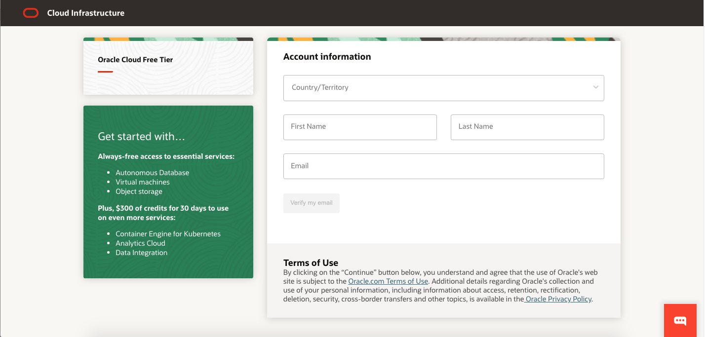
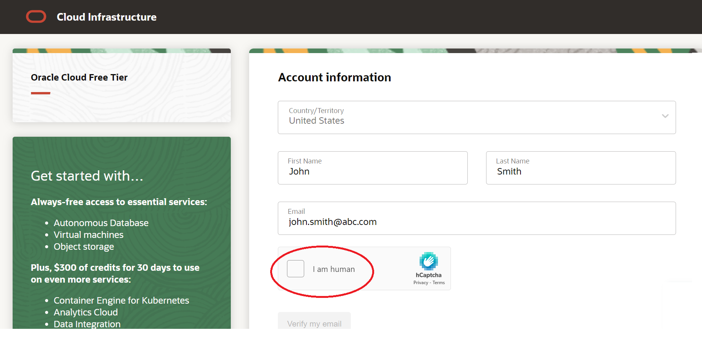
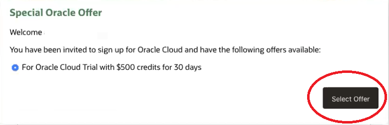
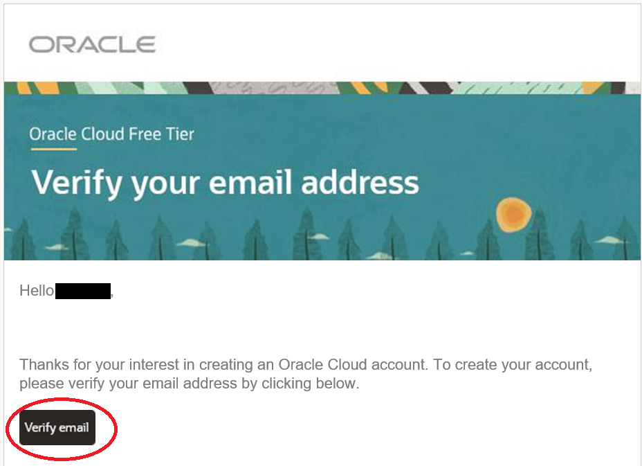
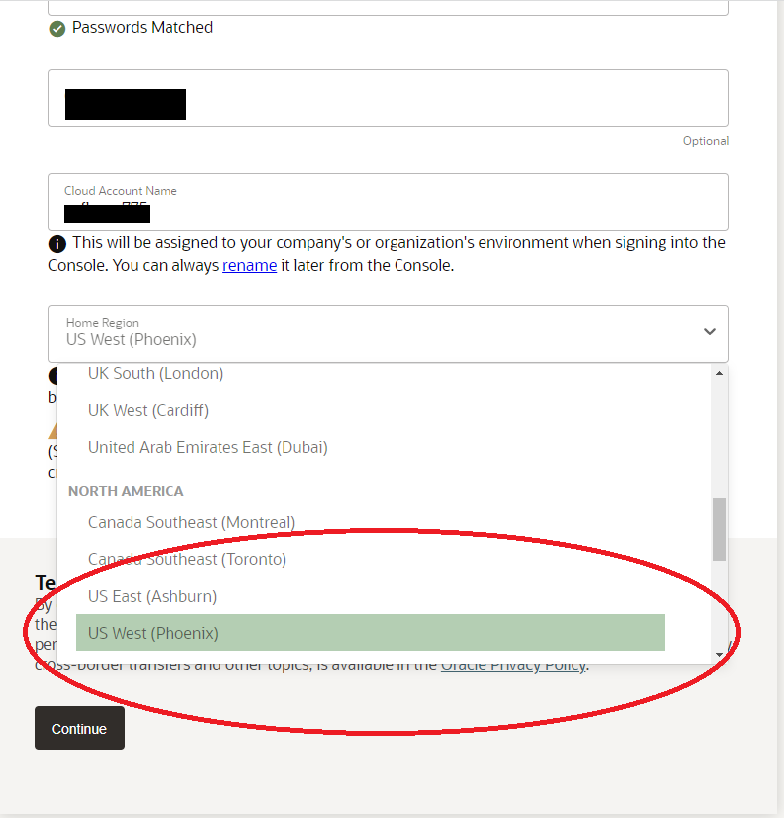
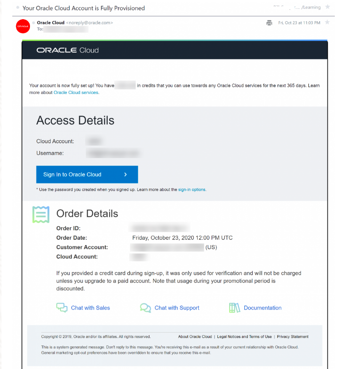

# Getting Started

## Introduction

**IMPOTANT**: When creating your Trial account

**Please Select**  the **US West (Phoenix)** Home Region.

**You will not be able to create the Required Components for this workshop** if you select the **US EAST (Ashburn)** Home Region !!!

Before you get started, you will need an Oracle Cloud account.

### **Two Cloud Offers in One**

Oracle Cloud Free Tier allows you to sign up for an Oracle Cloud account which provides a number of Always Free services and a Free Trial with US$500 of free credit to use on all eligible Oracle Cloud Infrastructure services for up to 30 days. The Always Free services are available for an unlimited period of time. The Free Trial services may be used until your US$500 of free credits are consumed or the 30 days has expired, whichever comes first.

### **What you will need**

* The email address you used to register for the **MySQL Database Service Hands-On Workshop**
* Ability to receive SMS text verification

### **Create Your Free Trial Account**

1. Open up a web browser to access the Oracle Cloud account registration form at [oracle.com/cloud/free](https://signup.cloud.oracle.com).

2. You will be presented with a registration page

    

3. Enter the following information to create your Oracle Cloud Free Tier account.
    * Choose your **Country**
    * Enter your **Name** and **Email**.

4. Once you have entered a valid email address, select the **I am human** box and follow the popup dialog's instructions

    

5. Once you have completed the **I am human** popup dialog's instructions
, select the **Verify my email** button. If you see a **Special Oracle Offer** dialog box, continue to step 6.

    **IMPORTANT**: If you **Do Not** see the **Special Oracle Offer** dialog box, please **STOP** and send an email asking for help to **perside.foster@oracle.com**. **DO NOT** continue this  **Create Account** process. Please exit this page.

6. From the **Special Oracle Offer** dialog box,  click  **Select Offer**.

    

7. Check your email inbox for the follwing Oracle Cloud email:

    **Verify your email to create your Oracle Cloud account**
    

8. Click the email's **Verify Email** button located on the email

9. Enter the following information to create your Oracle Cloud Free Tier account

       * Choose a **Password**
       * Enter your **Company Name**
       * Your **Cloud Account Name** will generate automatically based on your inputs, you can change that name by entering a new value. Remember what you wrote. You'll need this name later to sign in.
       * Choose a **Home Region**:

        Please select the **US West (Phoenix)** Home Region

        **DO NOT Select** the **US EAST (Ashburn)** Home Region !!!!

        **Your Home Region cannot be changed once you sign-up.**

           
       * Click **Continue**

10. Enter your Address information.  Click **Continue**.

    

11. Choose your country and enter a mobile number.

    

12. Review and accept the agreement by clicking the check box. Click the **Start my free trial** button.

    

13. Your account is provisioning and should be available in a few seconds! When it's ready, you're automatically taken to a sign-in page. You'll also receive two emails from Oracle. One email will be the initial notification that provisioning is underway. The other email will be notification that provisioning is complete. Here is a copy of the final notification:

    

## **Acknowledgements**

**Created By/Date** - Anoosha Pilli, Product Manager, February 2021
**Last Updated By** - Perside Foster, March 2022
