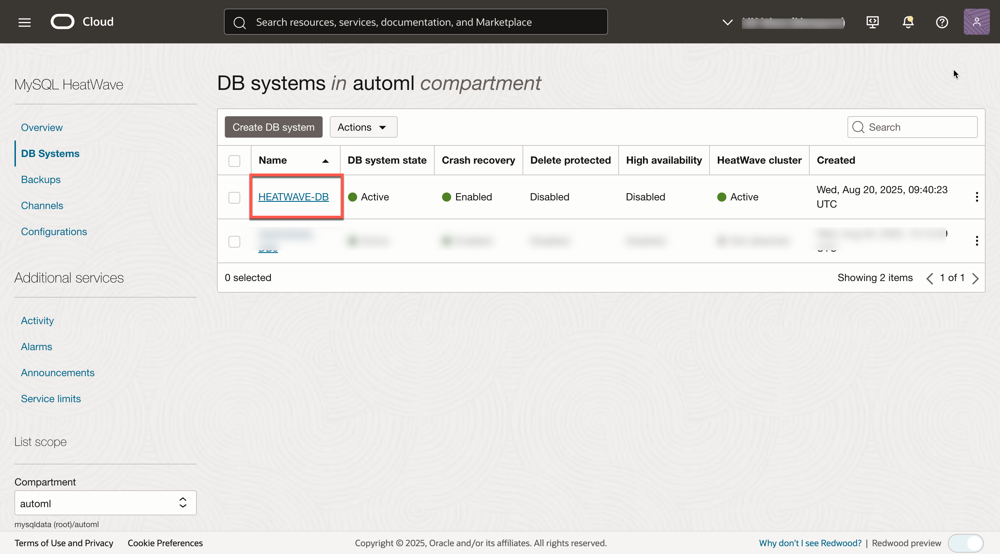
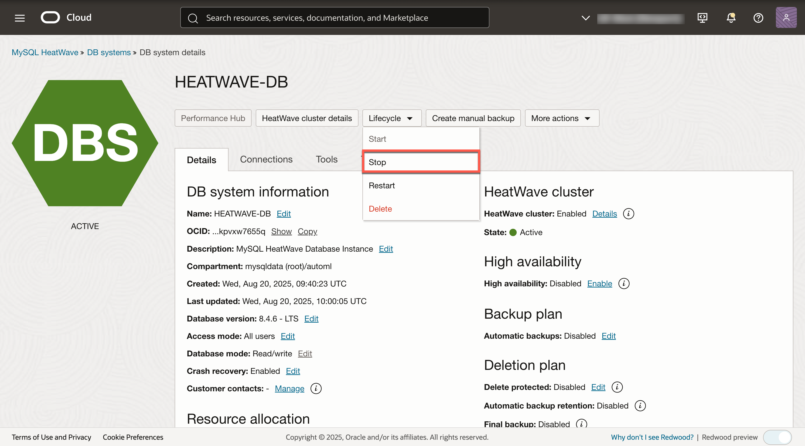
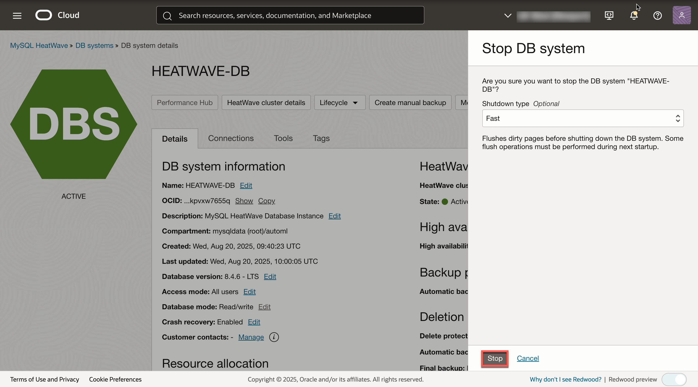
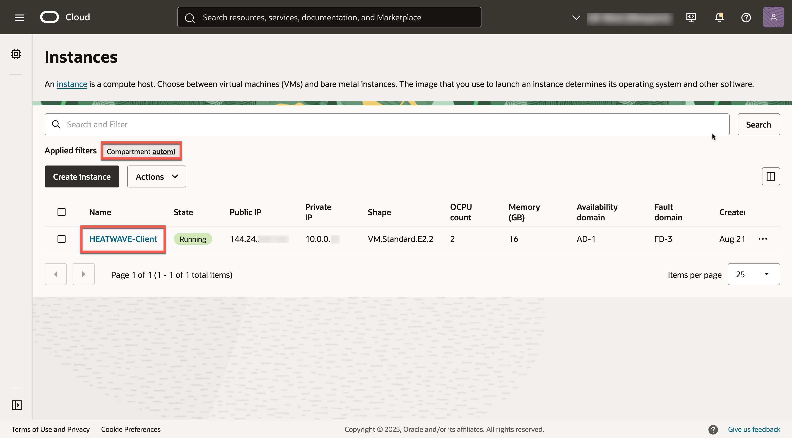
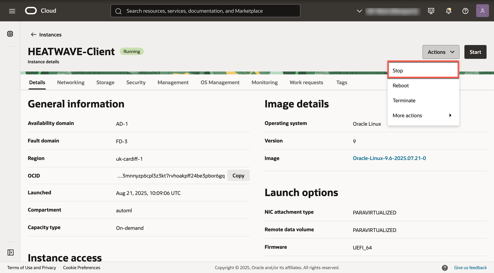
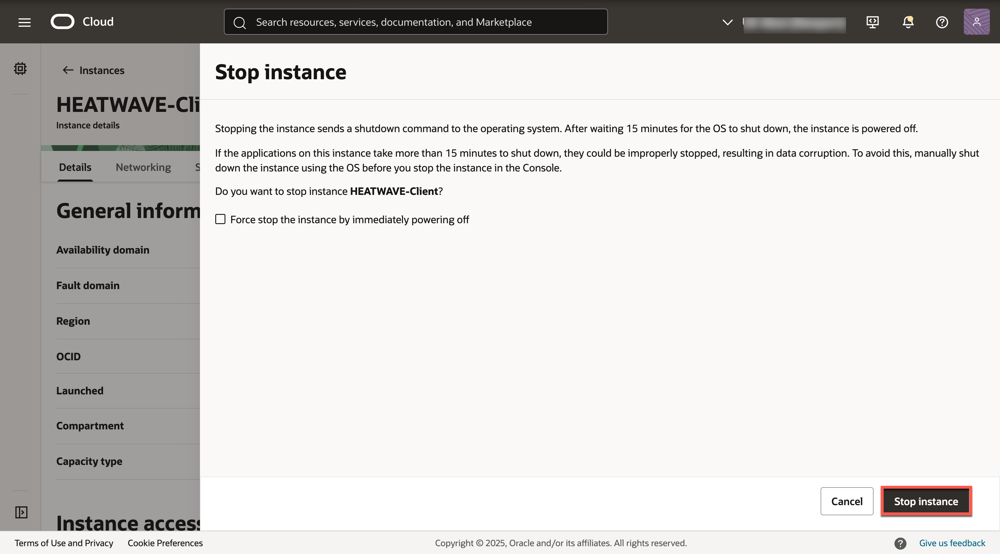

# Stop OCI Services

## Introduction

In this lab you will use the Console to Stop all of the Services you created in this Workshop.

_Estimated Time:_ 5 minutes

### Objectives

In this lab, you will be guided through the following task:

- Stop HeatWave Database Instance
- Stop Compute Instance

### Prerequisites

- An Oracle Trial or Paid Cloud Account
- Some Experience with MySQL Shell
- Completed Labs 1 and 5 

## Task 1: Stop HEATWAVE-DB Database Instance

1. Open the navigation menu  
    - Databases
    - MySQL
    - DB Systems
2. Choose the **automl** Compartment. A list of DB Systems is displayed.
    

3. In the displayed Instance Click **Stop**.
    

4. In the displayed **Stop DB system** dialog box, click the  **Stop** button.
    

## Task 2: Stop HEATWAVE-Client Compute Instance

1. Open the navigation menu  
    - Compute
    - Instances

2. Choose the **automl** Compartment. A list of Compute intances is displayed. In the list of Compute Instances, click the **HEATWAVE-Client** instance.
    

3. In the displayed Instance Click **Stop**.
    

4. In the displayed **Stop Instance** dialog box, click the  **Stop instance** button.
    

**Congratulations!  You have successfully finished the Workshop.**

## Learn More

- [Oracle Cloud Infrastructure MySQL Database Service Documentation](https://docs.cloud.oracle.com/en-us/iaas/MySQL-database)
- [MySQL Database Documentation](https://www.MySQL.com)

## Acknowledgements

- **Author** - Perside Foster, MySQL Principal Solution Engineering
- **Contributors** - Mandy Pang, MySQL Principal Product Manager,  Nick Mader, MySQL Global Channel Enablement & Strategy Manager
- **Last Updated By/Date** - Perside Foster, MySQL Solution Engineering, July 2023