# Create On-Prem MySQL System

## Introduction

In this lab, we will setup an on-prem environment in which we install a MySQL Server, MySQL Shell, and then lastly load a sample database into the on-prem MySQL Server

_Estimated Time:_ ? minutes

### Objectives

In this lab, you will be guided through the following tasks:

- How to set up an on-prem environment
- Install MySQL Community Edition
- Install MySQL Shell
- Load a sample database

### Prerequisites

- An Oracle Trial or Paid Cloud Account
- An environment where you can install/run a MySQL Server
- Some Experience with MySQL Shell

## Task 1: Set up an on-prem environment

**Note: if you already have an on-prem environment with MySQL installed and have data loaded, skip to Lab 2 Task 1.**

**But assuming you don't have an on-prem environment, start by following the below steps in order to set one up that looks like the image below which uses Oracle Linux 8 as it's OS. Oracle Linux is based on the RHEL.**
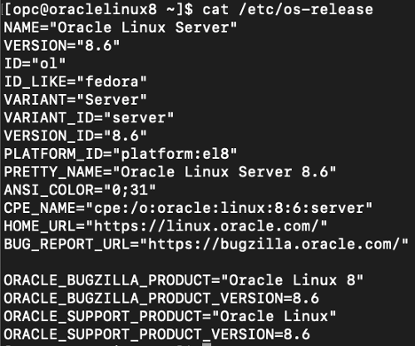

1. Login to Oracle Cloud (OCI), go to the Navigation or Hamburger menu again. Navigate to “Networking” and “Virtual Cloud Networks”

    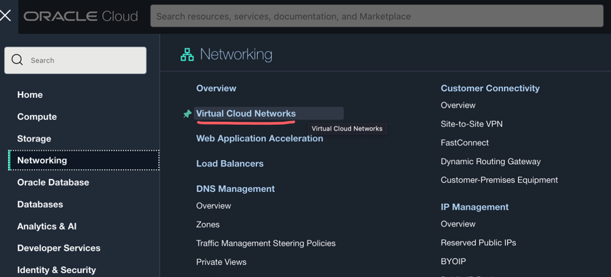

2. Once on the Virtual Cloud Networks page, click “Start VCN Wizard” and select “Create VCN with Internet Connectivity”

    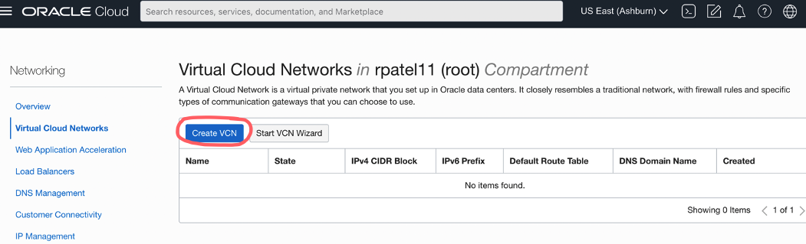

    

3. Name your VCN “MDS-VCN” while making sure you are in the correct Compartment. Leave everything as it is, and click “Next”
    ```bash
    <copy>MDS-VCN</copy>
    ```

    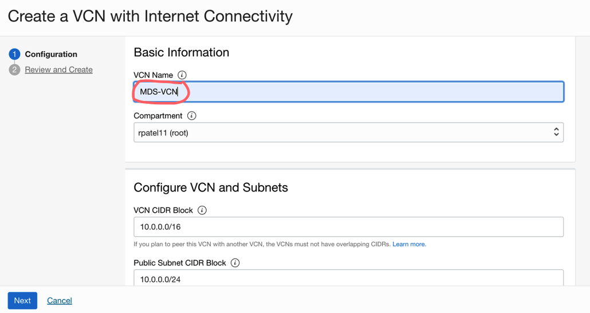

4. Review all the information and click “Create”

    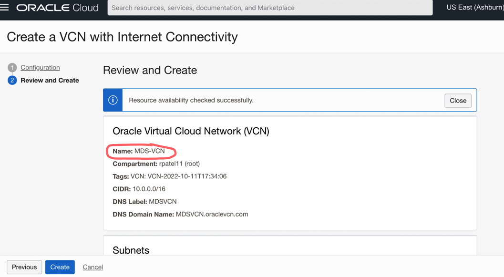

5. Once the VCN is created, click “View Virtual Cloud Network”

    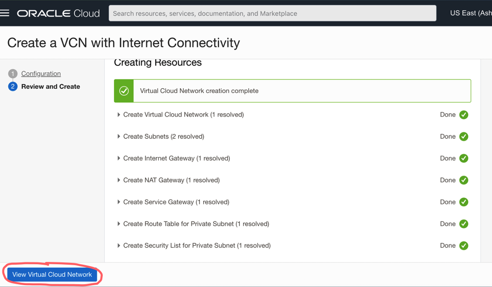

6. Once on the MDS-VCN page, under “Resources” click “Subnets” and go to the “Private-Subnet-MDS-VCN”

    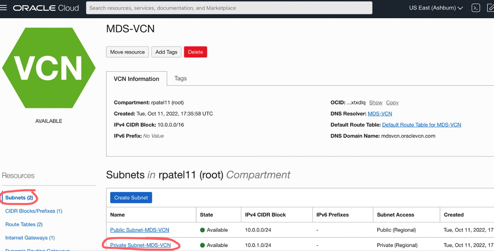

7. On the Private Subnet page, under “Security Lists”, click on “Security List for Private Subnet-MDS-VCN” and select “Add Ingress Rules”

    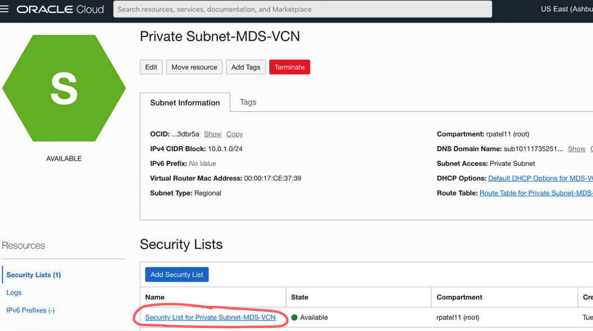

    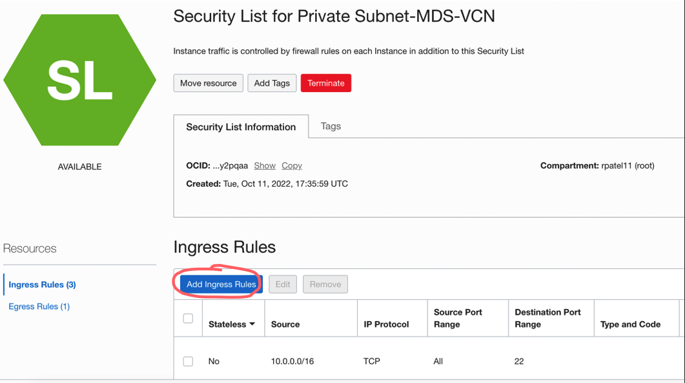

8. For the ‘Source CIDR’ enter “0.0.0.0/0”, select "TCP" for the 'IP Protocol' and for the Destination Port Range, enter “3306,33060”. In the ‘Description’ section, write “MySQL Port Access”
    ```bash
    <copy>0.0.0.0/0</copy>
    ```
    ```bash
    <copy>3306,33060</copy>
    ```

    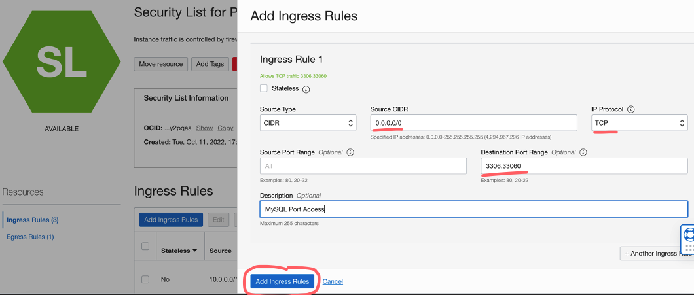

9. Inside Oracle Cloud, navigate to "Cloud Shell" under 'Developer tools' next to your Home Region

    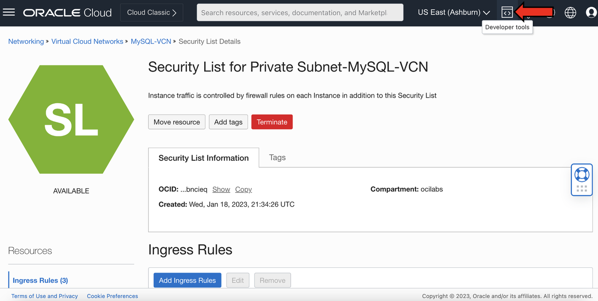

    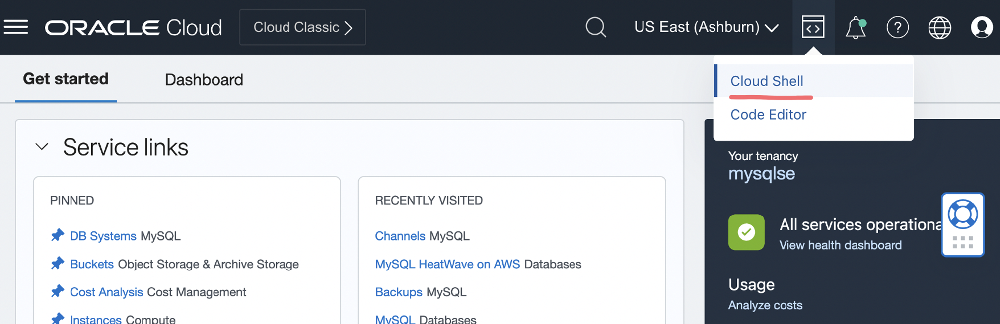

10. Once the Cloud Shell loads, it should look similar to this:

    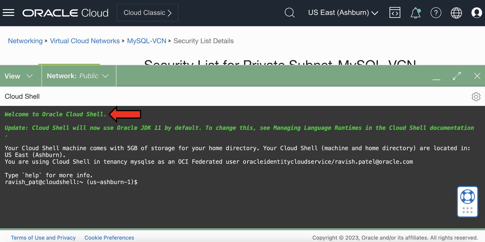

11. Inside your Cloud Shell, execute the command to create an SSH key-pair

    ```bash
    <copy>ssh-keygen -t rsa</copy>
    ```

    

    **Note:** keep pressing enter for each question. Here is what it should look like, your public and private SSH keys will be stored in a directory .ssh

    

12. Go to the .ssh directory and copy the contents of the id_rsa.pub file

    ```bash
    <copy>cd .ssh</copy>
    ```
    ```bash
    <copy>ls</copy>
    ```
    ```bash
    <copy>cat id_rsa.pub</copy>
    ```

    

13. Within Oracle Cloud, go to the Navigation or Hamburger menu and under Compute, select “Instances”

    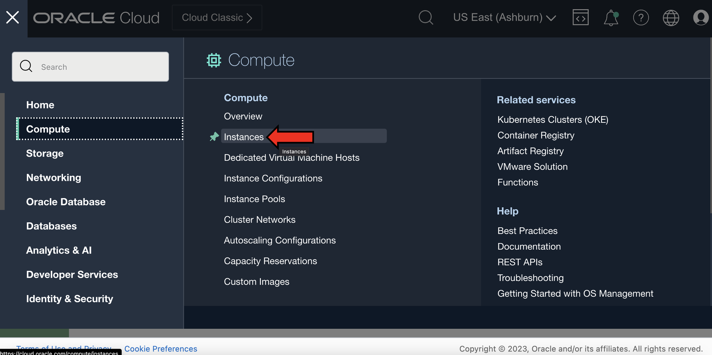

14. Make sure you are in the right compartment, and click “Create instance”

    

15. Name your compute instance “MDS-Compute”, leave everything default, and make sure the Public Subnet of your MDS-VCN is selected under the Networking section

    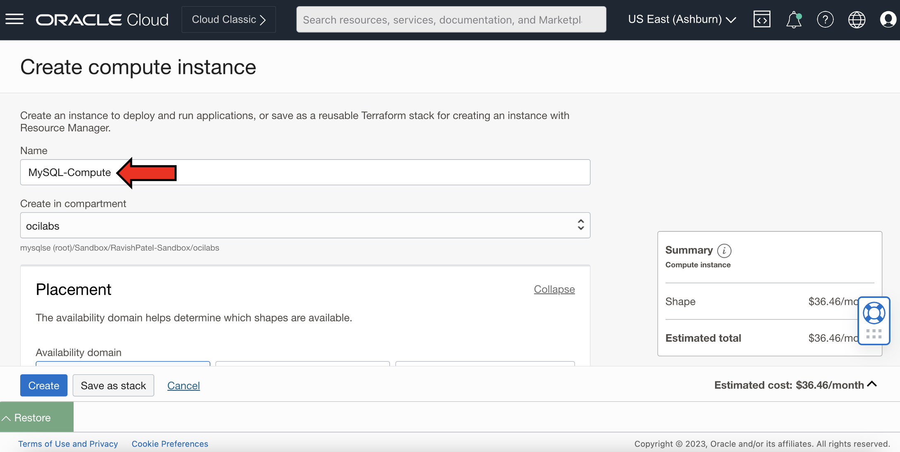

    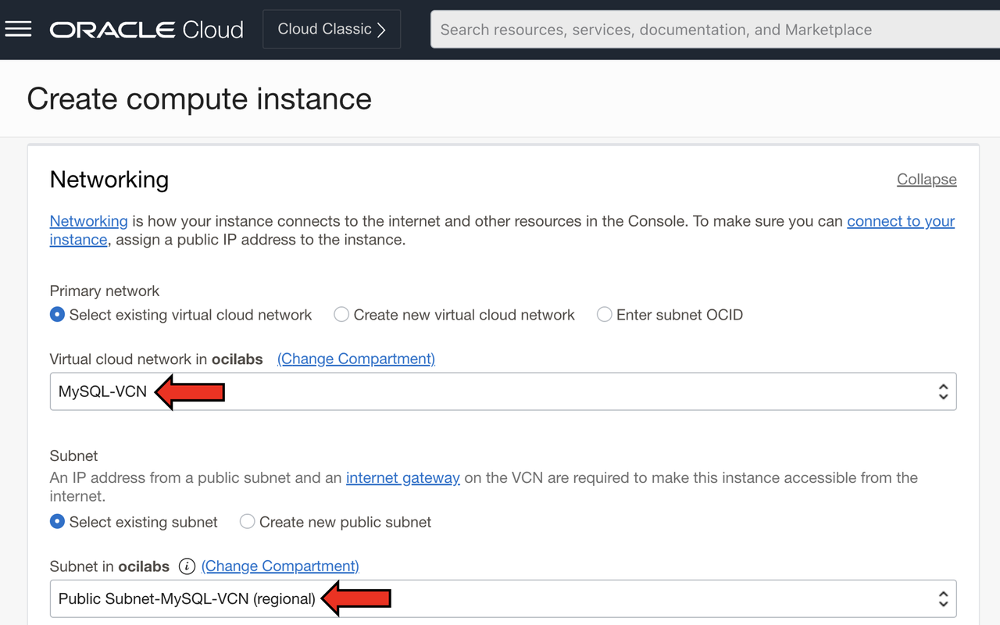

16. For the “Add SSH keys”, select “Paste public keys” and paste the contents of the id_rsa.pub file here

    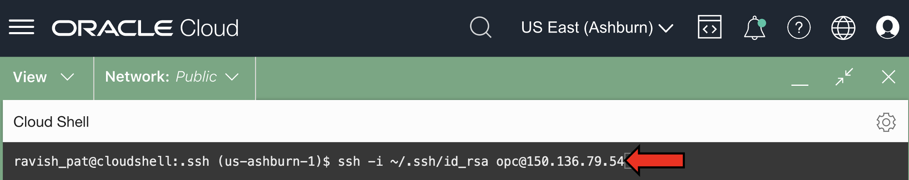

17. Click “Create” and your Virtual Machine will be ready in a few minutes

    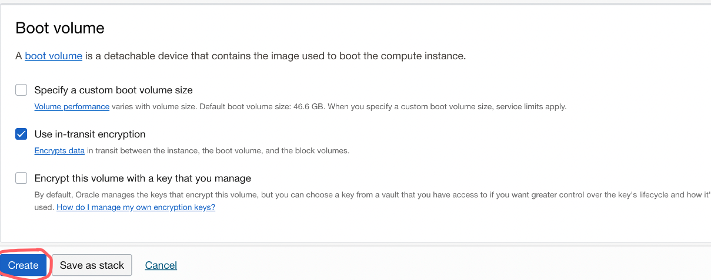

    

18. Once your VM or Compute Instance is ready, copy the Public IP address and open Cloud Shell. Perform the ssh command to login to your instance

    ```bash
    <copy>ssh -i ~/.ssh/id_rsa opc@<your_compute_instance_ip></copy>
    ```

    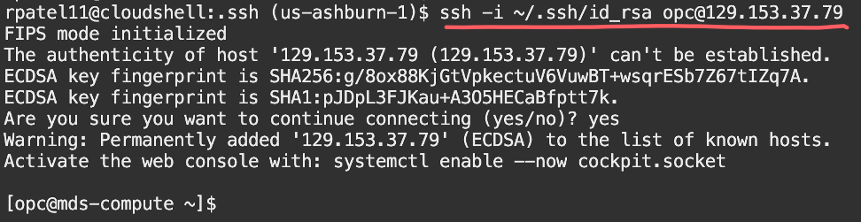

## Task 2: Install MySQL Community Edition in your on-prem environment

1. Once you have your system/environment ready and are logged in using SSH, download **MySQL Community Edition** on it
    ```bash
    <copy>sudo yum install mysql-server -y</copy>
    ```

    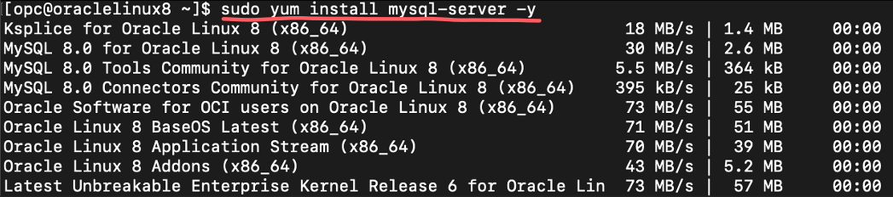

    **Note:** once your installation is complete, your screen should look similar to this

    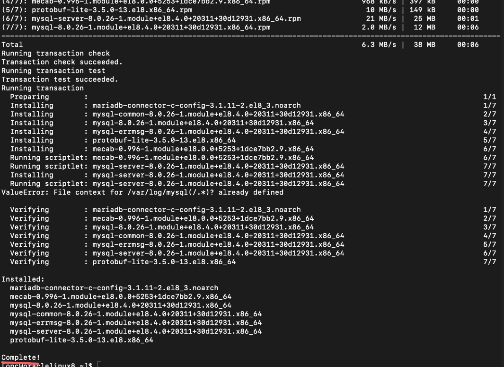

2. Start the MySQL server, find your mysqld.log file, grab the temporary password, and login to your MySQL environment

    ```bash
    <copy>sudo systemctl start mysqld</copy>
    ````
    ````bash
    <copy>sudo find / -iname mysqld.log</copy>
    ````
    ````bash
    <copy>grep 'temporary password' /var/log/mysql/mysqld.log</copy>
    ````
    ````bash
    <copy>mysql -u root -p<temporary-password></copy>
    ```

    **Note:** during my installation of the MySQL server, it created a root account without a password. Hence, I can just skip some the above steps and can login like so:
    ```bash
    <copy>sudo systemctl start mysqld</copy>
    ````
    ````bash
    <copy>mysql -uroot --skip-password</copy>
    ```

    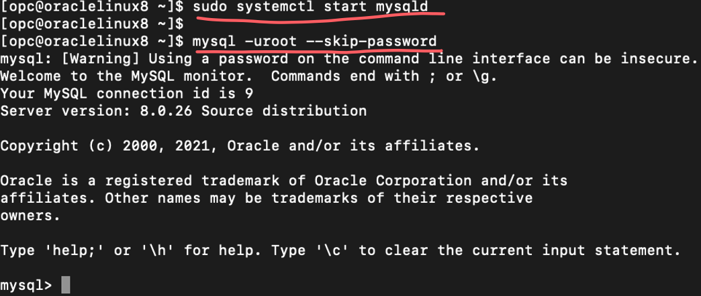

3. Change the root password

    ```bash
    <copy>ALTER USER 'root'@'localhost' IDENTIFIED BY 'pASsWordGoesHere';</copy>
    ```

    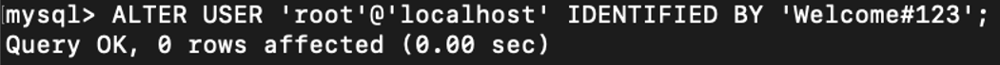

4. Exit MySQL and download MySQL Shell onto your on-prem environment

    ```bash
    <copy>exit</copy>
    ````
    ````bash
    <copy>sudo yum install mysql-shell -y</copy>
    ```

    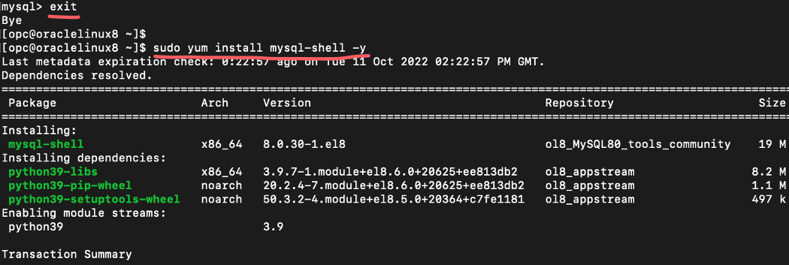

    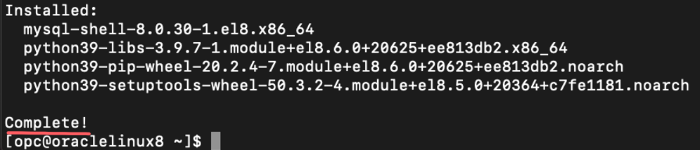

    **Note:** once you have MySQL Shell installed, you can login to your MySQL environment by either executing

    ```bash
    <copy>mysqlsh root@localhost</copy>
    ```

    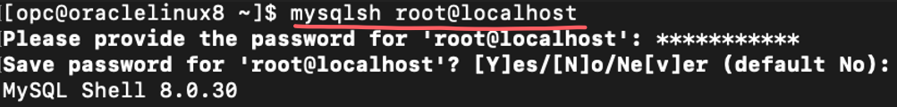

    -OR-

    ```bash
    <copy>mysqlsh</copy>
    <copy>\connect root@localhost</copy>
    ```

    

## Task 3: Load the sample database into the MySQL on-prem

1. Download the sample 'world' database, unzip the file, and load it into MySQL on-prem

    ```bash
    <copy>wget https://downloads.mysql.com/docs/world-db.zip</copy>
    ````
    ````bash
    <copy>unzip world-db.zip</copy>
    ````
    ````bash
    <copy>cd world-db</copy>
    ````
    ````bash
    <copy>mysql -u root -p < world.sql </copy>
    ```

    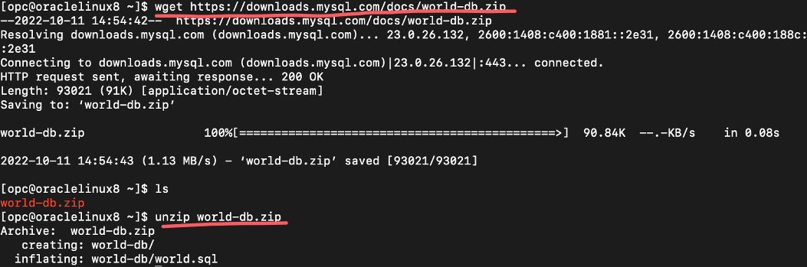

    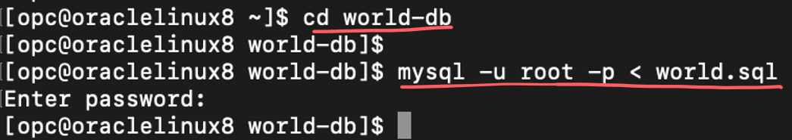

2. Login to your MySQL on-prem environment and check if the sample ‘world’ database was successfully loaded

    ```bash
    <copy>mysql -u root -p</copy>
    ````
    ````bash
    <copy>SHOW SCHEMAS;</copy>
    ````
    ````bash
    <copy>SHOW TABLES IN world;</copy>
    ```

    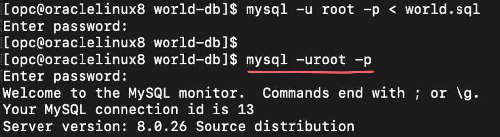

    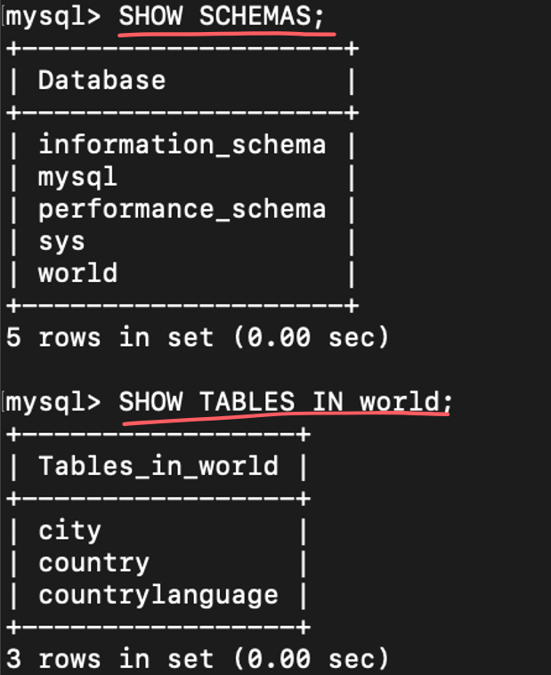

    This concludes this lab. You may now **proceed to the next lab.**

## Acknowledgements

- **Author** - Ravish Patel, MySQL Solution Engineering
- **Contributors** - Perside Foster, MySQL Solution Engineering
- **Last Updated By/Date** - Ravish Patel, MySQL Solution Engineering, November 2022
