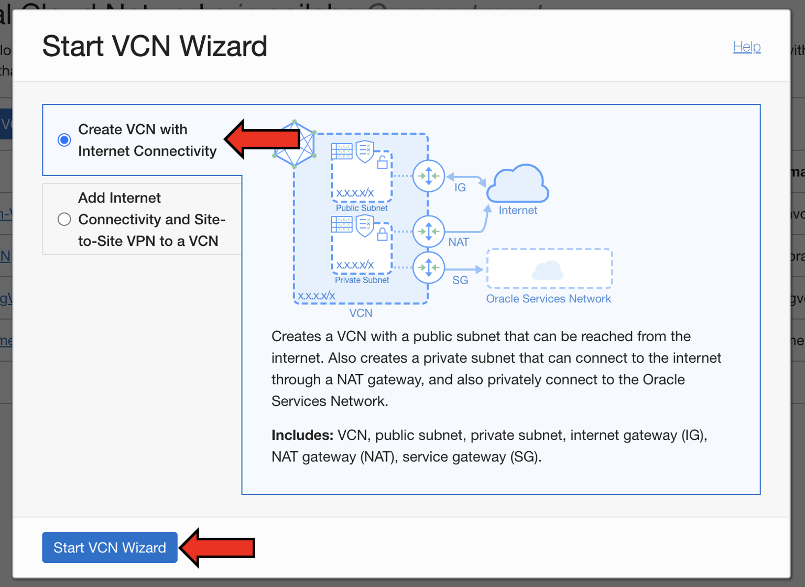
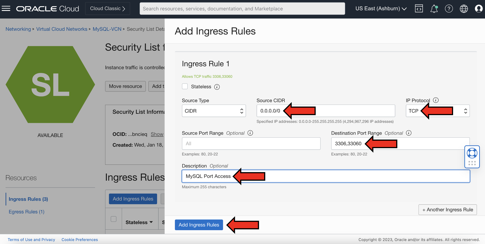

# Create an on-premise environment

## Introduction

In this lab, we will setup an on-prem environment in which we install a MySQL Server, MySQL Shell, and then lastly load a sample database into the on-prem MySQL Server.

_Estimated Time:_ 15 minutes

### Objectives

In this lab, you will be guided through the following tasks:

- Set up an on-prem environment
    - Create and configure Virtual Cloud Network (VCN) in OCI
    - Create SSH Key in OCI using Cloud Shell
    - Setup a Compute Instance
- Install MySQL Community Server and MySQL Shell
- Load a sample database into MySQL

### Prerequisites

- An Oracle Trial or Paid Cloud Account
- An environment where you can install/run a MySQL Server
- Some Experience with MySQL Shell

## Task 1: Create and configure Virtual Cloud Network (VCN) in OCI

1. Login to Oracle Cloud (OCI), click on the “Hamburger” menu on the top left. Navigate to “Networking” and “Virtual Cloud Networks”

    

    

2. Once on the Virtual Cloud Networks page, click “Start VCN Wizard” and select “Create VCN with Internet Connectivity”

    

    

3. Name your VCN “MySQL-VCN” while making sure you are in the correct Compartment. Leave everything as it is, and click “Next”

    ```bash
    <copy>MySQL-VCN</copy>
    ```

    

4. Review all the information and click “Create”

    

5. Once the VCN is created, click “View Virtual Cloud Network”

    

6. Once on the MySQL-VCN page, under “Resources” click “Subnets” and go to the “Private-Subnet-MySQL-VCN”

    

7. On the Private Subnet page, under “Security Lists”, click on “Security List for Private Subnet-MySQL-VCN” and select “Add Ingress Rules”

    

    

8. For the ‘Source CIDR’ enter “0.0.0.0/0”, select "TCP" for the 'IP Protocol' and for the Destination Port Range, enter “3306,33060”. In the ‘Description’ section, write “MySQL Port Access”

    ```bash
    <copy>0.0.0.0/0</copy>
    ```

    ```bash
    <copy>3306,33060</copy>
    ```

    ```bash
    <copy>MySQL Port Access</copy>
    ```

    

## Task 2: Create SSH Key in OCI using Cloud Shell

1. Inside Oracle Cloud, navigate to "Cloud Shell" under 'Developer tools' next to your Home Region

    

    

2. Once the Cloud Shell loads, it should look similar to this:

    

3. Inside your Cloud Shell, execute the command to create an SSH key-pair

    ```bash
    <copy>ssh-keygen -t rsa</copy>
    ```

    

    **Note:** keep pressing the enter/return key for each question. Here is what it should look like, your public and private SSH keys will be stored in a directory called .ssh

    

4. After your public/private rsa key pair has been created, go to the '.ssh' directory and copy the contents of the "id_rsa.pub" file

    ```bash
    <copy>cd .ssh</copy>
    ```

    ```bash
    <copy>ls</copy>
    ```

    ```bash
    <copy>cat id_rsa.pub</copy>
    ```

    

## Task 3: Setup a Compute Instance

1. Within Oracle Cloud, go to the Navigation or Hamburger menu and under Compute, select “Instances”

    

2. Make sure you are in the right compartment, and click “Create instance”

    

3. Name your compute instance "MySQL-Compute". For Placement, leave it at default. For Image and Shape, make sure "Oracle Linux 8" is selected and choose an appropriate Shape that fits your needs. Under Networking, make sure the Public Subnet of your MySQL-VCN is selected

    ```bash
    <copy>MySQL-Compute</copy>
    ```

    

    

    

4. Lastly for the 'Add SSH keys', select "Paste public keys" and paste the contents of the id_rsa.pub file here that we copied in Step 4 of Lab 1 Task 2. After pasting your public key, leave everything default and click "Create"

    

5. Your Compute instance will be ready in a few minutes. Copy the Public IP address of your Compute instance afterwards.

    

6. After copying the Public IP of your Compute, open/restore Cloud Shell. Once Cloud Shell loads, perform the ssh command to connect to your Compute instance

    ```bash
    <copy>ssh -i ~/.ssh/id_rsa opc@<your_compute_instance_ip></copy>
    ```

    

## Task 4: Install MySQL Community Edition in your on-prem environment

1. Once you have your on-premise environment/Compute instance ready and are connected to it, download **MySQL Community Edition** on the Compute instance by executing

    ```bash
    <copy>sudo yum install mysql-server -y</copy>
    ```

    

    **Note:** MySQL Community Server can also be downloaded by visiting this website: <https://dev.mysql.com/downloads/mysql/>

2. Start the MySQL server after it has been successfully installed onto your Compute instance. Once the server starts, login to MySQL:

    ```bash
    <copy>sudo systemctl start mysqld</copy>
    ```

    ```bash
    <copy>mysql -uroot --skip-password</copy>
    ```

    

    **Note:** during the installation of the MySQL server, it created a root account without a password. Therefore we have explicitly specified that there is no password and that the client program should not prompt for one, by providing the --skip-password option.

3. Change the root password

    ```bash
    <copy>ALTER USER 'root'@'localhost' IDENTIFIED BY 'pASsWordGoesHere';</copy>
    ```

    

    **Note:** after changing your root password, make a note of it or save it. This will be used later.

4. Exit MySQL and download MySQL Shell onto your on-prem environment

    ```bash
    <copy>exit</copy>
    ````

    ````bash
    <copy>sudo yum install mysql-shell -y</copy>
    ```

    

    **Note:** MySQL Shell can also be downloaded by visiting this website: https://dev.mysql.com/downloads/shell/

5. Once MySQL Shell is installed on your on-premise environment/Compute, you can login to your MySQL Server by either executing

    ```bash
    <copy>mysqlsh root@localhost</copy>
    ```

    

    -OR-

    ```bash
    <copy>mysqlsh -uroot -p</copy>
    ```

    

## Task 5: Load the sample database into the MySQL on-prem

1. Exit out of your MySQL Server. Download the sample 'world' database onto your Compute instance, unzip the file, and load it onto your on-prem MySQL Server

    ```bash
    <copy>\q</copy>
    ````

    ```bash
    <copy>wget https://downloads.mysql.com/docs/world-db.zip</copy>
    ```

    ```bash
    <copy>unzip world-db.zip</copy>
    ```

    ```bash
    <copy>cd world-db</copy>
    ```

    ```bash
    <copy>mysql -u root -p < world.sql </copy>
    ```

    

    

    **Note:** additional sample MySQL databases can be found here: https://dev.mysql.com/doc/index-other.html

2. Login to your MySQL on-prem environment using MySQL Shell and check if the sample ‘world’ database was successfully loaded

    ```bash
    <copy>mysqlsh root@localhost</copy>
    ```

    ```bash
    <copy>\sql</copy>
    ```

    ```bash
    <copy>SHOW SCHEMAS;</copy>
    ```

    ```bash
    <copy>SHOW TABLES IN world;</copy>
    ```

    

    

    **Note:** exit MySQL Shell and minimize Cloud Shell afterwards.

    This concludes this lab. You may now **proceed to the next lab.**

## Acknowledgements

- **Author** - Ravish Patel, MySQL Solution Engineering
- **Contributors** - Perside Foster, MySQL Solution Engineering
- **Last Updated By/Date** - Ravish Patel, MySQL Solution Engineering, November 2022
