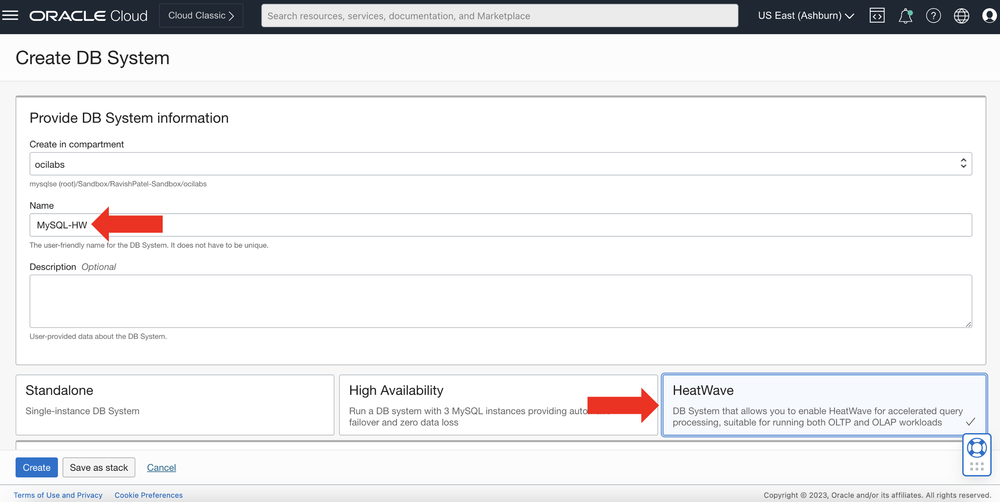
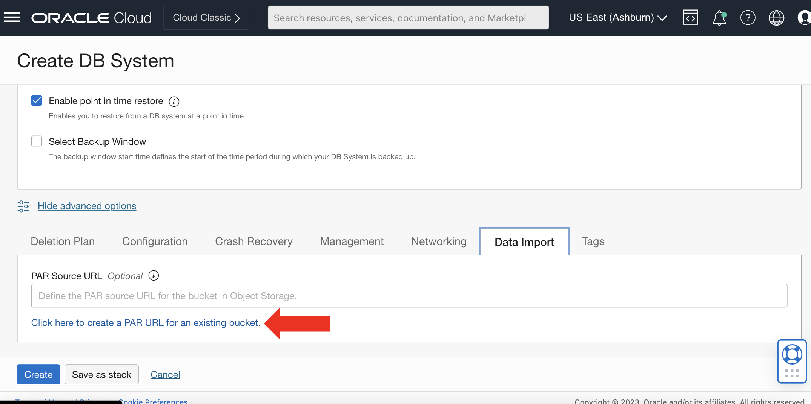
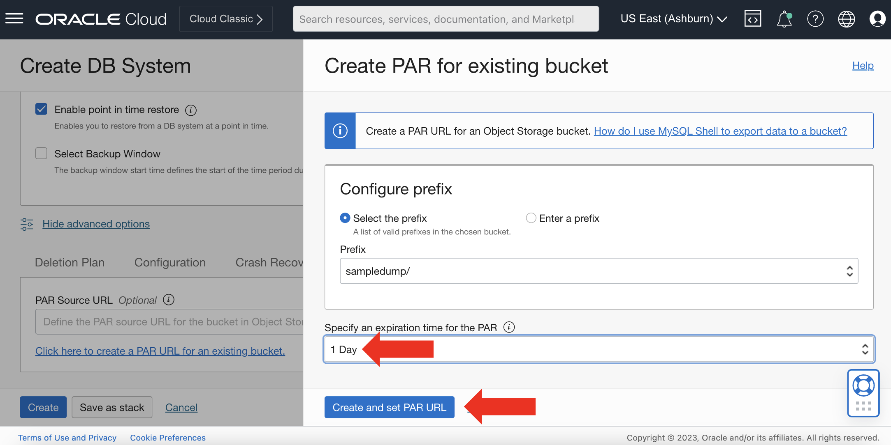

# Create a MySQL HeatWave System

## Introduction

In this lab, we will be creating our first MySQL HeatWave System inside Oracle Cloud. While creating the MySQL HeatWave system, we need to create a PAR URL. The PAR URL will allow us to load the Object Storage bucket data into MySQL HeatWave, while the system is creating.

_Estimated Time:_ 25 minutes

### Objectives

In this lab, you will be guided through the following task:

- Provision a MySQL HeatWave System
- Load data into MySQL HeatWave

### Prerequisites

- An Oracle Trial or Paid Cloud Account
- Some Experience with MySQL Shell
- Completed Lab 2

## Task 1: Set up an OCI MySQL HeatWave system

1. Once the all the dump files have successfully been exported to Object Storage Bucket, in OCI click on the “Hamburger” menu and go to “Databases” > “MySQL”

    

2. After you have landed on the ‘DB Systems’ page, ensure you have the correct Compartment selected and click “Create DB System”

    

3. Name your MySQL Database System “MySQL-HW” and select the “HeatWave” offering
    ```bash
    <copy>MySQL-HW</copy>
    ```

    

4. Next, create your admin credentials for the MySQL HeatWave system that is being created. Afterwards under “Configure networking”, make sure the “MySQL-VCN” is selected and the Subnet is “Private Subnet”

    

5. Leave the rest as it is and lastly click on "Show advanced options" under the “Configure Backup Plan” section. After clicking "Show advanced options", click on the "Networking" tab. Under "Hostname", enter the name of your MySQL Database System.

    

    

6. Afterwards, click on the "Data Import" tab

    

7. Once you are on the 'Data Import' tab, click on the "Click here to create a PAR URL" link.

    

8. After clicking the above link, another screen will appear where you will select the "MySQL-Bucket" bucket from the drop down list, that we created in Lab 2.

    

    

9. Once you have selected the appropriate bucket where the data was dumped, adjust the PAR expiration according to your needs. Then, simply click "Create and set PAR URL". Afterwards, your screen should look something similar to below:

    

    

     **Note:** click "Create" as shown in the above image, once your 'PAR Source URL' has been populated.

10. After clicking "Create" in the previous Step, your MySQL HeatWave System will start provisioning and will have the data pre-loaded that we dumped from our on-premise environment into Object Storage bucket, once the HeatWave System is in an "ACTIVE" status.

    

    **Note:** it may take MySQL HeatWave a few minutes to be in an "ACTIVE" state

11. Once your MySQL DB System is 'ACTIVE', a “Private IP Address” will be allocated to it, find and copy it. You can find this Private IP under “DB System Information” > “Endpoint” section on the “DB System Details” page

    

    **Note:** you can navigate to the “DB System Details” page by going to the “Hamburger” menu in OCI. “Databases” > “MySQL” > “DB Systems”. Click on the name of your MySQL DB System to open the “DB System Details” page.

12. Copy the Private IP Address in the previous Step. You can now login to your MySQL DB System using MySQL Shell from your Compute. Execute

    ```bash
    <copy>mysqlsh <username>@<private-mysql-ip></copy>
    ```

    -OR-

    ```bash
    <copy>mysqlsh -u <username> -h <private-mysql-ip> -P <portnumber> -p</copy>
    ```

This concludes this lab. You may now **proceed to the next lab.**

## Acknowledgements

- **Author** - Ravish Patel, MySQL Solution Engineering

- **Contributors** - Perside Foster, MySQL Solution Engineering

- **Last Updated By/Date** - Ravish Patel, MySQL Solution Engineering, November 2022
