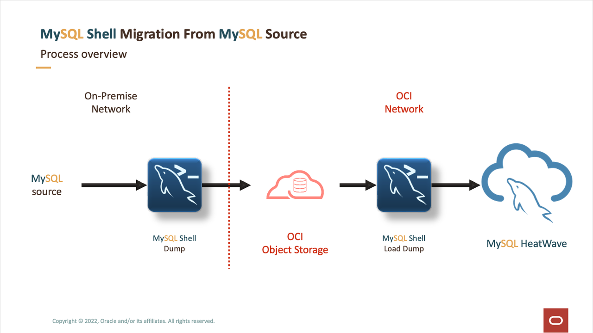

# Introduction

Welcome to "Migrate From On-Premises to MySQL HeatWave" workshop. The purpose of this LiveLab is to show you, how easy it is to migrate your data into MySQL HeatWave if you are coming from an on-prem environment.

MySQL HeatWave Introduction:

## About this Workshop

The process in order to migrate your on-prem data into MySQL HeatWave is fairly easy, and that is what this workshop will demonstrate.

Whether you are running a MySQL Community/Standard/Enterprise Edition, MariaDB, Percona, or a MySQL instance deployed on an AWS EC2/Compute - just using MySQL Shell and an Oracle Cloud Infrastructure account, you can securely dump all your on-prem data into OCI Object Storage Bucket. Once your data is uploaded into an Object Storage bucket, we can then securely load all that dumped data, into a MySQL HeatWave while the database is creating.

If you follow each Lab associated with this workshop thoroughly, all of the above steps that are mentioned will be covered in more detail.

***Here is what the visual representation of the whole migration process looks like:***

**To learn more about the following topics, click on them:**
- [What is MySQL?] (https://dev.mysql.com/doc/refman/8.0/en/what-is-mysql.html)
- [What is MySQL Shell?] (https://dev.mysql.com/doc/mysql-shell/8.0/en/)
- [What is MySQL HeatWave?] (https://dev.mysql.com/doc/heatwave/en/heatwave-introduction.html)
- [What is Oracle Cloud Infrastructure?] (https://www.oracle.com/cloud/)
- [What is a Virtual Cloud Network (VCN)?] (https://www.oracle.com/cloud/networking/virtual-cloud-network/)
- [What is a Compute Instance?] (https://www.oracle.com/cloud/compute/)
- [What is a Configuration File?] (https://docs.oracle.com/en-us/iaas/Content/API/Concepts/sdkconfig.htm)
- [How to get the MySQL sample database?] (https://dev.mysql.com/doc/index-other.html)

_Estimated Time:_ 1.15 hours

### Objectives

In this lab, you will learn how to:

- Create and configure Virtual Cloud Network (VCN) in OCI
- Create SSH Key in OCI using Cloud Shell
- Setup a Compute Instance
- Install MySQL Community Server and MySQL Shell
- Load a sample database into MySQL
- Add an API Key in Oracle Cloud Infrastructure (OCI) and setup the 'config' file
- Create Object Storage Bucket in OCI
- Perform MySQL Shell dump
- Provision MySQL HeatWave System with a HeatWave cluster and load the data
- Connect to MySQL HeatWave System and confirm data import
- Load data into HeatWave cluster

### Prerequisites

- An Oracle Cloud Account
- Some Experience with MySQL Shell - [MySQL shell] (https://dev.MySQL.com/doc/MySQL-shell/8.0/en/)

## Task 1: You may now **proceed to the next lab**

## Acknowledgements

- **Author** - Ravish Patel, MySQL Solution Engineering

- **Contributors** - Perside Foster, MySQL Solution Engineering

- **Last Updated By/Date** - Ravish Patel, MySQL Solution Engineering, June 2023
