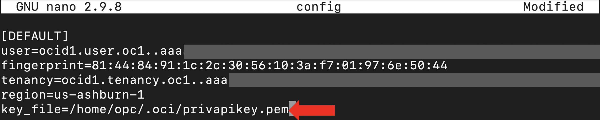
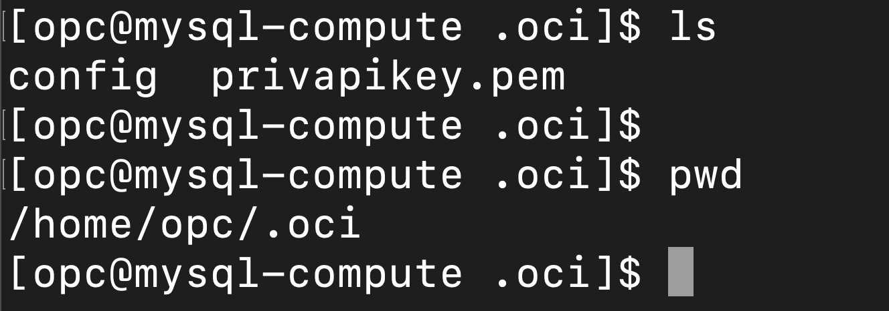
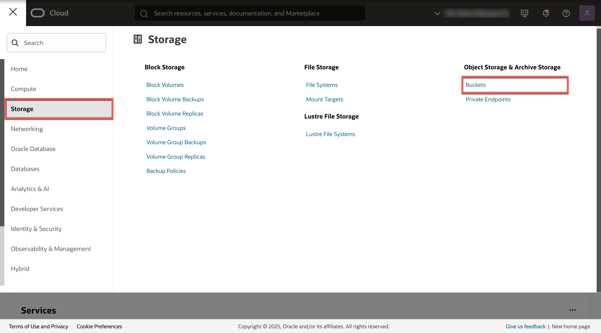
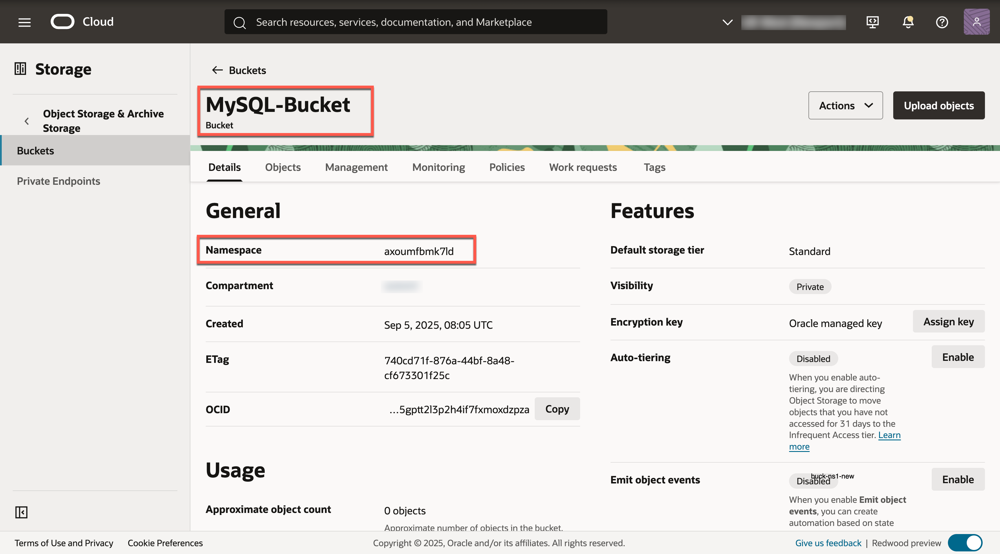
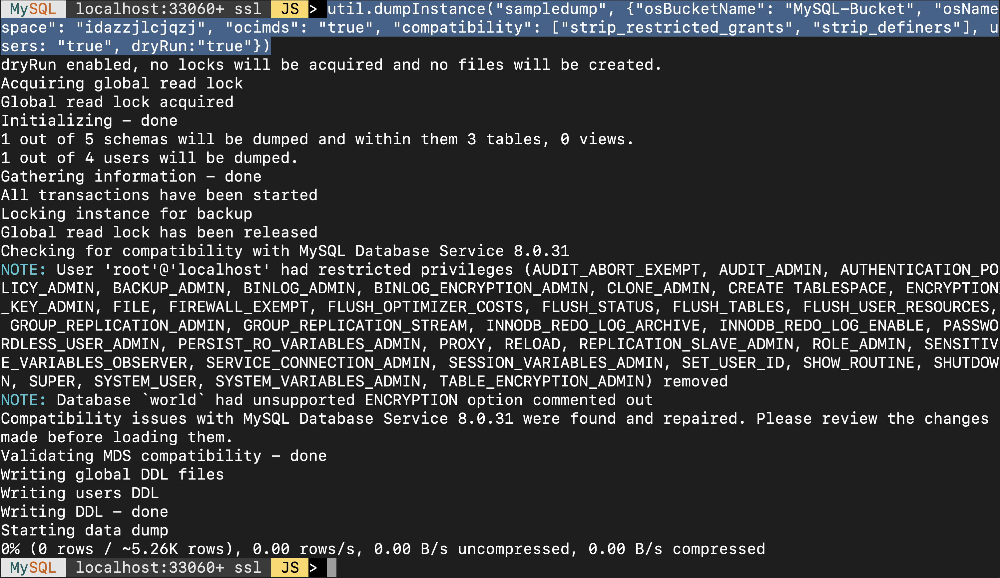
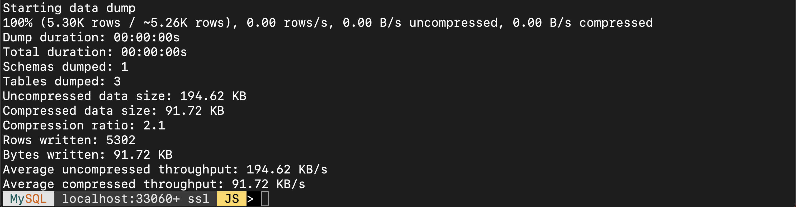

# Perform the MySQL Shell dump from on-premise MySQL

## Introduction

In this lab, we will go to OCI where we will create an API Key. Once we have our API Key, we then need to create a 'config' file so that MySQL Shell can access our Oracle Cloud Account to dump the data into Object Storage bucket. After the adding your API Key and creating a bucket on OCI, we then connect to the MySQL on-premise instance via MySQL Shell and perform the util.dumpInstance() utility. The util.dumpInstance() utility will take a dump of all the databases except “mysql, sys, performance schema, and information schema”. The dump comprises of DDL files for the schema structure and tab-separated .tsv files containing the actual data.

_Estimated Lab Time:_ 10 minutes

### Objectives

In this lab, you will be guided through the following tasks:

- Add an API Key in Oracle Cloud Infrastructure (OCI) and setup the 'config' file
- Create Object Storage Bucket in OCI
- Perform MySQL Shell dump

### Prerequisites

- An Oracle Trial or Paid Cloud Account
- Some Experience with MySQL Shell
- Must Complete Lab 1

## Task 1: On OCI "Add API Key"

1. Sign in to your Oracle Cloud account to set up the API Key along with the config file. Navigate to the 'Profile' icon on the top-right once on the homepage of Oracle Cloud. From there, click either on the "first link" or click on "User settings"

    

    

    You should be on the below "Details" page, once finished with the previous step

    

2. Open the "Tokens and keys" tab, and click “Add API key”

    

3. When you click on "Add API key", the "Add API key" pane appears. On that pane, select "Generate API key pair" and download both the “Private Key” and “Public Key”. Then, click “Add”

    

4. After you add the API key, the “Configuration file preview” pane appears. Copy the contents of the file, save it in a notepad, and then click 'Close' to exit out of the Configuration file preview

    

## Task 2: Setup the "config" file in the Compute/on-prem

1. Login to your Compute/on-prem instance and paste the 'Configuration File Preview' contents in a ".oci" directory, into your on-prem environment/Compute instance

    ```bash
    <copy>cd</copy>
    ```
    ```bash
    <copy>mkdir ~/.oci</copy>
    ```
    ```bash
    <copy>cd .oci</copy>
    ```
    ```bash
    <copy>nano config</copy>
    ```

    

    

2. Once you have pasted the “Configuration File Preview” snippet into the “config” file, you will need to adjust the parameter where it says “key_file” with the file path to your own OCI Private API Key. Look at an example below:

    

    **Note:** If you need help uploading your Private API Key onto your on-premise environment/Compute instance, continue following the guide. (If you have already uploaded your API Key and have updated the “key_file” parameter for your “config” file, skip to the next Task)

3. After your new API Keys have successfully been added on OCI and you have created the “config” file on your on-premise environment/Compute instance, open your Private API Key in a text editor of your choice. The Private API Key will be the file without the word “public” in the file name. (You should have downloaded both the Private and Public API Keys in Lab 2 Task 1.3)

    

4. Once you have opened your Private API Key in a text editor, copy the contents of the entire file like shown below:

    

5. After copying the contents, go back to your on-premise environment/Compute instance where you have created the “config” file and have MySQL Shell installed (in our case, the Oracle Linux server). Make sure you are in your .oci directory and create a new file there called "privapikey.pem", for example. This guide used the “nano” text editor to create the "privapikey.pem" file on the on-premise environment. Choose a text editor of your own choice.

    ```bash
    <copy>pwd</copy>
    ```
    ```bash
    <copy>nano privapikey.pem</copy>
    ```

    

6. Once the privapikey.pem file opens up, paste the contents of the OCI Private API Key that we copied in Lab 2 Task 2.4, into this newly created privapikey.pem file. Save and close the file afterwards.

    

7. After you have saved the Private API Key on your on-premise environment, grab the file path of the privapikey.pem and adjust the “key_file” parameter in the '.oci/config' file. To get the file path of your current working directory where you have the privapikey.pem, execute:

    ```bash
    <copy>ls</copy>
    ```
    ```bash
    <copy>pwd</copy>
    ```

    

    **Note:** by looking at the above image, the 'privapikey.pem' location for this guide will hence be "/home/opc/.oci/privapikey.pem". Go to your '.oci' directory and adjust your 'config' file accordingly

    

8. Save and close the 'config' file after you have adjusted its “key_file” parameter.

## Task 3: Set up Object Storage in OCI and note down "Bucket Name" and "Namespace"

1. Once you are all done with setting up the '.oci/config' file, navigate back to Oracle Cloud and create an Object Storage Bucket. On the homepage of Oracle Cloud, go to the ‘hamburger’ menu or the ‘navigation’ menu on top left. Navigate to ‘Storage’ and select "Buckets" under 'Object Storage & Archive Storage'

    

    

2. Once on the Buckets page, make sure you have the right Compartment selected. Afterwards, click “Create Bucket”

    

3. Name the bucket “MySQL-Bucket”, keep the ‘Default Storage Tier’ to “Standard” and click Create

    ```bash
    <copy>MySQL-Bucket</copy>
    ```

    

4. Click on the Bucket Name and note down the “Bucket Name” as well as “Namespace” which can be found under ‘Bucket Information’

    

## Task 4: Perform the MySQL Shell Dump

1. Once the bucket is created in OCI, we are ready to move our data from on-premise environment/Compute instance to Oracle Cloud Object Storage bucket. Navigate back to your on-premise environment, and login to your MySQL server using MySQL Shell

    ```bash
    <copy>mysqlsh root@localhost</copy>
    ```

    

    -OR-

    ```bash
    <copy>mysqlsh -uroot -p</copy>
    ```

    

2. Make sure you are in ‘JavaScript’ mode of MySQL Shell by executing “\js” and perform the command “util.dumpInstance()” to export the dump data into Oracle Cloud Object Storage bucket. The util.dumpInstance() command will take a dump of all the databases except “mysql, sys, performance schema, and information schema”. The dump comprises of DDL files for the schema structure and tab-seperated .tsv files containing the actual data. Additionally, you can also use “util.dumpSchemas()” or “util.dumpTables()” if you only want to dump specific schemas or tables

    ```bash
    <copy>\js</copy>
    ```
    ```bash
    <copy>util.dumpInstance("sampledump", {"osBucketName": "MySQL-Bucket", "osNamespace": "idazzjlcjqzj", "ocimds": "true", "compatibility": ["force_innodb", "strip_restricted_grants", "strip_definers", "create_invisible_pks", "skip_invalid_accounts"], users: "true", dryRun:"true"})</copy>
    ```

    

    **Note:** “sampledump” is the prefix under which all our dump files will be stored in Object Storage. **Change the ‘osBucketName’ and ‘osNamespace’ to match with what you have.** “ocimds”: “true” option ensures compatibility of the dump with MySQL Database Service/HeatWave. To understand the dumpInstance(), dumpSchemas(), or dumpTables() utility in more detail, refer to the below website:

    [https://dev.mysql.com/doc/mysql-shell/8.0/en/mysql-shell-utilities-dump-instance-schema.html] (https://dev.mysql.com/doc/mysql-shell/8.0/en/mysql-shell-utilities-dump-instance-schema.html)

3. Once you are done with the previous step, execute the same “util.dumpInstance()” command again but this time, change the “dryRun” option to “false”. (When dryRun is set to true, it will not perform the actual dump but instead, displays information on what would be dumped and performs compatibility checks)

    ```bash
    <copy>util.dumpInstance("sampledump", {"osBucketName": "MySQL-Bucket", "osNamespace": "idazzjlcjqzj", "ocimds": "true", "compatibility": ["force_innodb", "strip_restricted_grants", "strip_definers", "create_invisible_pks", "skip_invalid_accounts"], users: "true", dryRun:"false"})</copy>
    ```

    
    

4. Once the dump is complete, navigate back to Oracle Cloud and to the Object Storage bucket we created earlier (MySQL-Bucket). Check to see if you see your files under “sampledump” from the util.dumpInstance()

    

This concludes this lab. You may now **proceed to the next lab.**

## Acknowledgements

- **Author** - Ravish Patel, MySQL Solution Engineering
- **Contributor** - Perside Foster, MySQL Solution Engineering
- **Last Updated By/Date** - Ravish Patel, June 2023
