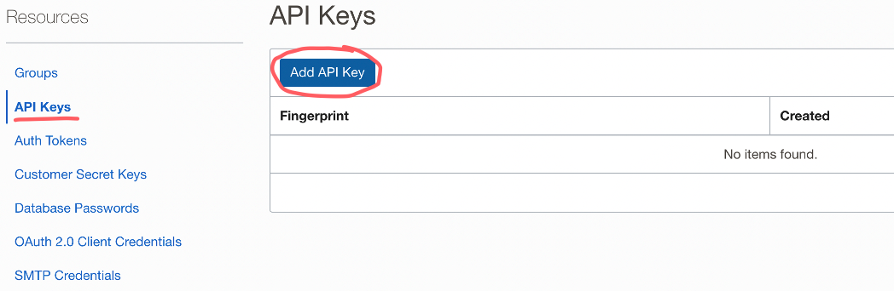
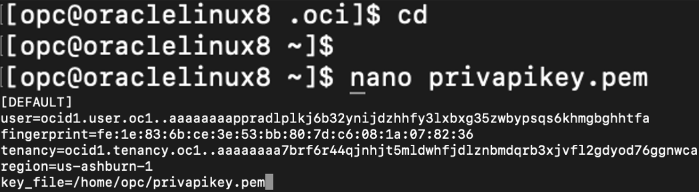

# Perform the MySQL Shell Dump from On-Prem

## Introduction

In this lab, we will go to Oracle Cloud where we will create an API Key. Once we have our API Key, we then need to create a 'config' file so that MySQL Shell can access our Oracle Cloud Account to dump the data. But before dumping the data, there is one more thing we need to take care of which is to create an Object Storage Bucket to hold all of our files that will be generated during the dump command

_Estimated Lab Time:_ ? minutes

### Objectives

In this lab, you will be guided through the following tasks:

- Add API Key in OCI
- Create a config file
- Setup Object Storage Bucket in OCI
- Perform the MySQL Shell Dump

### Prerequisites

- An Oracle Trial or Paid Cloud Account
- Some Experience with MySQL Shell
- Must Complete Lab 1

## Task 1: On OCI "Add API Key" and setup the ".oci/config" file in the Compute/on-prem

1. Sign in to your Oracle Cloud account (if you haven’t, try it for free: https://www.oracle.com/cloud/free/) and set up the API Key along with the config file. Navigate to the ‘Profile’ icon, once on the homepage of Oracle Cloud and click on the User

    

    **Note:** you should be on this page, once finished with the previous step

    

2. Scroll down on that same page until you see the ‘Resources’ section on the left. Click “API Keys” and “Add API Key”

    

    

3. Select ‘Generate API Key Pair’ and download both the “Private Key” and “Public Key”. Afterwards, click “Add”

    

4. Once you ‘Add’ the API Key, a pop will appear saying “Configuration File Preview”. Copy the contents of the file and paste the file into your on-prem environment (For e.g. I will be using my Oracle Linux 8 environment from the previous steps)

    

    ```bash
    <copy>cd</copy>
    ```
    ```bash
    <copy>mkdir .oci</copy>
    ```
    ```bash
    <copy>cd .oci</copy>
    ```
    ```bash
    <copy>nano config</copy>
    ```

    

    

    **Note:** you will need to add your ‘Private API Key’ path where it says "key _ file". This is how I did it; navigate back to your home directory and create a file called “privapikey.pem” and paste the contents of the Private API Key into the “privapikey.pem” file. Retieve the path of the .pem key and update the .oci/config file "key _ file"

    ```bash
    <copy>cd</copy>
    ```
    ```bash
    <copy>nano privapikey.pem</copy>
    ```

    

## Task 2: Set up Object Storage in OCI and note down "Bucket Name" and "Namespace"

1. Once you are all done with setting up the .oci/config file, navigate back to Oracle Cloud and create an Object Storage Bucket. On the homepage of Oracle Cloud, go to the ‘hamburger’ menu or the ‘navigation’ menu on top left

2. Go to ‘Storage’ and select ‘Buckets’ under Object Storage & Archive Storage

    

3. Once on the Buckets page, make sure you have the right Compartment selected. Afterwards, click “Create Bucket”

    

4. Name the bucket “MDS-Bucket”, keep the ‘Default Storage Tier’ to “Standard” and click Create

    

5. Click on the Bucket Name and note down the “Bucket Name” as well as “Namespace” which can be found under ‘Bucket Information’

    

## Task 3: Perform the MySQL Shell Dump

1. Once the Bucket is created, we are ready to move our data from on-prem to Oracle Cloud Object Storage. Navigate back to your MySQL on-prem environment, but make sure to login using the MySQL Shell

    ```bash
    <copy>mysqlsh root@localhost</copy>
    ```

    

2. Make sure you are in ‘JavaScript’ mode by executing “\js” and perform the command “util.dumpInstance()”. This will take a dump of all the databases except “mysql, sys, performance schema, and information schema”. The dump comprises of DDL files for the schema structure and tab-seperated .tsv files containing the actual data. Additionally, you can also use “util.dumpSchemas()” or “util.dumpTables()” if you only want to dump specific schemas or tables

    ```bash
    <copy>\js</copy>
    ```
    ```bash
    <copy>util.dumpInstance("sampledump", {"osBucketName": "MDS-Bucket", "osNamespace": "idzfu48uajtm", "ocimds": "true", "compatibility": ["strip_restricted_grants", "force_innodb", "strip_definers", "ignore_missing_pks"], dryRun:"true"})</copy>
    ```

    

    **Note:** “sampledump” is the prefix under which all our dump files will be stored in Object Storage. Change the ‘osBucketName’ and ‘osNamespace’ to match with what you have. “ocimds”: “true” option ensures compatibility of the dump with MySQL Database Service/HeatWave. For the “compatibility” options and what they do, please refer to this website:

    [https://dev.mysql.com/doc/mysql-shell/8.0/en/mysql-shell-utilities-dump-instance-schema.html] (https://dev.mysql.com/doc/mysql-shell/8.0/en/mysql-shell-utilities-dump-instance-schema.html)

3. Once you have executed the commands in 6.2, execute the same “util.dumpInstance()” command again but this time, change the “dryRun” option to “false”. (When dryRun is set to true, it will not perform the actual dump but instead, displays information on what would be dumped and performs compatibility checks)

    ```bash
    <copy>util.dumpInstance("sampledump", {"osBucketName": "MDS-Bucket", "osNamespace": "idzfu48uajtm", "ocimds": "true", "compatibility": ["strip_restricted_grants", "force_innodb", "strip_definers", "ignore_missing_pks"], dryRun:"false"})</copy>
    ```

    

4. Once the dump is complete, navigate back to Oracle Cloud and to the Object Storage Bucket we created earlier. Check to see if you see your files under “sampledump” from the util.dumpInstance()

    

This concludes this lab. You may now **proceed to the next lab.**

## Acknowledgements

- **Author** - Ravish Patel, MySQL Solution Engineering
- **Contributor** - Perside Foster, MySQL Solution Engineering
- **Last Updated By/Date** - Ravish Patel, November 2022
