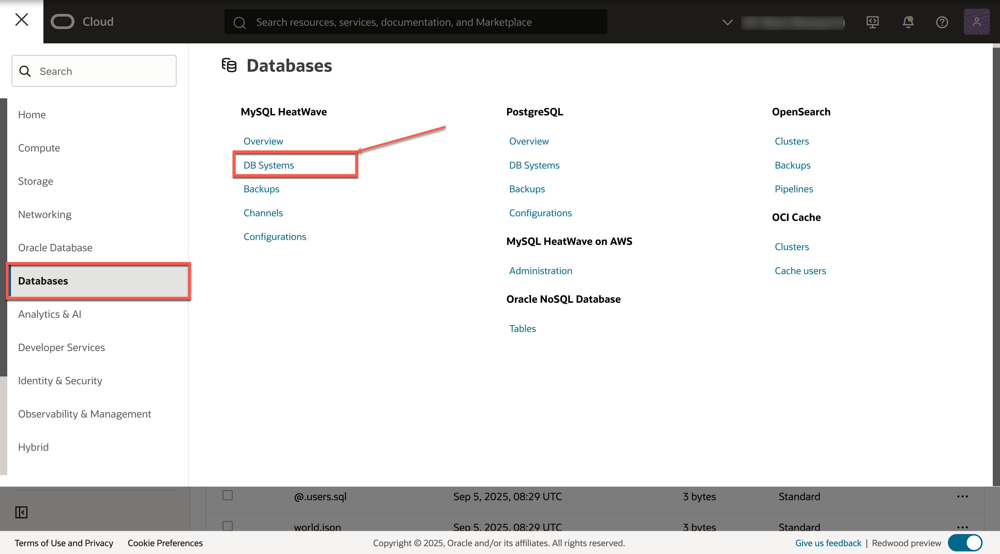
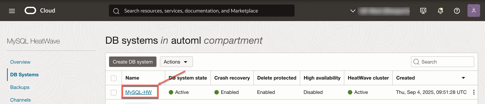

# Load Data into HeatWave

## Introduction

In this lab, we will make verify if our data was successfully imported into MySQL HeatWave using the PAR URL. If all your data is present, we will then go ahead and attach a HeatWave cluster to the MySQL database we created in the last Lab. Once the HeatWave cluster has been created and attached, the last step is to load the data from MySQL InnoDB storage engine into the HeatWave cluster for query acceleration.

_Estimated Time:_ 20 minutes

### Objectives

In this lab, you will be guided through the following tasks:

- Connect to MySQL HeatWave System and confirm data import
- Create a MySQL HeatWave cluster
- Load data into HeatWave cluster

### Prerequisites

- An Oracle Trial or Paid Cloud Account
- Some Experience with MySQL Shell
- Completed Lab 3

## Task 1: Confirm if the data was loaded successfully into MySQL HeatWave

1. Once your MySQL DB System is ACTIVE, SSH into the Compute Instance we created in Lab 1. Afterwards, using MySQL Shell, login to MySQL HeatWave via the Private IP that we had grabbed in the last Lab

    ```bash
    <copy>ssh -i <path/to/you-private-ssh-key> opc@<compute-public-ip-address></copy>
    ```

    then,

    ```bash
    <copy>mysqlsh <username>@<private-mysql-ip></copy>
    ```

    -OR-

    ```bash
    <copy>mysqlsh -u <username> -h <private-mysql-ip> -P <portnumber> -p</copy>
    ```

    

2. After logging into MySQL HeatWave, switch to \sql mode of MySQL Shell and check to see if all your tables were properly loaded

    ```bash
    <copy>\sql</copy>
    ```
    ```bash
    <copy>SHOW SCHEMAS;</copy>
    ```
    ```bash
    <copy>SHOW TABLES IN world;</copy>
    ```

    

## Task 2: Load the MySQL InnoDB data into an in-memory HeatWave Cluster for query acceleration

1. Now in order to load your InnoDB Storage engine data into HeatWave in-memory engine; from your OCI Home Page, click the ‘Hamburger’ menu and go to “Databases” > "DB Systems" under “MySQL HeatWave”. Once on the MySQL page, click on the name of your MySQL HeatWave System. This will take you to "DB System Details" page for your MySQL HeatWave. Upon landing on the "DB System Details" page, click on "HeatWave cluster details"

    

    

    

2. On the “MySQL-HW - HeatWave cluster” page, click “Estimate node” 

    

    Note: based on your database size, the next steps will estimate the size of the HeatWave cluster you will need to load the data into memory and run queries. The number of nodes in MySQL HeatWave in OCI can scale up to 64. Each node can handle approximately 1 TB of data

4. An “Estimate node” screen will appear that will look like the below image:

    

5. Here, click on “Generate estimate”. What this will do is, it will show you a list of all the databases that you have in your MySQL HeatWave system. Afterwards, you can select what tables and databases you want to load in-memory, from the list of databases that will appear after clicking “Generate estimate”

    

    **Note:** once you click on “Generate estimate”, it may take several minutes to display your schema information

6. This is what my screen looked like after hitting “Generate estimate”. It pulled up all the databases that we currently have in MySQL

    

7. From the above screen, you can either select the whole database or select individual tables that you want to load in memory

    

    **Note:** instead of loading the whole database, we will only load the 2 tables (city and countrylanguage)

8. After you are done selecting the tables/databases you want to load in-memory, on that same screen, scroll down until you see a "Summary" and "Predefined commands" section

    

    **Note:** the "Summary" section shows how many HeatWave nodes will be required depending on the data we have selected (in our case as you can see, we only need 1 node and 6 MB of memory will be used)

9. Under the "Predefined commands" section, there will be a SQL command. Simple copy that line of code, afterwards, click "Apply estimated node". In the upcoming steps we will take the copied command and execute it inside our MySQL HeatWave system, which will automatically load the selected data into memory using parallelism

    

    **Note:** after clicking “Apply estimated node”, the number of nodes required to load the data that you have selected, will change (depending on your data size). Lastly, click "Save changes" to finish the HeatWave cluster set up

    

12. Now it is time to login back into our MySQL HeatWave system, and load the data into memory. Login to your Compute instance with MySQL Shell installed to connect to MySQL HeatWave

    ```bash
    <copy>ssh -i <path/to/you-private-ssh-key> opc@<compute-public-ip-address></copy>
    ```

    then,

    ```bash
    <copy>mysqlsh <username>@<private-mysql-ip></copy>
    ```

    -OR-

    ```bash
    <copy>mysqlsh -u <username> -h <private-mysql-ip> -P <portnumber> -p</copy>
    ```

    

13. Once logged in, change the MySQL Shell mode to \sql and execute the command we copied in Lab 4 Task 2.9 to load the data in-memory

    ```bash
    <copy>\sql</copy>
    ```
    ```bash
    <copy>CALL sys.heatwave_load(JSON_ARRAY('world'), JSON_OBJECT('exclude_list', JSON_ARRAY('world.country')));</copy>
    ```

    

    **Note:** replace the load command with what you have

14. Once you invoke Load command, MySQL HeatWave will automatically loaded all your data without user intervention. If your data was loaded into HeatWave successfully, you should see a message saying "Query OK"

    

    **Note:** at the end, once all the data is loaded, HeatWave gives us a “Load Summary” where you can see it took 594 ms to load 2 tables which consisted of 9 columns!

15. Now you’ve got yourselves HeatWave accelerated queries!

**Congratulations!** You have completed the step by step workshop.

## Acknowledgements

- **Author** - Ravish Patel, MySQL Solution Engineering

- **Contributors** - Perside Foster, MySQL Solution Engineering

- **Last Updated By/Date** - Ravish Patel, MySQL Solution Engineering, June 2023