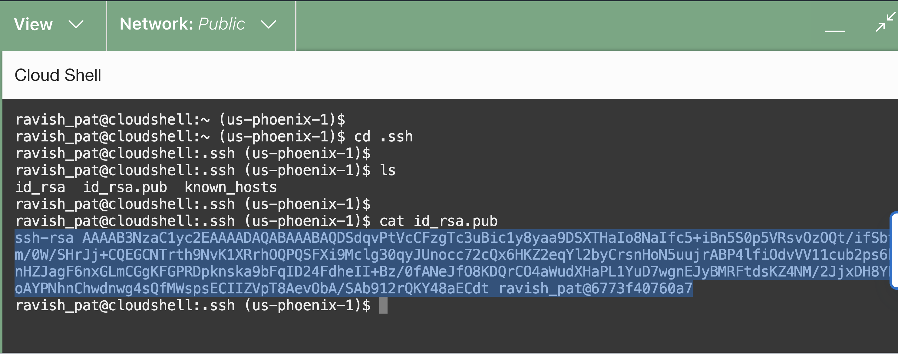
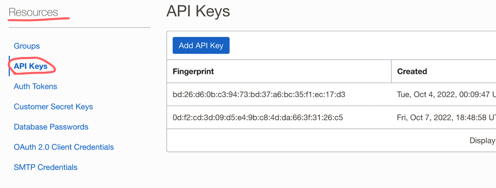
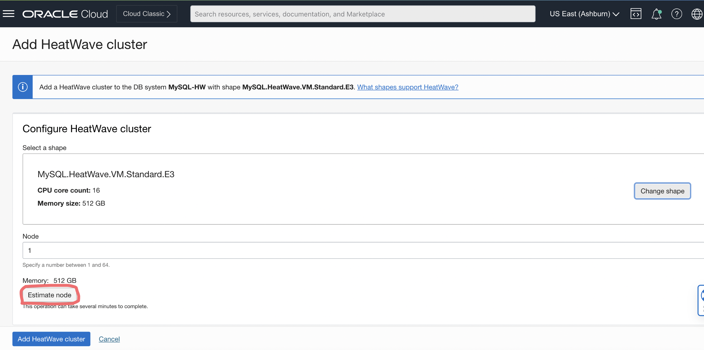
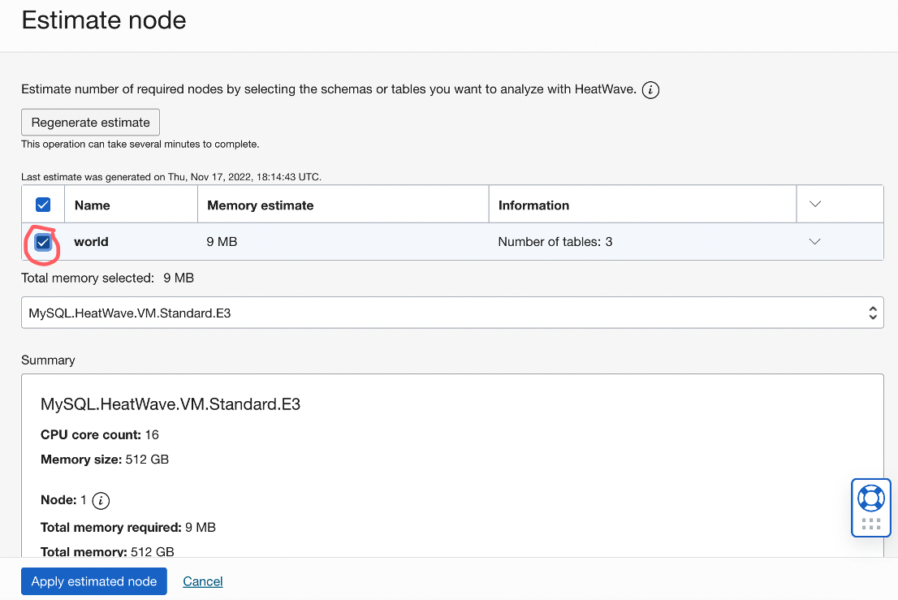
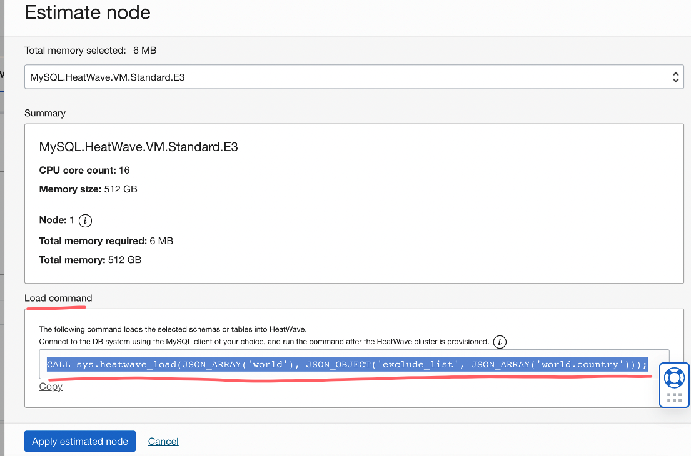

# Create a Compute Instance and perform the MySQL Shell Load

## Introduction

In this lab, we will be creating a Virtual Machine/Compute Instance inside OCI. Once our Compute is created, we then need to download MySQL Shell and create the 'config' file again inside our Compute Instance. After performing all of the above mentioned steps, we then connect to our MySQL HeatWave System via MySQL Shell and we will now be able to perform the MySQL Shell Load. This command will go to our Object Storage Bucket inside OCI and will start loading the files into our MySQL HeatWave System.

_Estimated Time:_ ? minutes

### Objectives

In this lab, you will be guided through the following tasks:

- Create an SSH Key using Cloud Shell in OCI
- Provision a Compute Instance
- Create a config file
- Install MySQL Shell
- Perform the MySQL Shell Load

### Prerequisites

- An Oracle Trial or Paid Cloud Account
- Some Experience with MySQL Shell
- Completed Lab 3

## Task 1: Create an SSH key, install a Compute and install MySQL Shell in order to access the newly created "HeatWave" system

1. Navigate to ‘Cloud Shell’ next to your Home Region (looks like a terminal prompt)

    

2. Once the Cloud Shell loads, it should look similar to this:

    

3. Execute the command to create an SSH key-pair

    ```bash
    <copy>ssh-keygen -t rsa</copy>
    ```

    

    **Note:** keep pressing enter for each question. Here is what it should look like, your public and private SSH keys will be stored in a directory .ssh

    

4. Go to the .ssh directory and copy the contents of the id_rsa.pub file

    ```bash
    <copy>cd .ssh</copy>
    ```
    ```bash
    <copy>ls</copy>
    ```
    ```bash
    <copy>cat id_rsa.pub</copy>
    ```

    

5. Within Oracle Cloud, go to the Navigation or Hamburger menu and under Compute, select “Instances”

    

6. Make sure you are in the right compartment, and click “Create instance”

    

7. Name your compute instance “MDS-Compute”, leave everything default, and make sure the Public Subnet of your MDS-VCN is selected under the Networking section

    

    

8. For the “Add SSH keys”, select “Paste public keys” and paste the contents of the id_rsa.pub file here

    

9. Click “Create” and your Virtual Machine will be ready in a few minutes

    

    

10. Once your VM or Compute Instance is ready, copy the Public IP address and open Cloud Shell. Perform the ssh command to login to your instance

    ```bash
    <copy>ssh -i ~/.ssh/id_rsa opc@<your_compute_instance_ip></copy>
    ```

    

11. After you get into your compute instance, install MySQL Shell

    ```bash
    <copy>sudo yum install mysql-shell -y</copy>
    ```

    

    

12. Once the MySQL Shell is installed, we can login to our MySQL HeatWave system

    ```bash
    <copy>mysqlsh admin@<private-db-ip</copy>
    ```

    

## TASK 2: Set up the .oci/config file in the Compute Instance

1. Exit the MySQL HeatWave System

    ```bash
        <copy>\q</copy>
    ```

2. Make sure you are in the Home Directory of your MDS-Compute and create a .oci directory and place the config file in that .oci directory

    ```bash
    <copy>cd</copy>
    ```
    ```bash
    <copy>mkdir .oci</copy>
    ```
    ```bash
    <copy>cd .oci</copy>
    ```
    ```bash
    <copy>nano config</copy>
    ```

    

3. Go to your API Keys in Oracle Cloud and get the “config” file contents

    

4. Once on this page, scroll down and under “Resources”, select “API Keys”

    

    

5. Click on the three-dots and select “View Configuration file”

    

6. Copy the file config file and paste it in the “MDS-Compute”, .oci/config file we created in Task 2

    

    **Note:** adjust the Private API Key path for “key_file”

## TASK 3: Perform the MySQL Shell Load

1. Once you have your config file setup in the “MDS-Compute”, login to your MySQL HeatWave System

    ```bash
    <copy>mysqlsh admin@<private-db-ip></copy>
    ```

    

2. It is now time to load our sample database “world”, which we imported from our on-prem MySQL Community Edition to the Oracle Cloud Object Storage

    ```bash
    <copy>\js</copy>
    ```
    ```bash
    <copy>util.loadDump("sampledump", {osBucketName: "MDS-Bucket", osNamespace: "idzfu48uajtm", progressFile: "/home/opc/progressfile.json", ignoreVersion:true})</copy>
    ```

    **Note:** change the prefix, osBucketName, and osNamespace to what you have. You can read more about what the different options by visiting this link:

    [https://dev.mysql.com/doc/mysql-shell/8.0/en/mysql-shell-utilities-load-dump.html] (https://dev.mysql.com/doc/mysql-shell/8.0/en/mysql-shell-utilities-load-dump.html)

    

3. If your dump was successful like the image above, switch to \SQL mode and check to see if all your tables were properly loaded

    ```bash
    <copy>\sql</copy>
    ```
    ```bash
    <copy>SHOW SCHEMAS;</copy>
    ```
    ```bash
    <copy>SHOW TABLES IN world;</copy>
    ```

    

    

## TASK 4: Load the data in-memory for query acceleration

1. Now in order to load your InnoDB Storage engine data into HeatWave in-memory engine, go to the “DB System Details” page for your MySQL HeatWave, and click on “More actions”

    

    

2. Once on the “More actions” dropdown, select “Add HeatWave cluster”

    

3. That will bring you to the below page, here click on “Estimate node”. The number of nodes in HeatWave on OCI can go from 1 to 64, while each node can handle ~800 GB of data

    

4. Once you click on “Estimate node”, a screen will appear that will look like the below image:

    

5. Here, click on “Generate estimate”. What this will do is, it will show you a list of all the databases that you have in your MySQL HeatWave system. Afterwards, you can select what tables and databases you want to load in-memory, from the list of databases that will appear after clicking “Generate estimate”

    

    **Note:** once you click on “Generate estimate”, it may take several minutes to display your schema information

6. This is what my screen looked like after hitting “Generate estimate”. It pulled up all my databases that I currently have in MySQL

    

7. From the above screen, you can either select the whole database or select individual tables that you want to load in memory

    

    

    **Note:** instead of loading the whole database, I will only load the 2 tables (city and countrylanguage)

8. After you are done selecting the tables/databases you want to load in-memory, on that same screen, scroll down

    

    **Note:** This end of that page shows us a summary on how many nodes will be required depending on the data I have selected (in my case as you can see, I only need 1 node and 6 MB of memory will be used)

9. On the same page, there is a section that says “Load command”. Simple copy that line of code. In the upcoming steps we will take the copied command and execute it inside our MySQL HeatWave system, which will automatically load the selected data into memory using parallelism

    

    **Note:** after copying the command, click “Apply estimated node”. This will change the number of nodes required to load the data that you have selected (depending on the data size)

    

    **Note:** Afterwards, click “Add HeatWave Cluster” afterwards, to finish the “Add HeatWave cluster” process

10. After clicking “Add HeatWave cluster”, you can see the status of the Cluster to “Creating” on the “DB System Details” page

    

    **Note:** to track how far along is the Cluster creation process, simply scroll down on that same page and look for “Work Requests” under the Resources section on the left

    

11. Once the HeatWave Cluster is created and “ACTIVE”, this is what it should look like

    

    **Note:** notice the “Cluster state: ACTIVE” option

12. Now it is time to login back into our MySQL HeatWave system, and load the data into memory. Login to your Compute instance with MySQL Shell installed to connect to MySQL HeatWave

    ```bash
    <copy>ssh opc@<compute-public-ip></copy>
    ```
    ```bash
    <copy>mysqlsh <admin-username>@<mysql-private-ip></copy>
    ```

    

13. Once logged in, change the MySQL Shell mode to \sql and execute the command we copied in Step 63 to load the data in-memory

    ```bash
    <copy>\sql</copy>
    ```
    ```bash
    <copy>CALL sys.heatwave_load(JSON_ARRAY('world'), JSON_OBJECT('exclude_list', JSON_ARRAY('world.country')));</copy>
    ```

    (replace the load command with what you have)

    

14. Once you invoke that command, MySQL HeatWave will automatically loaded all your data without user intervention. This is what the screen looks like

    

    **Note:** on the above image you can see that HeatWave tells us that 2 tables will be loaded in-memory and we have excluded one of the tables

    

    **Note:** on that same screen, HeatWave also tells us how much memory will be consumed after the data has loaded, alongside some other useful information

    

    **Note:** at the end, HeatWave breaks down each table that was loaded in-memory telling us if there were any warnings during the load process, how many threads were used, etc. Once all the data is loaded, HeatWave gives us a “Load Summary” where you can see it took 528 ms to loaded 2 tables which consisted of 9 columns!

15. Now you’ve got yourselves HeatWave accelerated queries!

**Congratulations!** You have completed the step by step workshop.

## Acknowledgements

- **Author** - Ravish Patel, MySQL Solution Engineering

- **Contributors** - Perside Foster, MySQL Solution Engineering

- **Last Updated By/Date** - Ravish Patel, MySQL Solution Engineering, November 2022