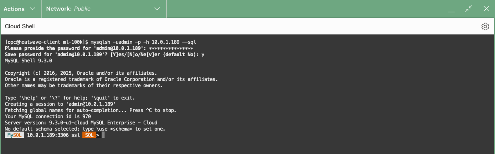
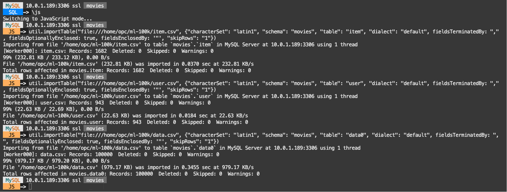
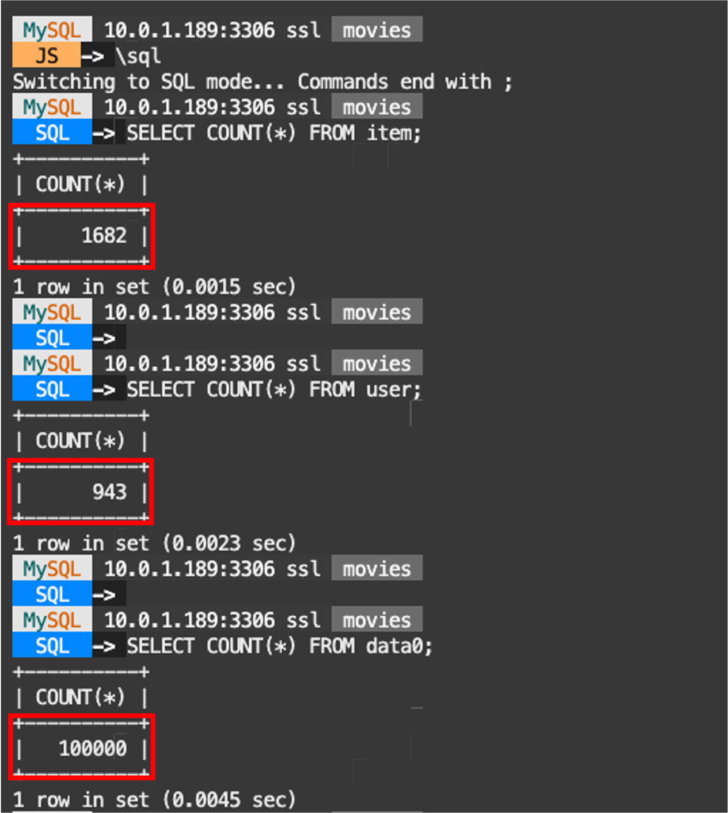
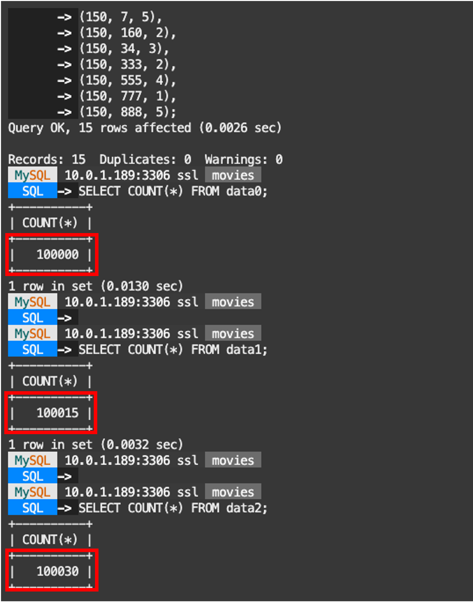

# Add MovieLens data to MySQL HeatWave


## Introduction

Int this lab you will be guided into importing the data from the SQL files generated with Python in the previous lab. For that, we will need to create the movies schema and the tables item, user, and data where this imported data will reside.

Click the following link for an overview of the MovieLens100k dataset files:

- [README file for the MovieLens dataset](https://files.grouplens.org/datasets/movielens/ml-100k-README.txt).

_Estimated Time:_ 10 minutes

### Objectives

In this lab, you will be guided through the following tasks:

- Creating the primary database and tables for the Movies: 'item', 'user' and 'data'
- Sourcing the data into the newly created tables with MySQL Shell

### Prerequisites

- An Oracle Trial or Paid Cloud Account
- Some Experience with Linux and Python
- Completed Lab 3

## Task 1: Create tables for movies data in HeatWave

1. Go to Cloud shell to SSH into the new Compute Instance

     (Example: **ssh -i ~/.ssh/id_rsa opc@132.145.170...**)

    ```bash
    <copy>ssh -i ~/.ssh/id_rsa opc@<your_compute_instance_ip></copy>
    ```

2. Connect To  mysql shell. On command Line, use the following command:

    ```bash
    <copy>mysqlsh -uadmin -p -h 10.0.1... --sql </copy>
    ```

    

3. List the schemas in your heatwave instance

    ```bash
    <copy>show databases;</copy>
    ```

    

4. Create the movie database

    Enter the following command at the prompt

    ```bash
    <copy>CREATE SCHEMA movies;</copy>
    ```

5. Use the movie database

    Enter the following command at the prompt

    ```bash
    <copy>USE movies;</copy>
    ```

6. Define the External Tables to access the movielens data.

    a. Enter the following command at the prompt. **Click on Reveal code block**

    <details>
        <summary>**_Reveal code block_**</summary>
        ```bash
        <copy>
            CREATE TABLE `item` (
            `my_row_id` bigint unsigned NOT NULL AUTO_INCREMENT /*!80023 INVISIBLE */,
            `item_id` int DEFAULT NULL,
            `title` varchar(100) DEFAULT NULL,
            `release_year` varchar(10) DEFAULT NULL,
            `release_date` varchar(20) DEFAULT NULL,
            `URL` varchar(250) DEFAULT NULL,
            `genre_Unknown` int DEFAULT NULL,
            `genre_Action` int DEFAULT NULL,
            `genre_Adventure` int DEFAULT NULL,
            `genre_Animation` int DEFAULT NULL,
            `genre_Children` int DEFAULT NULL,
            `genre_Comedy` int DEFAULT NULL,
            `genre_Crime` int DEFAULT NULL,
            `genre_Documentary` int DEFAULT NULL,
            `genre_Drama` int DEFAULT NULL,
            `genre_Fantasy` int DEFAULT NULL,
            `genre_Filmnoir` int DEFAULT NULL,
            `genre_Horror` int DEFAULT NULL,
            `genre_Musical` int DEFAULT NULL,
            `genre_Mystery` int DEFAULT NULL,
            `genre_Romance` int DEFAULT NULL,
            `genre_Scifi` int DEFAULT NULL,
            `genre_Thriller` int DEFAULT NULL,
            `genre_War` int DEFAULT NULL,
            `genre_Western` int DEFAULT NULL,
            PRIMARY KEY (`my_row_id`)
            );

            CREATE TABLE `user` ( `my_row_id` bigint unsigned NOT NULL AUTO_INCREMENT /*!80023 INVISIBLE */,
            `user_id` int DEFAULT NULL,
            `user_age` int DEFAULT NULL,
            `user_gender` varchar(20) DEFAULT NULL,
            `user_occupation` varchar(30) DEFAULT NULL,
            `user_zipcode` varchar(30) DEFAULT NULL,
            PRIMARY KEY (`my_row_id`)
            );

            CREATE TABLE `data0` (
            `user_id` varchar(5) DEFAULT NULL,
            `item_id` varchar(7) DEFAULT NULL,
            `rating` int DEFAULT NULL
            );

        </copy>
        ```
    </details>

    b. Hit **ENTER** to execute the last command

    

## Task 2: Add movies data into HeatWave tables

1. Import the CSV files into your tables with MySQL Shell Import Table Utility

    a. Make sure you are in the movie database

    ```bash
    <copy>USE movies;</copy>
    ```

    b. Change MySQL Shell mode to JavaScript

    ```bash
    <copy>\js</copy>
    ```
    

    c. Import the files into their respective tables. Make sure to replace the path of the file with your actual path if it is not the same.

    **Enter** the following commands at the JS prompt:

    ```bash
    <copy>util.importTable("file:///home/opc/ml-100k/item.csv", {"characterSet": "latin1", "schema": "movies", "table": "item", "dialect": "default", fieldsTerminatedBy: ",", fieldsOptionallyEnclosed: true, fieldsEnclosedBy: '"', "skipRows": "1"})</copy>
    ```
    ```bash
    <copy>util.importTable("file:///home/opc/ml-100k/user.csv", {"characterSet": "latin1", "schema": "movies", "table": "user", "dialect": "default", fieldsTerminatedBy: ",", fieldsOptionallyEnclosed: true, fieldsEnclosedBy: '"', "skipRows": "1"})</copy>
    ```
    ```bash
    <copy>util.importTable("file:///home/opc/ml-100k/data.csv", {"characterSet": "latin1", "schema": "movies", "table": "data0", "dialect": "default", fieldsTerminatedBy: ",", fieldsOptionallyEnclosed: true, fieldsEnclosedBy: '"', "skipRows": "1"})</copy>
    ```

    d. You should see a similar result:

    


     e. Change back MySQL Shell mode to SQL

    ```bash
    <copy>\sql</copy>
    ```

2. Check the number of rows for every created table

    a. Enter the following command to validate that the data was inserted correctly

    ```bash
    <copy>
    SELECT COUNT(*) FROM item;

    SELECT COUNT(*) FROM user;

    SELECT COUNT(*) FROM data0;
    </copy>
    ```

    b. Hit **ENTER** to execute the last command

    c. You should see the following resulting counts

    

3. Create two more data tables to be used by HeatWave AutoML

    a.

    ```bash
    <copy>CREATE TABLE movies.data1 as select * from movies.data0;
    INSERT INTO data1 (user_id, item_id, rating)
    VALUES
    (20, 23, 4),
    (20, 5, 3),
    (20, 546, 5),
    (20, 920, 2),
    (20, 63, 1),
    (20, 755, 5),
    (20, 885, 3),
    (20, 91, 2),
    (21, 768, 4),
    (21, 119, 1),
    (21, 168, 3),
    (21, 434, 5),
    (21, 247, 2),
    (21, 1131, 2),
    (21, 1002, 4);

    CREATE TABLE movies.data2 as select * from movies.data1;
    INSERT INTO data2 (user_id, item_id, rating)
    VALUES
    (20, 1432, 2),
    (20, 543, 4),
    (20, 1189, 1),
    (21, 1653, 1),
    (21, 814, 1),
    (21, 1536, 1),
    (150, 1293, 1),
    (150, 2, 1),
    (150, 7, 5),
    (150, 160, 2),
    (150, 34, 3),
    (150, 333, 2),
    (150, 555, 4),
    (150, 777, 1),
    (150, 888, 5);
    </copy>
    ```

    b. Hit **ENTER** to execute the last command

4. Compare the number of rows in the data tables.

    a. Enter the following command to compare the number of rows

    ```bash
    <copy>
    SELECT COUNT(*) FROM data0;

    SELECT COUNT(*) FROM data1;

    SELECT COUNT(*) FROM data2;
    </copy>
    ```

    b. Hit **ENTER** to execute the last command

    c. You should see the following result counts

    

You may now **proceed to the next lab**

## Learn More

- [Oracle Cloud Infrastructure MySQL Database Service Documentation](https://docs.oracle.com/en-us/iaas/mysql-database/home.htm)
- [MySQL HeatWave AutoML Documentation] (https://dev.mysql.com/doc/heatwave/en/mys-hwaml-machine-learning.html)
- [MySQL Shell Documentation](https://dev.mysql.com/doc/mysql-shell/8.4/en/mysql-shell-features.html)

## Acknowledgements

- **Author** - Cristian Aguilar, MySQL Solution Engineering
- **Contributors** - Perside Foster, MySQL Principal Solution Engineering
- **Last Updated By/Date** - Cristian Aguilar, MySQL Solution Engineering, May 2025

- **Dataset** - F. Maxwell Harper and Joseph A. Konstan. 2015. The MovieLens Datasets:
History and Context. ACM Transactions on Interactive Intelligent
Systems (TiiS) 5, 4, Article 19 (December 2015), 19 pages.
DOI=http://dx.doi.org/10.1145/2827872