# Create a Low Code Application with Oracle APEX for MySQL


## Introduction

The Oracle Database Development Tools team launched the Database Tools service in OCI providing instance web browser to create connections to the MySQL Database Service in OCI.

Using APEX, developers can quickly develop and deploy compelling apps that solve real problems and provide immediate value. You don't need to be an expert in a vast array of technologies to deliver sophisticated solutions. Focus on solving the problem and let APEX take care of the rest. [https://apex.oracle.com/en/platform/why-oracle-apex/](https://apex.oracle.com/en/platform/why-oracle-apex/)

**Aditional Support Guides**
- [https://medium.com/oracledevs/get-insight-on-mysql-data-using-apex](https://medium.com/oracledevs/get-insight-on-mysql-data-using-apex-22-1-7fe613c76ca5)
- [https://peterobrien.blog/2022/06/15/](https://peterobrien.blog/2022/06/15/)
- [https://peterobrien.blog/2022/06/15/how-to-use-the-oracle-database-tools-service-to-provide-data-to-apex/](https://peterobrien.blog/2022/06/15/how-to-use-the-oracle-database-tools-service-to-provide-data-to-apex/)

_Estimated Time:_ 30 minutes

### Objectives

In this lab, you will be guided through the following task:

- Setup Identity and Security tools and services
- Configure a Private Connection
- Create and configure an APEX Instance
- Configure APEX Credentials

### Prerequisites

- An Oracle Trial or Paid Cloud Account
- Some Experience with OCI Console
- Some Experience with Oracle Autonomous and Oracle APEX
- Completed Lab 6

## Task 1 Setup Identity & Security tools in OCI to Create a Secret

1. From the OCI Menu, navigate to **Identity & Security** and click **Vault**

    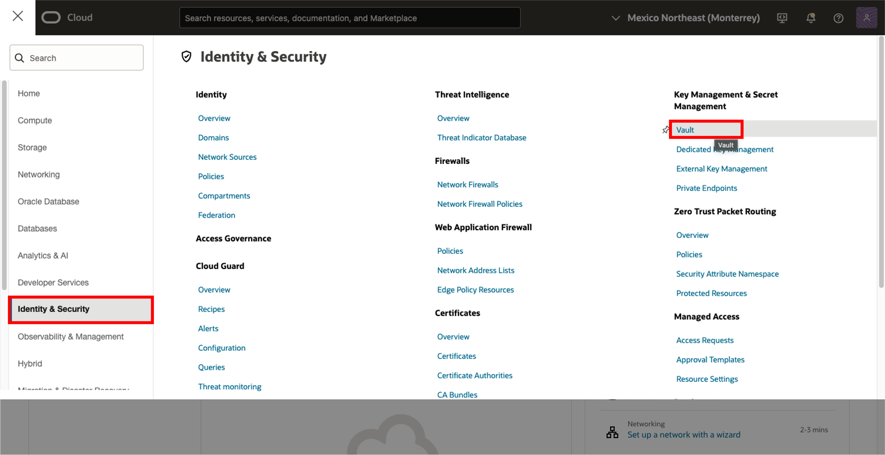

2. Create a Vault

    a. Click **Create Vault**

    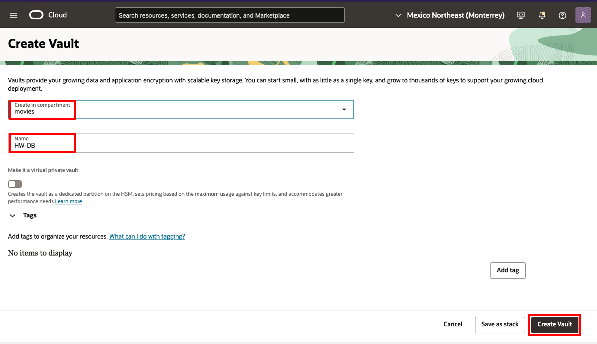

    b. Select the movies compartment

    c. Give the vault a name

    ```bash
    <copy> HW-DB </copy>
    ```

    d. Click **Create Vault**

3. Create a Master Encryption Key

    a. Click on the newly created Vault

    b. Go to the 'Master Encryption Keys' tab

    c. Click **Create Key**

    

    d. Select the movies compartment

    e. Give the key a name

    ```bash
    <copy> HW-DB </copy>
    ```

    f. Leave the rest configurations in default values

    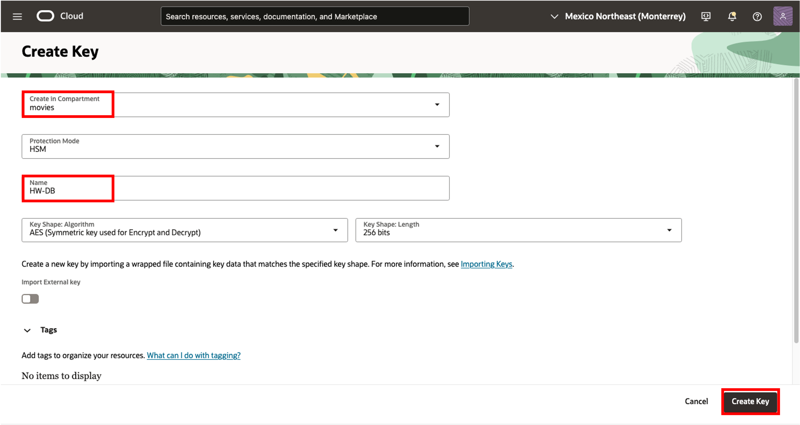

    g. Click **Create Key**

4. Create a Secret

    a. Click on **Secrets** tab to navigate to the secrets panel

    b. Click **Create Secret**

    

    c. Select the movies compartment

    d. Give the secret a name and description

    ```bash
    <copy>HW-DB</copy>
    ```

    ```bash
    <copy>moviepass</copy>
    ```
    e. Select the previously created Encryption Key

    f. Select 'Manual secret generation'

    g. In **Secret Contents**, write the password for the admin user created for your MySQL HeatWave DB System

    

    h. Leave the rest configurations in default values

    i. Click **Create Secret**

## Task 2 Configure a Private Connection

1. From the OCI Menu, navigate to **Developer Services** and click **Private Endpoints**

    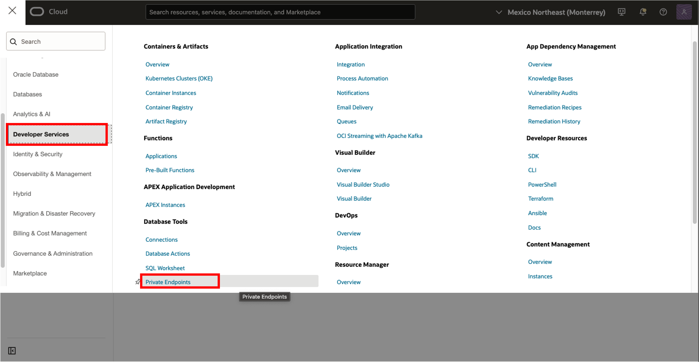

2. Create a Private Endpoint

    a. Navigate to Private Endpoints and click **Create private endpoint**

    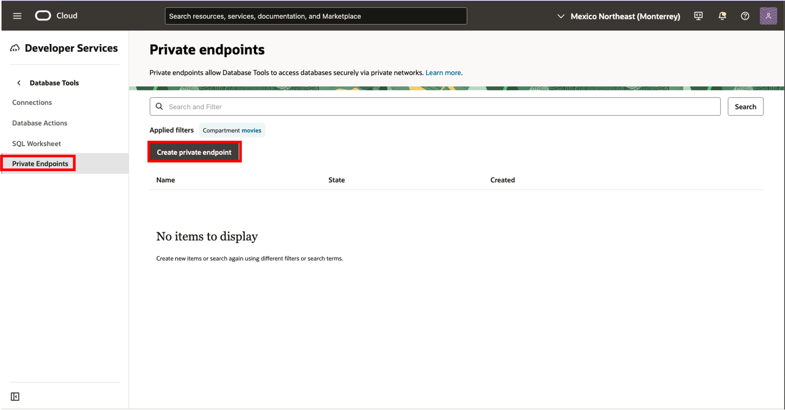

    b. Give the Endpoint a name

    ```bash
    <copy> HW-MovieHub-endpoint </copy>
    ```

    c. Select the movies compartment

    d. Select **Enter network information**

    e. Select the **private subnet** from the movies compartment

    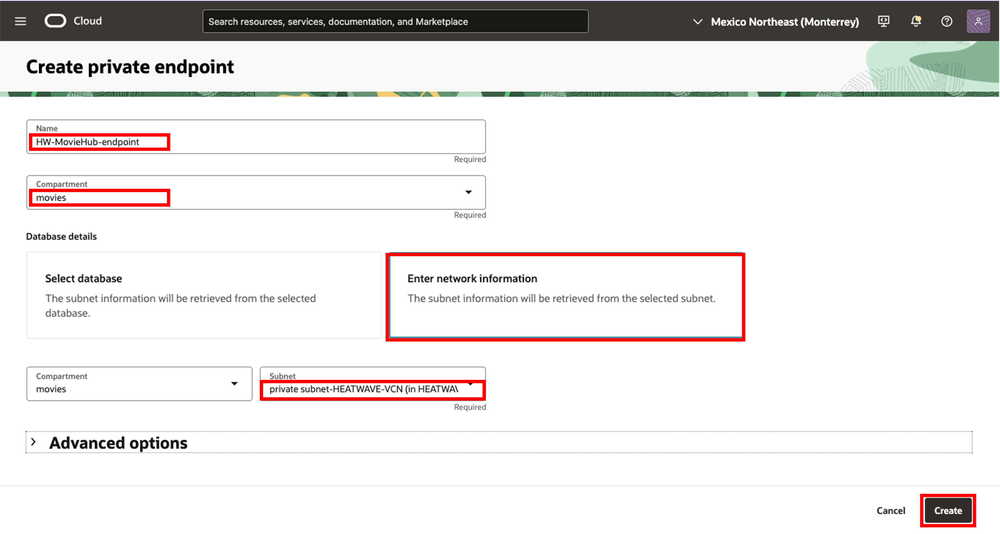

    f. Click **Create**

3. Create a Connection

    a. Navigate to Connections and click **Create connection**

    

    b. Give the Endpoint a name

    ```bash
    <copy> HW-MovieHub-Connection </copy>
    ```

    c. Select the movies compartment

    d. Select **Select database** option

    e. Select **MySQL Database** for Database cloud service

    f. Introduce the MySQL DB System created administrator user

    g. Select the created secret that contains the matching mysql password

    h. Select 'Access database via a private network'

    i. Click 'Select private endpoint' and select your previously created Private endpoint

    

    j. Click **Create**

## Task 3 Run SQL Worksheet

1. From the OCI Menu, navigate to **Developer Services** and click **SQL Worksheet**

    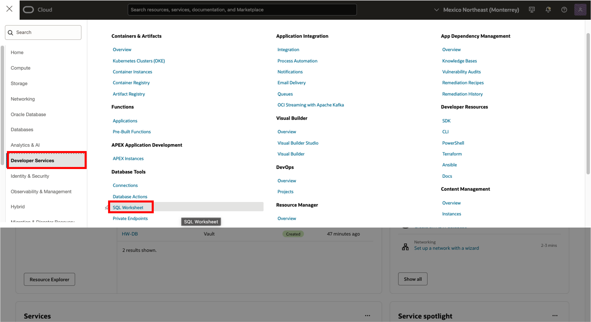

2. Select the **movies** compartment and the created **HW-MovieHub-Connection**

3. You can run SQL queries, in the SQL Worksheet.

    a. List the schemas

    ```bash
    <copy> SHOW SCHEMAS;</copy>
    ```

    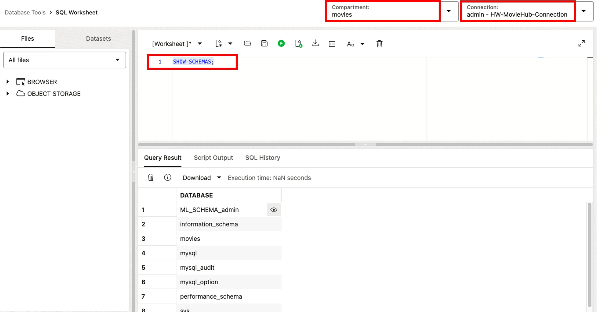

4. Get the MySQL Connection Endpoint URL

    The OCI Services connect to the MySQL DB System though the created Connection. This Connection Endpoint Consists of a URL Pattern:

    **Note.** The pattern is: 

        `https://sql.dbtools.< region >.oci.oraclecloud.com/20201005/ords/< connection-ocid >/_/sql`

    **Example:** 

        `https://sql.dbtools.us-ashburn-1.oci.oraclecloud.com/20201005/ords/ocid1.databasetoolsconnection.oc1.iad.amaaaaaao27h4wiamnbgbmuznwvg4nenu4j7nzbecnvpmzgs2fkgiugwueyq/_/sql`
    This URL can be also obtained by retrieving it from the network logs from the developer console in a Web Browser.

    a. Open the Developer Console from your web browser. This can be done by right clicking on the page and clicking **inspect/inspect element**

    

    b. In the developer **console** tab, look up for an event **dbtools-sqldev__LogEvent**. Then, click on the **object** to see its details

    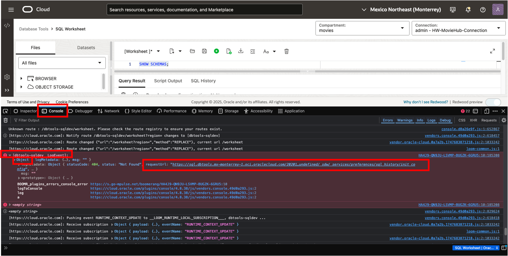

    c. The Endpoint URL will be visible. Right Click to Copy the Link

    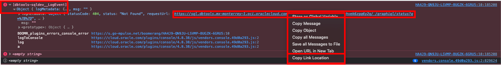

    d. Notice the pattern of the URL. **_if your enpoint ends with something like  "/\_/graphiql/status?q=%7B%7D"_**

    **_Replace it with  "/\_/sql"_**

    e. Save the Endpoint URL for later. You will need it for **Task 6** and **Task 7**

## Task 4 Create API Keys

1. From the OCI Menu, navigate to **Identity & Security** and click **Domains**

    

2. Click on **My profile** and navigate to **Tokens and Keys** tab

3. Click **Add API Key**

    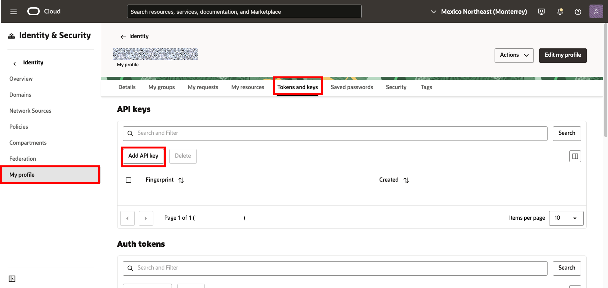

4. Save the generated API Key Pair

    

5. Save the content of the Configuration file preview by **copying** it. Then click **Close**

    

    **Note the values for your Username, Tenancy, and Fingerprint.** (If your resources are deployed in a region different from your tenancy's Home Region, the region value in the generated API configuration file will not match)

## Task 5 Create and Configure an APEX Instance

1. Create and Launch APEX

    a. Go to the OCI home page and look for the 'Quickstarts' menu. (the location may differ from your console)

    b. Click on 'Deploy a low-code app on Autonomous Database using Apex'
    
    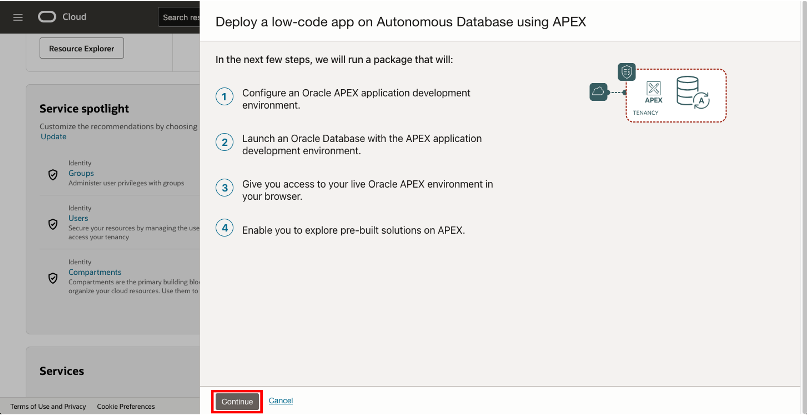
    c. Choose movies compartment and set the APEX password
    
    

2. Create Workspace

    a. Enter your APEX password
    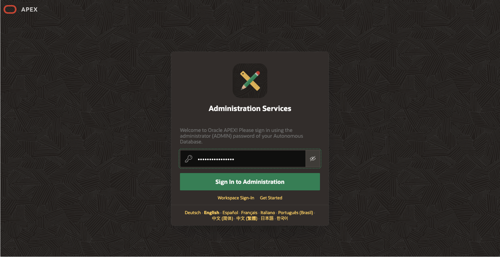

    b. Click 'Create Workspace'
    
    c. Name the APEX workspace

    ```bash
    <copy> heatwave-movies </copy>
    ```

    d. Set an Admin user and password for the workspace
    
    e. Log out from APEX
    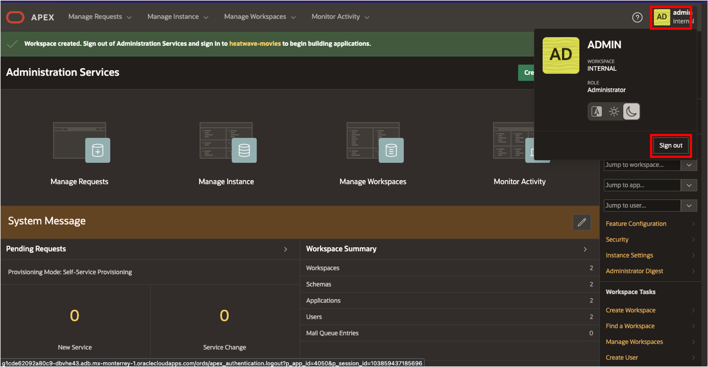


## Task 6 Create APEX Credentials

1. Create Web Credentials

    a. Log In to the APEX Workspace
    ```bash
    <copy> heatwave-movies </copy>
    ```
    
    b. Navigate to the Workspace Utilities from the App Builder Menu
    
    c. Click on **Web Credentials**
    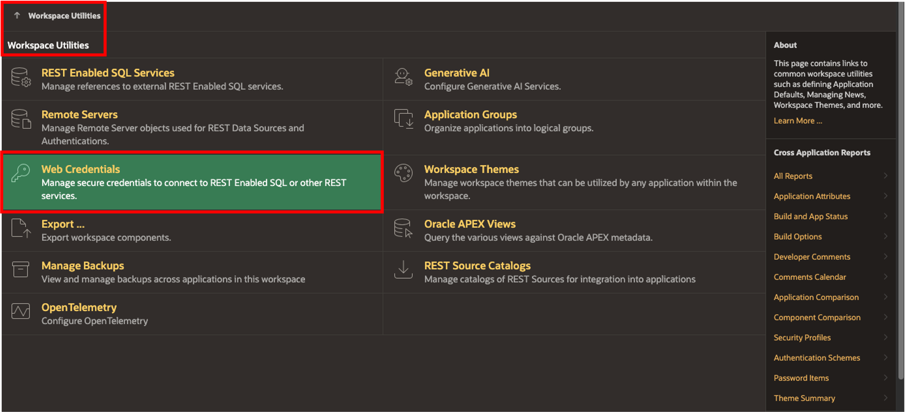

    d. You can obtain the OCID values and fingerprint from the **Configuration File Preview** generated with the API Key in **Task 4.4** or retrieve them from the OCI Console. Open the Private Key file in a text editor to copy the content.

    | Attributes | Value |
    | --------| -------:|
    | Name | Moviehub |
    | Static ID | Moviehub |
    | Authentication Type | OCI Native Authentication |
    | OCI User ID | **< YourUserOCID >** |
    | OCI Private Key | **< ContentOfYourSaved-APIPrivateKey >** |
    | OCI Tenancy ID | **< YourTenancyOCID >** |
    | OCI Public Key Fingerprint | **< YourPublicKeyFingerprint >** |
    | Valid for URLs | **< EndpointURL >** |
    {: title="Web Credentials \| Attributes"}

    e. Create new Web Credentials. Click **Create**
    

You may now **proceed to the next lab**

## Learn More

- How to use the Oracle Database Tools Service to provide MySQL data to APEX - [APEX and the MySQL Database Service](https://asktom.oracle.com/pls/apex/asktom.search?oh=18245)
- [Oracle Autonomous Database Serverless Documentation](https://docs.oracle.com/en/cloud/paas/autonomous-database/serverless/adbsb/index.html#Oracle%C2%AE-Cloud)
- [Using Web Services with Oracle APEX Documentation](https://docs.oracle.com/en/cloud/paas/autonomous-database/serverless/adbsb/apex-web-services.html#GUID-DA24C605-384D-4448-B73C-D00C02F5060E)


## Acknowledgements

- **Author** - Cristian Aguilar, MySQL Solution Engineering
- **Contributors** - Perside Foster, MySQL Principal Solution Engineering
- **Last Updated By/Date** - Cristian Aguilar, MySQL Solution Engineering, May 2025
