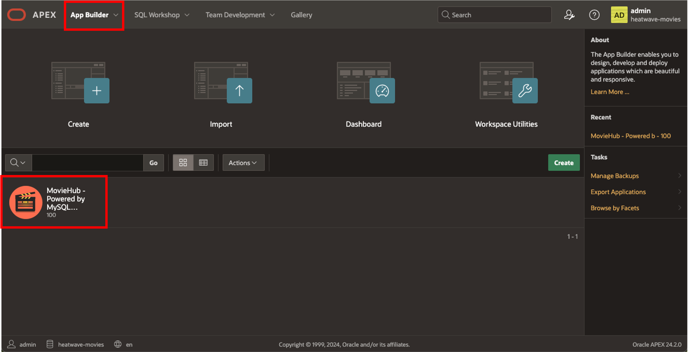
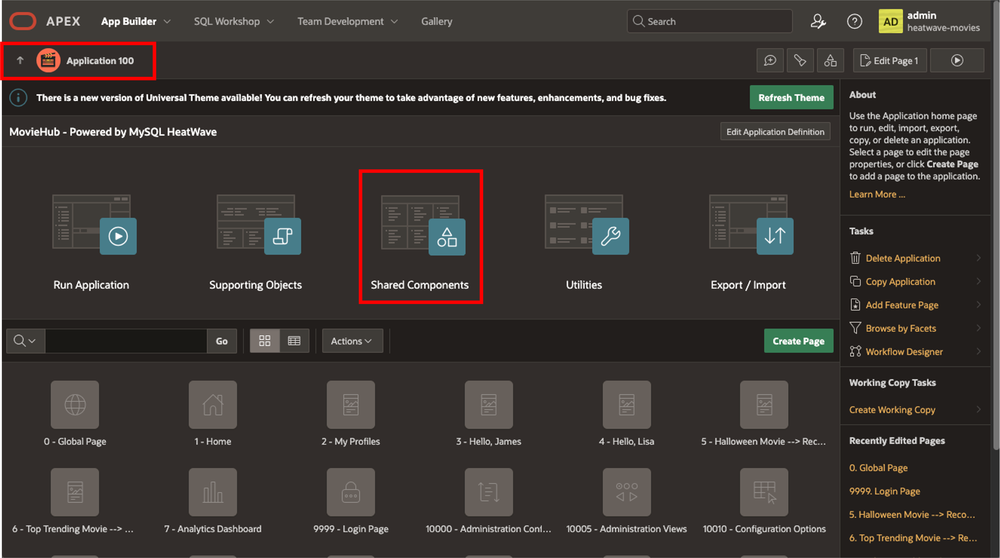
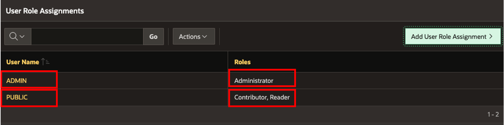
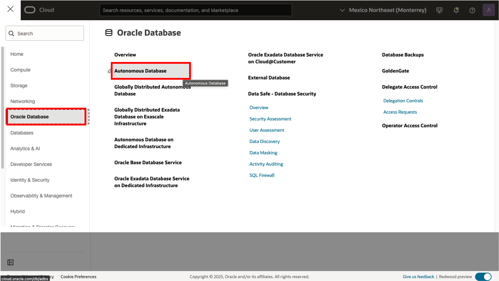
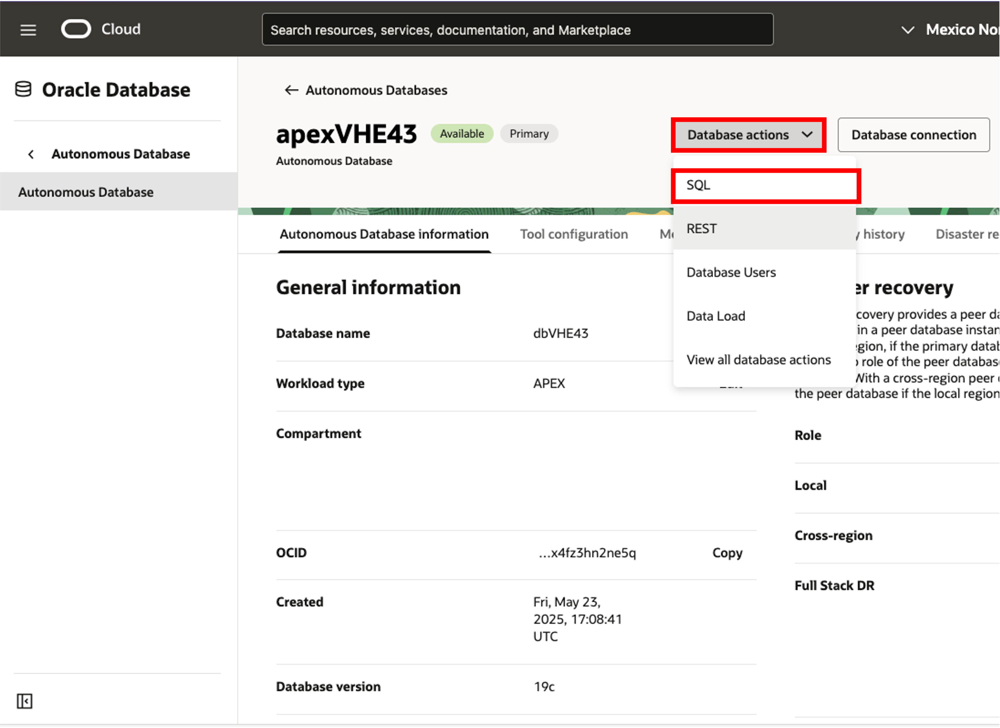

# Setup the APEX Application and Workspace


## Introduction

Using APEX, developers can quickly develop and deploy compelling apps that solve real problems and provide immediate value. You don't need to be an expert in a vast array of technologies to deliver sophisticated solutions. Focus on solving the problem and let APEX take care of the rest. [https://apex.oracle.com/en/platform/why-oracle-apex/](https://apex.oracle.com/en/platform/why-oracle-apex/)


_Estimated Lab Time:_ 10 minutes

### Objectives

In this lab, you will be guided through the following tasks:

- Download and import the sample application
- Configure the newly imported application
- Add users to the app
- Configure the APEX Workspace

### Prerequisites

- An Oracle Trial or Paid Cloud Account
- Some Experience with MySQL Shell
- Some Experience with Oracle Autonomous and Oracle APEX
- Must Complete Lab 6
- Must Complete Lab 8

## Task 1: Download the sample application - MovieHub

1. Download the MovieHub application template:

    Click on this link to **Download file** [MovieHub.zip](https://objectstorage.us-ashburn-1.oraclecloud.com/p/6YBDWd_zSujktgE7KdAP32YYPQ8TsX8QKRRvXY_hizlNVEIx_eX1KiSamC9Ni_V4/n/idi1o0a010nx/b/Bucket-CA/o/LiveLab-MovieHub-images/MovieHub-V2025.zip) to your local machine

## Task 2: Import the sample application - MovieHub

1. Connect to your APEX Workspace:

    a. Connect to your APEX workspace

    b. Go to App Builder

    

    

2. Import the MovieHub file

    a. Click on Import

    

    b. Select the downloaded file **MovieHub.zip** . Click on **Next** two times

    c. Click **Install Application** and **Next**

    

    d. Click on Edit Application after the application installation ends

    

## Task 3: Modify the REST Enabled SQL Endpoint for the App

**The imported app will import a broken 'REST Enabled SQL' Endpoint from the export source**

1. Navigate to **REST Enabled SQL**

    a. Navigate to the Workspace Utilities from the App Builder Menu

    

    b. Click on **REST Enabled SQL Services**

    

    c. Select the Endpoint that was imported "MovieHub-moviesdb"

    

2. Click on the name to edit the **REST** resource

    a. You can leave the name as it is.

    b. Edit the Endpoint URL with your endpoint 'https://sql.dbtools...' (Also used at **Lab 8, Task 6**)

    **Introduce the Endpoint URL without the "/\_/sql" or "/\_/graphiql.." at the end. Notice the help message.**

    c. Edit the credentials and select your previously created credentials

    d. Make sure the correct default database is selected

    

    e. Click Save and Test to validate its working.

    f. If credentials and URL correct, a new window will prompt to confirm the Default Database

    

    g. Select again the 'movies' database as default and click 'close'

## Task 4: Add Users to the App

As this is an imported app, your current workspace user will not have administration access to it

1. Register an Administrator account

    a. Navigate to Shared Components by first clicking the imported app.

    

    

    b. Go to **Security > Application Access Control**

    c. Click on 'Add User Role Assignment'. Create a user 'ADMIN' and assign **administrator role** to it. This administrator account would be referred as '**admin account**'

    

2. Create a 'Public' Role Assignment to simulate the difference in application usage between an administrative account and a non-administrative user account.

    a. Navigate to Shared Components

    b. Go to **Security > Application Access Control**

    c. Click on 'Add User Role Assignment'. Create a User Role Assignment, **Contributor role** and **Reader role**. This non administrative account would be referred as '**public account**'

    

    d. You should have 2 roles like this

    

3. Create a 'Public' account in the Administration - Users And Groups configuration

    a. In the APEX workspace. Click on the administration tab

    b. Navigate to **Manage Users and Groups**

    

    c. Click **Create User** with **username** 'public'

    

    d. Add an email address

    e. Set a password

    f. Unselect 'Require Change of Password...'

    g. Assign all group assignments to the user

    

    h. Click **Create User**

## Task 5 (BONUS): Increase the Web Service requests

When using Web Services with Oracle Autonomous Database, there is a limit in the number of 50,000 outbound web service requests per APEX workspace in a rolling 24-hour period. If the limit of outbound web service calls is reached, the following SQL exception is raised on the subsequent request and the request is blocked:
ORA-20001: You have exceeded the maximum number of web service requests per workspace. Please contact your administrator.

You may want to increase this limit if it is being reached

1. Navigate to Autonomous Database in OCI Console

    

2. Click on your Autonomous database to see its details

3. Click on the dropdown menu Database Actions

3. Select SQL

    

4. Run the query to increase the **MAX\_WEBSERVICE\_REQUESTS** limit

    ```bash
    <copy>BEGIN
        APEX_INSTANCE_ADMIN.SET_PARAMETER('MAX_WEBSERVICE_REQUESTS', '250000');
        COMMIT;
    END;
    / </copy>
    ```

    

You may now **proceed to the next lab**

## Learn More

- How to use the Oracle Database Tools Service to provide MySQL data to APEX - [APEX and the MySQL Database Service](https://asktom.oracle.com/pls/apex/asktom.search?oh=18245)
- [Oracle Autonomous Database Serverless Documentation](https://docs.oracle.com/en/cloud/paas/autonomous-database/serverless/adbsb/index.html#Oracle%C2%AE-Cloud)
- [Using Web Services with Oracle APEX Documentation](https://docs.oracle.com/en/cloud/paas/autonomous-database/serverless/adbsb/apex-web-services.html#GUID-DA24C605-384D-4448-B73C-D00C02F5060E)

## Acknowledgements

- **Author** - Cristian Aguilar, MySQL Solution Engineering
- **Contributors** - Perside Foster, MySQL Principal Solution Engineering
- **Last Updated By/Date** - Cristian Aguilar, MySQL Solution Engineering, May 2025