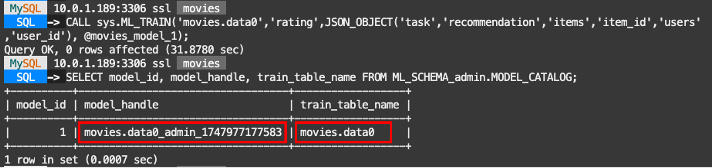
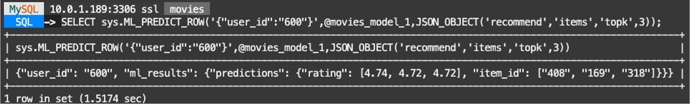
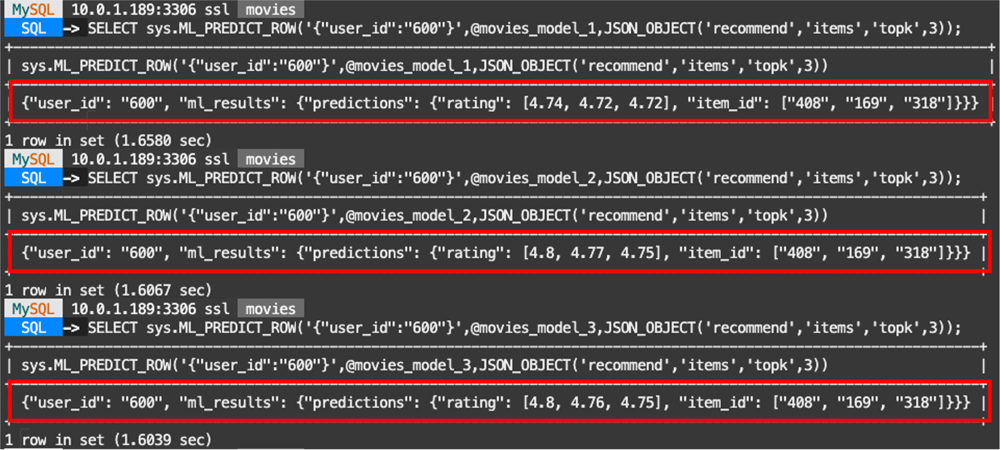
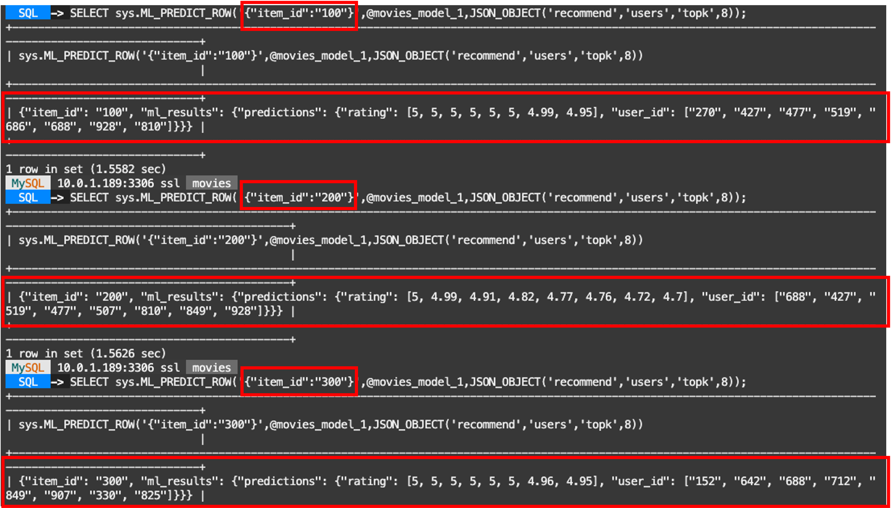

# Create and test HeatWave AutoML Recommender System


## Introduction

HeatWave ML makes it easy to use machine learning, whether you are a novice user or an experienced ML practitioner. You provide the data, and HeatWave AutoML analyzes the characteristics of the data and creates an optimized machine learning model that you can use to generate predictions and explanations. An ML model makes predictions by identifying patterns in your data and applying those patterns to unseen data. HeatWave ML explanations help you understand how predictions are made, such as which features of a dataset contribute most to a prediction.

To load the movies data, perform the following steps to create and load the required schema and tables. 

After this step the data is stored in the MySQL HeatWave database in the following schema and tables:

**movies:** The schema containing training and test dataset tables.

**data0:** The training dataset for the ml movies\_model\_1. Includes feature columns (user\_id, item\_id, rating) where 'rating' is the target column.

**data1:** The training dataset for the ml movies\_model\_2. Includes feature columns (user\_id, item\_id, rating) where 'rating' is the target column.

**data2:** The training dataset for the ml movies\_model\_3. Includes feature columns (user\_id, item\_id, rating) where 'rating' is the target column.

The three tables differ in the number of rows to simulate the behavior of the model trained when users "watch 15 and 30 more movies"

_Estimated Time:_ 20 minutes

### Objectives

In this lab, you will be guided through the following task:

- Load Movies Data into HeatWave
- Train ML models
- Test the models with ML\_PREDICT\_ROW

### Prerequisites

- An Oracle Trial or Paid Cloud Account
- Some Experience with MySQL Shell
- Completed Lab 5

## Task 1: Connect with MySQL Shell:

1. Go to Cloud shell to SSH into the new Compute Instance

     (Example: **ssh -i ~/.ssh/id_rsa opc@132.145.170...**)

    ```bash
    <copy>ssh -i ~/.ssh/id_rsa opc@<your_compute_instance_ip></copy>
    ```

2. On the command line, connect to MySQL using the MySQL Shell client tool with the following command:

    ```bash
    <copy>mysqlsh -uadmin -p -h 10.... -P3306 --sql </copy>
    ```

    

## Task 2: Review the data tables

1. To Review the data of your tables before training the model:

    a. Enter the following command at the prompt

    ```bash
    <copy>USE movies;</copy>
    ```

    b. View the content of one of your Machine Learning tables (data0)

    ```bash
    <copy>DESC data0;</copy>
    ```

    ```bash
    <copy>SELECT * FROM data0 LIMIT 5;</copy>
    ```

    

## Task 3: Load the movie database to HeatWave Cluster

1. Load the movie tables into the HeatWave cluster memory:

    ```bash
    <copy>CALL sys.heatwave_load(JSON_ARRAY('movies'), NULL);</copy>
    ```

## Task 4: Train one ML model with the original data table: data0


1. Train the model using ML_TRAIN. Since this is a recommendation dataset, the recommendation task is specified to create a recommendation model:

    a. Train the first recommendation model

    ```bash
    <copy>CALL sys.ML_TRAIN('movies.data0','rating',JSON_OBJECT('task','recommendation','items','item_id','users','user_id'), @movies_model_1);</copy>
    ```

    b. When the training operation finishes, the model handle is assigned to the @movies\_model\_1 session variable, and the model is stored in your model catalog. You can view the entry in your model catalog using the following query, where '**admin**' in ML\_SCHEMA\_admin.MODEL\_CATALOG is your MySQL account name:

    ```bash
    <copy>SELECT model_id, model_handle, train_table_name FROM ML_SCHEMA_admin.MODEL_CATALOG;</copy>
    ```

    c. The output should look like this, containing the list with your trained models

    

2. Load the model into HeatWave ML using ML\_MODEL\_LOAD routine:

    a. Reset model handle variable

    ```bash
    <copy>SET @movies_model_1=(SELECT model_handle FROM ML_SCHEMA_admin.MODEL_CATALOG  ORDER BY model_id DESC LIMIT 1);</copy>
    ```

    b. A model must be loaded before you can use it. The model remains loaded until you unload it or the HeatWave Cluster is restarted.

    ```bash
    <copy>select @movies_model_1;</copy>
    ```

    ```bash
    <copy>CALL sys.ML_MODEL_LOAD(@movies_model_1, NULL);</copy>
    ```

3. Test the model to predict the TOP 3 items recommended for a given user.

    a. Predict a ROW with the movies\_model\_1 . Top 3 recommended items for the user '600'

    ```bash
    <copy>
    SELECT sys.ML_PREDICT_ROW('{"user_id":"600"}',@movies_model_1,JSON_OBJECT('recommend','items','topk',3));</copy>
    ```

    b. The trained models will NOT be identical. So the resulting predictions are expected to differ from this example. Output should look like this

    

## Task 5: Train two more ML models with the remaining data tables: data1 and data2

1. Train the ML models:

    a. Train the two remaining models. Hit **ENTER** to execute the last command

    ```bash
    <copy>
    CALL sys.ML_TRAIN('movies.data1','rating',JSON_OBJECT('task','recommendation','items','item_id','users','user_id'), @movies_model_2);

    CALL sys.ML_TRAIN('movies.data2','rating',JSON_OBJECT('task','recommendation','items','item_id','users','user_id'), @movies_model_3);</copy>
    ```

    b. Make Sure the model handle variables are set correctly for every model. Hit **ENTER** to execute the last command

    ```bash
    <copy>
    SET @movies_model_1=(SELECT model_handle FROM ML_SCHEMA_admin.MODEL_CATALOG ORDER BY model_id DESC LIMIT 1 OFFSET 2);

    SET @movies_model_2=(SELECT model_handle FROM ML_SCHEMA_admin.MODEL_CATALOG ORDER BY model_id DESC LIMIT 1 OFFSET 1);

    SET @movies_model_3=(SELECT model_handle FROM ML_SCHEMA_admin.MODEL_CATALOG ORDER BY model_id DESC LIMIT 1 OFFSET 0);
    </copy>
    ```

    c. You can view the MODEL\_CATALOG table again with the new models

    ```bash
    <copy>SELECT model_id, model_handle, train_table_name FROM ML_SCHEMA_admin.MODEL_CATALOG;</copy>
    ```

    Output should look like this:

    

    d. Compare the model\_handle with the variables values. There must be a matching variable for every model

    ```bash
    <copy>
    SELECT @movies_model_1;
    SELECT @movies_model_2;
    SELECT @movies_model_3;</copy>
    ```

    e. Hit **ENTER** to execute the last command

    f. Load every model in memory before using them

    ```bash
    <copy>
    CALL sys.ML_MODEL_LOAD(@movies_model_1, NULL);
    CALL sys.ML_MODEL_LOAD(@movies_model_2, NULL);
    CALL sys.ML_MODEL_LOAD(@movies_model_3, NULL);</copy>
    ```

    g. Hit **ENTER** to execute the last command

## Task 6: Predict individual ROWS with the different trained models

1. Test the model to predict the TOP 3 items recommended for a given user.

    a. Predict a ROW with each of the 3 models. Top 3 recommended items for the user '600'

    ```bash
    <copy>
    SELECT sys.ML_PREDICT_ROW('{"user_id":"600"}',@movies_model_1,JSON_OBJECT('recommend','items','topk',3));
    SELECT sys.ML_PREDICT_ROW('{"user_id":"600"}',@movies_model_2,JSON_OBJECT('recommend','items','topk',3));
    SELECT sys.ML_PREDICT_ROW('{"user_id":"600"}',@movies_model_3,JSON_OBJECT('recommend','items','topk',3));</copy>
    ```

    b. Hit **ENTER** to execute the last command

    c. The trained models will NOT be identical. So the resulting predictions are expected to differ from this example. Output should look like this

    

1. Test the model to predict the TOP 8 recommended users for different given items.

    a. Predict multiple ROWS with a single model. Top 8 recommended users for the items '100' , '200', '300'

    ```bash
    <copy>
    SELECT sys.ML_PREDICT_ROW('{"item_id":"100"}',@movies_model_1,JSON_OBJECT('recommend','users','topk',8));
    SELECT sys.ML_PREDICT_ROW('{"item_id":"200"}',@movies_model_1,JSON_OBJECT('recommend','users','topk',8));
    SELECT sys.ML_PREDICT_ROW('{"item_id":"300"}',@movies_model_1,JSON_OBJECT('recommend','users','topk',8));</copy>
    ```

    b. Hit **ENTER** to execute the last command

    c. The trained models will NOT be identical. So the resulting predictions are expected to differ from this example. Output should look like this

    


To avoid consuming too much space, it is good practice to unload a model when you are finished using it.

You may now **proceed to the next lab**

## Learn More

- [Oracle Cloud Infrastructure MySQL Database Service Documentation](https://docs.oracle.com/en-us/iaas/mysql-database/index.html)
- [MySQL HeatWave ML Documentation] (https://dev.mysql.com/doc/heatwave/en/mys-hwaml-machine-learning.html)

## Acknowledgements

- **Author** - Cristian Aguilar, MySQL Solution Engineering
- **Contributors** - Perside Foster, MySQL Principal Solution Engineering
- **Last Updated By/Date** - Cristian Aguilar, MySQL Solution Engineering, November 2024
