# Create Bastion Server for MySQL Data


## Introduction

When working in the cloud, there are often times when your servers and services are not exposed to the public internet. MySQL HeatWave on OCI is an example of a service that is only accessible through private networks. Since the service is fully managed, we keep it siloed away from the internet to help protect your data from potential attacks and vulnerabilities. It’s a good practice to limit resource exposure as much as possible, but at some point, you’ll likely want to connect to those resources. That’s where Compute Instance, also known as a Bastion host, enters the picture. This Compute Instance Bastion Host is a resource that sits between the private resource and the endpoint which requires access to the private network and can act as a “jump box” to allow you to log in to the private resource through protocols like SSH. This bastion host requires a Virtual Cloud Network and Compute Instance to connect with the MySQL DB Systems.

You will also install Python and Pandas Module; and MySQL Shell on this Bastion Compute Instance. It will be used as a Development Server to Download, Transform and Import data into  MySQL HeatWave. New applications can also be created with other software stacks and connect to your MySQL HeatWave system in this bastion.

_Estimated Lab Time:_ 15 minutes

### Objectives

In this lab, you will be guided through the following tasks:

- Create SSH Key on OCI Cloud
- Create Bastion Compute Instance
- Install MySQL Shell on the Compute Instance
- Install Python and Pandas Module

### Prerequisites

- An Oracle Trial or Paid Cloud Account
- Some Experience with Linux VM
- Must Complete Lab 1

## Task 1: Create SSH Key on OCI Cloud Shell

The Cloud Shell machine is a small virtual machine running a Bash shell which you access through the Oracle Cloud Console (Homepage). You will start the Cloud Shell and generate a SSH Key to use  for the Bastion  session.

1. To start the Oracle Cloud shell, go to your Cloud console and click the cloud shell icon at the top right of the page. This will open the Cloud Shell in the browser, the first time it takes some time to generate it.

    

    

    

    _Note: You can use the icons in the upper right corner of the Cloud Shell window to minimize, maximize, restart, and close your Cloud Shell session._

2. Once the cloud shell has started, create the SSH Key using the following command:

    ```bash
    <copy>ssh-keygen -t rsa</copy>
    ```

    Press enter for each question.

    Here is what it should look like.  

    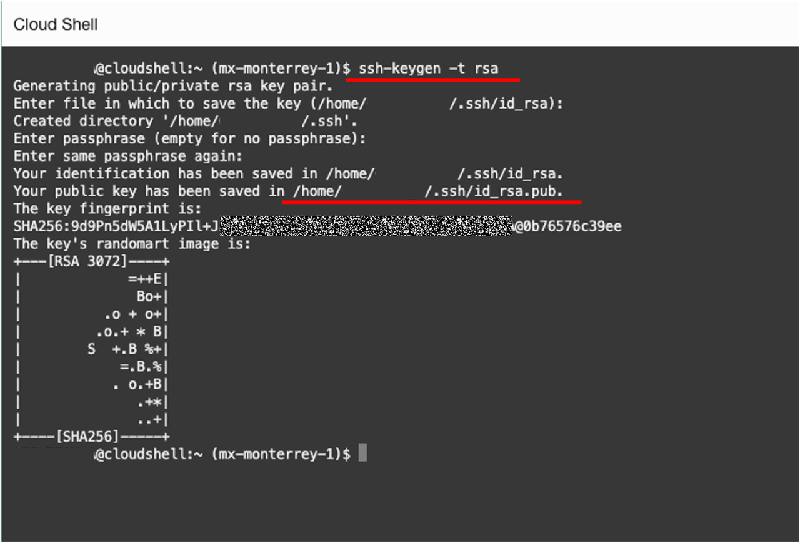

3. The public  and  private SSH keys  are stored in ~/.ssh/id_rsa.pub.

4. Examine the two files that you just created.

    ```bash
    <copy>cd .ssh</copy>
    ```

    ```bash
    <copy>ls</copy>
    ```

    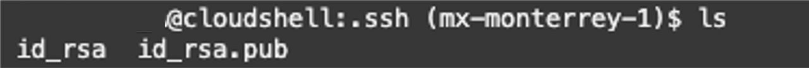

    Note: In the output there are two files, a *private key:* `id_rsa` and a *public key:* `id_rsa.pub`. Keep the private key safe and don't share its content with anyone. The public key will be needed for various activities and can be uploaded to certain systems as well as copied and pasted to facilitate secure communications in the cloud.

## Task 2: Create Compute instance

You will need a compute Instance to connect to your brand new MySQL database.

1. Before creating the Compute instance open a notepad

2. Do the followings steps to copy the public SSH key to the  notepad

    Open the Cloud shell
    Enter the following command

    ```bash
    <copy>cat ~/.ssh/id_rsa.pub</copy>
    ```

    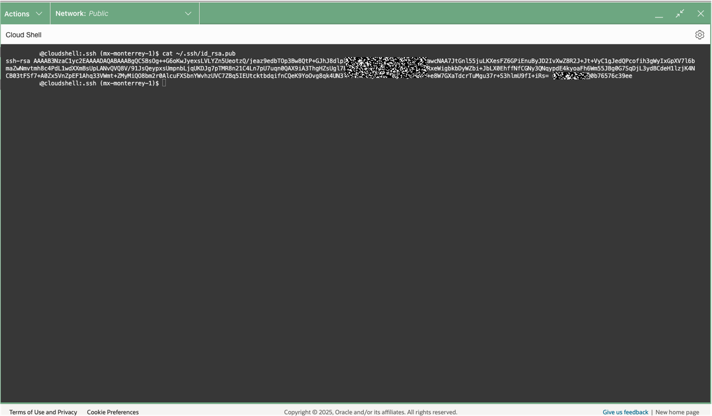

3. Copy the id_rsa.pub content the notepad

    Your notepad should look like this
    

4. Minimize cloud shell

    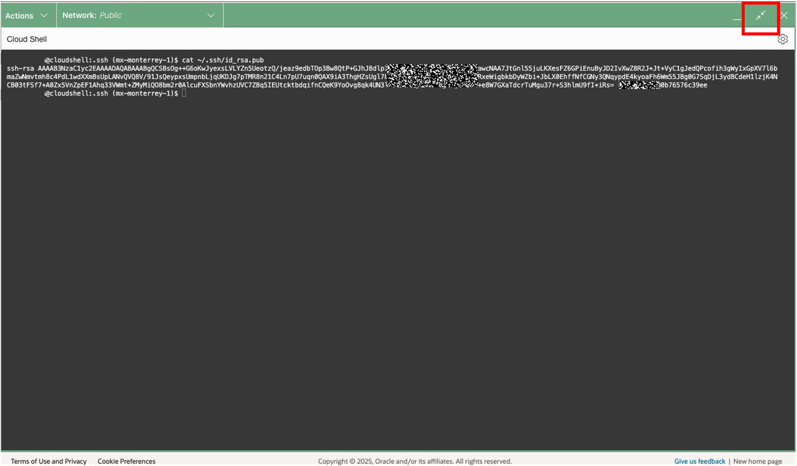

5. To launch a Linux Compute instance, go to
    Navigation Menu
    Compute
    Instances
    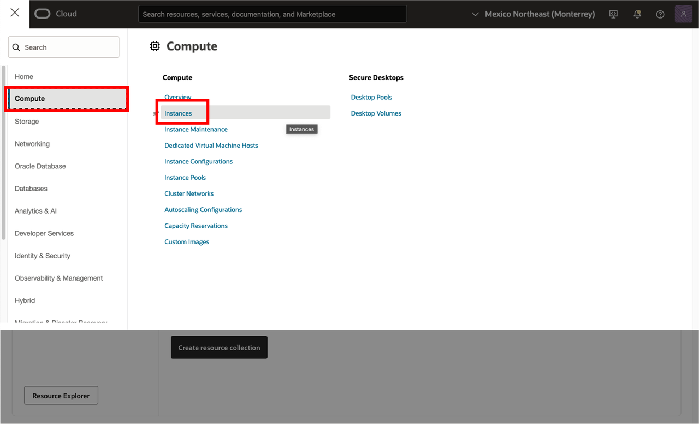

6. On Instances in **(movies)** Compartment, click  **Create Instance**
    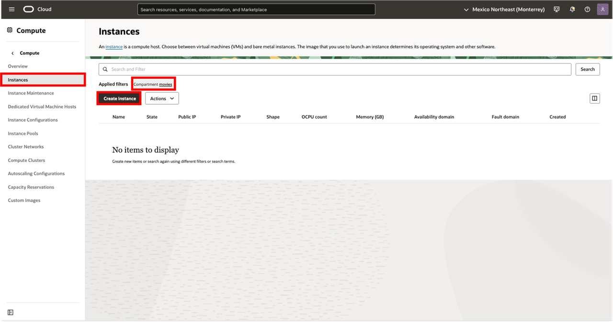

7. On Create Compute Instance 

    Enter Name

    ```bash
    <copy>HEATWAVE-Client</copy>
    ```

8. Make sure **(movies)** compartment is selected 

9. On Placement, keep the selected Availability Domain

    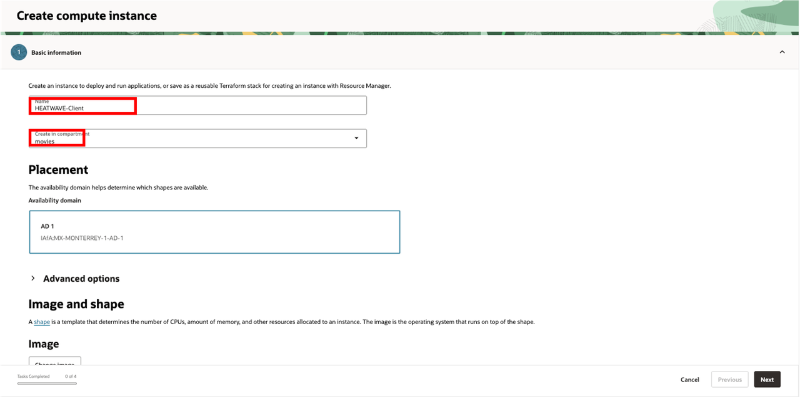  

10. On Image  keep the selected Image, Oracle Linux 8

11. Click Change Shape

12. If not already selected. Select Instance Shape: VM.Standard.E4.Flex with 1 OCPU and 16 GB of RAM

      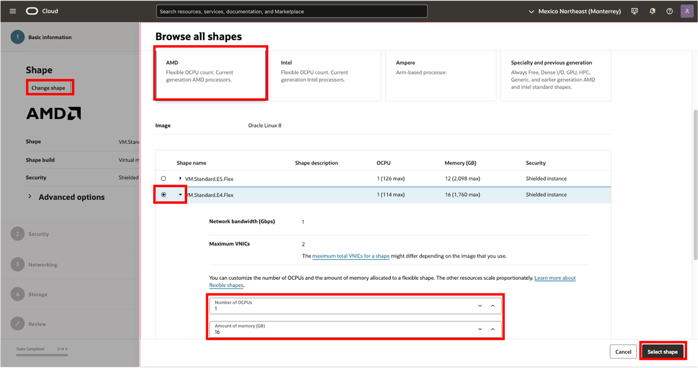 

    Click **Next**

13. On Security, keep the default

    - Shielded instance: Disabled

      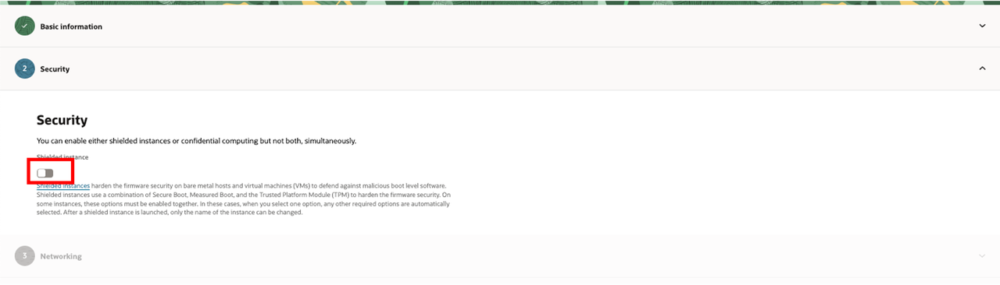

    Click **Next**

14. On Networking. Make sure **HEATWAVE-VCN**  and  and  **public subnet-HEATWAVE-VCN** are selected. Keep Public IPV4 address **Automatically Assign...** default

      

15. On Add SSH keys, paste the public key from the notepad.

    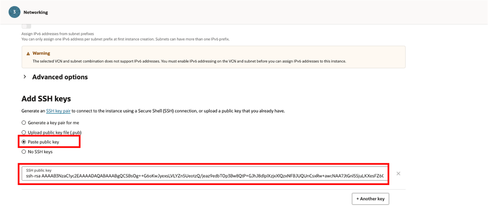

    Click **Next**

16. Keep Boot Volume default. Click **Next**

17. Click **Create** button to finish creating your Compute Instance.

    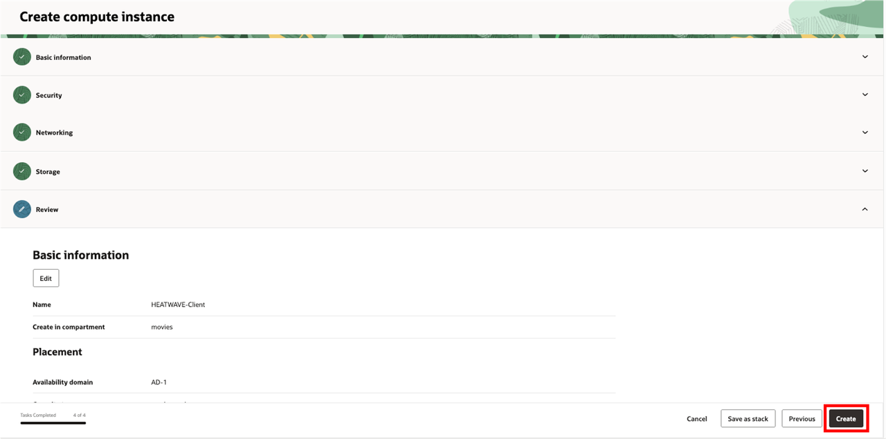

18. The New Virtual Machine will be ready to use after a few minutes. The state will be shown as 'Provisioning' during the creation
    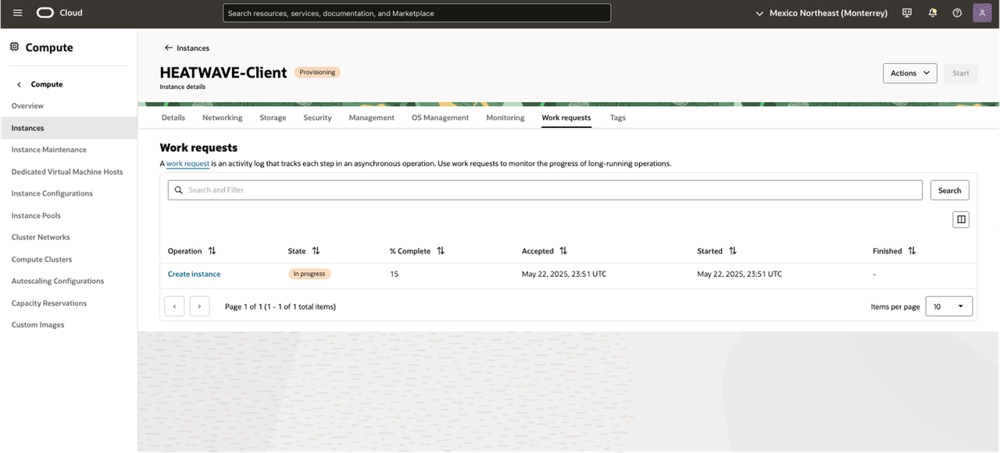

19. The state 'Running' indicates that the Virtual Machine is ready to use.

    Click on the 'Networking' tab to see the compute network details

    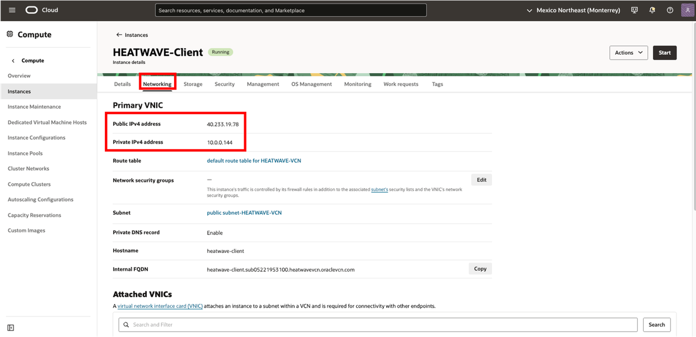

## Task 3: Connect to Bastion Compute and Install MySQL Shell

1. Copy the public IP address of the active Compute Instance to your notepad

    Go to Navigation Menu
    - Compute
    - Instances
    - Copy **Public IP**
    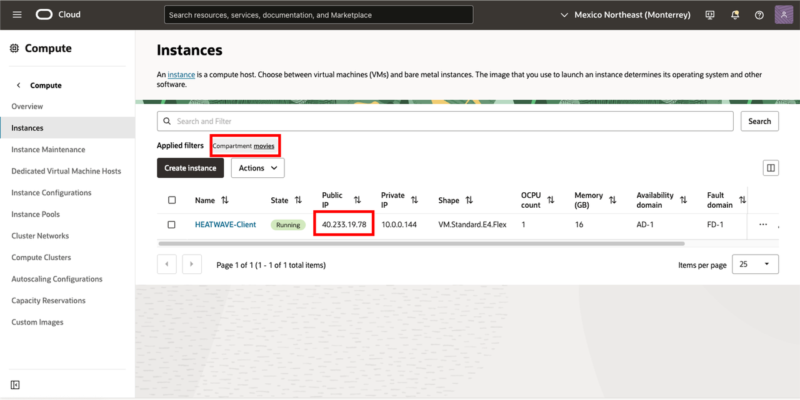

2. Go to Cloud shell to SSH into the new Compute Instance

    Enter the username **opc** and the Public **IP Address**.

    Note: The **HEATWAVE-Client**  shows the  Public IP Address as mentioned on TASK 3: Step 1

    (Example: **ssh -i ~/.ssh/id_rsa opc@132.145.170...**) 

    ```bash
    <copy>ssh -i ~/.ssh/id_rsa opc@<your_compute_instance_ip></copy>
    ```

    For the **Are you sure you want to continue connecting (yes/no)?**
    - answer **yes**

    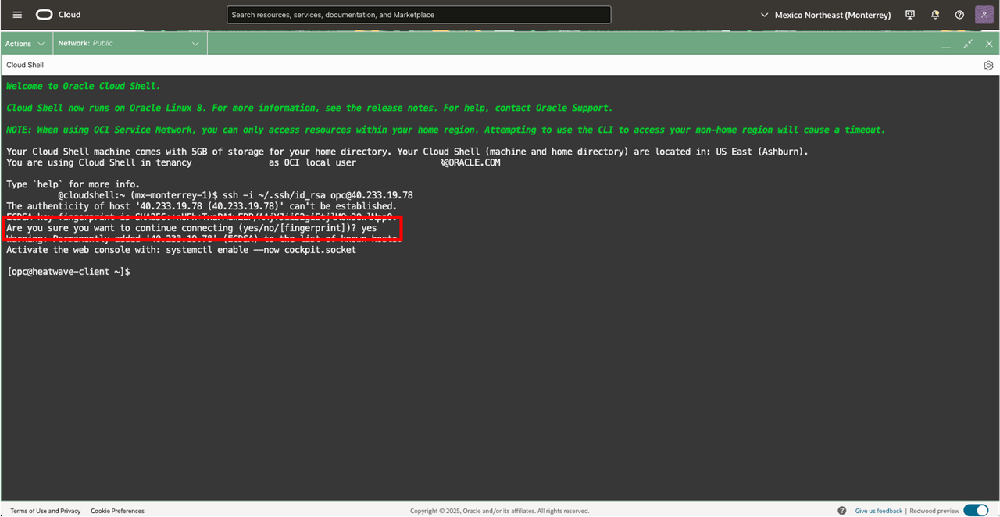

3. You will need a MySQL client tool to connect to your new MySQL HeatWave System from the Bastion. You can download the specific desired version and architecture at [MySQL Community Dowloads](https://dev.mysql.com/downloads/shell/)

    To Install the current latest version MySQL Shell version, you can follow the instructions:

    a. Install MySQL Shell with the following command (enter y for each question)

    ```bash
    <copy>wget https://dev.mysql.com/get/Downloads/MySQL-Shell/mysql-shell-9.3.0-1.el8.x86_64.rpm</copy>
    ```

    ```bash
    <copy>sudo yum install mysql-shell-9* -y</copy>
    ```

    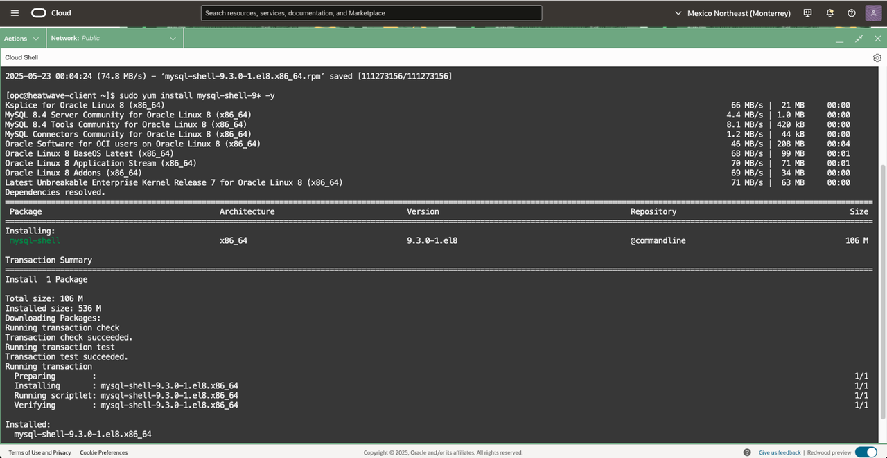

## Task 4: Install Python and Pandas

1. Verify Pandas and Python works

    a. Install Pandas

    ```bash
    <copy>sudo pip3 install pandas</copy>
    ```

    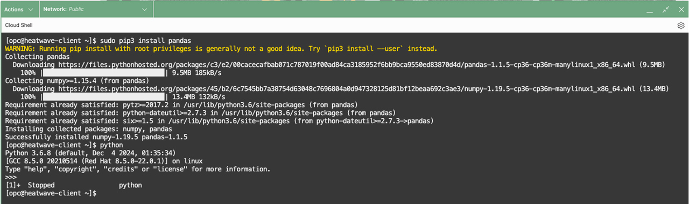

    b. Test Python is working

    ```bash
    <copy>python</copy>
    ```

    c. Exit Python with **Ctrl + Z**

You may now **proceed to the next lab**

## Learn More

- [Oracle Cloud Infrastructure Compute Documentation](https://docs.oracle.com/en-us/iaas/Content/Compute/home.htm)
- [MySQL Shell Documentation](https://dev.mysql.com/doc/mysql-shell/8.4/en/mysql-shell-features.html)

## Acknowledgements

- **Author** - Cristian Aguilar, MySQL Solution Engineering
- **Contributors** - Perside Foster, MySQL Principal Solution Engineering
- **Last Updated By/Date** - Cristian Aguilar, MySQL Solution Engineering, May 2025