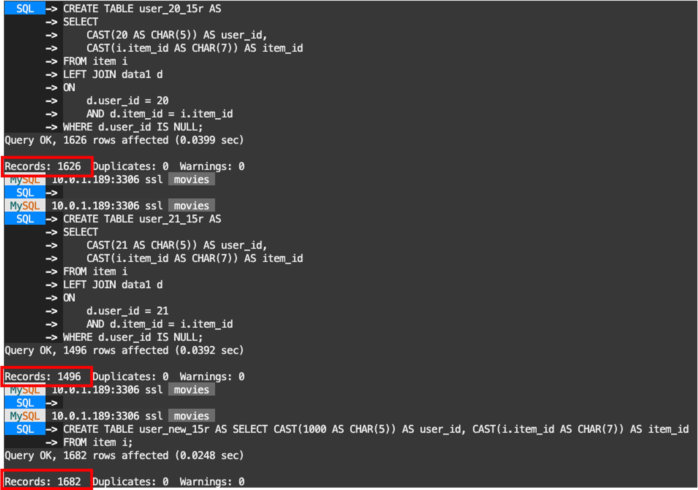
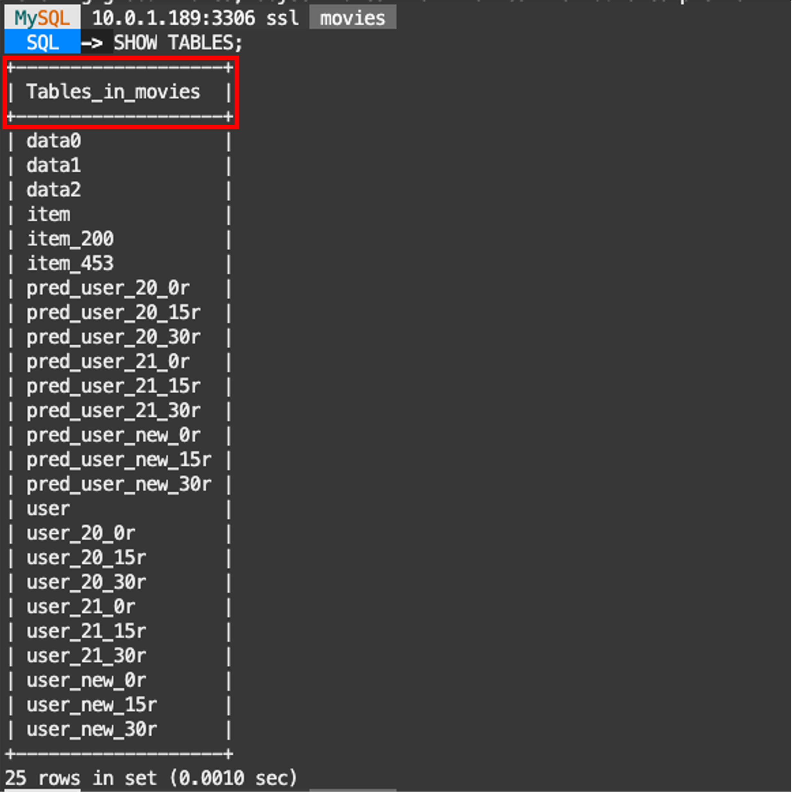

#  Create the base Movies Database Tables for the Movie App


## Introduction

In this lab, you will create the additional tables needed to train the MySQL HeatWave AutoML models and the tables needed to generate predictions with **ML\_PREDICT\_TABLE AutoMl function** using these Machine Learning models. These tables will also allow Oracle APEX to consume the data easily with RESTful Services for MySQL HeatWave Database Service.

_Estimated Time:_ 20 minutes

### Objectives

In this lab, you will be guided through the following tasks:

- Create the supporting tables for the predictions tables
- Create the predictions tables

### Prerequisites

- An Oracle Trial or Paid Cloud Account
- Some Experience with MySQL Shell
- Completed Lab 6

## Task 1: Connect with MySQL Shell:

1. Go to Cloud shell to SSH into the new Compute Instance

     (Example: **ssh -i ~/.ssh/id_rsa opc@132.145.170...**)

    ```bash
    <copy>ssh -i ~/.ssh/id_rsa opc@<your_compute_instance_ip></copy>
    ```

2. On the command line, connect to MySQL using the MySQL Shell client tool with the following command:

    ```bash
    <copy>mysqlsh -uadmin -p -h 10.... -P3306 --sql </copy>
    ```

    

## Task 2: Create the supporting tables to generate the predictions for two selected users

1. Create the supporting tables to generate the USER-ITEM predictions with the trained models:

    Enter the following command at the prompt
    a. Make sure you are in the movies schema

    ```bash
    <copy>USE movies;</copy>
    ```

    b. Create the supporting tables. Three tables for the users '20', '21' and a 'new' user will be created.

    Enter the following command at the prompt. **Click on Reveal code block**

    <details>
        <summary>**_Reveal code block_**</summary>
        ```bash
        <copy>
        CREATE TABLE user_20_0r AS
        SELECT
            CAST(20 AS CHAR(5)) AS user_id,
            CAST(i.item_id AS CHAR(7)) AS item_id
        FROM item i
        LEFT JOIN data0 d
        ON
            d.user_id = 20
            AND d.item_id = i.item_id
        WHERE d.user_id IS NULL;

        CREATE TABLE user_21_0r AS
        SELECT
            CAST(21 AS CHAR(5)) AS user_id,
            CAST(i.item_id AS CHAR(7)) AS item_id
        FROM item i
        LEFT JOIN data0 d
        ON
            d.user_id = 21
            AND d.item_id = i.item_id
        WHERE d.user_id IS NULL;

        CREATE TABLE user_new_0r AS SELECT CAST(1000 AS CHAR(5)) AS user_id, CAST(i.item_id AS CHAR(7)) AS item_id
        FROM item i;

        CREATE TABLE user_20_15r AS
        SELECT
            CAST(20 AS CHAR(5)) AS user_id,
            CAST(i.item_id AS CHAR(7)) AS item_id
        FROM item i
        LEFT JOIN data1 d
        ON
            d.user_id = 20
            AND d.item_id = i.item_id
        WHERE d.user_id IS NULL;

        CREATE TABLE user_21_15r AS
        SELECT
            CAST(21 AS CHAR(5)) AS user_id,
            CAST(i.item_id AS CHAR(7)) AS item_id
        FROM item i
        LEFT JOIN data1 d
        ON
            d.user_id = 21
            AND d.item_id = i.item_id
        WHERE d.user_id IS NULL;

        CREATE TABLE user_new_15r AS SELECT CAST(1000 AS CHAR(5)) AS user_id, CAST(i.item_id AS CHAR(7)) AS item_id
        FROM item i;

        CREATE TABLE user_20_30r AS
        SELECT
            CAST(20 AS CHAR(5)) AS user_id,
            CAST(i.item_id AS CHAR(7)) AS item_id
        FROM item i
        LEFT JOIN data2 d
        ON
            d.user_id = 20
            AND d.item_id = i.item_id
        WHERE d.user_id IS NULL;

        CREATE TABLE user_21_30r AS
        SELECT
            CAST(21 AS CHAR(5)) AS user_id,
            CAST(i.item_id AS CHAR(7)) AS item_id
        FROM item i
        LEFT JOIN data2 d
        ON
            d.user_id = 21
            AND d.item_id = i.item_id
        WHERE d.user_id IS NULL;

        CREATE TABLE user_new_30r AS SELECT CAST(1000 AS CHAR(5)) AS user_id, CAST(i.item_id AS CHAR(7)) AS item_id
        FROM item i;
        </copy>
        ```
    </details>

    c. Hit **ENTER** to execute the last command

    d. Notice the difference in the number of created records for the tables

    The number of records for every user table will vary between each other. This is because we are only getting the items from the user that the models WERE NOT trained with.

    This is exactly the same that the function ML\_PREDICT\_ROW does. In this case we are generating the results in tables to be easily consumed by the ORACLE APEX APP.

    

    e. Show the tables generated up until now

    ```bash
    <copy>USE movies;
    SHOW TABLES;
    </copy>
    ```

    

## Task 3: Create the supporting tables to generate the predictions for two selected items

1. Create the supporting tables to generate the ITEM-USER predictions with the trained models:

    ```bash
    <copy>CREATE TABLE item_200 AS
    SELECT
        CAST(200 AS CHAR(7)) AS item_id,
        CAST(i.user_id AS CHAR(5)) AS user_id
    FROM
        user i
    LEFT JOIN
        data0 d
    ON
        d.item_id = 200
        AND d.user_id = i.user_id
    WHERE
        d.item_id IS NULL;

    CREATE TABLE item_453 AS
    SELECT
        CAST(453 AS CHAR(7)) AS item_id,
        CAST(i.user_id AS CHAR(5)) AS user_id
    FROM
        user i
    LEFT JOIN
        data0 d
    ON
        d.item_id = 453
        AND d.user_id = i.user_id
    WHERE
        d.item_id IS NULL;</copy>
    ```

## Task 4: Generate the USER-ITEM and ITEM-USER Prediction Tables

1. Load to memory the trained ML models if they are not loaded already

    a. Set the model handle variables for every model

    ```bash
    <copy>
    SET @movies_model_1=(SELECT model_handle FROM ML_SCHEMA_admin.MODEL_CATALOG ORDER BY model_id DESC LIMIT 1 OFFSET 2);

    SET @movies_model_2=(SELECT model_handle FROM ML_SCHEMA_admin.MODEL_CATALOG ORDER BY model_id DESC LIMIT 1 OFFSET 1);

    SET @movies_model_3=(SELECT model_handle FROM ML_SCHEMA_admin.MODEL_CATALOG ORDER BY model_id DESC LIMIT 1 OFFSET 0);
    </copy>
    ```
    
    b. Hit **ENTER** to execute the last command

    c. Load every model in memory before using them

    ```bash
    <copy>
    CALL sys.ML_MODEL_LOAD(@movies_model_1, NULL);
    CALL sys.ML_MODEL_LOAD(@movies_model_2, NULL);
    CALL sys.ML_MODEL_LOAD(@movies_model_3, NULL);</copy>
    ```

    d. Hit **ENTER** to execute the last command

2. Generate the USER-ITEM table predictions with the trained models:

    a. Use the function ML\_PREDICT\_TABLE to generate the USER-ITEM tables.


    ```bash
    <copy>
    call sys.ML_PREDICT_TABLE('movies.user_20_0r',@movies_model_1,'movies.pred_user_20_0r',NULL);

    call sys.ML_PREDICT_TABLE('movies.user_20_15r',@movies_model_2,'movies.pred_user_20_15r',NULL);

    call sys.ML_PREDICT_TABLE('movies.user_20_30r',@movies_model_3,'movies.pred_user_20_30r',NULL);</copy>
    ```

    Hit **ENTER** to execute the last command

    ```bash
    <copy>
    call sys.ML_PREDICT_TABLE('movies.user_21_0r',@movies_model_1,'movies.pred_user_21_0r',NULL);

    call sys.ML_PREDICT_TABLE('movies.user_21_15r',@movies_model_2,'movies.pred_user_21_15r',NULL);

    call sys.ML_PREDICT_TABLE('movies.user_21_30r',@movies_model_3,'movies.pred_user_21_30r',NULL);</copy>
    ```

    Hit **ENTER** to execute the last command

    ```bash
    <copy>
    call sys.ML_PREDICT_TABLE('movies.user_new_0r',@movies_model_1,'movies.pred_user_new_0r',NULL);

    call sys.ML_PREDICT_TABLE('movies.user_new_15r',@movies_model_2,'movies.pred_user_new_15r',NULL);

    call sys.ML_PREDICT_TABLE('movies.user_new_30r',@movies_model_3,'movies.pred_user_new_30r',NULL);</copy>
    ```

    Hit **ENTER** to execute the last command

    b. Show the tables generated up until now

    ```bash
    <copy>USE movies;
    SHOW TABLES;
    </copy>
    ```

    

3. Generate the ITEM-USER table predictions with the trained models:

    a.

    ```bash
    <copy>
    call sys.ML_PREDICT_TABLE('movies.item_200',@movies_model_1,'movies.pred_item_200',NULL);

    call sys.ML_PREDICT_TABLE('movies.item_453',@movies_model_1,'movies.pred_item_453',NULL);</copy>
    ```

    b. Hit **ENTER** to execute the last command

## Task 5: Create the supporting media tables

1. Create the item media table:

    ```bash
    <copy>CREATE TABLE item_media AS SELECT item_id AS `image_id`, title AS `mov_title` FROM item;
    ALTER TABLE item_media ADD COLUMN url_down varchar(255) DEFAULT NULL, ADD COLUMN legend varchar(40) DEFAULT NULL, MODIFY image_id int NOT NULL, ADD PRIMARY KEY (image_id);</copy>
    ```

2. Create the profiles media table:

    ```bash
    <copy>CREATE TABLE `profiles` (
    `user` varchar(10) DEFAULT NULL,
    `name` varchar(20) DEFAULT NULL,
    `media` varchar(255) DEFAULT NULL,
    `legend` varchar(40) NOT NULL DEFAULT ' ');</copy>
    ```

    ```bash
    <copy>INSERT INTO profiles (user,name,media,legend)
    VALUES
    (21,'James',' ',' '),
    (20,'Lisa',' ',' '),
    (600,'Thomas',' ',' '),
    (165,'Marie',' ',' ');
    </copy>
    ```

## Task 6: Reload the movie database to HeatWave Cluster

1. Load the movie tables into the HeatWave cluster memory:

    ```bash
    <copy>CALL sys.heatwave_load(JSON_ARRAY('movies'), NULL);</copy>
    ```

You may now **proceed to the next lab**

## Learn More

- [Oracle Cloud Infrastructure MySQL Database Service Documentation](https://docs.oracle.com/en-us/iaas/mysql-database/index.html)
- [MySQL HeatWave ML Documentation] (https://dev.mysql.com/doc/heatwave/en/mys-hwaml-machine-learning.html)


## Acknowledgements

- **Author** - Perside Foster, MySQL Principal Solution Engineering
- **Contributors** - Mandy Pang, MySQL Principal Product Manager,  Nick Mader, MySQL Global Channel Enablement & Strategy Manager
- **Last Updated By/Date** - Perside Foster, MySQL Solution Engineering, November 2024
