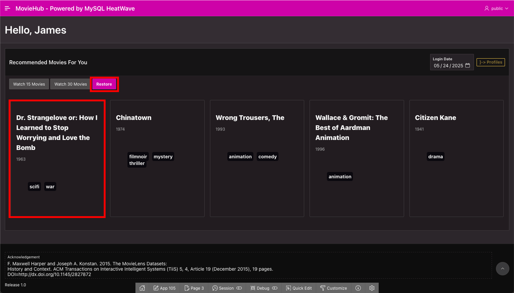
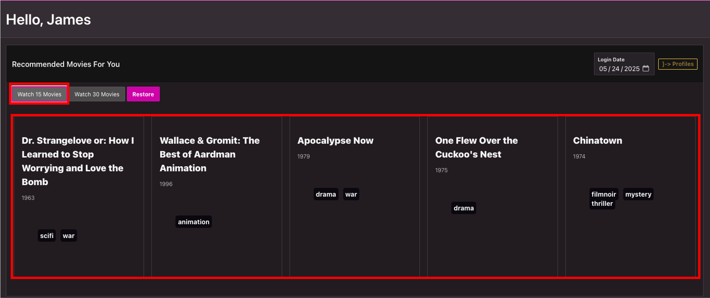
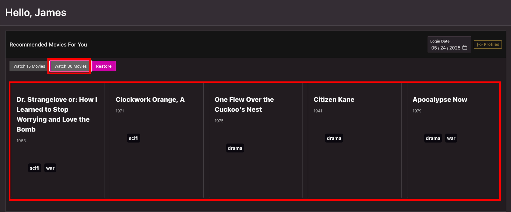

# Develop the MovieHub - Movie Recommendation App

## Introduction

The MovieHub App is a demo application created to showcase the potential of MySQL HeatWave powered applications.

In this lab, you will be guided to create high performance apps powered by the MySQL HeatWave Database Service; developing a movie stream like web application using Oracle APEX, a leading low-code development tool that allows you to create complex web apps in minutes. You will also learn how you can leverage the automation of machine learning processes, thanks to MySQL AutoML that allows you to build, train, deploy, and explain machine learning models within MySQL HeatWave.

_Estimated Time:_ 10 minutes

### Objectives

In this lab, you will be guided through the following task:

- Running the MovieHub demo application powered by MySQL
- Explore the users movies recommendation pages
- Use the Administration Views page
- Explore the Analytics Dashboard page
- Explore the Holiday Movie page

### Prerequisites

- An Oracle Trial or Paid Cloud Account
- Some Experience with MySQL Shell
- Some Experience with Oracle Autonomous and Oracle APEX
- Completed Lab 9

## Task 1: Run the MovieHub App

1. Login into to your Oracle APEX workspace

    

    You should see the imported application

2. Run and log into the imported app

    **The app will not run correctly if the Web credentials and Endopint have not been correctly set at Lab 8, Task 6 and Lab 9, Task 3**

    a. Click on **Run**

    A window will open in the web browser with the application home page

    

    Notice that the nobody user will be the default value when you are not currently logged as your APEX account

    c. Click on **Go To User Login Page**

    The application login page will appear

    

    d. Introduce your the user credentials of the 'public' account. This will simulate what happens when a not administrator user logs in the MovieHub App

    

## Task 2: Explore the users movies recommendation pages

1. Explore the Profiles page

    a. The **My Profiles** page will open, with the current account profiles in the app

    

    b. At any time, You can log out. This action will return you to the home page

    c. When logged as the public account, only the Profiles page will appear in the Side Tree Navigation Menu

    

2. See the movie recommendations for the user James

    a. Go to the profiles page

    

    b. Click the button below James profile

    

    c. The James movies recommendation page will appear

    

    The page will have the top 5 recommended movies, according to the "**pred\_user\_21\_0r**" MySQL table. This page is loaded with the **Restore** button as well

3. Explore the movie recommendations when you add more movie records to the data with "Watch movies" buttons. **This simulates the action of watching 15 and 30 movies from the movie catalog compared with the original data**

    a. Click on **Watch 15 movies**

    

    Notice the movie recommendation change. This action will show the top 5 recommended movies, according to the "**pred\_user\_21\_15r**" MySQL table

    b. Click on **Watch 30 movies**

    

    Notice the movie recommendation change. This action will show the top 5 recommended movies, according to the "**pred\_user\_21\_30r**" MySQL table

4. Explore the popular movies recommendations

    The application allows you to simulate what would happen if the user has inactivity for more than 30 days. This will trigger the global recommendations that are the same as a **new user**.

    a. Click on the Date Picker Item

    

    b. Select **30 days after** today's date. Or Select the **next month**

    

    Notice the movie recommendation change. This action will show the top 5 recommended movies, according to the "**pred\_user\_30\_30r**" MySQL table

## Task 3: Explore the Analytics Dashboard page

1. **Log Out** from the 'public' account

    

2. **Log In** as an 'admin' account

    

3. When logged in as an administrative account, the Home Page will be the **Admin Views**

    

4. Click in the Analytics Dashboard button to access the **Analytics Dashboard** page. You can also access this pages by the Navigation Menu

    

    You can see:

    a. **Movies - Genres Distribution** Pie chart

    b. **User - Gender Distribution** Donut chart

    c. **Users - Age Distribution** Bar chart

    d. **Top 10 Trending Movies** Bar chart

## Task 4: Explore the Holiday and Top Trending Movies page

1. Click in the **Holiday Movie** Navigation Menu button to access the **Holiday Movie** page

    a.

    

    b. The page will have the top 10 recommended users for the Movie 200 - 'The Shinning', according to the "**pred\_item\_200**" MySQL table

    

2. You can inspect the **Top Trending Movie** page too.

You may now **proceed to the next lab**

## Learn More

- [Oracle Autonomous Database Serverless Documentation](https://docs.oracle.com/en/cloud/paas/autonomous-database/serverless/adbsb/index.html#Oracle%C2%AE-Cloud)
- [Oracle APEX Rendering Objects Documentation](https://docs.oracle.com/en/database/oracle/apex/23.1/aexjs/apex.html)
- [Oracle JavaScript Extension Toolkit (JET) API Reference Documentation](https://docs.oracle.com/en/middleware/developer-tools/jet/14.1/develop/getting-started-oracle-javascript-extension-toolkit-jet.html)
- [Oracle Cloud Infrastructure MySQL Database Service Documentation](https://docs.oracle.com/en-us/iaas/mysql-database/home.htm)
- [MySQL HeatWave AutoML Documentation] (https://dev.mysql.com/doc/heatwave/en/mys-hwaml-machine-learning.html)

## Acknowledgements

- **Author** - Cristian Aguilar, MySQL Solution Engineering
- **Contributors** - Perside Foster, MySQL Principal Solution Engineering
- **Last Updated By/Date** - Cristian Aguilar, MySQL Solution Engineering, May 2025
