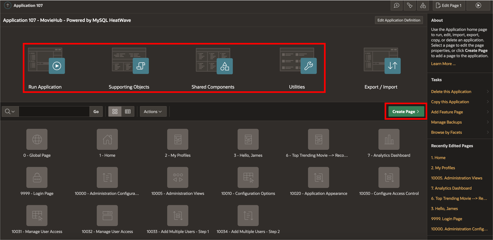
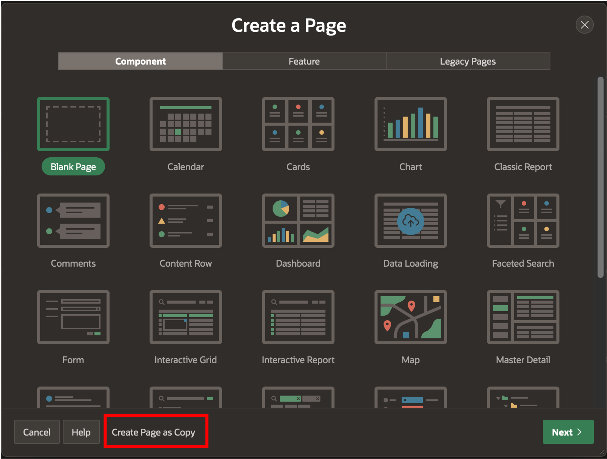
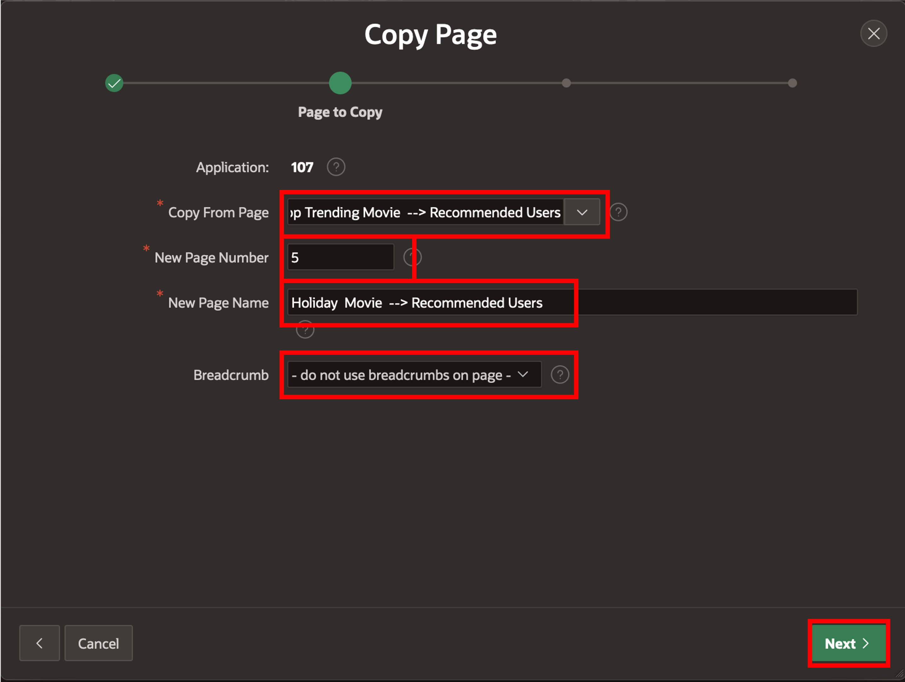
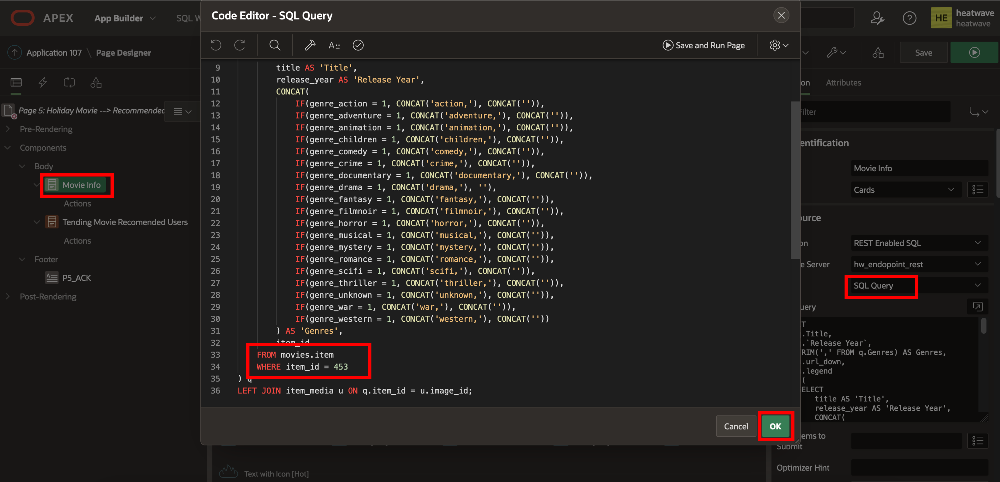

# Add a User Recommendation page for a Holiday Themed Movie in the 'Admin Views'

## Introduction

In this lab, you will add a user recommendation page for a Holiday Themed Movie. This page will allow the administrator to see the recommended users for a movie. In this case a Halloween movie

_Estimated Time:_ 45 minutes

### Objectives

In this lab, you will be guided through the following task:

- Adding the second item to user recommendation page
- Editing the page to get the recommended users for a given item
- Create a movie to potential users recommendation page
- Add Analytics Charts to the Analytic Dashboard

### Prerequisites

- An Oracle Trial or Paid Cloud Account
- Some Experience with MySQL Shell
- Some Experience with Oracle Autonomous and Oracle APEX
- Completed Lab 10

## Task 1: Create the Holiday Movie Admin page

1. Edit the MovieHub application

    a. Login into to your Oracle APEX workspace

    b. Go to the App Builder in the Oracle APEX workspace

    c. Click on the MovieHub application to edit. This will open the Page Designer page

    

    From the Page Designer you can Run, Add pages, Edit pages and Modify Supporting Objects, Shared Components and Utilities

    

    d. Click on **Create Page**

    e. At the bottom of popup window. Click **Create Page as Copy**

    

    f. In the **Copy Page**, select **Page in this application**. Click **Next**

    g. Enter the following values:

    | Parameter | Value |
    | -------- | -------:|
    | Copy From Page | Top Trending Movie ... |
    | New Page Number | 5 |
    | New Page Name | Holiday Movie --> Recommended Users |
    | Breadcrumb | no |
    {: title="Copy Page - Holiday Movie \| Parameters"}

    

    h. Click **Next**

    i. In the Navigation Menu section, Select **Do not associate this page with a navigation menu entry** and click **Next**

    j. Click **Copy** to create the Holiday Movie page

## Task 2: Edit the Holiday Movie Admin page

You will be in the Page Designer for The Holiday Movie page

1. Edit the Movie Info query source

    a. Select the **Movie Info** region

    b. In the Right Pane, go to the Source section

    

    c. Edit the query. Delete the previous 

You may now **proceed to the next lab**

## Learn More

- [Oracle Autonomous Database Serverless Documentation](https://docs.oracle.com/en/cloud/paas/autonomous-database/serverless/adbsb/index.html#Oracle%C2%AE-Cloud)
- [Oracle APEX Rendering Objects Documentation](https://docs.oracle.com/en/database/oracle/apex/23.1/aexjs/apex.html)
- [Oracle JavaScript Extension Toolkit (JET) API Reference Documentation](https://www.oracle.com/webfolder/technetwork/jet/jsdocs/index.html)
- [Oracle Cloud Infrastructure MySQL Database Service Documentation](https://docs.oracle.com/en-us/iaas/mysql-database/index.html)
- [MySQL HeatWave ML Documentation] (https://dev.mysql.com/doc/heatwave/en/mys-hwaml-machine-learning.html)

## Acknowledgements

- **Author** - Perside Foster, MySQL Solution Engineering

- **Contributors** - Salil Pradhan, Principal Product Manager,
Nick Mader, MySQL Global Channel Enablement & Strategy Manager
- **Last Updated By/Date** - Perside Foster, MySQL Solution Engineering, May 2022
