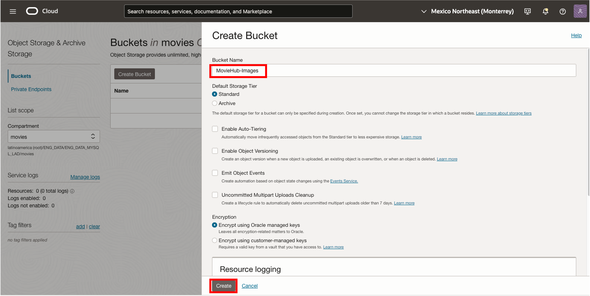
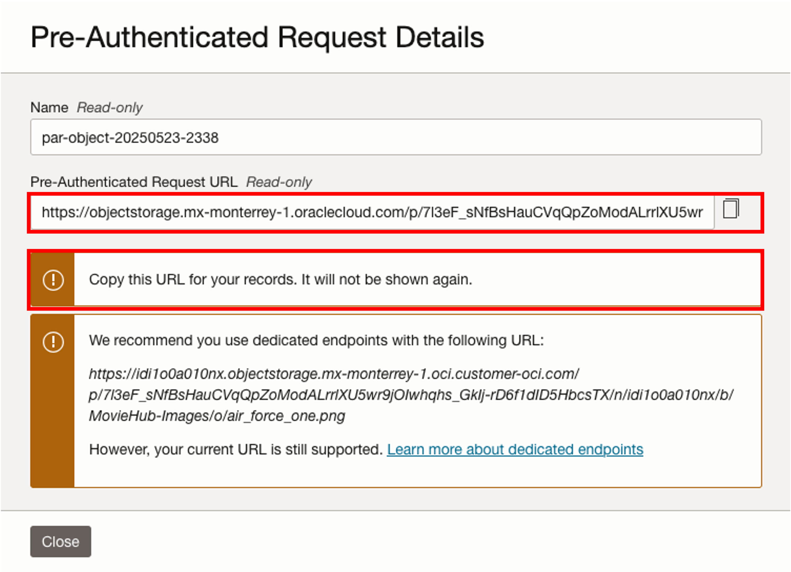
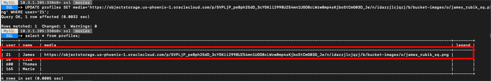
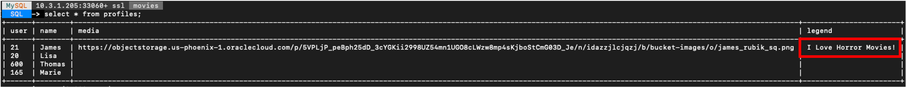
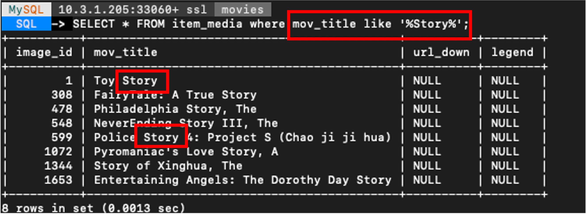
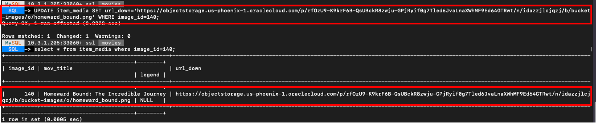

# (Bonus) Add your images to the MovieHub App for display


## Introduction

In this lab you will be guided into adding your  own images into the OCI Object Store and display them in your APEX **MovieHub App**


_Estimated Lab Time:_ 15 minutes

### Objectives

In this lab, you will be guided through the following tasks: 

- Upload your images to a bucket in OCI Object Store **(Please note that due to the very nature of machine learning, recommendations evolve over time and therefore images provided may not always match the movies displayed.)**
- Create pre-authenticated requests for your image files
- Update the media columns in the profiles and item_media tables

### Prerequisites

- An Oracle Trial or Paid Cloud Account
- Some Experience with MySQL Shell
- Must Complete Lab 7

## Task 1: Download sample display images from a Bucket in OCI Object Store:

1. Click on this link to Download the images [MovieHub Sample Images](https://objectstorage.us-ashburn-1.oraclecloud.com/p/IQ5Zvpi-KPjZMgVUMfAQfkzwezllFxOzLgEZ9tuLdkQilotp3WzvUh58eMGRXGTc/n/idi1o0a010nx/b/Bucket-CA/o/LiveLab-MovieHub-images/moviehub_imgs.zip) from the Demo to your local machine

## Task 2: Upload Images to the OCI Object Store:

1. Open the OCI Console

2. Click the **Navigation Menu** in the upper left, navigate to **Storage** and select **Buckets**.


3. On the Buckets page, select the **movies** compartment. Click **Create Bucket**.



4. Scroll down in the MovieHub-images bucket page

5. Click **Upload** to upload objects to the bucket. Upload the images you want to showcase in the app.


## Task 3: Create Pre-Authenticated Requests for each image

1. Click on the three dots in the far right of an object.

2. Click **Create Pre-Authenticated Request**

    a. Select **Permit object reads** on Access Type.

    b. Choose an Expiration date

    c. Click **Create Pre-Authenticated Request**

    

    d. Copy the generated URL into a text file. Notice the warning message. **The URL will not be shown again**

    


## Task 4: Connect with MySQL Shell:

1. Go to Cloud shell to SSH into the new Compute Instance

     (Example: **ssh -i ~/.ssh/id_rsa opc@132.145.170...**)

    ```bash
    <copy>ssh -i ~/.ssh/id_rsa opc@<your_compute_instance_ip></copy>
    ```

2. On the command line, connect to MySQL using the MySQL Shell client tool with the following command:

    ```bash
    <copy>mysqlsh -uadmin -p -h 10.... -P3306 --sql </copy>
    ```

    

3. Make sure you are in the movies schema

    a. Enter the following command at the prompt

    ```bash
    <copy>USE movies;</copy>
    ```

## Task 5: Update the media columns with the generated Pre-Authenticated Requests for your images

1. Update the profiles images for users

    a. List the current users attributes

    ```bash
    <copy>SELECT * FROM profiles;</copy>
    ```
    

    b. Enter the following command at the prompt.

    Replace **Pre-Auth-URL** with the Pre-Authenticated Request image you want use and **USER** with the corresponding user.

    ```bash
    <copy>UPDATE profiles SET media='Pre-Auth-URL' WHERE user='USER';</copy>
    ```

    

    c. You can also add a Legend to display in the app. You can choose a phrase you like

    ```bash
    <copy>UPDATE profiles SET legend='I Love Horror Movies!' WHERE user='USER';</copy>
    ```

    

    d. After you add a URL for every profile, your profile table will look like this

    


2. Update the movie images for the items

    a. List the current item_media attributes

    ```bash
    <copy>SELECT * FROM item_media LIMIT 5;</copy>
    ```

    

    b. You can search for specific movie id or title with the following query. Replace **Story** with your search tearm

    ```bash
    <copy>SELECT * FROM item_media where mov_title like '%Story%';</copy>
    ```

    

    c. Enter the following command at the prompt to update the url column for each movie you want to add an image.

    Replace **Pre-Auth-URL** with the Pre-Authenticated Request image you want use and **IMAGE\_ID** with the corresponding image_id.

    ```bash
    <copy>UPDATE item_media SET url_down='Pre-Auth-URL' WHERE image_id='IMAGE_ID';</copy>
    ```

    

## Task 6: See the changes in the MovieHub App

1. Login into to your Oracle APEX workspace

2. Run and log into the imported app

    a. Click on **Run**

    

3. Explore the Profiles page with the added images

    a. Go to the 'My Profiles page'

    When adding images URLs and legends to the profiles table, your profiles page will look like this

    

4. Explore the Users Recommendations pages with the added images

    a. Go to one of the user's page

    When adding images URLs to the item\_media table, your recommendations pages will look like this

    


## Learn More

- [Oracle Autonomous Database Serverless Documentation](https://docs.oracle.com/en/cloud/paas/autonomous-database/serverless/adbsb/index.html#Oracle%C2%AE-Cloud)
- [Oracle APEX Rendering Objects Documentation](https://docs.oracle.com/en/database/oracle/apex/23.1/aexjs/apex.html)
- [Oracle JavaScript Extension Toolkit (JET) API Reference Documentation](https://www.oracle.com/webfolder/technetwork/jet/jsdocs/index.html)
- [Oracle Cloud Infrastructure MySQL Database Service Documentation](https://docs.oracle.com/en-us/iaas/mysql-database/index.html)
- [MySQL HeatWave ML Documentation] (https://dev.mysql.com/doc/heatwave/en/mys-hwaml-machine-learning.html)

## Acknowledgements

- **Author** - Cristian Aguilar, MySQL Solution Engineering
- **Contributors** - Perside Foster, MySQL Principal Solution Engineering
- **Last Updated By/Date** - Cristian Aguilar, MySQL Solution Engineering, November 2024