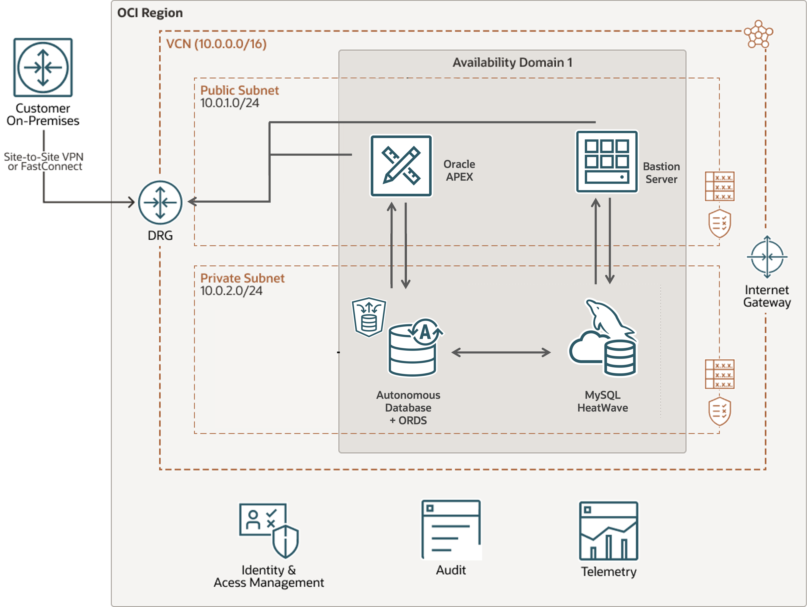

# Introduction

## About this Workshop

Welcome to this workshop in which you’ll follow step-by-step instructions to build the MovieHub application powered by MySQL HeatWave. MovieHub is a fictitious movie streaming application that delivers personalized recommendations using machine learning. It leverages the built-in HeatWave AutoML recommender system to predict, for example, movies that a user will like, or to which users a given movie should be promoted. You’ll build this app using the most popular low-code development platform, Oracle APEX, which will also enable you to create analytics dashboards in the application. You’ll develop a few scenarios both from the user's and the administrator's perspective.

_Estimated Lab Time:_ 3.5 hours

_Lab Setup

## About Product/Technology

MySQL HeatWave is the only cloud service that combines transactions, real-time analytics across data warehouses and data lakes, and machine learning in one MySQL Database—without the complexity, latency, risks, and cost of ETL duplication. It delivers unmatched performance and price-performance. HeatWave AutoML enables in-database machine learning, allowing you to build, train, deploy, and explain machine learning models within MySQL HeatWave. You do not need to move the data to a separate ML cloud service, or be an ML expert. MySQL Autopilot provides machine learning-powered automation that improves the performance, scalability, and ease of use of HeatWave, saving developers and DBAs significant time. The service can be deployed in OCI, AWS, Azure, in a hybrid environment, and in customers’ data centers with OCI Dedicated Region.

## Objectives

In this workshop, you will use OCI, MySQL HeatWave, and Oracle APEX to build the MovieHub application and generate personalized recommendations.

1. Create MySQL HeatWave Database System
2. Setup a HeatWave Cluster for OLAP/AutoML
3. Create Bastion Server for MySQL Data
4. Download & Transform the MovieLens dataset files
5. Add MovieLens data to MySQL HeatWave
6. Create and test HeatWave AutoML Recommender System
7. Create the base Movies Database Tables for the Movie App
8. Query Information from the movies and predictions tables
9. Create a Low Code Application with Oracle APEX and REST SERVICES for MySQL
10. Setup the APEX Application and Workspace
11. Explore the Movie Recommendation App with data inside MySQL HeatWave
12. (Bonus) Add your images to the MovieHub App for display

## Prerequisites

- An Oracle Free Tier, Paid or LiveLabs Cloud Account
- Some Experience with MySQL Shell - [MySQL Site](https://dev.MySQL.com/doc/MySQL-shell/8.0/en/).

You may now **proceed to the next lab**

## Acknowledgements

- **Author** - Cristian Aguilar, MySQL Solution Engineering
- **Contributors** - Perside Foster, MySQL Principal Solution Engineering
- **Last Updated By/Date** - Cristian Aguilar, MySQL Solution Engineering, November 2024

- **Dataset** - F. Maxwell Harper and Joseph A. Konstan. 2015. The MovieLens Datasets:
History and Context. ACM Transactions on Interactive Intelligent
Systems (TiiS) 5, 4, Article 19 (December 2015), 19 pages.
DOI=http://dx.doi.org/10.1145/2827872