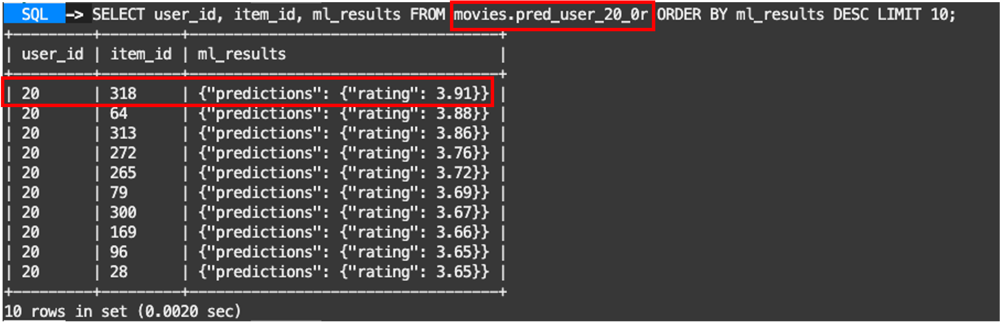
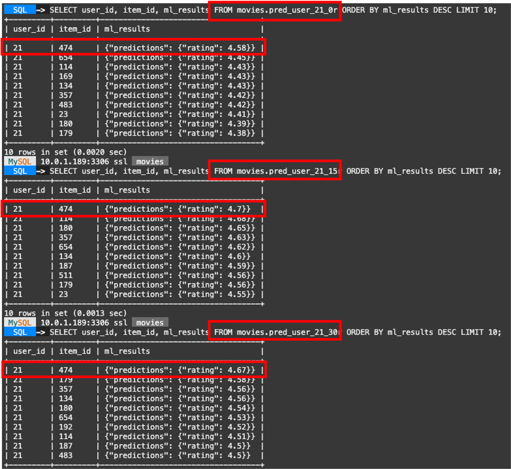
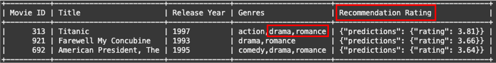

# Query Information from the movies and predictions tables


## Introduction

HeatWave ML makes it easy to use machine learning, whether you are a novice user or an experienced ML practitioner. You provide the data, and HeatWave AutoML analyzes the characteristics of the data and creates an optimized machine learning model that you can use to generate predictions and explanations. An ML model makes predictions by identifying patterns in your data and applying those patterns to unseen data. HeatWave ML explanations help you understand how predictions are made, such as which features of a dataset contribute most to a prediction.

In this lab, you will query information from the movie dataset tables and predictions tables with MySQL HeatWave

_Estimated Time:_ 10 minutes

### Objectives

In this lab, you will be guided through the following tasks:

- Query information from the movie dataset tables
- Query information from users and items prediction  tables
- Query information JOINING different tables

### Prerequisites

- An Oracle Trial or Paid Cloud Account
- Some Experience with MySQL Shell
- Completed Lab 7

## Task 1: Connect MySQL Shell:

1. Go to Cloud shell to SSH into the new Compute Instance

     (Example: **ssh -i ~/.ssh/id_rsa opc@132.145.170...**)

    ```bash
    <copy>ssh -i ~/.ssh/id_rsa opc@<your_compute_instance_ip></copy>
    ```

2. On the command line, connect to MySQL using the MySQL Shell client tool with the following command:

    ```bash
    <copy>mysqlsh -uadmin -p -h 10.... -P3306 --sql </copy>
    ```

    

3. Select the **movies** database

    ```bash
    <copy>USE movies;</copy>
    ```

## Task 2: Query information from the movie dataset tables

1. Select 5 Sci-Fi movies from the item table

    ```bash
    <copy>
    SELECT item_id as 'Movie id', title as 'Title', release_year as 'Year',
    CONCAT(
            IF(genre_action = 1, CONCAT('action,'), CONCAT('')),
            IF(genre_adventure = 1, CONCAT('adventure,'), CONCAT('')),
            IF(genre_animation = 1, CONCAT('animation,'), CONCAT('')),
            IF(genre_children = 1, CONCAT('children,'), CONCAT('')),
            IF(genre_comedy = 1, CONCAT('comedy,'), CONCAT('')),
            IF(genre_crime = 1, CONCAT('crime,'), CONCAT('')),
            IF(genre_documentary = 1, CONCAT('documentary,'), CONCAT('')),
            IF(genre_drama = 1, CONCAT('drama,'), ''),
            IF(genre_fantasy = 1, CONCAT('fantasy,'), CONCAT('')),
            IF(genre_filmnoir = 1, CONCAT('filmnoir,'), CONCAT('')),
            IF(genre_horror = 1, CONCAT('horror,'), CONCAT('')),
            IF(genre_musical = 1, CONCAT('musical,'), CONCAT('')),
            IF(genre_mystery = 1, CONCAT('mystery,'), CONCAT('')),
            IF(genre_romance = 1, CONCAT('romance,'), CONCAT('')),
            IF(genre_scifi = 1, CONCAT('scifi,'), CONCAT('')),
            IF(genre_thriller = 1, CONCAT('thriller,'), CONCAT('')),
            IF(genre_unknown = 1, CONCAT('unknown,'), CONCAT('')),
            IF(genre_war = 1, CONCAT('war,'), CONCAT('')),
            IF(genre_western = 1, CONCAT('western,'), CONCAT(''))
        ) AS 'Genres'
    FROM movies.item WHERE genre_scifi=1 LIMIT 5;
    </copy>
    ```
    

## Task 4: Query information from users and items prediction  tables

1. Select the top 10 movie predictions from the user 20 with the different models

    a. Select top 10 items from the pred\_user\_20\_0r. This table has the predictions for the original data, **data0** table

    ```bash
    <copy>
    SELECT user_id, item_id, ml_results FROM movies.pred_user_20_0r ORDER BY ml_results DESC LIMIT 10;
    </copy>
    ```
    

    b. Select top 10 items from the pred\_user\_20\_15r. This table has the predictions when adding 15 records to the original data, **data1** table

    ```bash
    <copy>
    SELECT user_id, item_id, ml_results FROM movies.pred_user_20_15r ORDER BY ml_results DESC LIMIT 10;
    </copy>
    ```

    c. Select top 10 items from the pred\_user\_20\_15r. This table has the predictions when adding 30 records to the original data, **data2** table

    ```bash
    <copy>
    SELECT user_id, item_id, ml_results FROM movies.pred_user_20_30r ORDER BY ml_results DESC LIMIT 10;
    </copy>
    ```

2. Now, select the top 10 movie predictions from the user 21 with the different models

    a.

    ```bash
    <copy>
    SELECT user_id, item_id, ml_results FROM movies.pred_user_21_0r ORDER BY ml_results DESC LIMIT 10;
    SELECT user_id, item_id, ml_results FROM movies.pred_user_21_15r ORDER BY ml_results DESC LIMIT 10;
    SELECT user_id, item_id, ml_results FROM movies.pred_user_21_30r ORDER BY ml_results DESC LIMIT 10;
    </copy>
    ```

    b. Hit **ENTER** to execute the last command

    

## Task 5: Query information JOINING different tables

You can use the predictions tables and the dataset tables in a JOIN to get better results.
This Query will join information from the **item** table with the predictions table

1. Select the top 3 movie predictions from the user 20 that belong to both 'Romance' and 'Drama' Genres

    ```bash
        <copy>SELECT
        q.item_id AS `Movie ID`,
        q.Title,
        q.`Release Year`,
        TRIM(',' FROM q.Genres) AS Genres,
        m.ml_results AS 'Recommendation Rating'
    FROM movies.pred_user_20_15r m
    JOIN (
        SELECT
            item_id,
            title AS 'Title',
            release_year AS 'Release Year',
            CONCAT(
                IF(genre_action = 1, CONCAT('action,'), CONCAT('')),
                IF(genre_adventure = 1, CONCAT('adventure,'), CONCAT('')),
                IF(genre_animation = 1, CONCAT('animation,'), CONCAT('')),
                IF(genre_children = 1, CONCAT('children,'), CONCAT('')),
                IF(genre_comedy = 1, CONCAT('comedy,'), CONCAT('')),
                IF(genre_crime = 1, CONCAT('crime,'), CONCAT('')),
                IF(genre_documentary = 1, CONCAT('documentary,'), CONCAT('')),
                IF(genre_drama = 1, CONCAT('drama,'), ''),
                IF(genre_fantasy = 1, CONCAT('fantasy,'), CONCAT('')),
                IF(genre_filmnoir = 1, CONCAT('filmnoir,'), CONCAT('')),
                IF(genre_horror = 1, CONCAT('horror,'), CONCAT('')),
                IF(genre_musical = 1, CONCAT('musical,'), CONCAT('')),
                IF(genre_mystery = 1, CONCAT('mystery,'), CONCAT('')),
                IF(genre_romance = 1, CONCAT('romance,'), CONCAT('')),
                IF(genre_scifi = 1, CONCAT('scifi,'), CONCAT('')),
                IF(genre_thriller = 1, CONCAT('thriller,'), CONCAT('')),
                IF(genre_unknown = 1, CONCAT('unknown,'), CONCAT('')),
                IF(genre_war = 1, CONCAT('war,'), CONCAT('')),
                IF(genre_western = 1, CONCAT('western,'), CONCAT(''))
            ) AS 'Genres'
        FROM movies.item WHERE genre_romance=1 and genre_drama=1
    ) q ON m.item_id = q.item_id
    ORDER BY m.ml_results DESC, q.Title DESC
    LIMIT 3;
    </copy>
    ```

    


You may now **proceed to the next lab**

## Learn More

- [Oracle Cloud Infrastructure MySQL Database Service Documentation](https://docs.oracle.com/en-us/iaas/mysql-database/index.html)
- [MySQL HeatWave ML Documentation] (https://dev.mysql.com/doc/heatwave/en/mys-hwaml-machine-learning.html)

## Acknowledgements

- **Author** - Cristian Aguilar, MySQL Solution Engineering
- **Contributors** - Perside Foster, MySQL Principal Solution Engineering
- **Last Updated By/Date** - Cristian Aguilar, MySQL Solution Engineering, November 2024
