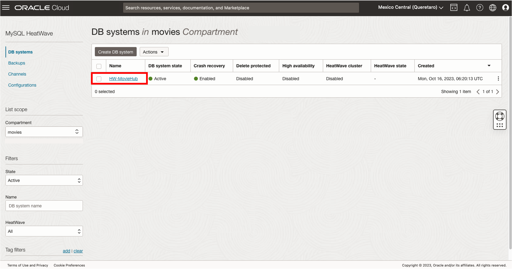
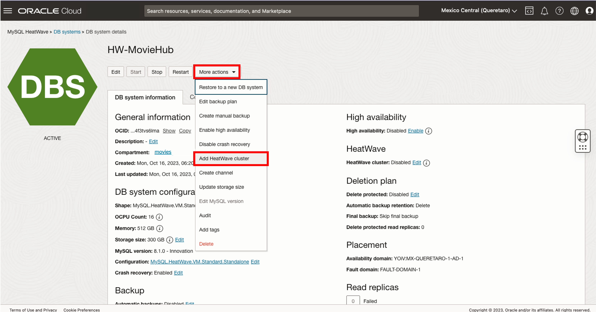
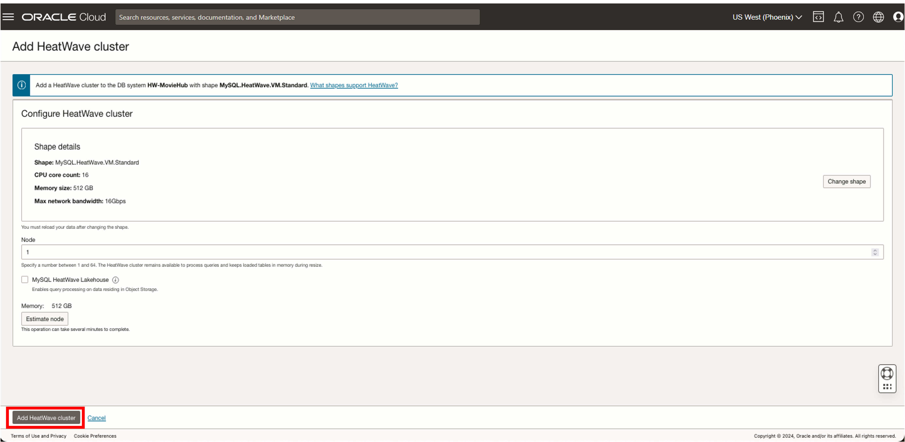
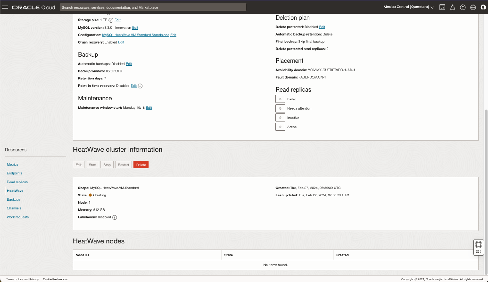

# Setup a HeatWave Cluster for OLAP/AutoML

## Introduction

A HeatWave cluster comprise of a MySQL DB System node and one or more HeatWave nodes. The MySQL DB System node includes a plugin that is responsible for cluster management, loading data into the HeatWave cluster, query scheduling, and returning query result.

_Estimated Time:_ 10 minutes

### Objectives

In this lab, you will be guided through the following task:

- Add a HeatWave Cluster to MySQL Database System

### Prerequisites

- An Oracle Trial or Paid Cloud Account
- Some Experience with MySQL Shell
- Completed Lab 2

## Task 1: Add a HeatWave Cluster to MDS-HW MySQL Database System

1. Open the navigation menu
    - Databases
    - MySQL
    - DB Systems
2. Choose the **movies** Compartment. A list of DB Systems is displayed.
    

3. In the list of DB Systems, click the **HW-MovieHub** system. click **More Action ->  Add HeatWave Cluster**.
    

4. On the “Add HeatWave Cluster” dialog, select the “HeatWave.512GB” shape

5. Click “Add HeatWave Cluster” to create the HeatWave cluster
    

6. HeatWave creation will take about 10 minutes. From the DB display page scroll down to the Resources section. Click the **HeatWave** link. Your completed HeatWave Cluster Information section will look like this:
    

You may now **proceed to the next lab**

## Learn More

- [Oracle Cloud Infrastructure MySQL Database Service Documentation](https://docs.cloud.oracle.com/en-us/iaas/MySQL-database)
- [MySQL Database Documentation](https://www.MySQL.com)

You may now **proceed to the next lab**

## Acknowledgements

- **Author** - Perside Foster, MySQL Principal Solution Engineering
- **Contributors** - Mandy Pang, MySQL Principal Product Manager,  Nick Mader, MySQL Global Channel Enablement & Strategy Manager, Cristian Aguilar, MySQL Solution Engineering
- **Last Updated By/Date** - Cristian Aguilar, MySQL Solution Engineering, November 2024