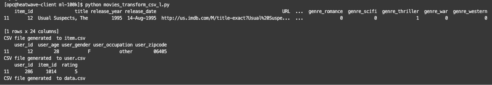

# Download & Transform the MovieLens dataset files


## Introduction

In this lab, you will download the dataset used to train the recommender system model in MySQL. You will use Python and Pandas to transform the original dataset into MySQL compatible format.

The Dataset is the MovieLens100k by GroupLens. Click the following link for an overview of the MovieLens100k dataset files:

- [README file for the MovieLens dataset](https://files.grouplens.org/datasets/movielens/ml-100k-README.txt)

_Estimated Time:_ 10 minutes

### Objectives

In this lab, you will be guided through the following tasks:

- Downloading the GroupLens MovieLens100k Dataset
- Preparing the data and Transforming the files to CSV using Python
- Transforming CSV files to MySQL, SQL files

### Prerequisites

- An Oracle Trial or Paid Cloud Account
- Some Experience with Linux and Python
- Completed Lab 3

## Task 1: Download the movie dataset

1. Go to Cloud shell to SSH into the new Compute Instance

     (Example: **ssh -i ~/.ssh/id_rsa opc@132.145.170...**)

    ```bash
    <copy>ssh -i ~/.ssh/id_rsa opc@<your_compute_instance_ip></copy>
    ```

2. Download the MovieLens 100k Dataset:

    Go to [Grouplens](https://grouplens.org/datasets/movielens/100k/)

    Get the download url for the zip file 'ml-100k.zip'

    Download the file into your home directory

    ```bash
    <copy>
    sudo wget https://files.grouplens.org/datasets/movielens/ml-100k.zip
    </copy>
    ```

    ```bash
    <copy>
    ls
    </copy>
    ```

    Unzip the file

    ```bash
    <copy>
    unzip ml-100k.zip
    </copy>
    ```

    ```bash
    <copy>
    ls
    </copy>
    ```

    
    Delete the unnecessary files

    ```bash
    <copy>
    cd ml-100k
    </copy>
    ```

    ```bash
    <copy>
    ls
    </copy>
    ```

    ```bash
    <copy>
    rm *.pl *.sh *.base *.test u.genre u.occupation
    </copy>
    ```

## Task 2: Download the scripts

1. Download the Python scripts

    In the same newly folder created, download the scripts

    Enter the following command at the prompt

    ```bash
    <copy>sudo wget https://objectstorage.us-ashburn-1.oraclecloud.com/p/7yuwIwQMyXC5lTzpv-mKaXbnqAnIDTdubHnHsCaWd0LyUgs7KGVxphWDMaFZpviL/n/idi1o0a010nx/b/Bucket-CA/o/LiveLab-MovieHub-images/scripts.zip</copy>
    ```

    Unzip the application code. Be sure to include the -j option to avoid creating a new folder.

    ```bash
    <copy>sudo unzip -j scripts.zip</copy>
    ```

2. List the files in the folder

    ```bash
    <copy>ls -l</copy>
    ```

    

## Task 3: Inspect the u.'name' files

1. Open the u.item file

    ```bash
    <copy>nano u.item</copy>
    ```

2. Notice the name and structure of the file

    

3. Exit nano without saving any changes with **Ctrl + X**

## Task 4: Run the scripts

1. Run the script to transform the u.'name' files to CSV

    Enter the following command at the prompt

    ```bash
    <copy>python movies_transform_csv_l.py</copy>
    ```

     ```bash
    <copy>ls</copy>
    ```

    It should produce an output like this:

    

2. Run the script to transform the CSV files to SQL

    Enter the following command at the prompt

    ```bash
    <copy>python movies_transform_sql_l.py</copy>
    ```

     ```bash
    <copy>ls</copy>
    ```

    It should produce an output like this:

    

3. Check the resulting SQL Files

    a. Open the item.sql file

    ```bash
    <copy>nano item.sql</copy>
    ```

    You should see a file like this, that includes the data in sql INSERT statements:

    

    b. Exit nano without saving any changes with **Ctrl + X**

You may now **proceed to the next lab**

## Acknowledgements

- **Author** - Cristian Aguilar, MySQL Solution Engineering
- **Contributors** - Perside Foster, MySQL Principal Solution Engineering
- **Last Updated By/Date** - Cristian Aguilar, MySQL Solution Engineering, November 2024

- **Dataset** - F. Maxwell Harper and Joseph A. Konstan. 2015. The MovieLens Datasets:
History and Context. ACM Transactions on Interactive Intelligent
Systems (TiiS) 5, 4, Article 19 (December 2015), 19 pages.
DOI=http://dx.doi.org/10.1145/2827872